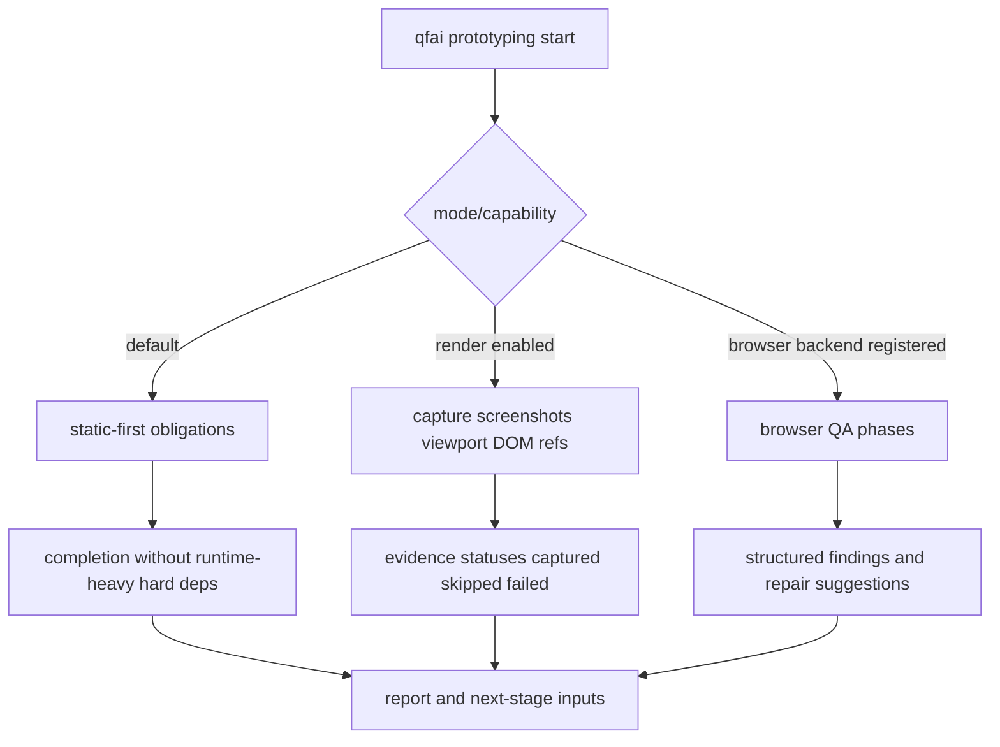

# 02 Inception Deck

## Metadata

| Key | Value |
| --- | --- |
| Discussion ID | discussion-20260329130000123 |
| Date | 2026-03-29 |

## 1. Why Are We Here?

- `/qfai-prototyping` の default path を static-first に戻し、runtime-heavy burden を correction するため
- render/browser evidence foundation を整え、後続 review と QA を mode-aware に支えるため

## 2. Elevator Pitch

QFAI v1.7.5 は、prototyping を再び軽量な標準経路へ戻しつつ、必要なケースだけが render evidence と browser QA を使える基盤を追加するリリースである。web/browser がない環境でも既存フローを壊さない。

## 3. Product Box

- Static-first default prototyping
- Optional render evidence
- Optional backend abstraction
- Mode-aware browser QA
- Non-web safe behavior

## 4. NOT List

- external critique provider はやらない
- full-harness orchestration はやらない
- calibration pack はやらない
- cost observability はやらない
- long-running handoff はやらない

## 5. Meet the Neighbors

- Upstream: v1.7 系の discussion/spec/contracts/assets
- Adjacent: validate/report/evidence/tests/docs
- Downstream: `/qfai-sdd`, `/qfai-atdd`, CI flows, browser-enabled optional users

## 6. Show the Solution

## 7. What Keeps Us Up at Night?

- runtime-heavy default が別名で復活すること
- browser abstraction が Playwright 前提で固定化すること
- evidence の status/shape が曖昧で report が説明不能になること

## 8. Size It Up

- 機能影響: 高
- 運用影響: 高
- 性能影響: 中
- セキュリティ影響: 低
- ドキュメント/テスト影響: 高

## 9. What Will We Not Do?

- browser availability を default hard gate にしない
- screenshot semantic quality を validator error にしない
- external tool install 成功を completion 条件にしない

## 10. What Must Be True?

1. default prototyping is static-first
2. evidence is optional-capability aware
3. browser/backends are not universal hard dependencies
4. mode-specific expectations are explicit
5. non-web project remains valid with zero browser setup
