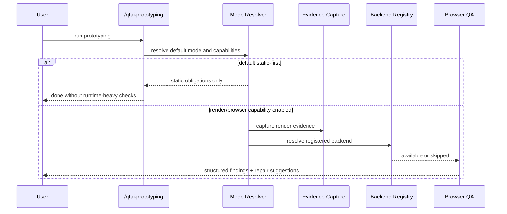

# 03 Story Workshop

## Metadata

| Key           | Value                        |
| ------------- | ---------------------------- |
| Discussion ID | discussion-20260329130000123 |
| Date          | 2026-03-29                   |
| Surface Type  | non-ui                       |

## Surface Classification

- Classification: `non-ui`
- Reason: 対象は CLI/toolkit の runtime/evidence foundation であり、ユーザー向け画面や GUI surface を追加しない
- UI sidecar generation: not required

## User Stories

### US-D001: Static-First Default Recovery

As a QFAI user running `/qfai-prototyping`,
I want the default path to complete with static-first obligations,
so that I am not forced to prepare runtime-heavy environments for baseline prototyping.

### US-D002: Render Evidence as Optional Capability

As a QFAI user who needs visual/runtime evidence,
I want screenshots, viewport metadata, and DOM/HTML snapshot references to be captured only when the capability is enabled,
so that default usage stays lightweight while richer evidence remains available.

### US-D003: Backend Abstraction Without Web Lock-In

As a QFAI maintainer,
I want browser or visual-review backends to be registered through capability abstraction,
so that Playwright-like, agent-browser-like, and future backends can coexist without becoming mandatory defaults.

### US-D004: Browser QA Structured Outputs

As a QFAI user running browser QA,
I want smoke, interaction, visual, and accessibility phases to return structured findings and repair suggestions,
so that follow-up work is actionable and mode-aware.

### US-D005: Non-Web Project Safety

As a non-web or non-visual project user,
I want browser/evidence features to fail-open or skip cleanly,
so that my project is not blocked by irrelevant dependencies.

## User Flow

## Example Seeds

### US-D001: Static-First Default Recovery

#### Happy Path

- default mode で source, route, state, contract-level obligations のみを満たし完了する

#### Negative Path

- default mode が API non-404 や DB existence を強制しようとした場合、設計違反として扱う

#### Edge / Boundary

- low-cost mode と standard mode の境界で obligation が混ざらない

#### Permission / Role

- N/A: CLI 実行者に特別な role 分岐はない

#### State Transition

- runtime-heavy default 旧挙動から static-first default 新挙動へ移行しても opt-in runtime mode は維持される

#### Idempotency / Retry

- 同一 mode / capability 条件では連続実行しても同じ completion expectation になる

### US-D002: Render Evidence as Optional Capability

#### Happy Path

- render evidence enabled 時に screenshot, viewport metadata, DOM/HTML snapshot ref が `captured` で残る

#### Negative Path

- capability 未登録時に evidence を要求せず `skipped` として扱う

#### Edge / Boundary

- screenshot は captured だが DOM snapshot が unavailable の場合でも partial status を表現できる

#### Permission / Role

- N/A: capability toggle のみで role 制御はない

#### State Transition

- capability off から on に切り替えると evidence fields が追加されるが default obligations は変わらない

#### Idempotency / Retry

- 再実行時に `captured/skipped/failed` status 語彙は変化せず同じ schema で出る

### US-D003: Backend Abstraction Without Web Lock-In

#### Happy Path

- Playwright style backend と screenshot-only fallback が同一 abstraction で宣言できる

#### Negative Path

- web backend 未登録でも default prototyping が失敗しない

#### Edge / Boundary

- future mobile/desktop backend を追加しても browser 前提の必須項目が漏れ込まない

#### Permission / Role

- N/A

#### State Transition

- backend registration 追加後に browser QA フェーズが有効化される

#### Idempotency / Retry

- 同一 backend declaration では backend resolution 結果が安定する

### US-D004: Browser QA Structured Outputs

#### Happy Path

- smoke, interaction, visual, accessibility 各 phase が structured finding を返し、repair suggestion まで繋がる

#### Negative Path

- backend 不在時は hard fail ではなく skip / fail-open semantics を返す

#### Edge / Boundary

- visual phase のみ unsupported でも smoke/interaction/accessibility を独立評価できる

#### Permission / Role

- N/A

#### State Transition

- smoke only から full phase 実行へ拡張しても output schema は互換を保つ

#### Idempotency / Retry

- finding normalization が同一入力に対して安定する

### US-D005: Non-Web Project Safety

#### Happy Path

- non-web project で browser/evidence capability なしでも warning/error を増やさず通過する

#### Negative Path

- non-web project に browser setup を要求した場合は方針違反とみなす

#### Edge / Boundary

- mixed artifacts を含む repo でも project classification と capability declaration の整合で誤爆しない

#### Permission / Role

- N/A

#### State Transition

- non-web project が後で backend capability を導入しても default behavior は維持される

#### Idempotency / Retry

- capability 未設定時の skip semantics は再実行でも同じ
