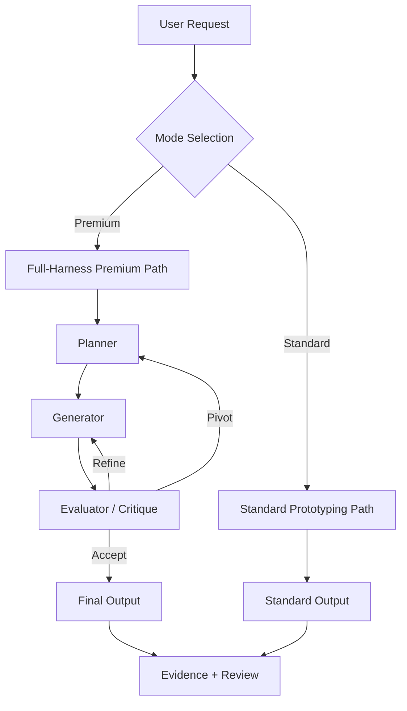

# 02 Inception Deck

## Metadata

| Key           | Value                        |
| ------------- | ---------------------------- |
| Discussion ID | discussion-20260329175059391 |
| Date          | 2026-03-29                   |

## 1. Why Are We Here?

- To enable high-quality prototype generation through an explicit multi-loop harness with structured critique
- To provide calibration, observability, and handoff infrastructure for teams that need iterative refinement beyond the standard single-pass path
- To keep the standard path lightweight and unaffected while offering a premium alternative

## 2. Elevator Pitch

QFAI v1.7.6 adds a premium prototyping mode with external critique, calibration, and iterative refinement for teams that need the highest quality output. It introduces `/qfai-prototyping-full-harness` as an explicit non-default skill that runs planner/generator/evaluator loops with fail-open critique, scoring alignment, and cost/time observability -- all without touching the standard path.

## 3. Product Box

- "Ship better prototypes with structured critique loops"
- Premium multi-iteration evaluator with accept/refine/pivot policy
- External critique adapter with fail-open semantics
- Calibration pack for consistent scoring across runs
- Cost/time observability for informed mode selection
- Long-running handoff artifacts for session continuity

## 4. NOT List

| We are NOT doing                                         | Reason                                           |
| -------------------------------------------------------- | ------------------------------------------------ |
| Making full-harness the default mode                     | Standard path must remain lightweight            |
| Reworking v1.7 artifact architecture                     | v1.7.5 evidence foundation is stable             |
| Adding critique semantics to deterministic validate      | Validate must stay deterministic and predictable |
| Building a UI or dashboard                               | QFAI is a CLI/framework tool                     |
| Requiring external providers for standard path operation | Fail-open and optional-only                      |

## 5. Meet the Neighbors

- **Upstream**: v1.7.5 evidence foundation, v1.7 scoring-ready axes and aggregate rules
- **Adjacent**: validate pipeline, existing prototyping skill, report/evidence/tests/docs subsystems
- **Downstream**: `/qfai-sdd`, `/qfai-atdd`, CI flows, teams consuming generated prototypes
- **External**: critique providers (generic command interface), calibration asset maintainers

## 6. Show the Solution

### Architecture Overview

### Key Architectural Decisions

- Premium path is a separate skill (`/qfai-prototyping-full-harness`), not a flag on the standard skill
- Critique adapter is a provider interface; concrete providers are pluggable
- Calibration pack is file-based, independently updatable
- Loop iteration is capped at a configurable maximum (default 15)
- Plateau detection triggers early exit when scoring stops improving

## 7. What Keeps Us Up at Night

1. **Premium path creep** -- features or obligations leaking from premium into standard path
2. **Provider failures** -- external critique providers being unavailable or returning garbage
3. **Calibration drift** -- scoring alignment assets becoming stale over time
4. **Cost runaway** -- premium loops consuming excessive resources without ceiling enforcement
5. **Long-running state corruption** -- multi-iteration context becoming stale mid-loop

## 8. Size It Up

Five implementation slices, medium-high complexity:

| Slice | Description                          | Complexity |
| ----- | ------------------------------------ | ---------- |
| S1    | External Critique Adapter            | Medium     |
| S2    | Harness Contracts + Calibration Pack | Medium     |
| S3    | `/qfai-prototyping-full-harness`     | High       |
| S4    | Observability + Capability Profile   | Medium     |
| S5    | Handoff + Display/Stub Detection     | Medium     |

## 9. What's Going to Give

- **Quality over speed** for the premium path; iteration loops are intentionally slower for better output
- **Standard path stays fast**; no performance tax from premium path existence
- **Operational complexity increases** due to critique providers, calibration assets, and handoff artifacts
- **Calibration requires curation** -- ongoing maintenance cost accepted as trade-off for scoring consistency

## 10. What's It Going to Take

- Critique adapter interface + generic command provider + optional example providers
- Calibration pack with scoring alignment assets and accept/refine/pivot policy definitions
- Full-harness skill implementation with planner/generator/evaluator split
- Cost/time observability hooks and reviewer drift tracking
- Handoff artifact generation and display-only/stub-only detection logic
