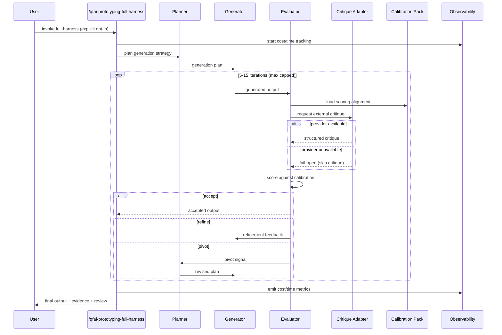

# 03 Story Workshop

## Metadata

| Key           | Value                        |
| ------------- | ---------------------------- |
| Discussion ID | discussion-20260329175059391 |
| Date          | 2026-03-29                   |
| Surface Type  | non-ui                       |

## Surface Classification

- Classification: `non-ui`
- Reason: QFAI is a CLI/framework tool; v1.7.6 adds runtime behaviors and artifacts, not GUI surfaces
- UI sidecar generation: not required

## User Stories

### US-DISC-001: Premium Prototyping Mode Opt-In

As a QFAI user,
I want to opt into a premium prototyping mode (`/qfai-prototyping-full-harness`),
so that I get higher-quality output through iterative critique loops with planner/generator/evaluator decomposition.

### US-DISC-002: Critique Adapter Fail-Open

As a QFAI user,
I want the critique adapter to fail open when a provider is unavailable or returns an error,
so that provider failures do not block my workflow or degrade the standard path.

### US-DISC-003: Calibration Asset Consistency

As a QFAI user,
I want calibration assets (scoring alignment, example packs) available for the evaluator,
so that scoring is consistent across runs and across different team members.

### US-DISC-004: Cost/Time Observability

As a QFAI user,
I want cost/time observability metrics emitted for every premium run,
so that I can make informed decisions about when to use premium mode vs. standard mode.

### US-DISC-005: Long-Running Handoff Artifacts

As a QFAI user,
I want handoff artifacts generated for long-running sessions,
so that I can resume work or hand off to another team member after session interruption.

### US-DISC-006: Display-Only and Stub-Only Detection

As a QFAI user,
I want display-only and stub-only implementations detected and flagged during evaluation,
so that superficial implementations are not accepted as complete.

## User Flow

## Example Seeds

### US-DISC-001: Premium Prototyping Mode Opt-In

| Perspective        | Seed                                                                                         |
| ------------------ | -------------------------------------------------------------------------------------------- |
| Happy path         | User invokes `/qfai-prototyping-full-harness`; loop runs 7 iterations; output accepted       |
| Negative path      | User invokes full-harness without required spec inputs; clear error before loop starts        |
| Edge/boundary      | Loop reaches max iteration cap (15); output emitted with cap-reached status                  |
| Permission/role    | User without premium mode configuration attempts full-harness; guided to configure            |
| State transition   | Loop transitions through refine -> refine -> pivot -> refine -> accept sequence              |
| Idempotency/retry  | User re-invokes full-harness after interruption; handoff artifact enables resumption          |

### US-DISC-002: Critique Adapter Fail-Open

| Perspective        | Seed                                                                                         |
| ------------------ | -------------------------------------------------------------------------------------------- |
| Happy path         | Critique provider returns structured feedback; evaluator incorporates it into scoring         |
| Negative path      | Provider returns malformed response; adapter logs warning and continues without critique      |
| Edge/boundary      | Provider timeout at exactly the configured threshold; adapter treats as unavailable           |
| Permission/role    | Provider requires API key; missing key triggers fail-open, not hard error                    |
| State transition   | Provider available for iterations 1-3, becomes unavailable at iteration 4; loop continues    |
| Idempotency/retry  | Same input sent to provider twice; adapter deduplicates or accepts idempotent response       |

### US-DISC-003: Calibration Asset Consistency

| Perspective        | Seed                                                                                         |
| ------------------ | -------------------------------------------------------------------------------------------- |
| Happy path         | Calibration pack loaded; scoring alignment applied consistently across 10 runs               |
| Negative path      | Calibration pack file missing; evaluator falls back to default scoring with warning          |
| Edge/boundary      | Calibration pack contains zero examples; evaluator uses defaults and logs advisory           |
| Permission/role    | Read-only filesystem; calibration pack loaded but not updatable; run proceeds                |
| State transition   | Calibration pack updated mid-session; next iteration picks up new alignment                  |
| Idempotency/retry  | Same calibration pack loaded twice in same session; no side effects                          |

### US-DISC-004: Cost/Time Observability

| Perspective        | Seed                                                                                         |
| ------------------ | -------------------------------------------------------------------------------------------- |
| Happy path         | Premium run completes; cost/time metrics emitted to observability output                     |
| Negative path      | Observability sink unavailable; metrics buffered or logged locally, run not blocked           |
| Edge/boundary      | Run completes in 1 iteration (minimum); metrics still emitted with single-iteration data     |
| Permission/role    | User queries historical cost data; only own runs visible                                     |
| State transition   | Metrics accumulate per-iteration; final summary aggregates all iterations                    |
| Idempotency/retry  | Interrupted run resumes; metrics from prior iterations preserved in handoff artifact          |

### US-DISC-005: Long-Running Handoff Artifacts

| Perspective        | Seed                                                                                         |
| ------------------ | -------------------------------------------------------------------------------------------- |
| Happy path         | 12-iteration run interrupted at iteration 8; handoff artifact written; resume picks up at 9  |
| Negative path      | Handoff artifact corrupted; resume detects corruption and starts fresh with warning          |
| Edge/boundary      | Session interrupted at iteration 1 (no meaningful progress); minimal handoff artifact saved  |
| Permission/role    | Different user attempts to resume another's handoff; artifact is portable (no user lock)     |
| State transition   | Handoff artifact captures planner state, generator state, and evaluator history              |
| Idempotency/retry  | Resume from same handoff artifact twice; second resume is idempotent (no duplicate work)     |

### US-DISC-006: Display-Only and Stub-Only Detection

| Perspective        | Seed                                                                                         |
| ------------------ | -------------------------------------------------------------------------------------------- |
| Happy path         | Generator produces real implementation; detection passes; no flag raised                     |
| Negative path      | Generator produces stub-only output; evaluator flags it and triggers refine                  |
| Edge/boundary      | Output is 90% real with one stub method; detection flags partial stub with specific location |
| Permission/role    | Detection runs in both standard and premium paths; no role distinction                       |
| State transition   | Iteration 1 has stubs; iteration 2 fills some; iteration 3 fills all; accepted               |
| Idempotency/retry  | Same output evaluated twice by detector; same findings both times                            |
