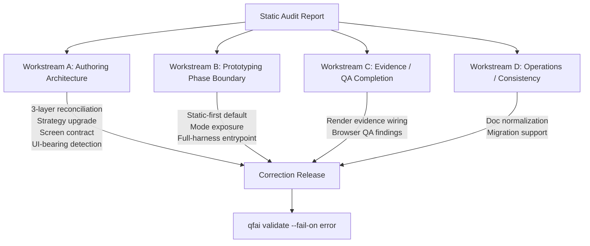

# Inception Deck: QFAI v1.7.6 Audit Follow-Up Remediation

| Field        | Value                                      |
| ------------ | ------------------------------------------ |
| Surface Type | CLI tool / verification framework (non-UI) |
| Version      | 1.7.6                                      |
| Date         | 2026-03-29                                 |

---

## 1. Why Are We Here?

A static audit of QFAI v1.7.6 revealed a set of user-facing contradictions that
undermine the tool's own "quality-first" promise:

- **Prototyping defaults are runtime-heavy instead of static-first.** The default
  prototyping phase pulls in browser/render evidence paths that should only
  activate in full-harness mode.
- **No full-harness entrypoint.** Users who need the premium verification path
  have no explicit CLI command or skill to opt in.
- **3-layer vs 4-axis mismatch.** Spec documents reference a 3-layer evaluation
  model, but the implementation exposes a 4-axis surface — the mapping is
  undocumented and confusing.
- **Weak strategy/contract artifacts.** Strategy specs and screen contracts lack
  enforceable structure, making `qfai validate` checks incomplete.
- **Inconsistent UI-bearing detection.** The heuristic for deciding whether a
  project has a UI surface is fragile and produces false positives.
- **Incomplete evidence/QA wiring.** Render-evidence capture and browser-based QA
  findings are stubbed but never invoked in the standard pipeline.
- **Inconsistent documentation.** README, workflow docs, and in-code comments
  contradict each other on mode boundaries and evaluation layers.

These are not feature requests. They are correctness issues that must be resolved
before v1.7.6 can be promoted to stable.

---

## 2. Elevator Pitch

| Element         | Description                                                               |
| --------------- | ------------------------------------------------------------------------- |
| **For**         | QFAI maintainers and contributors                                         |
| **Who**         | need to fix architectural contradictions before shipping v1.7.6 as stable |
| **The**         | QFAI v1.7.6 Remediation                                                   |
| **Is a**        | targeted correction pass                                                  |
| **That**        | resolves all P0-P2 issues from the static audit                           |
| **Unlike**      | a full redesign                                                           |
| **Our product** | preserves existing implementation while fixing user-facing contradictions |

---

## 3. Product Box

If QFAI v1.7.6 Remediation were a product on a shelf, the box would highlight:

1. **Static-first prototyping default** -- Prototyping mode produces only static
   analysis evidence by default; runtime evidence is opt-in.
2. **Explicit full-harness premium path** -- A dedicated CLI entrypoint
   (`--full-harness` or equivalent) activates browser/render evidence.
3. **Unified evaluation architecture** -- One reconciled model (layers and axes
   documented, mapped, and validated) replaces the current 3-vs-4 ambiguity.
4. **Clean mode exposure in CLI/skill** -- Every mode boundary is surfaced in
   `--help`, skill descriptions, and docs with no contradictions.

---

## 4. NOT List

### In Scope

| Priority | Item                                                |
| -------- | --------------------------------------------------- |
| P0       | Prototyping static-first default                    |
| P0       | Full-harness entrypoint                             |
| P1       | 3-layer / 4-axis reconciliation                     |
| P1       | Strategy spec upgrade (enforceable structure)       |
| P1       | Screen contract enforcement                         |
| P1       | UI-bearing detection fix                            |
| P1       | Render evidence wiring                              |
| P1       | Browser QA findings integration                     |
| P1       | Mode split (prototyping vs full-harness boundaries) |
| P2       | Documentation normalization                         |
| P2       | Workflow docs alignment                             |
| P2       | Migration guide for existing projects               |

### Out of Scope

| Item                                           | Reason                                                     |
| ---------------------------------------------- | ---------------------------------------------------------- |
| Full architectural redesign                    | Disproportionate cost; contradictions are fixable in-place |
| New feature development                        | Remediation only; features belong to v1.8+                 |
| Semantic taste judgments in validator          | Subjective quality scoring is out of charter               |
| Collapsing full-harness into the standard path | Full-harness must remain an explicit opt-in                |

---

## 5. Meet Your Neighbors

```
Upstream                    This Project                Downstream
─────────────────           ──────────────              ──────────────────
Static Audit Report    ───> QFAI v1.7.6           ───> QFAI end users
User feedback / issues      Remediation                 CI/CD pipelines
                                                        npm registry consumers
```

| Neighbor            | Relationship | Key Concern                                         |
| ------------------- | ------------ | --------------------------------------------------- |
| Static Audit Report | Upstream     | Defines the defect list driving scope               |
| User feedback       | Upstream     | Validates which contradictions hurt most            |
| QFAI end users      | Downstream   | Must not break existing `qfai.config.yaml` projects |
| CI/CD pipelines     | Downstream   | `qfai validate` exit codes must remain stable       |
| npm registry        | External     | Publish corrected package as v1.7.7                 |

---

## 6. Show the Solution

The remediation is organized into four parallel workstreams converging on a
single correction release, gated by `qfai validate --fail-on error`.



### Workstream Summary

| Workstream | Focus                      | Key Deliverables                                                       |
| ---------- | -------------------------- | ---------------------------------------------------------------------- |
| A          | Authoring Architecture     | Reconciled evaluation model, strategy/contract schemas, UI-bearing fix |
| B          | Prototyping Phase Boundary | Static-first default, mode gating, full-harness CLI flag               |
| C          | Evidence / QA Completion   | Render evidence pipeline, browser QA integration                       |
| D          | Operations / Consistency   | Doc normalization, workflow alignment, migration guide                 |

---

## 7. Risks

| #   | Risk                                           | Likelihood | Impact | Mitigation                                                                       |
| --- | ---------------------------------------------- | ---------- | ------ | -------------------------------------------------------------------------------- |
| 1   | Scope creep from fixing interconnected issues  | High       | Medium | Strict workstream boundaries; changes outside scope go to backlog                |
| 2   | Breaking existing projects during migration    | Medium     | High   | Backward compatibility checks; migration guide; `qfai validate` regression suite |
| 3   | Full-harness accidentally becoming the default | Low        | High   | Explicit mode gating with opt-in flag; default always resolves to static         |

---

## 8. Size It Up

- **4 workstreams** (A through D) as described above.
- **Phased delivery:**

| Phase        | Contents                                                            | Target     |
| ------------ | ------------------------------------------------------------------- | ---------- |
| Hotfix A     | P0 fixes (static-first, full-harness entrypoint)                    | Immediate  |
| Correction B | P1 fixes (architecture, contracts, detection, evidence, mode split) | Short-term |
| Correction C | P2 fixes (docs, workflow docs, migration guide)                     | Follow-up  |

Each phase must pass `qfai validate --fail-on error` before merge.

---

## 9. Trade-offs

Priority ranking (1 = most constrained, 4 = most flexible):

| Dimension | Rank | Rationale                                                          |
| --------- | ---- | ------------------------------------------------------------------ |
| Scope     | 1    | Audit findings define a fixed defect list; scope is non-negotiable |
| Quality   | 2    | QFAI is a quality tool -- shipping contradictions is unacceptable  |
| Time      | 3    | Phased delivery allows incremental progress without rushing        |
| Budget    | 4    | Open-source project; budget is flexible (contributor time)         |

---

## 10. What's It Going to Take?

| Capability                       | Why Needed                                                    |
| -------------------------------- | ------------------------------------------------------------- |
| TypeScript expertise             | All source lives in `packages/qfai/src/`; changes are TS      |
| QFAI domain knowledge            | Understanding spec/contract/evaluation model internals        |
| CLI / skill authoring experience | Full-harness entrypoint and mode exposure require CLI changes |
| Test engineering                 | Every source change requires corresponding test coverage      |
| Technical writing                | Doc normalization and migration guide                         |

---

_Generated as part of discussion pack `discussion-20260329195516830`._
