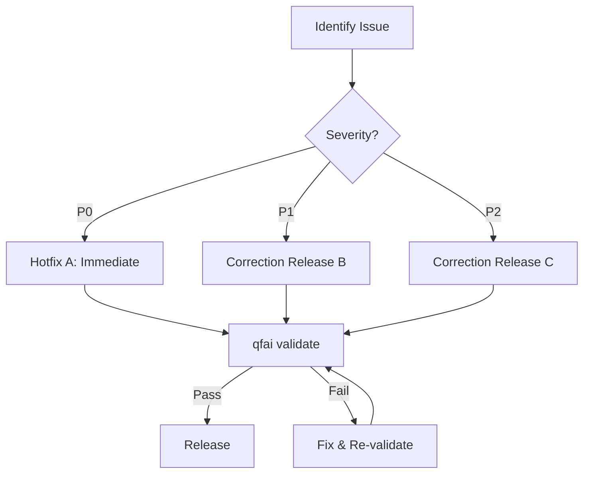

# 03 Story Workshop

## Metadata

| Key           | Value                        |
| ------------- | ---------------------------- |
| Discussion ID | discussion-20260329195516830 |
| Date          | 2026-03-29                   |
| Surface Type  | non-ui                       |

## Surface Classification

- Classification: `non-ui`
- Reason: QFAI is a CLI tool / verification framework; all user stories target CLI commands, internal architecture, and documentation — no GUI surfaces
- UI sidecar generation: not required

## User Stories

### US-001: Static-first prototyping default

As a QFAI user,
I want the default prototyping mode to be static-first (no runtime checks required),
so that I can start prototyping without environment setup overhead.

### US-002: Explicit full-harness premium path

As a QFAI power user,
I want a dedicated `/qfai-prototyping-full-harness` skill/command for runtime-heavy validation,
so that I can opt into premium validation explicitly when my environment is ready.

### US-003: Unified evaluation architecture

As a QFAI maintainer,
I want the evaluation architecture reconciled to the 3-layer model (invariant, trend-derived, product-specific) or formally documented as 4-axis,
so that scoring rubrics, trend translation, and calibration logic are internally consistent.

### US-004: Strengthened strategy artifact

As a QFAI user creating discussion packs,
I want the UI/UX Implementation Strategy artifact to include `selection_required`, `candidate_options`, `chosen_option`, `verification_expectations`, and `none-as-legitimate-outcome`,
so that strategy decisions are explicit and not silently missing.

### US-005: Upgraded screen contract schema

As a QFAI user defining screen contracts,
I want contracts to include route/screen identity, actor, purpose, observable outcomes, and multi-screen structure,
so that verification and review have sufficient contract detail.

### US-006: Consistent UI-bearing detection

As a QFAI user running validation,
I want UI-bearing detection to use explicit surface classification as primary SSOT with content signals as fallback only,
so that false positives and false negatives are eliminated.

### US-007: End-to-end render evidence

As a QFAI user running prototyping,
I want render evidence capture wired through to CLI output (not placeholder),
so that evidence claims in changelog match actual CLI behavior.

### US-008: Browser QA structured findings

As a QFAI user running full-harness prototyping,
I want browser QA runner to return structured findings (not empty),
so that critique and full-harness layers can rely on QA data.

### US-009: Clean mode exposure in CLI

As a QFAI user,
I want CLI flags and skill docs to clearly expose low-cost, standard, and full-harness modes,
so that I can choose the appropriate prototyping depth.

### US-010: Normalized repo state indicators

As a QFAI maintainer,
I want changelog, steering docs, and source comments to be consistent about v1.7.6 status,
so that maintenance and audit are reliable.

### US-011: Internal module workflow documentation

As a QFAI contributor,
I want usage docs, entrypoint docs, mode relationship docs, and failure behavior docs for internal modules (critique, calibration, observability, handoff, detection),
so that these modules are discoverable and usable.

### US-012: Migration and upgrade support

As a QFAI user upgrading from older versions,
I want stale asset detection, upgrade guidance, and explicit migration paths,
so that upgrades don't break existing projects.

## Correction Flow

### Flow Descriptions

1. **Identify Issue** — An audit finding, regression, or inconsistency is reported against v1.7.6 artifacts or runtime behavior. The finding is linked to one or more user stories (US-001 through US-012).
2. **Classify Severity** — The issue is triaged into one of three priority lanes:
   - **P0 (Hotfix A: Immediate)** — Blocks core workflow or produces incorrect validation results. Examples: UI-bearing false positive causing spurious failures (US-006), render evidence placeholder masquerading as real output (US-007).
   - **P1 (Correction Release B)** — Degrades usability or consistency but does not block. Examples: evaluation architecture mismatch (US-003), missing strategy fields (US-004), empty browser QA findings (US-008).
   - **P2 (Correction Release C)** — Documentation, discoverability, and polish. Examples: inconsistent repo state indicators (US-010), missing internal module docs (US-011), migration guidance (US-012).
3. **Implement Fix** — The appropriate correction is applied following the relevant user story acceptance criteria and example seeds.
4. **qfai validate** — `qfai validate` is run against the full spec suite. All traceability chains (REQ -> Spec -> Code -> Test) must pass.
5. **Pass / Fail Gate** — If validation passes, the fix proceeds to release. If validation fails, the fix is revised and re-validated. The loop continues until the gate is satisfied.
6. **Release** — The corrected version is tagged and released with updated changelog entries that are consistent with the fix (US-010).

## Example Seeds

### US-001: Static-first prototyping default

| Perspective       | Seed                                                                                          |
| ----------------- | --------------------------------------------------------------------------------------------- |
| Happy path        | User runs `qfai prototype`; static analysis completes without any runtime dependency          |
| Negative path     | User's project has no parseable spec files; clear error with guidance to create specs          |
| Edge/boundary     | Project has 0 source files but valid specs; static-first completes with empty-source warning   |
| Permission/role   | Read-only filesystem; static-first still produces stdout output without writing temp files     |
| State transition  | User starts static-first, then upgrades mid-session to full-harness; transition is seamless   |
| Idempotency/retry | Running `qfai prototype` twice on unchanged input produces identical output                   |

### US-002: Explicit full-harness premium path

| Perspective       | Seed                                                                                              |
| ----------------- | ------------------------------------------------------------------------------------------------- |
| Happy path        | User invokes `/qfai-prototyping-full-harness`; runtime checks execute; structured output returned |
| Negative path     | Required runtime dependency (e.g., browser) missing; error before loop with install guidance       |
| Edge/boundary     | Environment has partial runtime support; harness runs available checks, skips unavailable ones     |
| Permission/role   | User without premium configuration invokes full-harness; guided to configure or fall back          |
| State transition  | Full-harness running -> user cancels -> handoff artifact persists for resumption                   |
| Idempotency/retry | Re-invoking full-harness with same inputs after completion yields consistent results               |

### US-003: Unified evaluation architecture

| Perspective       | Seed                                                                                               |
| ----------------- | -------------------------------------------------------------------------------------------------- |
| Happy path        | Evaluation runs using 3-layer model; invariant, trend-derived, and product-specific scores align   |
| Negative path     | Calibration pack references a 4th axis not defined in architecture; validation rejects with detail  |
| Edge/boundary     | Score falls exactly on layer boundary threshold; layer assignment is deterministic and documented   |
| Permission/role   | Maintainer updates scoring rubric; changes require spec-level traceability before acceptance        |
| State transition  | Architecture migrates from ad-hoc to 3-layer; existing scores are re-mapped without data loss      |
| Idempotency/retry | Same evaluation input scored twice; identical layer assignments and scores produced                 |

### US-004: Strengthened strategy artifact

| Perspective       | Seed                                                                                                     |
| ----------------- | -------------------------------------------------------------------------------------------------------- |
| Happy path        | Discussion pack generated with all 5 strategy fields populated; `qfai validate` passes                   |
| Negative path     | `selection_required` is true but `chosen_option` is empty; validation emits actionable error              |
| Edge/boundary     | `none-as-legitimate-outcome` is the chosen option; artifact records rationale, validation accepts         |
| Permission/role   | Contributor generates strategy artifact; reviewer can audit all fields without source access              |
| State transition  | Strategy artifact transitions from draft to finalized; all 5 fields are immutable after finalization      |
| Idempotency/retry | Regenerating strategy artifact for same input yields identical field values                               |

### US-005: Upgraded screen contract schema

| Perspective       | Seed                                                                                                    |
| ----------------- | ------------------------------------------------------------------------------------------------------- |
| Happy path        | Contract includes route, actor, purpose, outcomes, and multi-screen structure; validation passes         |
| Negative path     | Contract missing `actor` field; validation rejects with field-level error message                        |
| Edge/boundary     | Contract defines single-screen structure; multi-screen fields default to single without error            |
| Permission/role   | Non-ui surface type; contract schema still requires purpose and outcomes, omits route/screen identity    |
| State transition  | Existing v1.7.5 contract upgraded to new schema; missing fields populated with migration defaults        |
| Idempotency/retry | Parsing and validating same contract twice produces identical schema-validated output                    |

### US-006: Consistent UI-bearing detection

| Perspective       | Seed                                                                                                    |
| ----------------- | ------------------------------------------------------------------------------------------------------- |
| Happy path        | Explicit `surface: non-ui` classification; detection returns non-ui without consulting content signals   |
| Negative path     | No explicit classification and content signals are ambiguous; detection returns `unknown` with warning   |
| Edge/boundary     | Explicit classification says `non-ui` but content signals suggest UI; explicit classification wins       |
| Permission/role   | Only maintainers can override explicit surface classification; contributors see read-only detection      |
| State transition  | Project reclassified from `ui` to `non-ui`; subsequent validations use new classification immediately    |
| Idempotency/retry | Detection run twice on same project state; identical classification result both times                    |

### US-007: End-to-end render evidence

| Perspective       | Seed                                                                                                |
| ----------------- | --------------------------------------------------------------------------------------------------- |
| Happy path        | Prototyping completes; CLI outputs real render evidence (screenshot hash, timestamp, file path)      |
| Negative path     | Render target unreachable; CLI outputs error with explicit "no evidence captured" instead of stub    |
| Edge/boundary     | Render completes but output is 0 bytes; evidence flagged as empty with warning, not silently passed  |
| Permission/role   | Non-ui surface; render evidence section is omitted from output (not a placeholder)                   |
| State transition  | Evidence transitions from "pending" to "captured" atomically; no intermediate placeholder persists   |
| Idempotency/retry | Re-running prototype on unchanged source produces evidence with same content hash                    |

### US-008: Browser QA structured findings

| Perspective       | Seed                                                                                                    |
| ----------------- | ------------------------------------------------------------------------------------------------------- |
| Happy path        | Browser QA runner returns structured JSON with severity, location, and description per finding           |
| Negative path     | Browser launch fails; runner returns structured error object, not empty array                            |
| Edge/boundary     | QA finds exactly 0 issues; runner returns empty findings array with `"status": "clean"` metadata        |
| Permission/role   | Full-harness mode required; standard mode invoking QA gets "not available in current mode" message       |
| State transition  | QA runner transitions from initializing -> scanning -> complete; each state logged with timestamp        |
| Idempotency/retry | Same page scanned twice without changes; identical findings array returned                              |

### US-009: Clean mode exposure in CLI

| Perspective       | Seed                                                                                                |
| ----------------- | --------------------------------------------------------------------------------------------------- |
| Happy path        | `qfai prototype --help` lists low-cost, standard, and full-harness modes with descriptions          |
| Negative path     | User passes `--mode=unknown`; CLI rejects with list of valid modes                                  |
| Edge/boundary     | User passes no mode flag; defaults to low-cost (static-first) per US-001                            |
| Permission/role   | Full-harness mode listed in help but marked as requiring environment setup                           |
| State transition  | User switches from `--mode=standard` to `--mode=full-harness` between runs; no stale state carried  |
| Idempotency/retry | Running `--help` multiple times produces identical output                                           |

### US-010: Normalized repo state indicators

| Perspective       | Seed                                                                                                  |
| ----------------- | ----------------------------------------------------------------------------------------------------- |
| Happy path        | Changelog, steering docs, and source comments all reference v1.7.6 consistently after release         |
| Negative path     | Source comment references v1.7.5 while changelog says v1.7.6; `qfai validate` flags inconsistency    |
| Edge/boundary     | Pre-release state: version is `1.7.7-dev`; all indicators reference dev suffix consistently           |
| Permission/role   | Only maintainers can update version indicators; contributors see validation errors for mismatches      |
| State transition  | Version bumped from 1.7.6 to 1.7.7; all indicators updated atomically in single commit               |
| Idempotency/retry | Running version normalization check twice yields identical findings list                              |

### US-011: Internal module workflow documentation

| Perspective       | Seed                                                                                                     |
| ----------------- | -------------------------------------------------------------------------------------------------------- |
| Happy path        | Each internal module (critique, calibration, observability, handoff, detection) has discoverable docs     |
| Negative path     | Module entrypoint referenced in docs does not exist in source; validation flags broken reference          |
| Edge/boundary     | Module has zero public exports; docs still describe internal-only usage with appropriate access caveats   |
| Permission/role   | Contributor reads module docs; sufficient to understand usage without maintainer guidance                  |
| State transition  | New module added; doc generation detects undocumented module and emits warning                            |
| Idempotency/retry | Doc generation run twice on same source; identical output produced                                       |

### US-012: Migration and upgrade support

| Perspective       | Seed                                                                                                   |
| ----------------- | ------------------------------------------------------------------------------------------------------ |
| Happy path        | User upgrades from v1.7.5 to v1.7.6; stale assets detected and migration guidance printed              |
| Negative path     | User upgrades from unsupported version (e.g., v1.4.0); clear error with "manual migration required"    |
| Edge/boundary     | User is already on v1.7.6; upgrade check reports "already current" with no-op                          |
| Permission/role   | Migration modifies config files; user prompted for confirmation before destructive changes              |
| State transition  | Migration transitions project from pre-migration -> migrating -> migrated; rollback available mid-way  |
| Idempotency/retry | Running migration twice on already-migrated project is a safe no-op                                    |
