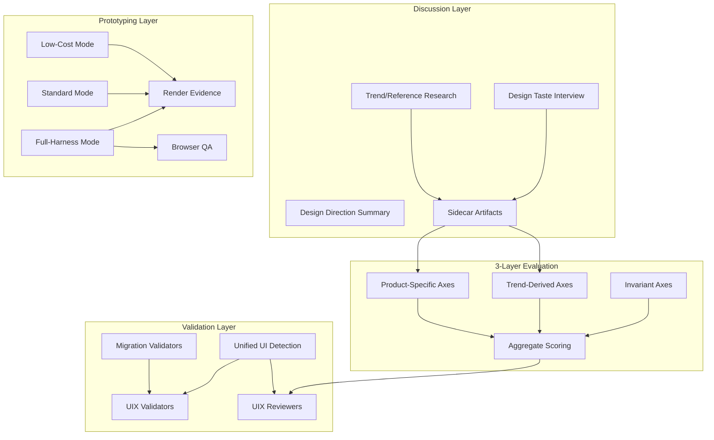

# 02_Inception-Deck

## Q1: Why are we here?

v1.7.7 は改善されたが canonical architecture に未収束。v1.7.8 は「既に合意した設計を repo に完全反映させる」ための correction-and-convergence release。

## Q2: Elevator Pitch

> QFAI v1.7.8 は、discussion/validation/prototyping の全レイヤーを canonical architecture に収束させ、user-facing の矛盾を完全に除去する correction release です。

## Q3: Product Box

- **見出し**: Canonical Convergence
- **3つの売り文句**:
  1. Design taste interview と trend research が discussion に統合
  2. 3-layer evaluation architecture が唯一の正規モデル
  3. static-first prototyping と real full-harness entrypoint

## Q4: NOT List (Out of Scope)

| In Scope                                 | Out of Scope                                       |
| ---------------------------------------- | -------------------------------------------------- |
| Design taste interview artifact          | Full-harness をデフォルトにする                    |
| Mandatory trend/reference research       | External critique provider の品質ベンチマーク      |
| 3-layer evaluation architecture 収束     | Advanced browser QA heuristics beyond MVP          |
| Scoring-ready schema 強化                | Full observability productization                  |
| Strategy artifact 強化                   | 美的実験（nonessential aesthetic experimentation） |
| Screen contract 強化                     | ゼロからの再設計                                   |
| UI-bearing detection 統一                | 4-axis model を equal canon として維持             |
| Prototyping skill rewrite (static-first) | Runtime-heavy default の維持                       |
| True full-harness entrypoint             | Web-only mandatory behavior for CLI project        |
| Render evidence CLI wiring               |                                                    |
| Browser QA MVP findings                  |                                                    |
| Migration normalization                  |                                                    |
| Reviewer extension for taste/trend       |                                                    |
| Docs/state normalization                 |                                                    |

## Q5: Neighbors

- 上流: v1.7.7 correction release (UIX-VAL/UIX-REV 追加、mode resolver)
- 下流: v1.8.0 以降の feature release (full observability, advanced browser QA)
- 並行: QFAI 利用プロジェクトの discussion/prototyping ワークフロー

## Q6: Technical Solution

## Q7: Risks

| Risk                                       | Likelihood | Impact | Mitigation                                  |
| ------------------------------------------ | ---------- | ------ | ------------------------------------------- |
| 3-layer 移行で既存 pack が validator fail  | High       | Medium | Migration validator + stale-asset guidance  |
| non-UI project で新 validator が over-fire | Medium     | High   | 全新 validator に non-UI fixture テスト追加 |
| full-harness entrypoint のスコープ肥大化   | Medium     | Medium | MVP scope を明示的に限定                    |
| browser QA MVP が期待値と乖離              | Low        | Medium | smoke + visual minimum と明示               |

## Q8: Team

| Role              | Responsibility         |
| ----------------- | ---------------------- |
| Developer (agent) | 全 deliverable の実装  |
| User              | 方針決定、レビュー承認 |

## Q9: Timeline

- v1.7.8 は v1.7.7 直後の correction release として位置づけ
- 14 deliverables を優先度順に実装

## Q10: Trade-offs

| Dimension     | Priority | Rationale                                     |
| ------------- | -------- | --------------------------------------------- |
| Convergence   | Highest  | canonical architecture への収束が最優先       |
| Compatibility | High     | migration path を提供し既存ユーザーを壊さない |
| Completeness  | Medium   | MVP scope で foundation-only を解消           |
| Performance   | Low      | v1.7.8 ではパフォーマンス最適化は対象外       |
