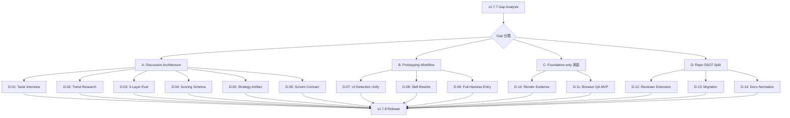

# 03_Story-Workshop

## Surface Type Classification

| Key          | Value  |
| ------------ | ------ |
| Surface Type | non-ui |
| UI-bearing   | No     |

QFAI は CLI ツール / フレームワークであり、ユーザー向け GUI を持たない。
DDS (Design Direction Summary) および uiux/ sidecar は本パックでは不要。

---

## User Stories

### US-001: Design Taste Interview の追加 (D-01)

**As** a QFAI discussion facilitator,
**I want** UI-bearing project の discussion で design taste interview が必須ステップとして実行される
**So that** ユーザーの visual/emotional preference が discussion artifact に明示的に記録される。

### US-002: Trend/Reference Research の必須化 (D-02)

**As** a QFAI discussion facilitator,
**I want** UI-bearing project の discussion で trend/reference research が必須ステップとして実行される
**So that** session-specific な direction と freshness metadata が確保される。

### US-003: 3-Layer Evaluation Architecture 収束 (D-03)

**As** a QFAI framework developer,
**I want** 評価軸モデルが invariant / trend-derived / product-specific の 3-layer に統一される
**So that** validators / reviewers / calibration / migration が一つの canonical model で動作する。

### US-004: Scoring-Ready Schema 強化 (D-04)

**As** a QFAI reviewer/calibrator,
**I want** 全評価軸が scoring-ready schema (16 fields) を持つ
**So that** reviewer interpretation drift を防ぎ、calibration が機能する。

### US-005: Strategy Artifact 強化 (D-05)

**As** a QFAI discussion consumer,
**I want** UI/UX Implementation Strategy artifact が strong universal schema を使用する
**So that** explicit comparison / selection / verification expectations が保証される。

### US-006: Screen Contract 強化 (D-06)

**As** a downstream automation consumer,
**I want** screen contract が machine-readable な multi-screen 対応 schema を持つ
**So that** multi-screen validation と structured evidence mapping が可能になる。

### US-007: UI-Bearing Detection 統一 (D-07)

**As** a QFAI validator maintainer,
**I want** UI-bearing detection が単一の shared module に統一される
**So that** validators / skills / templates が同じルールで判定する。

### US-008: Prototyping Skill Rewrite (D-08)

**As** a QFAI prototyping user,
**I want** skill body が static-first mode architecture を記述する
**So that** skill body と CLI の契約が一致し、正しい期待値で作業できる。

### US-009: Full-Harness Entrypoint (D-09)

**As** a premium prototyping user,
**I want** full-harness path に実際の user-facing entrypoint がある
**So that** routing guidance だけでなく実際のワークフローを開始できる。

### US-010: Render Evidence Wiring (D-10)

**As** a prototyping evidence consumer,
**I want** render evidence の CLI path が実際の capture/skip/fail を報告する
**So that** placeholder "not implemented" が除去され、honest な結果を得られる。

### US-011: Browser QA MVP (D-11)

**As** a QA workflow consumer,
**I want** browser QA が少なくとも smoke phase で real findings を生成する
**So that** QA runner が operational な品質ループとして機能する。

### US-012: Reviewer Extension (D-12)

**As** a discussion reviewer,
**I want** review templates が taste/trend reflection を評価する
**So that** 新 discussion artifacts のレビュー品質が保証される。

### US-013: Migration Normalization (D-13)

**As** a QFAI adopter with existing packs,
**I want** old → intermediate → final の migration path が明示される
**So that** validator strengthening で既存パックが mysterious fail しない。

### US-014: Docs/State Normalization (D-14)

**As** a QFAI user/developer,
**I want** README / CHANGELOG / steering / source comments が一貫した feature maturity 表現を使う
**So that** subsystem が同時に "done" と "deferred" にならない。

---

## User Flow

---

## Example Seeds

### US-001: Design Taste Interview

| Perspective        | Seed                                                                                   |
| ------------------ | -------------------------------------------------------------------------------------- |
| Happy path         | UI-bearing project で taste interview が実行され、全 9 セクションが記録される            |
| Negative path      | taste interview artifact が空のまま discussion 完了を試みる → validator error             |
| Edge / boundary    | ユーザーが全項目に "no preference" と回答 → 記録はされるが review で reflection quality 警告 |
| Permission / role  | agent が interview を実行、user が回答を提供                                             |
| State transition   | N/A (stateless)                                                                        |
| Idempotency        | N/A (no external I/O)                                                                  |

### US-002: Trend/Reference Research

| Perspective        | Seed                                                                                   |
| ------------------ | -------------------------------------------------------------------------------------- |
| Happy path         | UI-bearing project で trend scan 実行、freshness metadata 付きで記録                    |
| Negative path      | trend scan summary が missing のまま discussion 完了 → validator error                   |
| Edge / boundary    | 全 reference が "low confidence" → 記録は有効だが review で relevance 警告               |
| Permission / role  | agent が scan 実行、user が applicability を確認                                        |
| State transition   | N/A                                                                                    |
| Idempotency        | N/A                                                                                    |

### US-003: 3-Layer Evaluation Architecture

| Perspective        | Seed                                                                                   |
| ------------------ | -------------------------------------------------------------------------------------- |
| Happy path         | 新規 pack で 3-layer model の axes が全て scoring-ready                                 |
| Negative path      | 旧 4-axis format の pack を validate → migration warning (migration window 内)          |
| Edge / boundary    | mixed pack (一部 3-layer, 一部旧形式) → validator error                                |
| Permission / role  | N/A                                                                                    |
| State transition   | legacy → intermediate → final (migration stages)                                       |
| Idempotency        | migration validator を複数回実行しても同じ結果                                          |

### US-007: UI-Bearing Detection

| Perspective        | Seed                                                                                   |
| ------------------ | -------------------------------------------------------------------------------------- |
| Happy path         | explicit `surface: web-ui` で検出 → sidecar 生成                                       |
| Negative path      | surface 未指定 + content heuristics fallback → heuristic result が返る                  |
| Edge / boundary    | web endpoint はあるが UI component なし → surface type で判定、interaction complexity 無視 |
| Permission / role  | N/A                                                                                    |
| State transition   | N/A                                                                                    |
| Idempotency        | 同一入力に対して常に同じ detection 結果                                                 |

### US-008: Prototyping Skill Rewrite

| Perspective        | Seed                                                                                   |
| ------------------ | -------------------------------------------------------------------------------------- |
| Happy path         | skill body が low-cost / standard / full-harness を正しく記述                           |
| Negative path      | 旧 runtime-heavy language が残存 → doc consistency validator fail                       |
| Edge / boundary    | non-UI project で skill body 参照 → visual-review 関連が n/a として扱われる             |
| Permission / role  | N/A                                                                                    |
| State transition   | N/A                                                                                    |
| Idempotency        | N/A                                                                                    |

### US-010: Render Evidence Wiring

| Perspective        | Seed                                                                                   |
| ------------------ | -------------------------------------------------------------------------------------- |
| Happy path         | render evidence 要求 → capture 実行 → structured result 書き出し                       |
| Negative path      | capture 環境なし → skipped status + honest reason                                      |
| Edge / boundary    | capture 部分成功 → partial result + failed items list                                  |
| Permission / role  | N/A                                                                                    |
| State transition   | N/A                                                                                    |
| Idempotency        | 同一入力で再実行 → 同一構造の結果（content は環境依存）                                 |

### US-011: Browser QA MVP

| Perspective        | Seed                                                                                   |
| ------------------ | -------------------------------------------------------------------------------------- |
| Happy path         | smoke phase 実行 → real findings (non-empty) が返る                                    |
| Negative path      | 対象 URL なし → structured error (not empty findings)                                  |
| Edge / boundary    | smoke + visual 両方実行、interaction/accessibility は skip                              |
| Permission / role  | N/A                                                                                    |
| State transition   | N/A                                                                                    |
| Idempotency        | N/A (external I/O, 結果は環境依存)                                                     |

### US-013: Migration Normalization

| Perspective        | Seed                                                                                   |
| ------------------ | -------------------------------------------------------------------------------------- |
| Happy path         | old no-sidecar pack → migration validator が upgrade guidance を提示                    |
| Negative path      | unknown format pack → validator error with clear message                                |
| Edge / boundary    | v1.7.6 intermediate pack → intermediate → final transition guidance                    |
| Permission / role  | N/A                                                                                    |
| State transition   | no-sidecar → 4-axis intermediate → 3-layer final                                      |
| Idempotency        | 同一 pack に対して migration validator 再実行 → 同一結果                                |

### US-018 (cross-cutting): Non-UI Safety

| Perspective        | Seed                                                                                   |
| ------------------ | -------------------------------------------------------------------------------------- |
| Happy path         | CLI project で taste/trend validators が skip (non-UI)                                 |
| Negative path      | non-UI project で taste validator が fire → bug (over-fire)                             |
| Edge / boundary    | mixed surface (web endpoint + CLI) → surface type classification で判定                 |
| Permission / role  | N/A                                                                                    |
| State transition   | N/A                                                                                    |
| Idempotency        | N/A                                                                                    |
