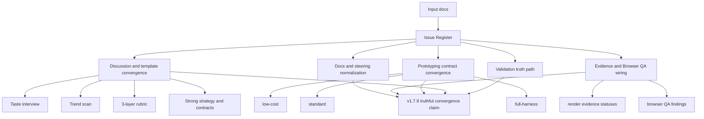

# 02_Inception-Deck

## Q1: Why are we here?

v1.7.9 は architecture 再議論ではなく convergence release である。残ギャップを issue register 化し、discussion から実装計画へ truthful に接続するために本ディスカッションを行う。

## Q2: Elevator Pitch

> QFAI v1.7.9 は、discussion・template・validator・prototyping・evidence・docs を同一の canonical v1.7 model に収束させる correction and integration release である。

## Q3: Product Box

- 見出し: Single-Model Convergence
- 3つの売り文句:
  1. production validation が新しい UIX validators を本線で実行する
  2. discussion が taste/trend/3-layer model を completion criteria として採用する
  3. prototyping/evidence/docs が honest capability を公開する

## Q4: NOT List

| In Scope                              | Out of Scope                                 |
| ------------------------------------- | -------------------------------------------- |
| Validation truth path の修正          | core architecture の再設計                   |
| Discussion/template convergence       | full-harness の default 化                   |
| Prototyping static-first contract     | aesthetic quality の自動判定                 |
| Evidence/QA orchestration honest 化   | 全 evidence backend の最適化                 |
| Docs/steering/changelog normalization | 既存 legacy project の無説明 breaking change |

## Q5: Neighbors

- Upstream: v1.7.8 までの correction work、既存 UIX validator/reviewer foundation
- Downstream: `/qfai-sdd`、`/qfai-atdd`、`/qfai-implement`
- External impact: QFAI 利用者が init/discussion/prototyping/validate で受け取る completion rule

## Q6: Technical Solution

## Q7: Risks

| Risk                                             | Likelihood | Impact | Mitigation                                                            |
| ------------------------------------------------ | ---------- | ------ | --------------------------------------------------------------------- |
| validator だけ先行し template が追従しない       | High       | High   | PR slicing を維持し、同PRで docs/tests も更新する                     |
| non-ui project へ UI-bearing validator が誤発火  | Medium     | High   | non-ui skip path を acceptance / NFR に明記する                       |
| full-harness を nominal に追加して運用不能にする | Medium     | Medium | explicit non-default + iteration cap + evidence obligation を定義する |
| docs が capability を過大表現する                | High       | Medium | maturity vocabulary と release claim 制約を policy 化する             |

## Q8: Team

| Role            | Responsibility                                        |
| --------------- | ----------------------------------------------------- |
| User            | v1.7.9 scope と release posture の承認                |
| Agent           | discussion pack 作成、review pack 作成、evidence 作成 |
| Reviewer roster | discussion gate の PASS/REVISE 判定                   |

## Q9: Timeline

- PR-A: Validation truth path
- PR-B: Discussion/template convergence
- PR-C: Prototyping contract convergence
- PR-D: Evidence/QA orchestration
- PR-E: Reviewer/docs normalization

## Q10: Trade-offs

| Dimension     | Priority | Rationale                                   |
| ------------- | -------- | ------------------------------------------- |
| Truthfulness  | Highest  | release claim と実態の一致が最重要          |
| Convergence   | High     | 同一モデルへの収束が v1.7.9 の本質          |
| Compatibility | High     | legacy 移行は warning/guidance 前提で進める |
| Scope control | Medium   | premium/full-harness を default に広げない  |
