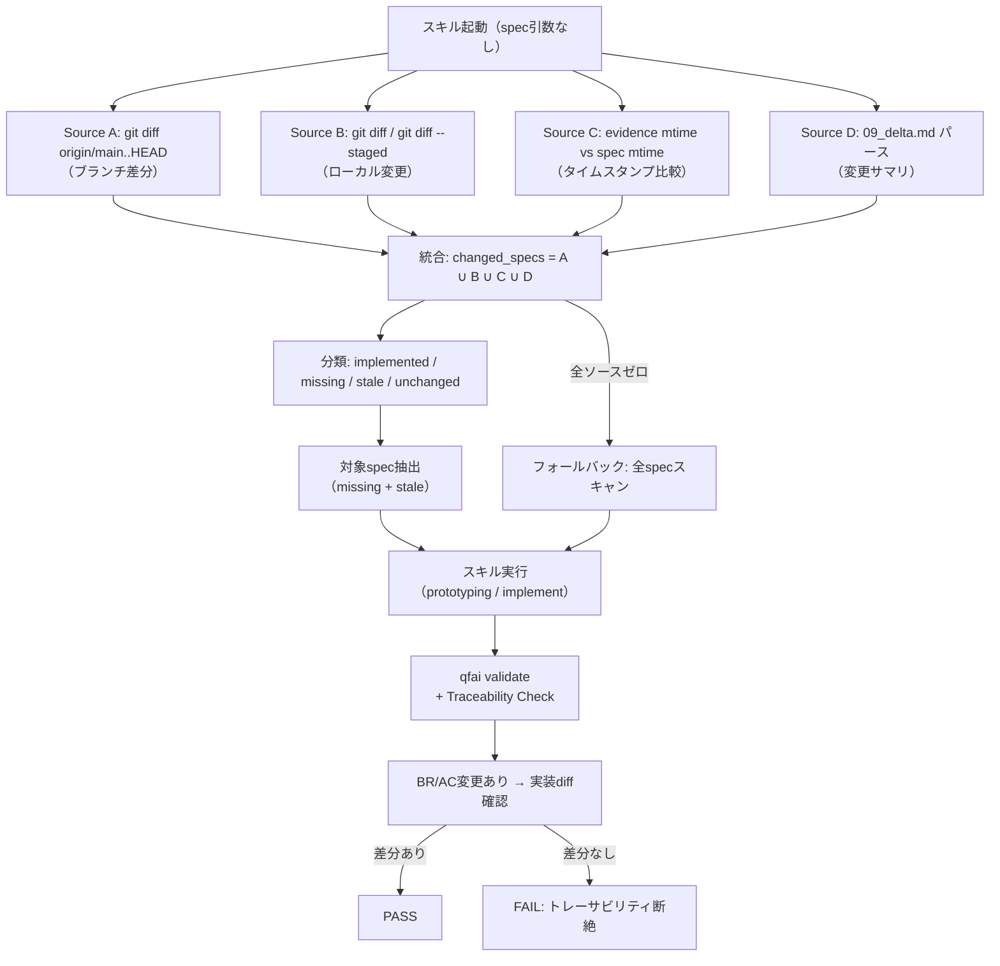

# 02 Inception Deck

## 1. Why Are We Here?

- Purpose: AIエージェントが `/qfai-prototyping` や `/qfai-implement` を実行する際、spec引数を省略しても自律的に作業対象specを特定し、specと実装の整合性を保証する仕組みを構築する。「specの指定が無いから作業できない」という停止状況を根絶する。

## 2. Elevator Pitch

- For: QFAI利用開発者およびAIコーディングエージェント
- Who: spec引数を毎回手動指定する負担、およびspec変更と実装の乖離に気づけない問題
- The: Spec Auto-Discovery Protocol + Traceability Validator
- Is a: QFAIスキル改善 + バリデーション拡張
- That: spec引数なしでも自動的に変更specを検出し、specと実装の整合性を常時検証する
- Unlike: 現行の「全spec対象」または「引数必須」のall-or-nothing方式
- Our product: 4ソース統合差分検出（git diff + ローカル変更 + timestamp + delta.md）とBR/ACトレーサビリティチェックにより、インクリメンタルで正確な作業指示を実現する

## 3. Product Box (Feature highlights)

- Headline feature 1: **Spec Auto-Discovery** — 4ソース統合差分検出による対象spec自動特定
- Headline feature 2: **Traceability Integrity Check** — specのBR/AC変更と実装コードの整合性検証
- Headline feature 3: **Validate Gate Extension** — `qfai validate` でspec-実装ドリフトを検出・エラー報告

## 4. NOT List (Out of Scope)

| In Scope                                          | Out of Scope                                                    |
| ------------------------------------------------- | --------------------------------------------------------------- |
| SKILL.md（prototyping/implement）のプロンプト改修 | `/qfai-verify` のインクリメンタル対応                           |
| TypeScript差分検出モジュール実装                  | delta.md パーサーの根本的改修                                   |
| `qfai validate` トレーサビリティ拡張              | CI/CDパイプラインの変更                                         |
| spec-0011 Preflight Diff Protocol のSKILL.md統合  | `/qfai-atdd` のインクリメンタル対応（本ディスカッション対象外） |
| BR/ACとソースコード実装部分の差分有無チェック     | 完全なセマンティック解析によるBR/AC一致検証                     |

## 5. Meet Your Neighbors (Stakeholders & Dependencies)

- Upstream dependencies:
  - spec-0011 Preflight Diff Protocol 仕様
  - `packages/qfai/src/core/specLayout.ts` — collectSpecEntries
  - `packages/qfai/src/core/validate.ts` — ValidationResult / ValidationIssue
- Downstream dependencies:
  - `/qfai-prototyping` スキル実行
  - `/qfai-implement` スキル実行
  - `qfai validate` コマンド
- External integrations:
  - git CLI（`git diff`, `git log` 等）

## 6. Show the Solution (Architecture Overview)

- High-level architecture: 4ソース統合差分検出 → 対象spec特定 → SKILL.md指示に基づく作業実行 → validate gate でトレーサビリティ検証
- Key components:
  - `specDiffDetector` モジュール（新規）: 4ソース差分検出
  - `traceabilityValidator` モジュール（新規）: spec-実装整合性チェック
  - SKILL.md 改修: Spec Auto-Discovery Protocol セクション追加

## 7. What Keeps Us Up at Night (Risks)

| Risk                                    | Probability | Impact | Mitigation                                        |
| --------------------------------------- | ----------- | ------ | ------------------------------------------------- |
| R1: git不在環境での差分検出失敗         | low         | high   | Source B/C/Dフォールバック + --full フラグ        |
| R2: shallow clone環境でgit diffが不完全 | medium      | medium | timestamp + delta.md バックアップソース           |
| R3: BR/AC変更の検出粒度が粗すぎて偽陰性 | medium      | high   | ファイル単位のdiff + 行レベルのgrep（段階的改善） |
| R4: 差分検出の偽陽性による不要な作業    | low         | low    | ユーザー確認プロンプトで対象specリスト承認        |
| R5: 既存spec-0011仕様との不整合         | low         | medium | spec-0011の決定事項を厳密に参照し整合性を保証     |

## 8. Size It Up (Effort & Timeline)

- Estimated effort: 中規模（SKILL.md改修 + TypeScript新規モジュール2つ + テスト）
- Target timeline: spec-0011既存仕様を土台として段階的に実装

## 9. What's Going to Give (Trade-offs)

| Dimension | Priority | Notes                                                               |
| --------- | -------- | ------------------------------------------------------------------- |
| Scope     | 1        | 4ソース統合 + トレーサビリティチェックの両方を実現                  |
| Quality   | 2        | 差分検出の精度はファイルレベル（セマンティック解析は将来拡張）      |
| Time      | 3        | 段階実装可能（Phase 1: SKILL.md + diff検出、Phase 2: validate拡張） |
| Budget    | 4        | パッケージ内の既存依存のみ使用                                      |

## 10. What's It Going to Take (Team & Resources)

- Required skills: TypeScript開発、git操作、QFAIスキル定義、バリデーションパイプライン理解
- Team composition: フルスタックエンジニア + QAエンジニア
- Infrastructure: Node.js 環境、git CLI
