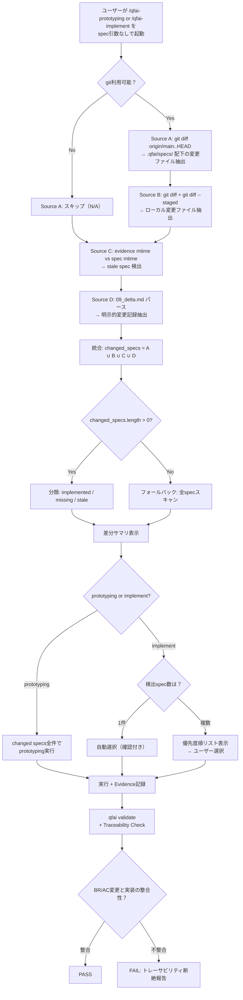

# 03 Story Workshop

## User Stories

### US-001: spec引数省略時の自動spec検出（prototyping）

- As a: QFAI利用開発者
- I want: `/qfai-prototyping` をspec引数なしで実行した際に、変更されたspecが自動検出されること
- So that: 手動でspec引数を指定する手間が省け、エージェントが停止せず作業を開始できる

#### Acceptance Criteria

- AC-001-01: spec引数なしで `/qfai-prototyping` が呼び出された場合、4ソース統合差分検出が実行される
- AC-001-02: 検出された変更specの一覧がユーザーに提示され、承認後に作業が開始される
- AC-001-03: 全ソースで変更ゼロの場合、全specスキャン（フルモード）にフォールバックする
- AC-001-04: git不在環境では Source B(timestamp) + Source D(delta.md) にフォールバックする

#### Example Seeds

| Perspective         | Example                                                                                       | Status |
| ------------------- | --------------------------------------------------------------------------------------------- | ------ |
| Happy path          | ブランチ上でspec-0005のBRを変更 → prototyping起動 → spec-0005が自動検出され作業開始           | seed   |
| Negative path       | git repoでないディレクトリで実行 → timestamp + delta.md のみで検出 → 結果ゼロならフルスキャン | seed   |
| Edge / boundary     | specファイルは変更なしだがevidence timestampが古い → staleとして検出                          | seed   |
| Permission / role   | N/A（CLIツールのため権限概念なし）                                                            | seed   |
| State transition    | 前回のprototyping以降にspecが追加された → missingとして検出                                   | seed   |
| Idempotency / retry | 同じspec変更で2回prototyping実行 → 2回目はevidence更新済みでunchanged判定                     | seed   |

### US-002: spec引数省略時の自動spec検出（implement）

- As a: QFAI利用開発者
- I want: `/qfai-implement` をspec引数なしで実行した際に、変更されたspecが自動検出され提示されること
- So that: 「specの指定が無いから作業できない」という停止が解消される

#### Acceptance Criteria

- AC-002-01: spec引数なしで `/qfai-implement` が呼び出された場合、4ソース統合差分検出が実行される
- AC-002-02: 複数specが検出された場合、優先度順（依存関係・変更量）でリスト表示し、ユーザーに選択を促す
- AC-002-03: 単一specのみ検出された場合、自動的にそのspecで作業を開始する（ユーザー確認付き）
- AC-002-04: `--full` フラグで強制的に全specスキャンを実行できる

#### Example Seeds

| Perspective         | Example                                                                               | Status |
| ------------------- | ------------------------------------------------------------------------------------- | ------ |
| Happy path          | ブランチ上でspec-0003のACを変更 → implement起動 → spec-0003が提示され選択後に作業開始 | seed   |
| Negative path       | 変更specが0件 → 「変更specなし。--full で全件指定するか、spec-idを明示してください」  | seed   |
| Edge / boundary     | 変更specが10件以上 → ページネーション付きリスト表示                                   | seed   |
| Permission / role   | N/A                                                                                   | seed   |
| State transition    | test-list.mdが全件done → 「spec-XXXXは全TDD完了済み。再実行しますか？」               | seed   |
| Idempotency / retry | 同じspec変更で2回implement実行 → 2回目は残りtodoアイテムから継続                      | seed   |

### US-003: specと実装のトレーサビリティ検証

- As a: QFAI利用開発者
- I want: specのBR/ACが変更された際に、対応する実装コードにも変更があるかを自動検証したい
- So that: specと実装の乖離（トレーサビリティ断絶）を早期に検出できる

#### Acceptance Criteria

- AC-003-01: `qfai validate` 実行時に、変更されたspecのBR/ACと紐づく実装ファイルの差分有無がチェックされる
- AC-003-02: specのBRに変更があるのに対応する実装ファイルに変更がない場合、warning/errorが報告される
- AC-003-03: Traceability Ledger（`16_Traceability-ledger.md`）に記録されたマッピングを基にチェックする
- AC-003-04: マッピングが存在しない場合はチェックをスキップしwarningを出す

#### Example Seeds

| Perspective         | Example                                                                                | Status |
| ------------------- | -------------------------------------------------------------------------------------- | ------ |
| Happy path          | BR-0005-0001変更 + 対応src/auth.ts変更 → PASS                                          | seed   |
| Negative path       | BR-0005-0001変更 + 対応src/auth.ts未変更 → FAIL: トレーサビリティ断絶                  | seed   |
| Edge / boundary     | Traceability Ledgerが空 → WARNING: マッピング未定義、チェックスキップ                  | seed   |
| Permission / role   | N/A                                                                                    | seed   |
| State transition    | spec新規追加（spec-0038）→ 実装ファイルなし → missing扱いでprototyping/implement対象に | seed   |
| Idempotency / retry | 同じvalidate 2回実行 → 同じ結果（冪等）                                                | seed   |

### US-004: 差分サマリの可読性

- As a: QFAI利用開発者
- I want: 差分検出結果が一目で把握できる形式で提示されること
- So that: 作業対象specを迅速に把握し、不要な作業を回避できる

#### Acceptance Criteria

- AC-004-01: 差分サマリにspec-id、変更種別（modified/added/removed）、変更ソース（git/timestamp/delta.md）が含まれる
- AC-004-02: 分類結果（implemented/missing/stale/unchanged）がテーブル形式で表示される
- AC-004-03: Evidence Diff Contextセクションに `last_commit_sha`, `last_run_timestamp`, `changed_specs`, `execution_mode` が記録される

#### Example Seeds

| Perspective         | Example                                                                         | Status |
| ------------------- | ------------------------------------------------------------------------------- | ------ |
| Happy path          | 3spec変更 → テーブル: spec-0003(stale), spec-0005(modified), spec-0012(missing) | seed   |
| Negative path       | git不在 → ソースA欄が「N/A (git unavailable)」表示                              | seed   |
| Edge / boundary     | 37spec全件変更（\_policies変更）→ 全件リスト + ユーザー確認プロンプト           | seed   |
| Permission / role   | N/A                                                                             | seed   |
| State transition    | N/A                                                                             | seed   |
| Idempotency / retry | N/A                                                                             | seed   |

## User Flows

## Flow Descriptions

- Flow 1: Spec Auto-Discovery Flow
  - Entry point: スキル起動（spec引数なし）
  - Steps: 4ソース検出 → 統合 → 分類 → ユーザー確認 → 実行
  - Exit point: スキル実行完了 + evidence記録

- Flow 2: Traceability Validation Flow
  - Entry point: `qfai validate` 実行 or スキル完了後の自動チェック
  - Steps: 変更spec特定 → BR/ACマッピング取得 → 実装ファイルdiff確認 → 結果報告
  - Exit point: PASS/FAIL判定 + ValidationIssue生成

## Behavior Obligations

### State Coverage

| State     | Trigger                                | Display                               | Transitions          |
| --------- | -------------------------------------- | ------------------------------------- | -------------------- |
| empty     | 変更specゼロ + evidenceなし            | フルスキャンフォールバック通知        | → full-scan          |
| loading   | 差分検出処理中                         | 「差分検出中...」プログレス           | → populated or error |
| error     | git実行エラー / ファイルアクセスエラー | エラーメッセージ + フォールバック案内 | → fallback           |
| populated | 差分spec検出完了                       | 差分サマリテーブル表示                | → execution          |

### Interaction Contracts

| Element       | Action              | Expected Result          | Error Handling                                |
| ------------- | ------------------- | ------------------------ | --------------------------------------------- |
| spec引数      | 省略                | 4ソース差分検出起動      | git不在時はtimestamp+delta.mdにフォールバック |
| --full フラグ | 指定                | 全specスキャン強制       | 常に成功                                      |
| 差分サマリ    | 表示 → ユーザー承認 | 承認されたspecで作業開始 | 却下時は手動spec指定を要求                    |

### Error Handling

- Input validation: spec-id形式チェック（`spec-XXXX`パターン）
- Network failure: git remote操作不可時はローカルソースのみで検出
- Timeout: git操作のタイムアウト時はtimestamp + delta.mdフォールバック
