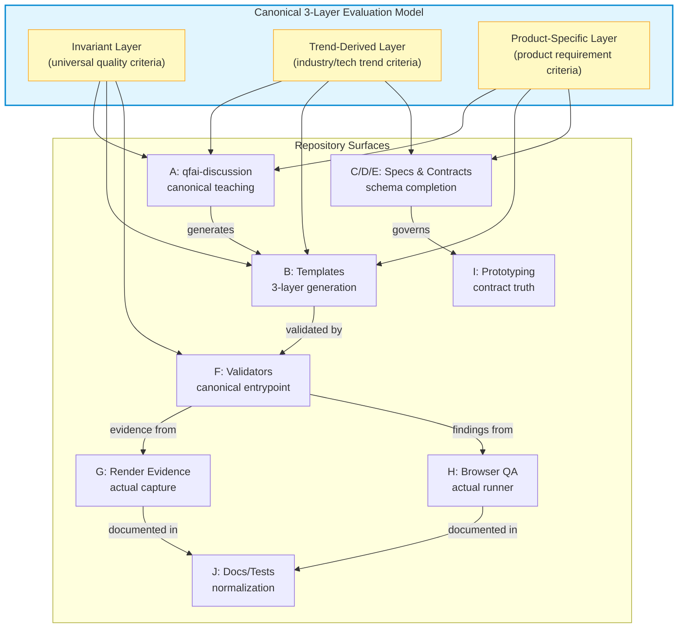
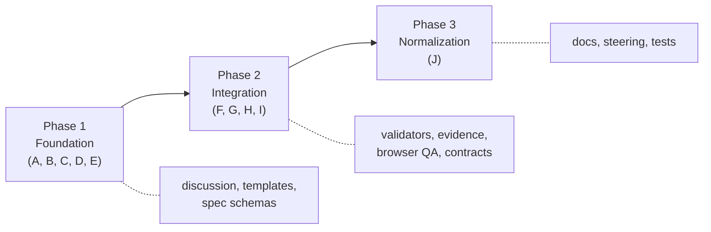

# 02_Inception-Deck — QFAI v1.7.11

## Q1. Why Are We Here?

v1.7.9 監査で未完だった実装収束を完了するため。

v1.7 系で canonical 3-layer evaluation model (invariant / trend-derived / product-specific) が設計確定したが、repo の全層 (discussion / templates / validators / runtime evidence / docs / tests) での統一が v1.7.9 時点で達成されていない。各層が異なる architectural truth を公開している状態を解消し、canonical design に repo truth を完全に合わせる。

## Q2. Elevator Pitch

> **v1.7.11 は、repo の全 surface (discussion / templates / validators / runtime / docs / tests) を同一 canonical 3-layer evaluation model に収束させる completion release である。**

| For         | QFAI 開発者・ユーザー                                                                     |
| ----------- | ----------------------------------------------------------------------------------------- |
| Who         | canonical model と repo 実装の乖離に直面している                                          |
| The         | QFAI v1.7.11                                                                              |
| Is a        | Completion / Correction / Integration release                                             |
| That        | 全 surface を canonical 3-layer model に統一する                                          |
| Unlike      | v1.7.9 (収束途上)                                                                         |
| Our product | 全層で一貫した truth を提供し、バリデーション・エビデンス・ドキュメントの信頼性を確立する |

## Q3. Design a Product Box

### QFAI v1.7.11 — Complete Convergence

**表面 (Front)**

- "Complete Convergence" — 全層統一の completion release
- Canonical 3-layer evaluation model の全面適用
- 10 workstreams による体系的収束

**裏面 (Back)**

- discussion skill: canonical 3-layer teaching
- templates: 3-layer canonical generation
- validators: canonical entrypoint 統合
- runtime: actual capture / actual runner
- docs/tests: v1.7.11 truth 反映

## Q4. NOT List

以下は v1.7.11 のスコープ外であり、実施しない:

| Item                           | In / Out | Rationale                               |
| ------------------------------ | -------- | --------------------------------------- |
| 新機能追加                     | OUT      | completion release — 既存設計の収束のみ |
| アーキテクチャ再議論           | OUT      | canonical 3-layer model は確定済み      |
| full-harness default 化        | OUT      | prototyping contract の truth 確立まで  |
| reviewer 科学の高度化          | OUT      | 収束完了後の次版以降で検討              |
| recurrence prevention 制度実装 | OUT      | 制度設計は別リリースで扱う              |
| UI sidecar 実装                | OUT      | non-ui surface — CLI のみ               |
| パフォーマンス最適化           | OUT      | 機能的収束が優先                        |

## Q5. Meet Your Neighbors

v1.7.11 の作業は以下の隣接 skill / モジュールと相互作用する:

| Neighbor                | Interaction                       | Direction                          |
| ----------------------- | --------------------------------- | ---------------------------------- |
| `qfai-discussion`       | canonical 3-layer teaching の実装 | 双方向 (A → discussion output)     |
| `qfai-sdd`              | discussion pack → spec 変換       | 下流 (discussion → sdd)            |
| `qfai-prototyping`      | contract truth の確立             | 双方向 (I → prototyping contracts) |
| `qfai-verify`           | validator entrypoint 統合         | 双方向 (F → verify flow)           |
| `packages/qfai/src/`    | validator / evidence 実装         | 直接変更対象                       |
| `packages/qfai/assets/` | template family 置換              | 直接変更対象                       |
| `.qfai/specs/`          | spec / contract 更新              | 直接変更対象                       |
| `.github/workflows/`    | CI 整合                           | 必要に応じて更新                   |

## Q6. Show the Solution

### Convergence Architecture

以下の Mermaid 図は、全層が canonical 3-layer evaluation model に収束するアーキテクチャを示す。



### Convergence Flow



## Q7. What Keeps Us Up at Night?

| Risk                                   | Severity | Mitigation                                                        |
| -------------------------------------- | -------- | ----------------------------------------------------------------- |
| Integration 未完のまま次版に持ち越し   | HIGH     | 10 workstreams を段階的に実行し、各 phase で完了判定を実施        |
| Workstream 間の依存関係による blocking | MEDIUM   | Phase 分割により依存を制御。Phase 1 完了なしに Phase 2 に進まない |
| 既存テストの大量 breakage              | MEDIUM   | 段階的な変更とテスト更新を並行実施                                |
| canonical model 解釈のブレ             | LOW      | 設計確定済みの 3-layer model を唯一の truth とする                |
| スコープクリープ (新機能混入)          | MEDIUM   | NOT list の厳格な適用。新機能は次版に defer                       |

## Q8. Size It Up

### Workstreams (10)

| ID  | Workstream                              | Phase | Scope                                      |
| --- | --------------------------------------- | ----- | ------------------------------------------ |
| A   | qfai-discussion canonical completion    | 1     | 4-axis 除去、3-layer canonical 追加        |
| B   | UI/UX template family replacement       | 1     | 3-layer templates への置換                 |
| C   | 04_Sources.md schema completion         | 3     | trend scan schema 完成                     |
| D   | 10_strategy.md strong schema            | 1     | strategy spec の strong schema 化          |
| E   | 40_contracts.md strong schema           | 3     | contracts spec の strong schema 化         |
| F   | Canonical validator registration        | 1     | runAllUixValidators → canonical entrypoint |
| G   | Render evidence actual capture          | 2     | placeholder → real capture status          |
| H   | Browser QA orchestrator actual runner   | 2     | stub → actual phase runner                 |
| I   | Prototyping/full-harness contract truth | 2     | contract truth の確立                      |
| J   | Docs/steering/tests normalization       | 3     | v1.7.11 truth への全面更新                 |

### Phases (3)

| Phase | Name                | Workstreams | Goal                                                               |
| ----- | ------------------- | ----------- | ------------------------------------------------------------------ |
| 1     | Truth-Path Blockers | A, B, D, F  | discussion / templates / strategy / validator の truth-path を確立 |
| 2     | Runtime Completion  | G, H, I     | evidence / browser QA / prototyping の実行層を統合                 |
| 3     | Normalization       | C, E, J     | schema 完成 + ドキュメント・テストを truth に合わせる              |

## Q9. What Is It Going to Take? (Trade-offs)

| Dimension               | Priority          | Rationale                   |
| ----------------------- | ----------------- | --------------------------- |
| 完全性 (Completeness)   | **HIGH** — 最優先 | 全層の canonical 収束が目的 |
| 新機能 (Features)       | LOW — 実施しない  | completion release          |
| 収束 (Convergence)      | **HIGH**          | 拡張より収束を優先          |
| 拡張 (Extension)        | LOW — 後回し      | 次版以降で対応              |
| 品質 (Quality)          | **HIGH**          | テストカバレッジ維持・向上  |
| スケジュール (Timeline) | MEDIUM            | 固定だがスコープ調整で対応  |

### Trade-off Matrix

```
              完全性 > 新機能
              収束   > 拡張
              品質   > スケジュール
```

## Q10. What's Going to Give?

**Timeline is fixed; scope may be narrowed if needed.**

- リリーススケジュールは固定。v1.7.11 を予定通りリリースする。
- 全 10 workstreams の完了が理想だが、タイムライン制約下でスコープ縮小が必要な場合は以下の優先順位で判断する:
  1. **Must**: A (discussion canonical), F (validator entrypoint), J (docs/tests) — これらが未完では release claim が成立しない
  2. **Should**: B (templates), G (evidence), H (browser QA) — ユーザー facing の品質に直結
  3. **Could**: C, D, E (spec schemas), I (prototyping contracts) — spec 層の強化で、次版 defer 可能
- defer された workstream は次版 (v1.7.12 or v1.8.0) の必須スコープとして引き継ぐ。

## Design Direction Pack

### visual_thesis

Canonical 3-layer evaluation model should read as a single coherent architecture across discussion, templates, validators, runtime evidence, and tests.

### content_plan

- Explain the convergence story from discussion through validation.
- Show the repository surfaces that must align with the canonical model.

### interaction_thesis

- Prefer deterministic validation entrypoints over hidden fallbacks.
- Keep completion evidence explicit and reviewable.

### anti_goals

- generic dashboard clone
- empty-state without action

### cta_hierarchy

- Primary: complete convergence of all repository surfaces
- Secondary: preserve compatibility while removing stale architectural truths
- Placement: inception-deck summary and workstream plan

### theme

- Theme: completion release
- Mood: rigorous
- Taste: technical
- Material: markdown and validator contracts
- Energy: deliberate
- visual_anchor: canonical 3-layer model
