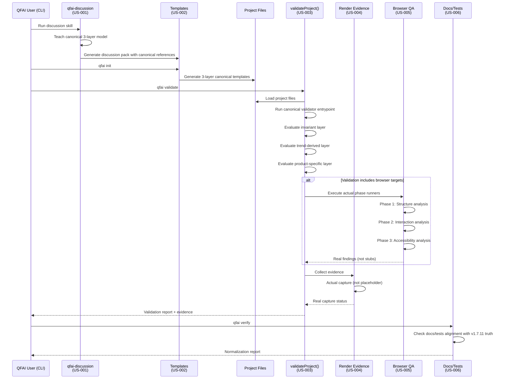
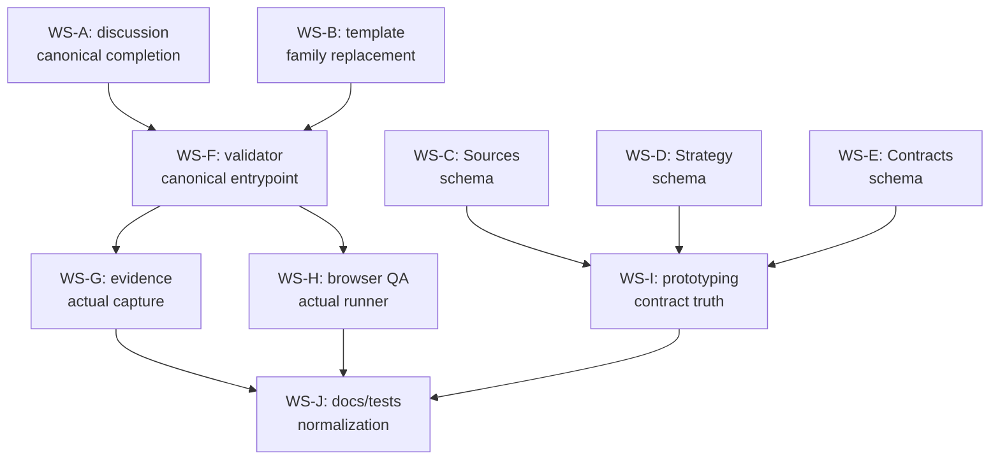

# 03_Story-Workshop — QFAI v1.7.11

## Surface Type

**non-ui** — QFAI は CLI ツール / フレームワーク。UI-bearing sidecar は対象外。HTML mock は不要。

---

## User Stories

### US-001: qfai-discussion canonical 3-layer teaching

> As a QFAI user, I want qfai-discussion to teach canonical 3-layer model for UI-bearing projects so that generated artifacts match the validated architecture.

| Attribute           | Value                                                                                                                                |
| ------------------- | ------------------------------------------------------------------------------------------------------------------------------------ |
| Priority            | Must                                                                                                                                 |
| Workstream          | A                                                                                                                                    |
| Acceptance criteria | discussion skill が 3-layer model (invariant / trend-derived / product-specific) を教示し、4-axis model への参照が除去されていること |

### US-002: 3-layer canonical template generation

> As a QFAI user, I want init/packaged assets to generate 3-layer canonical templates so that new projects start with the correct architecture.

| Attribute           | Value                                                                               |
| ------------------- | ----------------------------------------------------------------------------------- |
| Priority            | Should                                                                              |
| Workstream          | B                                                                                   |
| Acceptance criteria | `qfai init` が 3-layer canonical templates を生成し、旧テンプレートが含まれないこと |

### US-003: Canonical validator entrypoint

> As a QFAI user, I want `validateProject()` to use canonical validator entrypoint so that production validation enforces the canonical model.

| Attribute           | Value                                                                                            |
| ------------------- | ------------------------------------------------------------------------------------------------ |
| Priority            | Must                                                                                             |
| Workstream          | F                                                                                                |
| Acceptance criteria | `validateProject()` が canonical entrypoint を呼び出し、`runAllUixValidators` が使用されないこと |

### US-004: Render evidence actual capture

> As a QFAI user, I want render evidence to report real capture status so that evidence reports are honest.

| Attribute           | Value                                                                                                       |
| ------------------- | ----------------------------------------------------------------------------------------------------------- |
| Priority            | Should                                                                                                      |
| Workstream          | G                                                                                                           |
| Acceptance criteria | evidence report が実際のキャプチャステータス (success/failure/skipped) を返し、placeholder が残存しないこと |

### US-005: Browser QA actual phase runner

> As a QFAI user, I want browser QA to execute actual phase runners so that findings reflect real analysis.

| Attribute           | Value                                                                                |
| ------------------- | ------------------------------------------------------------------------------------ |
| Priority            | Should                                                                               |
| Workstream          | H                                                                                    |
| Acceptance criteria | browser QA orchestrator が実際の phase runner を実行し、stub/mock 結果を返さないこと |

### US-006: Docs/steering/tests normalization

> As a QFAI user, I want docs/steering/tests to reflect v1.7.11 truth so that release claims are trustworthy.

| Attribute           | Value                                                                                                            |
| ------------------- | ---------------------------------------------------------------------------------------------------------------- |
| Priority            | Must                                                                                                             |
| Workstream          | J                                                                                                                |
| Acceptance criteria | 全ドキュメント・ステアリング文書・テストが canonical 3-layer model と v1.7.11 の実装状態を正確に反映していること |

---

## User Flows

### Flow: Canonical Validation Pipeline

以下の Mermaid sequenceDiagram は、discussion から evidence までの validation flow を示す。

### Flow: Workstream Dependency

---

## Example Seeds

### US-001: qfai-discussion canonical 3-layer teaching

| Perspective      | Seed                                                                        | Expected Outcome                                                                        |
| ---------------- | --------------------------------------------------------------------------- | --------------------------------------------------------------------------------------- |
| Happy path       | discussion skill を UI-bearing project で実行し、3-layer model が教示される | discussion pack に invariant / trend-derived / product-specific の 3 layer が明示される |
| Negative path    | discussion skill 実行時に canonical model 定義ファイルが欠損している        | エラーメッセージが canonical model 定義の欠損を報告し、fallback しない                  |
| Edge/Boundary    | non-ui project (CLI tool) で discussion skill を実行する                    | UI-bearing 固有の layer 項目がスキップされ、共通項目のみ教示される                      |
| Permission/Role  | agent role で discussion skill を実行する                                   | user/agent 両方の role で同一 canonical model が適用される                              |
| State transition | 旧 4-axis model で生成済みの discussion pack が存在する状態で再実行         | 旧 4-axis 参照が検出され、canonical 3-layer への migration が提示される                 |

### US-002: 3-layer canonical template generation

| Perspective      | Seed                                                             | Expected Outcome                                                                                              |
| ---------------- | ---------------------------------------------------------------- | ------------------------------------------------------------------------------------------------------------- |
| Happy path       | `qfai init` を新規ディレクトリで実行する                         | 3-layer canonical templates が生成され、invariant / trend-derived / product-specific の各セクションが含まれる |
| Negative path    | assets ディレクトリに canonical templates が存在しない           | エラーメッセージが template 欠損を報告し、旧テンプレートへの fallback をしない                                |
| Edge/Boundary    | 既存プロジェクトに対して `qfai init` を実行する (上書きシナリオ) | 既存ファイルとの衝突検出が行われ、上書き確認プロンプトが表示される                                            |
| Permission/Role  | read-only ディレクトリで `qfai init` を実行する                  | 書き込み権限エラーが適切に報告される                                                                          |
| State transition | 旧テンプレートで初期化済みプロジェクトを再初期化する             | 旧テンプレートが 3-layer canonical に更新される                                                               |

### US-003: Canonical validator entrypoint

| Perspective      | Seed                                                                      | Expected Outcome                                                                          |
| ---------------- | ------------------------------------------------------------------------- | ----------------------------------------------------------------------------------------- |
| Happy path       | `qfai validate` を canonical templates を持つプロジェクトで実行する       | canonical validator entrypoint 経由で 3-layer 評価が実行され、各 layer の結果が報告される |
| Negative path    | canonical validator entrypoint の登録が欠損している                       | `runAllUixValidators` への fallback をせず、entrypoint 未登録エラーを報告する             |
| Edge/Boundary    | 一部の layer のみ spec が定義されているプロジェクトで validate を実行する | 定義済み layer のみ評価され、未定義 layer は "not configured" として報告される            |
| Permission/Role  | CI 環境 (non-interactive) で validate を実行する                          | interactive prompt なしで完走し、exit code で結果を返す                                   |
| State transition | validate 実行中にプロジェクトファイルが変更される                         | 実行開始時のスナップショットで評価が完了する (途中変更の影響を受けない)                   |

### US-004: Render evidence actual capture

| Perspective      | Seed                                              | Expected Outcome                                                                  |
| ---------------- | ------------------------------------------------- | --------------------------------------------------------------------------------- |
| Happy path       | validate 完了後に evidence report を生成する      | 各チェック項目の実際のキャプチャステータス (success/failure/skipped) が記録される |
| Negative path    | evidence capture 対象が存在しないパスを参照する   | capture status が "failure" + エラー理由として記録される (placeholder にならない) |
| Edge/Boundary    | 全チェック項目が skip される (該当 surface なし)  | 全項目 "skipped" で記録され、空レポートや placeholder にならない                  |
| Permission/Role  | evidence 出力先ディレクトリに書き込み権限がない   | 権限エラーが報告され、部分的な evidence ファイルが残らない                        |
| State transition | 前回の evidence report が存在する状態で再生成する | 新しい evidence report が生成され、前回の report は保持される (上書きしない)      |

### US-005: Browser QA actual phase runner

| Perspective      | Seed                                                         | Expected Outcome                                                                                 |
| ---------------- | ------------------------------------------------------------ | ------------------------------------------------------------------------------------------------ |
| Happy path       | browser QA 対象の URL が有効で、全 phase runner が実行される | Phase 1 (Structure), Phase 2 (Interaction), Phase 3 (Accessibility) の実際の findings が返される |
| Negative path    | 対象 URL が応答しない (timeout)                              | phase runner が timeout エラーを報告し、stub 結果を返さない                                      |
| Edge/Boundary    | 対象ページが SPA で JavaScript 実行が必要                    | phase runner が JavaScript 実行後の DOM を対象に分析する                                         |
| Permission/Role  | browser QA がヘッドレス環境 (CI) で実行される                | ヘッドレスモードで全 phase runner が正常に動作する                                               |
| State transition | phase 1 で critical finding が検出された場合                 | phase 2, 3 も実行され、全 phase の findings が集約される (early termination しない)              |

### US-006: Docs/steering/tests normalization

| Perspective      | Seed                                                                              | Expected Outcome                                                                        |
| ---------------- | --------------------------------------------------------------------------------- | --------------------------------------------------------------------------------------- |
| Happy path       | `qfai verify` で docs/steering/tests の整合性を検証する                           | 全ドキュメントが v1.7.11 truth (canonical 3-layer model) と整合していることが確認される |
| Negative path    | ドキュメントに旧 4-axis model への参照が残存している                              | 不整合が検出され、具体的なファイルパスと修正内容が報告される                            |
| Edge/Boundary    | テストファイルが v1.7.11 の新規 API を参照しているが、旧 API テストも残存している | 旧 API テストの deprecation warning が報告される                                        |
| Permission/Role  | CI で normalization check を実行する                                              | non-interactive で完走し、不整合があれば non-zero exit code を返す                      |
| State transition | normalization 修正適用前後で verify を実行する                                    | 修正前: 不整合報告あり → 修正後: 不整合報告なし (PASS)                                  |
