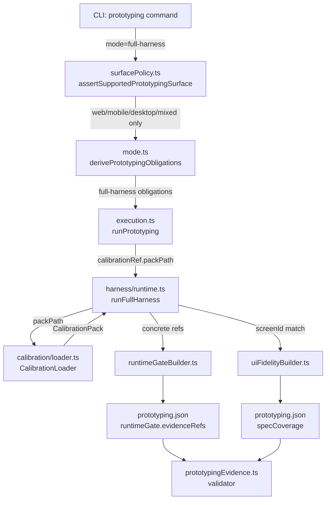

# 02 Inception Deck

## Q1: Why Are We Here?

The QFAI v1.7.15-06 audit identified 5 unresolved contract contradictions in the `packages/qfai` prototyping subsystem:

1. `standard` mode is accepted by the validator but the runtime requires full-harness evidence — an unauditable state.
2. `cli` surface remains in type definitions and tests despite being non-prototypable by design.
3. `runFullHarness()` accepts caller-supplied scalar thresholds, allowing threshold override that breaks calibration SSOT.
4. `runtimeGate.evidenceRefs` and `specCoverage.evidenceRefs` contain self-references and synthetic strings that cannot be independently verified.
5. `reviewerSignoff.status = approved` is emitted for plateau and maxIterations terminations, making the audit trail semantically incorrect.

We are here to resolve all 5 contradictions in a single, atomic PR with no backward-compat concerns. The goal is a strict, auditable, and fully self-consistent implementation of full-harness-only / UI-only prototyping in `packages/qfai`.

---

## Q2: Elevator Pitch

> "For package maintainers who need an auditable prototyping runtime, QFAI v1.7.15 delivers a strict full-harness-only/UI-only prototyping contract with calibration pack SSOT, concrete evidenceRefs, and explicit review semantics. Unlike the current implementation that accepts contradictory inputs silently, our solution enforces all contracts at every layer simultaneously. If it runs, it's valid. If it's invalid, it fails fast."

---

## Q3: Design Box (Product Box)

| Field | Value |
|-------|-------|
| Package name | `packages/qfai` |
| Version | v1.7.15 |
| Key features | Full-harness only mode; UI-bearing surface restriction; Calibration pack SSOT; Concrete evidenceRefs; Clean review semantics vocabulary |
| Target users | QFAI maintainers and users running `qfai validate` |
| Primary promise | "If it runs, it's valid. If it's invalid, it fails fast." |
| Secondary promise | Zero ambiguity in review outcome — `approved`, `rejected`, and `abandoned` are mutually exclusive and exhaustive. |

---

## Q4: NOT List (Anti-Goals)

The following are explicitly NOT in scope for this PR:

- ❌ Adding any new prototyping features or modes
- ❌ Supporting `standard` mode (removed, not deprecated)
- ❌ Supporting `low-cost` mode (removed, not deprecated)
- ❌ Supporting `cli` surface in prototyping (removed entirely)
- ❌ Providing migration tooling for users who used removed modes
- ❌ Writing release notes or a changelog entry
- ❌ Touching repo root `.qfai/**` (out of scope)
- ❌ Any v1.8 feature work
- ❌ Updating external documentation outside `packages/qfai/`

---

## Q5: Meet the Neighbors

**Upstream (feeds into this system):**
- `qfai-discussion` skill → produces discussion packs like this one
- `qfai-sdd` skill → produces spec files that drive implementation
- `qfai-prototyping` skill → drives prototyping execution sessions
- `surfacePolicy.ts` (new) → supplies allowed surfaces
- `CalibrationLoader` → resolves calibration packs from disk

**Downstream (depends on this system):**
- `qfai validate` CLI → invokes `prototypingEvidence.ts` validator
- `prototypingEvidence.ts` validator → checks all contracts enforced here
- Downstream users' CI pipelines → run `qfai validate` as a gate

**Peer components (same layer):**
- `uiFidelityBuilder.ts` → computes UI fidelity score per screen
- `runtimeGateBuilder.ts` → assembles runtimeGate evidenceRefs
- `specCoverage.ts` → assembles specCoverage evidenceRefs

---

## Q6: Show the Solution

The following diagram shows the architecture of the prototyping subsystem after the change:

**Key architectural changes visualized:**
- `surfacePolicy.ts` is a new standalone module (WS-2) — surface allowlist is no longer inline in mode.ts
- `CalibrationLoader` is now the mandatory resolution path for calibration (WS-3) — scalar thresholds bypass is removed
- `runtimeGateBuilder.ts` and `uiFidelityBuilder.ts` produce only concrete artifact refs (WS-4, WS-6)
- The entire chain is now fail-closed: any invalid input throws before reaching the iteration loop

---

## Q7: What Keeps Us Up at Night

| Risk | Description | Severity |
|------|-------------|----------|
| Validator softening | The validator (`prototypingEvidence.ts`) might be loosened to pass stale test fixtures instead of fixing the fixtures themselves. This inverts the purpose of the validator. | High |
| evidenceRefs regression | After a future PR, `runtimeGate.evidenceRefs` might silently become synthetic again if the concrete-ref constraint is not enforced by the validator. | High |
| approved-on-abandoned regression | A future refactor might re-introduce `approved` as a return value for plateau or maxIterations termination if the mapping is not enforced at both runtime and validator layers. | High |
| WS-3 complexity | `runFullHarness()` caller API change (removing scalar thresholds) is the most likely source of unexpected breakage across test fixtures. | Medium |
| Incomplete stale cleanup | WS-7 may miss a file that still contains `standard` or `cli prototyping` references, causing downstream confusion. | Medium |

---

## Q8: Size It Up

| Dimension | Estimate |
|-----------|----------|
| Workstreams | 7 (WS-1 through WS-7) |
| Existing files changed | ~15 |
| New files added | ~4 (surfacePolicy.ts + ~3 test support files) |
| New test files | ~3 |
| Complexity | Medium-high |
| Highest-risk workstream | WS-3 (calibration SSOT — touches harness/runtime.ts, calibration/loader.ts, execution.ts, prototypingEvidence.ts) |
| Lowest-risk workstream | WS-6 (uiFidelityBuilder one-line fix + regression test) |

---

## Q9: Tradeoffs

| Dimension | Chosen Approach | Rejected Approach | Reason for Choice |
|-----------|----------------|-------------------|-------------------|
| Backward compat | No compat — `standard`, `low-cost`, `cli` surface throw hard errors | Deprecation warnings for N versions | Design doc explicitly states "後方互換は完全に捨てる"; deprecation creates ambiguity in the audit period |
| Delivery model | Single atomic PR (all 7 WS together) | Phased PRs per workstream | Splitting creates transient contract-inconsistent states; single PR ensures atomicity |
| surfacePolicy location | Standalone `surfacePolicy.ts` file | Inline constants in `mode.ts` | SRP: mode.ts owns obligations logic; surface allowlist is a separate, independently testable concern |
| CalibrationLoader failure | Throw `Error` immediately | Return null or typed error object | Fail-fast precondition; no caller should be allowed to proceed without a resolved pack |
| reviewerLogs vocabulary | Mapped vocabulary (approve/revise/reject/abandon) | Store original pre-mapping vocabulary | Reduces validator branching; downstream consumers see consistent vocabulary at every read point |

---

## Q10: What Will It Take?

**People:**
- 1 implementor capable of TypeScript strict-mode refactoring across the prototyping subsystem
- Reviewers: `completion-reviewer`, `requirements-reviewer`, `architecture-reviewer`

**Technical gates:**
- TypeScript `strict: true` compliance — 0 errors, 0 `@ts-ignore`, 0 bare `as` casts
- All vitest suites pass: `pnpm test` exits 0
- Validator (`prototypingEvidence.ts`) rejects all previously-contradictory inputs

**Scope gates:**
- All 7 workstreams implemented in one PR
- No new features introduced
- No stale semantics remaining in shipped docs, assets, or tests
- Repo root `.qfai/**` untouched

**Process:**
- Implementation order: WS-1/WS-2 → WS-3 → WS-4 → WS-5 → WS-6 → WS-7
- Each workstream: implement → write/update tests → confirm vitest passes → continue
- Final WS-7: stale doc cleanup only after all code workstreams are green
