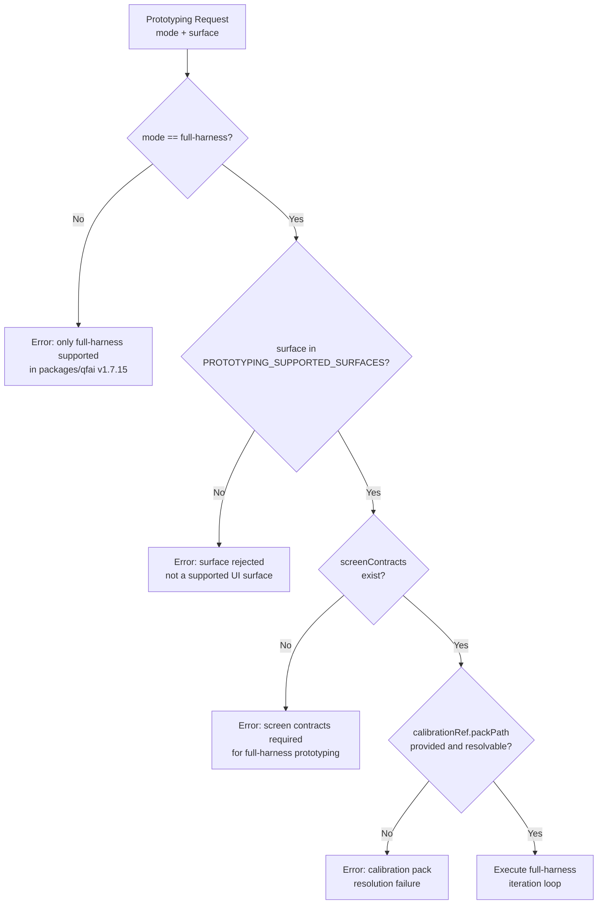

# 03 Story Workshop

## Mode/Surface Rejection Decision Tree

---

## US-001: Reject Non-Full-Harness Mode at CLI

**As a** package implementor,  
**I want** `prototyping.ts` CLI to reject `--mode standard` and `--mode low-cost` with a clear error,  
**so that** no user can accidentally run an unsupported mode and receive an unvalidatable result.

### Acceptance Criteria

- AC-001-1: `qfai prototyping --mode standard` exits non-zero with error message containing "full-harness mode only"
- AC-001-2: `qfai prototyping --mode low-cost` exits non-zero with error message containing "full-harness mode only"
- AC-001-3: `qfai prototyping --mode full-harness` with valid surface and calibration proceeds to execution
- AC-001-4: `execution.ts` rejects `mode !== "full-harness"` independently of CLI (defense in depth)
- AC-001-5: `prototypingEvidence.ts` validator rejects `mode !== "full-harness"` in recorded output

### Example Seeds

| Perspective | Input | Expected Outcome |
|-------------|-------|-----------------|
| Happy path | `--mode full-harness` with valid surface/contracts/calibration | Execution starts; no error |
| Negative path | `--mode standard` | Immediate CLI error: "packages/qfai v1.7.15 supports full-harness mode only." |
| Negative path | `--mode low-cost` | Immediate CLI error: "packages/qfai v1.7.15 supports full-harness mode only." |
| Edge/boundary | `--mode FULL-HARNESS` (uppercase) | Error (case-sensitive rejection; no case folding) |
| Edge/boundary | `--mode ""` (empty string) | Error (empty mode treated as invalid) |
| Permission/role | Implementor bypasses CLI and calls `execution.ts` directly with `mode: "standard"` | Error thrown from execution layer (defense in depth) |
| State transition | Mode rejection must fire before calibration loading | Error at mode check; CalibrationLoader never invoked |
| Idempotency/retry | Calling CLI twice with `--mode standard` | Both calls fail identically; no state change on second call |

---

## US-002: Reject Non-UI Surfaces at All Layers

**As a** package implementor,  
**I want** `cli`, `api`, and `backend` surfaces to be rejected at CLI, execution, and validator layers,  
**so that** stale CLI prototyping references in old configs cannot silently produce a prototyping run.

### Acceptance Criteria

- AC-002-1: `qfai prototyping --surface cli` exits non-zero with error naming the rejected surface
- AC-002-2: `qfai prototyping --surface api` exits non-zero with error naming the rejected surface
- AC-002-3: `qfai prototyping --surface backend` exits non-zero with error naming the rejected surface
- AC-002-4: `execution.ts` calls `assertSupportedPrototypingSurface()` from `surfacePolicy.ts`
- AC-002-5: `prototypingEvidence.ts` validator rejects any surface not in `PROTOTYPING_SUPPORTED_SURFACES`
- AC-002-6: `PROTOTYPING_SUPPORTED_SURFACES` = `["web", "mobile", "desktop", "mixed"]`

### Example Seeds

| Perspective | Input | Expected Outcome |
|-------------|-------|-----------------|
| Happy path | `--surface web` with valid mode/contracts/calibration | Execution proceeds |
| Happy path | `--surface mobile` | Execution proceeds |
| Happy path | `--surface desktop` | Execution proceeds |
| Happy path | `--surface mixed` | Execution proceeds |
| Negative path | `--surface cli` | Error: "Surface 'cli' is not a supported prototyping surface. Supported: web, mobile, desktop, mixed." |
| Negative path | `--surface api` | Error naming `api` as rejected |
| Negative path | `--surface backend` | Error naming `backend` as rejected |
| Edge/boundary | `--surface unknown-surface-xyz` | Error (unknown surface treated as unsupported) |
| Permission/role | Call `assertSupportedPrototypingSurface("cli")` directly | Throws immediately |
| State transition | Surface rejection fires before any file I/O | Error before calibration load attempt |
| Idempotency/retry | `isSupportedPrototypingSurface("cli")` called twice | Returns `false` both times (pure function) |

---

## US-003: runFullHarness Uses Calibration Pack SSOT

**As a** harness operator,  
**I want** `runFullHarness()` to resolve its calibration pack internally from `calibrationRef.packPath`,  
**so that** I cannot override thresholds externally and the validator can verify the same pack was used.

### Acceptance Criteria

- AC-003-1: `runFullHarness()` signature does not include scalar threshold parameters
- AC-003-2: `runFullHarness()` accepts `calibrationRef: { packPath: string }` (or pre-resolved `calibrationPack` object)
- AC-003-3: When `packPath` is provided, `CalibrationLoader` is invoked internally to resolve the pack
- AC-003-4: If `packPath` is missing or the file is not found, an `Error` is thrown immediately before any iteration
- AC-003-5: The resolved pack's path is recorded in the runtime summary's `calibrationRef.packPath`
- AC-003-6: Validator checks that `calibrationRef.packPath` matches the pack used at runtime

### Example Seeds

| Perspective | Input | Expected Outcome |
|-------------|-------|-----------------|
| Happy path | `calibrationRef: { packPath: "./calib/standard.yaml" }` (file exists) | Pack resolved; iteration loop starts |
| Negative path | `calibrationRef: { packPath: "./calib/missing.yaml" }` (file not found) | Immediate `Error` with packPath in message; no iterations |
| Negative path | No `calibrationRef` provided | Immediate `Error`: calibration pack required |
| Edge/boundary | `packPath` is an absolute path | Resolved correctly; path recorded in summary |
| Edge/boundary | `packPath` points to malformed YAML | `Error` thrown at parse time; no iterations |
| Permission/role | Caller tries to pass scalar `passingThreshold: 0.95` | TypeScript compile error (removed from signature) |
| State transition | Pack resolution error must fire before `iteration[0]` begins | No partial iteration state in output |
| Idempotency/retry | Same `packPath` called twice | Both calls use same resolved pack; results deterministic |

---

## US-004: runtimeGate.evidenceRefs Contains Only Concrete Artifact Refs

**As an** auditor,  
**I want** `runtimeGate.evidenceRefs` to point to concrete, resolvable artifacts,  
**so that** I can independently verify each ref without relying on self-referential pointers.

### Acceptance Criteria

- AC-004-1: `runtimeGate.evidenceRefs` contains render summary refs (e.g., `prototyping.json#/iterations/0/renderSummary`)
- AC-004-2: `runtimeGate.evidenceRefs` contains screenshot refs (e.g., `screenshots/iter-0-screen-login.png`)
- AC-004-3: `runtimeGate.evidenceRefs` contains Browser QA phase/finding refs
- AC-004-4: `runtimeGate.evidenceRefs` does NOT contain self-references (e.g., `prototyping.json#/runtimeGate`)
- AC-004-5: `prototypingEvidence.ts` validator rejects any evidenceRef that is a self-reference
- AC-004-6: `prototypingEvidence.ts` validator rejects any evidenceRef that is a synthetic free-text string

### Example Seeds

| Perspective | Input | Expected Outcome |
|-------------|-------|-----------------|
| Happy path | evidenceRefs: `["prototyping.json#/iterations/0/renderSummary", "screenshots/iter-0.png"]` | Validator passes |
| Negative path | evidenceRefs: `["prototyping.json#/runtimeGate"]` (self-ref) | Validator error: self-reference forbidden |
| Negative path | evidenceRefs: `["specs: UI matches design as per visual inspection"]` (synthetic) | Validator error: synthetic ref forbidden |
| Edge/boundary | evidenceRefs: `[]` (empty array) | Validator error: at least one concrete ref required |
| Edge/boundary | evidenceRefs with 100 entries | All checked; any invalid entry causes rejection |
| Permission/role | `runtimeGateBuilder.ts` produces self-refs due to code bug | Validator catches and rejects; runtime code bug surfaced at validate time |
| State transition | Valid refs from iteration N must include N-specific paths | Validator can correlate each ref to a specific iteration |
| Idempotency/retry | Same evidenceRefs validated twice | Both validations return same result |

---

## US-005: reviewerSignoff.status Reflects Actual Outcome

**As an** auditor,  
**I want** `reviewerSignoff.status` to use `approved`, `rejected`, or `abandoned` with correct mapping,  
**so that** plateau and rejected outcomes are distinguishable in the audit trail.

### Acceptance Criteria

- AC-005-1: `reviewerSignoff.status = "approved"` only when quality gate was met (`terminationReason = "accepted"`)
- AC-005-2: `reviewerSignoff.status = "rejected"` only when explicitly rejected (`terminationReason = "rejected"`)
- AC-005-3: `reviewerSignoff.status = "abandoned"` for `terminationReason = "plateau"`, `"maxIterations"`, or `"runtimeFailure"`
- AC-005-4: `isCompleted: true` alone does NOT produce `status = "approved"`
- AC-005-5: `reviewerLogs[].verdict` uses `approve`, `revise`, `reject`, or `abandon` vocabulary
- AC-005-6: Validator enforces that `status` and `terminationReason` are consistent

### Example Seeds

| Perspective | Input | Expected Outcome |
|-------------|-------|-----------------|
| Happy path | `terminationReason: "accepted"` | `reviewerSignoff.status = "approved"` |
| Negative path | `terminationReason: "plateau"` + `status: "approved"` | Validator rejects: inconsistent status/terminationReason |
| Negative path | `terminationReason: "maxIterations"` + `status: "approved"` | Validator rejects |
| Edge/boundary | `isCompleted: true` + `terminationReason: "plateau"` | `status = "abandoned"` (not approved) |
| Edge/boundary | `terminationReason: "runtimeFailure"` | `status = "abandoned"` |
| Permission/role | Harness code tries to write `status: "accepted"` (old vocab) | TypeScript type error (not in allowed literal union) |
| State transition | Mapping from terminationReason to status at harness exit | Mapping applied once at execution end; immutable after |
| Idempotency/retry | Validator run twice on same output | Both runs return same accept/reject decision |

---

## US-006: uiFidelityBuilder Matches by screenId

**As a** test engineer,  
**I want** `uiFidelityBuilder` to match screen observations using `obs.screenId === screen.screenId`,  
**so that** observation records are correctly attributed even when `uiContractId` differs from `screenId`.

### Acceptance Criteria

- AC-006-1: `uiFidelityBuilder.ts` uses `obs.screenId === screen.screenId` for matching (not `screen.uiContractId`)
- AC-006-2: A regression test fixture exists where `screenId !== uiContractId`
- AC-006-3: The regression test verifies that the fixture observation is matched by `screenId` (not by `uiContractId`)
- AC-006-4: Observations with a `screenId` matching no contract entry produce no match (not matched by `uiContractId` fallback)
- AC-006-5: The old matching code `obs.screenId === screen.uiContractId` is fully removed

### Example Seeds

| Perspective | Input | Expected Outcome |
|-------------|-------|-----------------|
| Happy path | `obs.screenId = "screen-login"`, `screen.screenId = "screen-login"` | Match found; fidelity computed |
| Negative path | `obs.screenId = "screen-login"`, `screen.uiContractId = "screen-login"`, `screen.screenId = "sc-001"` | No match (old matching removed); observation unmatched |
| Negative path | `obs.screenId = "sc-001"`, `screen.screenId = "screen-login"` | No match |
| Edge/boundary | Multiple screens with same `screenId` prefix | Each matched by exact `screenId` equality |
| Edge/boundary | Observation list is empty | No error; fidelity result empty |
| Permission/role | Test fixture uses `uiContractId` field in observation schema | Hard-error: `uiContractId` field rejected (backward compat abandoned) |
| State transition | Fix applied to uiFidelityBuilder | All pre-existing tests that relied on uiContractId matching fail until fixtures are corrected |
| Idempotency/retry | `buildUiFidelity(screens, obs)` called twice | Returns same result (pure function) |
