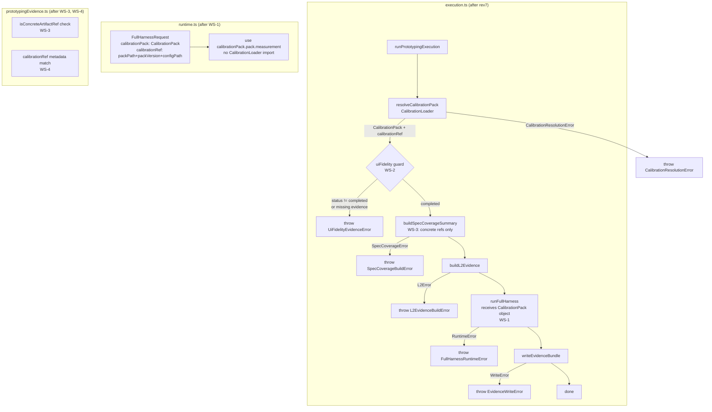

# 02 Inception Deck

## 1. Why Are We Here?

The v1.7.15-07 audit of `packages/qfai` identified 6 contract gaps that survive rev6. Each gap represents either a security risk (summary forgery, calibration bypass), a diagnostic failure (catch-all error masking), or a specification contradiction (config surface vs. README SSOT claim). Without closing these gaps, the package cannot be considered complete for the v1.7.15 release. A single PR must close all 6 gaps simultaneously with no backward compat concerns.

---

## 2. The Elevator Pitch

> **For** QFAI package maintainers and implementors,
> **who need** a strictly auditable, fail-closed prototyping subsystem,
> **the v1.7.15-07 single PR** is a targeted audit closure,
> **that** enforces resolved-pack API, uiFidelity hard gate, concrete traceability, validator calibration integrity, distinct error taxonomy, and packPath-only config,
> **unlike** the rev6 baseline, which left runtime pack resolution ambiguous, uiFidelity non-fatal, and config surface cluttered with obsolete scalar fields.

---

## 3. What Will It NOT Do?

| Out of Scope | Reason |
|---|---|
| repo root `.qfai/**` changes | Explicitly excluded from scope (design doc §4-2) |
| Migration guide / backward compat tooling | 後方互換は完全に捨てる |
| v1.8 new features | Different release scope |
| Non-UI prototyping re-introduction | Removed in previous cycles |
| `standard` / `low-cost` mode re-introduction | Removed in rev6 |
| `packHash` integrity check | Deferred (OQ-0001 resolved: defer to future cycle) |
| Discussion runtime redesign | Out of package scope |

---

## 4. Neighbors (Dependencies)

| Dependency | Direction | Notes |
|---|---|---|
| `packages/qfai/src/core/calibration/loader.ts` | consumed by execution.ts | CalibrationLoader stays; runtime.ts loses its import |
| `packages/qfai/src/core/prototyping/surfacePolicy.ts` | upstream of execution.ts, CLI | existing module; WS-7 syncs its error message |
| `packages/qfai/assets/init/root/qfai.config.yaml` | shipped artifact | WS-6 removes scalar fields |
| `packages/qfai/README.md` | shipped doc | WS-6 aligns description with packPath-only |
| vitest test suite | downstream gate | all suites must pass after changes |
| v1.7.15-07 audit report | upstream input | source of truth for gap definitions |
| rev6 discussion pack (discussion-20260415161758193) | upstream context | establishes full-harness-only, UI-only baseline |

---

## 5. The Solution (Architecture Sketch)

The central change is moving pack resolution from `runtime.ts` to `execution.ts`. After that, uiFidelity becomes a hard gate, error taxonomy is split, and config surface is narrowed.

---

## 6. What Keeps Us Up at Night?

| Risk | Mitigation |
|---|---|
| Circular import between `execution.ts` and new `errors.ts` | Place `errors.ts` in `prototyping/errors.ts` with no import of execution logic (OQ-0002 resolved) |
| `configPath` in `calibrationRef` — conditional comparison causes edge cases | Treat as optional; compare only when present in summary (OQ-0003 resolved) |
| Scalar field detection at parse-time vs. normalize-time | Detect at normalize-time for consistency with existing config.ts pattern (OQ-0004 resolved) |
| surfacePolicy.ts message generated from constant vs. hardcoded | Generate from constant to prevent stale recurrence (OQ-0005 resolved) |
| `packHash` omission leaves integrity gap | Deferred by design; `packVersion + packPath` sufficient for audit (OQ-0001 resolved) |
| Wide test surface change (7 workstreams) | Implementation order: WS-6 → WS-1 → WS-5 → WS-2 → WS-3 → WS-4 → WS-7 → tests/docs |

---

## 7. Timeline

| Phase | Content | Target |
|---|---|---|
| Discussion | This pack (rev7 audit closure design) | 2026-04-15 |
| Implementation WS-6 | Remove scalar config fields; update template + README | PR day 1 |
| Implementation WS-1 | Move pack resolution to execution.ts; update runtime.ts contract | PR day 1 |
| Implementation WS-5 | Introduce `prototyping/errors.ts`; split catch blocks | PR day 1 |
| Implementation WS-2 | Add uiFidelity guard before runFullHarness | PR day 2 |
| Implementation WS-3 | isConcreteArtifactRef; restrict specCoverage.evidenceRefs | PR day 2 |
| Implementation WS-4 | Validator calibration metadata comparison | PR day 2 |
| Implementation WS-7 | Sync surfacePolicy.ts message from constant | PR day 2 |
| Tests + docs | Update all test suites; verify vitest green | PR day 3 |
| PR review + merge | Final review against 7 DoD conditions | v1.7.15 release |

---

## 8. Tradeoffs

| Decision | Chosen | Alternative | Reason |
|---|---|---|---|
| Pack resolution location | execution.ts (before runFullHarness) | runtime.ts (status quo) | Eliminates dual responsibility; runtime becomes a pure consumer |
| Error taxonomy granularity | 6 distinct classes in errors.ts | Single typed error hierarchy | Enables instanceof-based catch in CLI; each class names its domain |
| configPath comparison | Optional (only when present in summary) | Always required | Design doc explicitly states "存在するなら" — conditional |
| packHash | Deferred | Required now | Audit only requires packPath+packVersion+configPath; hash requires new infrastructure |
| Scalar field detection | normalize-time error | parse-time schema error | Consistent with existing config.ts normalization flow |
| surfacePolicy.ts message | Generated from PROTOTYPING_SUPPORTED_SURFACES | Hardcoded string | DRY; prevents stale recurrence (OQ-0005) |

---

## 9. What Does It Take to Win?

1. All 7 DoD conditions satisfied (§5 of design doc).
2. 0 `CalibrationResolutionError` thrown for non-calibration failures.
3. 0 TypeScript strict errors or `@ts-ignore` suppressions.
4. All vitest test suites green.
5. Shipped config template has 0 scalar calibration fields.
6. `runtime.ts` has 0 imports of `CalibrationLoader`.
7. Rejection message in `surfacePolicy.ts` matches `PROTOTYPING_SUPPORTED_SURFACES` constant exactly.

---

## 10. What Is the First Move?

Start with **WS-6** (remove scalar config fields). It has no dependency on other workstreams and establishes the packPath-only contract that all subsequent workstreams assume. Run `pnpm format:check && pnpm lint && pnpm check-types` green before proceeding to WS-1.
