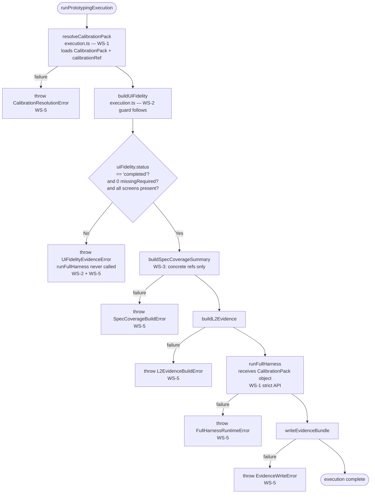

# 03 Story Workshop

## Execution Flow After WS-1 + WS-2

---

## US-001: runFullHarness Receives Resolved CalibrationPack (WS-1)

**As a** package maintainer,  
**I want** `runFullHarness()` to receive a resolved `CalibrationPack` object (not a path),  
**so that** execution cannot bypass pack validation and runtime has no pack resolution responsibility.

### Acceptance Criteria

- AC-001-1: `FullHarnessRequest` includes `calibrationPack: CalibrationPack` and `calibrationRef: { packPath, packVersion, configPath? }`.
- AC-001-2: `execution.ts` calls `resolveCalibrationPack()` (via `CalibrationLoader`) before passing to `runFullHarness()`.
- AC-001-3: `runtime.ts` does not import `CalibrationLoader`.
- AC-001-4: `runtime.ts` reads `request.calibrationPack.pack.measurement` directly without resolving any path.
- AC-001-5: `calibrationRef` is used only for summary/report metadata in `runtime.ts`.

### Example Seeds

| Perspective | Input | Expected Outcome |
|---|---|---|
| Happy path | `execution.ts` resolves pack, passes `{ calibrationPack, calibrationRef }` to `runFullHarness` | Pack consumed from object; no I/O in runtime |
| Negative path | Pack file missing at execution-time resolution | `CalibrationResolutionError` thrown; `runFullHarness` never called |
| Negative path | `runtime.ts` TypeScript source imports `CalibrationLoader` | Compile error / lint failure — forbidden import |
| Edge/boundary | Pack file is valid YAML but has unexpected schema | `CalibrationResolutionError` at parse-time in `loader.ts` |
| Edge/boundary | `calibrationRef.configPath` is undefined | Optional field; comparison skipped in validator (WS-4) |
| Permission/role | Caller tries to construct `FullHarnessRequest` with `packPath` string only (old pattern) | TypeScript type error; `calibrationPack` field is required |
| State transition | Pack resolution failure fires before any iteration | No partial iteration state created |
| Idempotency/retry | Same resolved pack passed twice to `runFullHarness` | Results deterministic; no side effects from CalibrationLoader |

---

## US-002: Execution Fails Immediately on Incomplete uiFidelity (WS-2)

**As a** package maintainer,  
**I want** execution to fail immediately on incomplete UI fidelity evidence,  
**so that** incomplete runs don't produce misleading summaries that pass downstream validation.

### Acceptance Criteria

- AC-002-1: `uiFidelity.status !== "completed"` → `throw UiFidelityEvidenceError` before `runFullHarness`.
- AC-002-2: `uiFidelity.missingRequiredEvidence.length > 0` → `throw UiFidelityEvidenceError` before `runFullHarness`.
- AC-002-3: Required screen absent from `screenSummaries` → `throw UiFidelityEvidenceError` before `runFullHarness`.
- AC-002-4: Error message names missing screen / missing evidence type, not "calibration failure".
- AC-002-5: `uiFidelityBuilder.ts` documents that `completed` is the only execution-valid status.

### Example Seeds

| Perspective | Input | Expected Outcome |
|---|---|---|
| Happy path | `uiFidelity.status = "completed"`, 0 missing evidence, all screens present | Guard passes; execution continues to specCoverage |
| Negative path | `uiFidelity.status = "insufficient-evidence"` | `UiFidelityEvidenceError` thrown; `runFullHarness` not called |
| Negative path | `uiFidelity.missingRequiredEvidence = ["browser-qa"]` | `UiFidelityEvidenceError` with `browser-qa` named |
| Negative path | Required screen `screen-checkout` absent from `screenSummaries` | `UiFidelityEvidenceError` naming `screen-checkout` |
| Edge/boundary | `uiFidelity.screenSummaries = []` with non-empty screen contracts | All screens missing → fail-closed |
| Edge/boundary | `status = "completed"` but `missingRequiredEvidence` non-empty | Guard still fails (both conditions checked independently) |
| Permission/role | n/a (no user roles; pure library code) | — |
| State transition | Guard must fire after `buildUiFidelity` and before `buildSpecCoverageSummary` | No specCoverage or L2 state produced on failure |
| Idempotency/retry | Same incomplete fidelity input → same error on retry | Pure check; no external state modified |

---

## US-003: specCoverage.evidenceRefs Contains Only Concrete Artifact Refs (WS-3)

**As a** package maintainer,  
**I want** `specCoverage.evidenceRefs` to contain only concrete artifact refs,  
**so that** the traceability ledger is auditable and each ref resolves to a real artifact or spec anchor.

### Acceptance Criteria

- AC-003-1: `specCoverage.evidenceRefs` accepts spec anchor refs (e.g., `40_screen_contracts.md#screen-login`).
- AC-003-2: `specCoverage.evidenceRefs` accepts concrete observation refs (render summary, screenshot, browser QA artifact).
- AC-003-3: `prototypingEvidence.ts` validator rejects directory paths.
- AC-003-4: `prototypingEvidence.ts` validator rejects pack root paths.
- AC-003-5: `prototypingEvidence.ts` validator rejects self-refs (`.qfai/evidence/prototyping.json#/...`).
- AC-003-6: `prototypingEvidence.ts` validator rejects synthetic tokens (`specs:` prefix, extension-less strings).
- AC-003-7: `isConcreteArtifactRef(ref)` helper exported from `prototypingEvidence.ts`.

### Example Seeds

| Perspective | Input | Expected Outcome |
|---|---|---|
| Happy path | `"40_screen_contracts.md#screen-login"` | Accepted |
| Happy path | `"screenshots/iter-0-screen-login.png"` | Accepted |
| Happy path | `"browser-qa/phase-2-findings.json#/finding-3"` | Accepted |
| Negative path | `"./evidence/prototyping/"` (directory path) | Validator error: directory path forbidden |
| Negative path | `".qfai/evidence/prototyping.json#/specCoverage"` (self-ref) | Validator error: self-ref forbidden |
| Negative path | `"specs: all screens covered"` (synthetic token) | Validator error: synthetic token forbidden |
| Negative path | `"40_screen_contracts"` (no anchor, no extension) | Validator error: extension-less / anchor-less path forbidden |
| Edge/boundary | Empty `evidenceRefs: []` | Validator error: at least one concrete ref required |
| Edge/boundary | 200 refs, one is a directory path | Validator finds and reports the invalid ref |
| Idempotency/retry | `isConcreteArtifactRef(ref)` called twice | Pure function; same result both times |

---

## US-004: Validator Compares Calibration Metadata Against Actual Pack (WS-4)

**As a** package maintainer,  
**I want** the validator to compare `calibrationRef.packPath`, `packVersion`, and `configPath` against the actual pack,  
**so that** summary forgery (mismatched calibration metadata) is detected as a validator error.

### Acceptance Criteria

- AC-004-1: Validator resolves `calibrationRef.packPath` and reads the actual pack.
- AC-004-2: `packPath` mismatch (normalized) → validator error.
- AC-004-3: `packVersion` mismatch → validator error.
- AC-004-4: `configPath` present in summary + mismatch → validator error.
- AC-004-5: Hardcoded `"1.0.0"` heuristic removed from validator.
- AC-004-6: Mismatch is `issues.push(error(...))`, not `issues.push(warning(...))`.

### Example Seeds

| Perspective | Input | Expected Outcome |
|---|---|---|
| Happy path | Summary `calibrationRef` matches actual pack exactly | Validator passes |
| Negative path | `packVersion` in summary = `"1.0.1"`, actual pack = `"1.0.2"` | Validator error |
| Negative path | `configPath` in summary = `"calib/custom.yaml"`, actual configPath = `"calib/default.yaml"` | Validator error |
| Negative path | `packPath` in summary resolved to different file than actual | Validator error |
| Negative path | `packVersion = "1.0.0"` (old heuristic match) but actual version differs | Validator error (heuristic removed) |
| Edge/boundary | `configPath` absent from summary | Comparison skipped; no error |
| Edge/boundary | `packPath` is relative path | Normalized before comparison |
| State transition | Previously warning → now error | Failing validation causes rejection, not a passing-with-warnings result |
| Idempotency/retry | Validator run twice on same summary | Same result both times |

---

## US-005: Execution Failures Have Distinct Error Types (WS-5)

**As a** package maintainer,  
**I want** execution failures to have distinct error types,  
**so that** CI diagnostics are actionable and calibration failures are not confused with fidelity or write failures.

### Acceptance Criteria

- AC-005-1: `CalibrationResolutionError` thrown only for calibration pack resolution failure.
- AC-005-2: `UiFidelityEvidenceError` thrown only for incomplete UI fidelity.
- AC-005-3: `SpecCoverageBuildError` thrown only for specCoverage construction failure.
- AC-005-4: `L2EvidenceBuildError` thrown only for L2 evidence construction failure.
- AC-005-5: `FullHarnessRuntimeError` thrown only for `runFullHarness()` internal failure.
- AC-005-6: `EvidenceWriteError` thrown only for bundle write / serialization failure.
- AC-005-7: All 6 classes exported from `packages/qfai/src/core/prototyping/errors.ts`.
- AC-005-8: No catch block maps non-calibration failures to `CalibrationResolutionError`.

### Example Seeds

| Perspective | Input | Expected Outcome |
|---|---|---|
| Happy path | Each failure type thrown from correct try/catch block | `instanceof` check identifies failure category |
| Negative path | Bundle write fails (disk full) | `EvidenceWriteError` thrown, not `CalibrationResolutionError` |
| Negative path | `runFullHarness()` throws internal error | `FullHarnessRuntimeError` thrown |
| Negative path | `buildSpecCoverageSummary()` throws | `SpecCoverageBuildError` thrown |
| Edge/boundary | Error wraps underlying cause with `cause` field | Underlying message preserved in `cause` |
| Permission/role | CLI catches error by instanceof | Can branch on error type for distinct exit codes |
| State transition | Old wide catch block → 6 narrow catch blocks | Each block wraps only its own phase's errors |
| Idempotency/retry | Same failure re-thrown twice | Same error class both times (no state mutation) |

---

## US-006: Scalar Calibration Config Fields Removed (WS-6)

**As a** package maintainer,  
**I want** scalar calibration fields removed from the config schema,  
**so that** the pack SSOT (`calibrationPack`) is the only calibration entry point.

### Acceptance Criteria

- AC-006-1: `thresholds.accept`, `thresholds.refine`, `maxIterations`, `plateauDelta`, `plateauLookback` absent from `PrototypingCalibrationConfig` type.
- AC-006-2: `config.ts` normalize step throws on any of the above fields if present in input.
- AC-006-3: `assets/init/root/qfai.config.yaml` contains 0 scalar calibration fields.
- AC-006-4: `packages/qfai/README.md` example uses packPath-only config.
- AC-006-5: `config.test.ts` includes a test that passing scalar fields causes an error.

### Example Seeds

| Perspective | Input | Expected Outcome |
|---|---|---|
| Happy path | Config with only `prototyping.calibration.packPath` | Valid; no error |
| Negative path | Config with `thresholds.accept: 0.9` | Normalize error: obsolete field |
| Negative path | Config with `maxIterations: 5` | Normalize error: obsolete field |
| Negative path | Config with `plateauDelta: 0.01` | Normalize error: obsolete field |
| Edge/boundary | All 5 scalar fields present simultaneously | Error naming all obsolete fields |
| Edge/boundary | `packPath` absent | Separate validation error: packPath required |
| State transition | Old config.test.ts fixtures with scalar fields → updated to packPath-only | Tests pass after fixture update |
| Idempotency/retry | normalize called twice on packPath-only config | Same result both times |

---

## US-007: Surface Rejection Message Matches PROTOTYPING_SUPPORTED_SURFACES (WS-7)

**As a** package maintainer,  
**I want** the surface rejection message to match the actual `PROTOTYPING_SUPPORTED_SURFACES` constant,  
**so that** the message is never stale when the allowed surface list changes.

### Acceptance Criteria

- AC-007-1: Rejection message in `surfacePolicy.ts` is generated from `PROTOTYPING_SUPPORTED_SURFACES` constant (not hardcoded).
- AC-007-2: Stale `cli` surface string removed from rejection message.
- AC-007-3: Generated message lists `web, mobile, desktop, mixed` (current constant value).
- AC-007-4: If `PROTOTYPING_SUPPORTED_SURFACES` changes, the message updates automatically.

### Example Seeds

| Perspective | Input | Expected Outcome |
|---|---|---|
| Happy path | `assertSupportedPrototypingSurface("web")` | No error |
| Negative path | `assertSupportedPrototypingSurface("cli")` | Error: "Surface 'cli' is not supported. Supported: web, mobile, desktop, mixed." |
| Negative path | `assertSupportedPrototypingSurface("backend")` | Error listing current PROTOTYPING_SUPPORTED_SURFACES members |
| Edge/boundary | `PROTOTYPING_SUPPORTED_SURFACES` extended with a new surface | Message auto-updates; no hardcoded string to change |
| Edge/boundary | Empty string surface | Error: not a supported surface |
| Permission/role | n/a (pure library code) | — (skipped: no permission model) |
| State transition | Before WS-7: message contains stale `cli` → after: generated from constant | Test verifies message does not contain `cli` |
| Idempotency/retry | `isSupportedPrototypingSurface("cli")` called twice | Returns `false` both times (pure function) |
