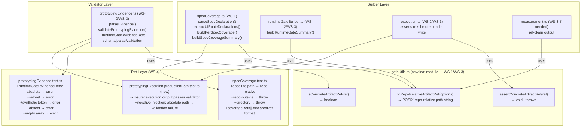

# 02 Inception Deck

## 1. Why Are We Here?

The v1.7.15-08 audit of `packages/qfai` confirmed that rev7 closed 6 of the 8 known contract gaps. Two blocking issues remain:

1. **specCoverage absolute path output**: `specCoverage.ts` generates `declaredRef` and `evidenceRefs` values using raw absolute file paths. `isConcreteArtifactRef()` already forbids absolute paths, so the package's own builder produces output that its own validator must reject. The traceability ledger is not self-consistent.
2. **runtimeGate.evidenceRefs not validated**: `execution.ts` writes a top-level `runtimeGate.evidenceRefs` field into the output bundle, but `prototypingEvidence.ts` has no schema, no parser, and no validation for this field. Any value — including absolute paths and synthetic tokens — passes through undetected.

Without closing these gaps, the prototyping evidence system cannot claim a strictly auditable, self-consistent traceability ledger, which is the v1.7.15 completion criterion.

---

## 2. The Elevator Pitch

> **For** QFAI package maintainers,
> **who need** a strictly auditable traceability ledger with complete validator coverage,
> **the v1.7.15-08 single PR** closes the final 2 blocking issues and unifies ref grammar across all 3 traceability layers,
> **that** eliminates absolute path output from specCoverage, adds full runtimeGate.evidenceRefs validation, unifies ref grammar with shared helpers, and adds execution→validate closure tests,
> **unlike** the rev7 baseline, which left specCoverage generating absolute paths and runtimeGate.evidenceRefs entirely outside the validator contract.

---

## 3. What Will It NOT Do?

| Out of Scope                              | Reason                                          |
|-------------------------------------------|-------------------------------------------------|
| repo root `.qfai/**` changes              | Explicitly excluded (design doc §4-2)           |
| Calibration system redesign               | Out of scope; rev7 already closed this          |
| Full-harness runtime redesign             | Out of scope; rev7 already closed this          |
| uiFidelity / Browser QA redesign          | Out of scope; rev7 already closed this          |
| `uiFidelity` / L2 evidence redesign       | Out of scope                                    |
| standard / low-cost mode re-introduction  | Removed in earlier cycles                       |
| Non-UI prototyping re-introduction        | Removed in earlier cycles                       |
| Backward compat / migration tooling       | 後方互換は完全に捨てる                           |
| `packHash` integrity check                | Deferred (carried from rev7 OQ-0001)            |
| Existing output migration                 | Not required; compat abandoned                  |

---

## 4. Neighbors (Dependencies)

| Dependency                                                     | Direction                     | Notes                                                              |
|----------------------------------------------------------------|-------------------------------|--------------------------------------------------------------------|
| `packages/qfai/src/core/prototyping/pathUtils.ts` (new)        | new leaf module               | WS-1/WS-3: ref helpers; no imports from execution.ts              |
| `packages/qfai/src/core/prototyping/specCoverage.ts`           | modified                      | WS-1: uses `toRepoRelativeArtifactRef()` instead of raw paths     |
| `packages/qfai/src/core/prototyping/runtimeGateBuilder.ts`     | modified                      | WS-2/WS-3: ref-clean output                                       |
| `packages/qfai/src/core/prototyping/execution.ts`              | modified                      | WS-2/WS-3: `assertConcreteArtifactRef()` gate before bundle write |
| `packages/qfai/src/core/harness/measurement.ts`                | conditionally modified        | WS-3: if absolute paths used in ref output                        |
| `packages/qfai/src/core/validators/prototypingEvidence.ts`     | modified                      | WS-2: schema/parse/validation for `runtimeGate.evidenceRefs`      |
| vitest test suite                                              | downstream gate               | All suites must pass after changes                                 |
| v1.7.15-08 audit report                                        | upstream input                | Source of truth for the 2 blocking findings                       |
| rev7 discussion pack (discussion-20260415203030886)            | upstream context              | Establishes rev7 baseline; issues not re-opened                   |

---

## 5. The Solution (Architecture Sketch)

Rev8 introduces a shared `pathUtils.ts` leaf module containing three helpers. All ref-producing builders and ref-checking validators converge on these helpers.

**Implementation order**: WS-1 → WS-2 → WS-3 → WS-4

---

## 6. What Keeps Us Up at Night?

| Risk                                                             | Mitigation                                                                              |
|------------------------------------------------------------------|-----------------------------------------------------------------------------------------|
| Circular import: `pathUtils.ts` → `execution.ts` → `pathUtils.ts` | `pathUtils.ts` is a leaf module; it must not import from `execution.ts` or any module that imports `execution.ts` (OQ-0002 resolved) |
| `runtimeGate.evidenceRefs` empty array: false positive on valid "no routes observed" run | Design doc §6-2-3 is explicit: empty array is error; fail-closed; backward compat abandoned (OQ-0003 resolved) |
| `measurement.ts` scope creep: unintended changes outside WS-3   | Include `measurement.ts` only if its current ref output uses absolute paths; empirical check required (OQ-0002 resolved) |
| `README.md` over-update: unnecessary churn on stable content    | Update only if obsolete or absent ref grammar description exists (OQ-0004 resolved)     |
| Windows `\\` separator leaking into repo-relative output        | `toRepoRelativeArtifactRef()` must normalize to POSIX `/` on all platforms (TC-1)       |

---

## 7. Timeline

| Phase                   | Content                                                          | Target        |
|-------------------------|------------------------------------------------------------------|---------------|
| Discussion              | This pack (rev8 audit closure design)                            | 2026-04-16    |
| Implementation WS-1     | `pathUtils.ts` helper; `specCoverage.ts` ref normalization       | PR day 1      |
| Implementation WS-2     | `prototypingEvidence.ts` runtimeGate.evidenceRefs schema/parse/validate | PR day 1 |
| Implementation WS-3     | Unify ref grammar; `execution.ts` `assertConcreteArtifactRef`    | PR day 2      |
| Implementation WS-4     | New and extended test files; production path closure test        | PR day 2      |
| README (conditional)    | Update only if obsolete description found                        | PR day 2      |
| PR review + merge       | Final review against 4 DoD conditions                           | v1.7.15 release |

---

## 8. Tradeoffs

| Decision                              | Chosen                                          | Alternative                                      | Reason                                                      |
|---------------------------------------|-------------------------------------------------|--------------------------------------------------|-------------------------------------------------------------|
| Helper location                       | New `pathUtils.ts` (leaf module)                | Inline in `specCoverage.ts`                      | Shared between builders and validators; no circular import  |
| `runtimeGate.evidenceRefs` empty array | Error (fail-closed)                            | Allowed when no routes observed                  | Design doc §6-2-3 explicit; backward compat abandoned       |
| `measurement.ts` inclusion in WS-3   | Conditional (include if absolute paths found)   | Unconditional inclusion                          | Design doc §6 lists it; empirical check confirms scope      |
| README update                         | Conditional (only if obsolete/absent)           | Unconditional update                             | Design doc §7-8 explicit conditional criterion              |
| Ref grammar enforcement               | Shared helpers (single implementation)          | Parallel implementations in builder and validator | DRY; prevents grammar drift between layers                 |

---

## 9. What Does It Take to Win?

1. All 4 DoD conditions satisfied (§5 of design doc).
2. `packages/qfai/src` contains zero `path.resolve(...)` calls whose result flows directly into `declaredRef` or `evidenceRefs`.
3. `validatePrototypingEvidence()` rejects all 5 malformed forms in `runtimeGate.evidenceRefs`: absolute path, self-ref, synthetic token, absent field, empty array.
4. Production path closure test exists and passes.
5. `pathUtils.ts` has 100% line coverage in unit tests.
6. 0 TypeScript strict errors or `@ts-ignore` suppressions in new code.
7. All vitest test suites green.

---

## 10. What Is the First Move?

Start with **WS-1**: create `pathUtils.ts` with `toRepoRelativeArtifactRef()`, `assertConcreteArtifactRef()`, and `isConcreteArtifactRef()`. Integrate into `specCoverage.ts`. Run `pnpm format:check && pnpm lint && pnpm check-types` green before proceeding to WS-2.
