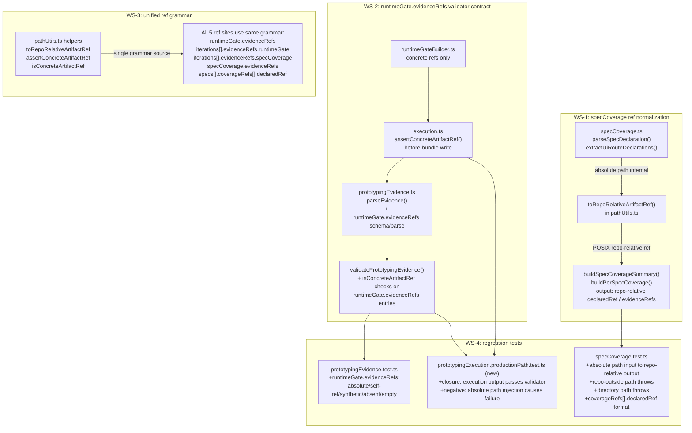

# 03 Story Workshop

## Ref Normalization and Validator Coverage Flow (WS-1 through WS-4)

---

## US-001: specCoverage Outputs Only Repo-Relative Concrete Artifact Refs (WS-1)

**As a** package maintainer,
**I want** `specCoverage.ts` to output only repo-root relative concrete artifact refs (not absolute paths),
**so that** the traceability ledger is self-consistent with the validator contract and cross-platform reproducible.

### Acceptance Criteria

- AC-001-1: `toRepoRelativeArtifactRef({ repoRoot, absolutePath, line?, anchor? })` exists in `pathUtils.ts` and returns a POSIX repo-relative path string.
- AC-001-2: `parseSpecDeclaration()` / `extractUiRouteDeclarations()` do not return raw absolute paths as `declaredRef`; all external-facing refs pass through `toRepoRelativeArtifactRef()`.
- AC-001-3: `buildSpecCoverageSummary()` does not accept a directory path as a ref source; `evidenceRefs` in output contains only concrete artifact refs.
- AC-001-4: `buildPerSpecCoverage()` produces `coverageRefs[].declaredRef` values that are concrete artifact refs (same grammar as summary `evidenceRefs`).
- AC-001-5: `toRepoRelativeArtifactRef()` throws if `absolutePath` is outside `repoRoot`.
- AC-001-6: `toRepoRelativeArtifactRef()` throws if a directory path (no file extension) is passed.
- AC-001-7: `toRepoRelativeArtifactRef()` throws if both `line` and `anchor` are specified simultaneously.
- AC-001-8: Output uses POSIX `/` separator regardless of host OS.

### Example Seeds

| Perspective       | Input                                                                                                             | Expected Outcome                                                    |
|-------------------|-------------------------------------------------------------------------------------------------------------------|---------------------------------------------------------------------|
| Happy path        | absolutePath = `/repo/.qfai/specs/spec-001/40_screen_contracts.md`, line = 12                                    | `.qfai/specs/spec-001/40_screen_contracts.md#L12`                  |
| Happy path        | absolutePath = `/repo/.qfai/evidence/iter-0/screenshot.png`                                                      | `.qfai/evidence/iter-0/screenshot.png`                              |
| Negative path     | absolutePath = `/other-repo/file.md` (outside repoRoot)                                                          | `toRepoRelativeArtifactRef()` throws                                |
| Negative path     | absolutePath = `/repo/.qfai/specs/spec-001/` (directory path)                                                    | `toRepoRelativeArtifactRef()` throws                                |
| Edge/boundary     | `line = 5` and `anchor = "section-a"` both specified                                                             | `toRepoRelativeArtifactRef()` throws (mutually exclusive)           |
| Edge/boundary     | absolutePath on Windows uses `\\` separators                                                                      | Output uses POSIX `/` (normalized)                                  |
| Permission/role   | N/A — no permission model; pure helper function                                                                   | (skipped: no role-based access in this library module)              |
| State transition  | Before WS-1: `declaredRef` is absolute path → After WS-1: repo-relative                                          | Existing tests updated; no absolute paths in output                 |
| Idempotency/retry | Same `absolutePath` + `repoRoot` passed twice to `toRepoRelativeArtifactRef()`                                   | Identical output both times (pure function)                         |

---

## US-002: Validator Validates Top-Level runtimeGate.evidenceRefs (WS-2)

**As a** package maintainer,
**I want** `prototypingEvidence.ts` to parse and validate top-level `runtimeGate.evidenceRefs`,
**so that** malformed refs in the summary-level runtimeGate field are detected and rejected with the same strictness as iteration-level refs.

### Acceptance Criteria

- AC-002-1: `PrototypingEvidence["runtimeGate"]` type includes `evidenceRefs: string[]` as a formal field.
- AC-002-2: `parseEvidence()` reads `runtimeGate.evidenceRefs`; a non-array value is a parse error.
- AC-002-3: `validatePrototypingEvidence()` applies `isConcreteArtifactRef()` checks to each entry in `runtimeGate.evidenceRefs`.
- AC-002-4: Absence of `runtimeGate.evidenceRefs` field is a validator error (not silently skipped).
- AC-002-5: An empty array `runtimeGate.evidenceRefs: []` is a validator error.
- AC-002-6: Absolute path in `runtimeGate.evidenceRefs` is a validator error.
- AC-002-7: Self-ref (`.qfai/evidence/prototyping.json#/...`) in `runtimeGate.evidenceRefs` is a validator error.
- AC-002-8: Synthetic token (e.g., `"routes: all observed"`) in `runtimeGate.evidenceRefs` is a validator error.
- AC-002-9: Directory path in `runtimeGate.evidenceRefs` is a validator error.
- AC-002-10: Empty string in `runtimeGate.evidenceRefs` is a validator error.

### Example Seeds

| Perspective       | Input                                                                                        | Expected Outcome                                                     |
|-------------------|----------------------------------------------------------------------------------------------|----------------------------------------------------------------------|
| Happy path        | `runtimeGate.evidenceRefs = [".qfai/evidence/iter-0/browser-qa.json#/finding-1"]`           | Validator passes                                                     |
| Negative path     | `runtimeGate.evidenceRefs = ["/abs/path/file.json"]` (absolute path)                        | Validator error: absolute path forbidden                            |
| Negative path     | `runtimeGate.evidenceRefs = [".qfai/evidence/prototyping.json#/runtimeGate"]` (self-ref)    | Validator error: self-ref forbidden                                  |
| Negative path     | `runtimeGate.evidenceRefs = ["routes: all observed"]` (synthetic token)                     | Validator error: synthetic token forbidden                           |
| Negative path     | `runtimeGate.evidenceRefs` field absent from summary                                        | Validator error: required field missing                              |
| Edge/boundary     | `runtimeGate.evidenceRefs = []` (empty array)                                               | Validator error: at least one concrete ref required                  |
| Edge/boundary     | `runtimeGate.evidenceRefs = [""]` (empty string entry)                                      | Validator error: empty string is not a concrete ref                  |
| Permission/role   | N/A — no permission model; pure validator function                                           | (skipped: no role-based access in this library module)              |
| State transition  | Before WS-2: field silently ignored → After WS-2: field validated                           | Existing output with malformed runtimeGate.evidenceRefs now fails  |
| Idempotency/retry | Same evidence input validated twice                                                          | Same validation result both times (pure function)                   |

---

## US-003: All 3 Traceability Layers Use the Same Ref Grammar and Helpers (WS-3)

**As a** package maintainer,
**I want** all three traceability layers (top-level summary, iteration evidence, per-spec coverage) to use the same ref grammar implemented by shared helpers,
**so that** future grammar changes propagate consistently and there is no silent divergence between builder output and validator expectations.

### Acceptance Criteria

- AC-003-1: `toRepoRelativeArtifactRef`, `assertConcreteArtifactRef`, and `isConcreteArtifactRef` are the single shared helpers; validators and builders do not have separate implementations of the same grammar.
- AC-003-2: `runtimeGate.evidenceRefs` (top-level), `iterations[].evidenceRefs.runtimeGate`, `iterations[].evidenceRefs.specCoverage`, `specCoverage.evidenceRefs`, and `specs[].coverageRefs[].declaredRef` all use the same ref grammar.
- AC-003-3: No parallel regex or pattern definition for "is concrete ref" exists outside `pathUtils.ts`.
- AC-003-4: `measurement.ts` is checked; if it uses absolute paths in ref output, it is updated to use shared helpers.
- AC-003-5: `execution.ts` calls `assertConcreteArtifactRef()` on builder outputs before bundle write.

### Example Seeds

| Perspective       | Input                                                                                      | Expected Outcome                                                                 |
|-------------------|--------------------------------------------------------------------------------------------|----------------------------------------------------------------------------------|
| Happy path        | All 5 ref sites populated with `.qfai/...` refs via shared helpers                        | All pass validator; no grammar mismatch                                          |
| Negative path     | `iterations[].evidenceRefs.runtimeGate` contains absolute path                            | Validator error (same check as top-level `runtimeGate.evidenceRefs`)            |
| Negative path     | `specs[].coverageRefs[].declaredRef` contains absolute path (old pattern)                 | Builder throws at ref generation time via `toRepoRelativeArtifactRef()`         |
| Edge/boundary     | Two separate implementations of concrete-ref grammar exist (grep check)                   | Code review / lint failure: only one implementation allowed                     |
| Edge/boundary     | `measurement.ts` emits absolute path ref                                                   | Caught by `assertConcreteArtifactRef()` in `execution.ts` before bundle write  |
| Permission/role   | N/A — no permission model; pure library code                                               | (skipped: no role-based access in this library module)                          |
| State transition  | Before WS-3: 3 divergent grammar implementations → After WS-3: single shared helpers      | All 5 ref sites behave identically for same input                               |
| Idempotency/retry | `isConcreteArtifactRef(ref)` called multiple times on same input                          | Returns same boolean value each time (pure function)                             |

---

## US-004: Execution to Validate Closure Regression Test Exists (WS-4)

**As a** package maintainer,
**I want** a production-path regression test that runs `runPrototypingExecution()` and passes the output to `validatePrototypingEvidence()`,
**so that** the class of regression where builders produce output that fails their own validator is permanently covered by the test suite.

### Acceptance Criteria

- AC-004-1: `prototypingExecution.productionPath.test.ts` file exists in `packages/qfai/tests/core/`.
- AC-004-2: At least one positive closure test: `runPrototypingExecution()` succeeds and its output passes `validatePrototypingEvidence()` with zero errors.
- AC-004-3: At least one negative injection test: a fixture with an absolute path in `specCoverage.evidenceRefs` or `runtimeGate.evidenceRefs` causes `validatePrototypingEvidence()` to return errors.
- AC-004-4: `specCoverage.test.ts` includes negative cases: absolute path input → repo-relative output, repo-outside path → throw, directory path → throw, `coverageRefs[].declaredRef` format verified.
- AC-004-5: `prototypingEvidence.test.ts` includes cases: `runtimeGate.evidenceRefs` with absolute path → error, self-ref → error, synthetic token → error, field absent → error, empty array → error.

### Example Seeds

| Perspective       | Input                                                                                                              | Expected Outcome                                                         |
|-------------------|--------------------------------------------------------------------------------------------------------------------|--------------------------------------------------------------------------|
| Happy path        | `runPrototypingExecution()` with valid inputs; pass output to `validatePrototypingEvidence()`                      | Validation returns 0 errors                                              |
| Negative path     | Fixture with `specCoverage.evidenceRefs[0] = "/abs/path/file.md"` passed to `validatePrototypingEvidence()`      | Validation returns at least 1 error for absolute path                   |
| Negative path     | Fixture with `runtimeGate.evidenceRefs` absent passed to `validatePrototypingEvidence()`                          | Validation returns at least 1 error for missing field                   |
| Edge/boundary     | `runPrototypingExecution()` output has `runtimeGate.evidenceRefs = []`                                            | Validation returns error: empty array not allowed                        |
| Edge/boundary     | All 5 ref sites populated correctly in closure test output                                                         | All pass `isConcreteArtifactRef()` in validator                         |
| Permission/role   | N/A — no permission model; pure test function                                                                      | (skipped: no role-based access in this library module)                  |
| State transition  | Before WS-4: no closure test exists → After WS-4: closure test exists and passes                                   | CI gate catches builder/validator contract mismatches on future changes |
| Idempotency/retry | Same test fixture passed to `validatePrototypingEvidence()` twice                                                  | Same validation result both times (pure function)                        |
