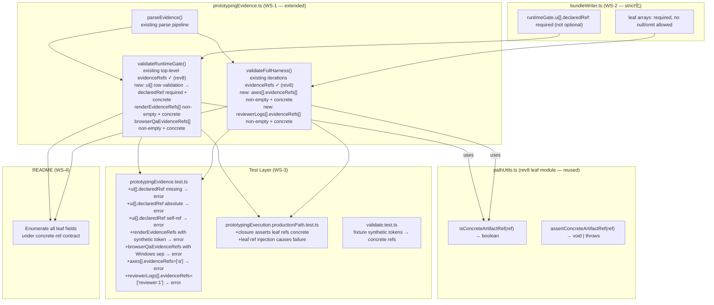

# 02 Inception Deck

## 1. Why Are We Here?

The v1.7.15-09 audit of `packages/qfai` confirmed that rev8 successfully closed top-level summary field traceability:
- `specCoverage.evidenceRefs` → concrete refs via `pathUtils.ts`
- `runtimeGate.evidenceRefs` (top-level) → fully validated
- ref grammar unified across 3 layers

However, the same audit identified that **leaf-field traceability remains unsealed**: three field groups pass through the validator with only structural type checking, not concrete-ref validation. This means synthetic tokens, absolute paths, and missing declarations at screen level, axis level, and reviewer level are silently accepted — even though the package claims strict, auditable traceability.

The three blind spots:
1. **`runtimeGate.ui[]` row fields**: `declaredRef` (optional, not concrete-ref checked), `renderEvidenceRefs[]` and `browserQaEvidenceRefs[]` (plain string arrays, no grammar enforcement)
2. **Axis-level `evidenceRefs[]`**: `fullHarness.iterations[].l1/l2.axes[].evidenceRefs[]` — string arrays only
3. **Reviewer-level `evidenceRefs[]`**: `fullHarness.reviewerLogs[].evidenceRefs[]` — string arrays only

Without sealing these leaf fields, `packages/qfai` cannot claim complete, package-wide strict traceability.

---

## 2. The Elevator Pitch

> **For** QFAI package maintainers,
> **who need** a package-wide strict traceability ledger with concrete artifact ref enforcement at every evidence leaf field,
> **the v1.7.15-09 single PR** closes the final three leaf-field blind spots,
> **that** enforces `runtimeGate.ui[].declaredRef` as required + concrete, validates all `renderEvidenceRefs[]` and `browserQaEvidenceRefs[]` entries, enforces axis-level and reviewer-level `evidenceRefs[]` as non-empty concrete refs, aligns bundle schema with validator contract, and adds leaf-field regression tests,
> **unlike** the rev8 baseline, which left screen-level, axis-level, and reviewer-level leaf fields outside the concrete-ref validation contract.

---

## 3. What Will It NOT Do?

| Out of Scope                                    | Reason                                                    |
|-------------------------------------------------|-----------------------------------------------------------|
| repo root `.qfai/**` changes                    | Explicitly excluded (design doc §4-2)                     |
| Calibration pack redesign                       | Out of scope; closed in earlier cycles                    |
| Full-harness scoring logic redesign             | Out of scope; closed in earlier cycles                    |
| Browser QA orchestration redesign               | Out of scope                                              |
| Non-UI prototyping re-introduction              | Removed in earlier cycles                                 |
| Standard / low-cost mode re-introduction        | Removed in earlier cycles                                 |
| Backward compat / migration tooling             | 後方互換は完全に捨てる                                     |
| `packHash` integrity check                      | Deferred (carry-forward from rev7 OQ-0001)                |
| New external dependencies                       | Not introduced                                            |
| `pathUtils.ts` helper redesign                  | Rev8 helpers are correct and reused as-is                 |

---

## 4. Neighbors (Dependencies)

| Dependency                                                        | Direction                  | Notes                                                                   |
|-------------------------------------------------------------------|----------------------------|-------------------------------------------------------------------------|
| `packages/qfai/src/core/validators/prototypingEvidence.ts`        | modified                   | WS-1: add leaf-field concrete-ref validation for ui[], axes[], reviewerLogs[] |
| `packages/qfai/src/core/evidence/bundleWriter.ts`                 | modified                   | WS-2: declaredRef required; leaf arrays required non-empty              |
| `packages/qfai/src/core/prototyping/runtimeObservation.ts`        | conditionally modified     | WS-2: if leaf field nullish/omit patterns exist in output builder        |
| `packages/qfai/src/core/prototyping/runtimeGateBuilder.ts`        | conditionally modified     | WS-2: if leaf arrays can be emitted null or omitted                     |
| `packages/qfai/src/core/prototyping/pathUtils.ts`                 | reused (no change)         | WS-1: `isConcreteArtifactRef()` used by new leaf validators; already exists from rev8 |
| `packages/qfai/tests/core/prototypingEvidence.test.ts`            | extended                   | WS-3: leaf-field negative cases                                         |
| `packages/qfai/tests/core/prototypingExecution.productionPath.test.ts` | extended              | WS-3: leaf strictness assertions in closure test                        |
| `packages/qfai/tests/core/validate.test.ts`                       | extended                   | WS-3: fixture synthetic token replacement                               |
| `packages/qfai/README.md`                                         | modified                   | WS-4: enumerate all leaf fields under concrete-ref contract             |
| Rev8 discussion pack (discussion-20260416023323603)                | upstream context           | Rev8 baseline; issues not re-opened                                     |

---

## 5. The Solution (Architecture Sketch)

Rev9 extends the rev8 validator architecture by adding leaf-level validation layers to the existing parse→validate pipeline, while reusing rev8's shared helpers from `pathUtils.ts`.

**Implementation order**: WS-1 (validator) → WS-2 (schema) → WS-3 (tests) → WS-4 (docs)

---

## 6. What Keeps Us Up at Night?

| Risk                                                                                       | Mitigation                                                                                                   |
|--------------------------------------------------------------------------------------------|--------------------------------------------------------------------------------------------------------------|
| `runtimeGate.ui[]` may not always be populated in existing test fixtures                  | Negative test explicitly covers missing `ui[]` entry; positive closure test includes ui[] with concrete refs  |
| `browserQaEvidenceRefs[]` may legitimately be empty on some codepaths                     | Design doc §3-2 fail-closed: empty is always an error; OQ-0002 resolved as Option A (non-empty required)     |
| Axis-level validation may break existing tests that use `"a"` / `"b"` as dummy refs       | WS-3 explicitly replaces ALL synthetic token fixtures; a grep gate confirms zero residual synthetic tokens    |
| Leaf arrays in `bundleWriter.ts` may require runtime builder changes to produce non-empty output | WS-2 conditionally modifies `runtimeObservation.ts` / `runtimeGateBuilder.ts` if emission can be null/omit   |
| Windows `\\` separator could appear in `browserQaEvidenceRefs` from browser-QA toolchain  | `assertConcreteArtifactRef()` in execution.ts (rev8) already rejects `\\`; new test case explicitly covers it |

---

## 7. Timeline

| Phase                   | Content                                                                    | Target        |
|-------------------------|----------------------------------------------------------------------------|---------------|
| Discussion              | This pack (rev9 leaf-field closure design)                                 | 2026-04-16    |
| Implementation WS-1     | `prototypingEvidence.ts` leaf-field validation extension                   | PR day 1      |
| Implementation WS-2     | `bundleWriter.ts` strict schema; conditional builder updates               | PR day 1      |
| Implementation WS-3     | Leaf-field negative test cases; fixture synthetic token replacement        | PR day 2      |
| Implementation WS-4     | README enumeration of all concrete-ref leaf fields                         | PR day 2      |
| PR review + merge       | Final review against DoD conditions                                        | v1.7.15 release |

---

## 8. Tradeoffs

| Decision                                         | Chosen                                              | Alternative                                                 | Reason                                                              |
|--------------------------------------------------|-----------------------------------------------------|-------------------------------------------------------------|---------------------------------------------------------------------|
| ui[] row validation location                     | Inline in `prototypingEvidence.ts` (Option A)       | Extract to separate utility file (Option B)                 | Logically cohesive with existing runtimeGate validation; design doc §6-1-2 names `prototypingEvidence.ts` as the changed file |
| `browserQaEvidenceRefs[]` empty array            | Always error (Option A)                             | Allow empty if no browser QA run                            | Design doc §3-2 fail-closed; empty evidenceRefs is always an error (same principle as rev8 runtimeGate.evidenceRefs) |
| Axis-level validation granularity                | Per-axis (Option A)                                 | Only error if all axes have empty refs (lenient)            | Design doc §6-1-3: per-field fail-closed; no lenient special-case   |
| README update scope                              | Full enumeration of all leaf fields (Option A)      | Minimal note about rev9 extension                           | Design doc §5-6: docs/validator mismatch must be eliminated         |

---

## 9. What Does It Take to Win?

1. All 8 DoD conditions satisfied (§5 of design doc).
2. `validatePrototypingEvidence()` rejects all malformed forms in all 3 new leaf field groups.
3. `bundleWriter.ts` schema has no optional/nullable leaf arrays.
4. `tests/core/` has zero synthetic token fixtures in `evidenceRefs` fields.
5. Production path closure test includes leaf-field strictness assertions.
6. README enumerates all fields under the concrete-ref contract.
7. 0 TypeScript strict errors or `@ts-ignore` suppressions in new code.
8. All vitest test suites green.

---

## 10. What Is the First Move?

Start with **WS-1**: extend `prototypingEvidence.ts` to validate `runtimeGate.ui[]` row fields. Add `isConcreteArtifactRef()` checks (from existing `pathUtils.ts`) for `declaredRef` (required), `renderEvidenceRefs[]` (non-empty, all concrete), and `browserQaEvidenceRefs[]` (non-empty, all concrete). Run `pnpm format:check && pnpm lint && pnpm check-types` green before proceeding to axis-level and reviewer-level validation.
