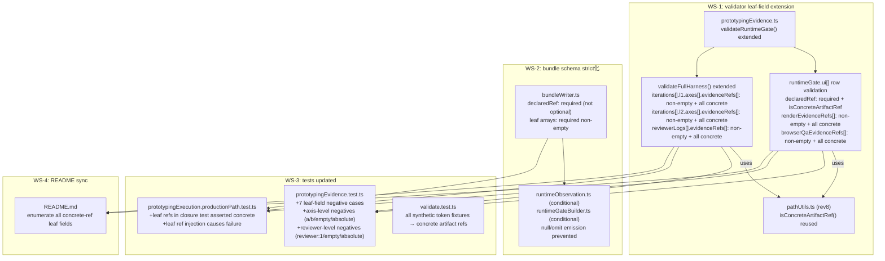

# 03 Story Workshop

## Leaf-Field Traceability Closure Flow (WS-1 through WS-4)

---

## US-001: runtimeGate.ui[] Row-Level Leaf Fields Are Strictly Validated (WS-1)

**As a** package maintainer,
**I want** `prototypingEvidence.ts` to validate all three leaf fields of each `runtimeGate.ui[]` row as concrete artifact refs,
**so that** screen-level traceability coverage cannot be silently faked with synthetic tokens, missing declarations, or absolute paths.

### Acceptance Criteria

- AC-001-1: `runtimeGate.ui[].declaredRef` is required; its absence is a validator error.
- AC-001-2: `runtimeGate.ui[].declaredRef` must be a concrete artifact ref; absolute path, self-ref, synthetic token, bare filename, and directory path are each validator errors.
- AC-001-3: `runtimeGate.ui[].renderEvidenceRefs[]` must be non-empty; empty array is a validator error.
- AC-001-4: Each entry in `runtimeGate.ui[].renderEvidenceRefs[]` must be a concrete artifact ref; any malformed entry is a validator error.
- AC-001-5: `runtimeGate.ui[].browserQaEvidenceRefs[]` must be non-empty; empty array is a validator error.
- AC-001-6: Each entry in `runtimeGate.ui[].browserQaEvidenceRefs[]` must be a concrete artifact ref; any malformed entry is a validator error.
- AC-001-7: The validation reuses `isConcreteArtifactRef()` from `pathUtils.ts`; no parallel grammar implementation is introduced.

### Example Seeds

| Perspective       | Input                                                                                                              | Expected Outcome                                                    |
|-------------------|---------------------------------------------------------------------------------------------------------------------|---------------------------------------------------------------------|
| Happy path        | `ui[0].declaredRef = ".qfai/specs/spec-001/01_Spec.md#L5"`, `renderEvidenceRefs = [".qfai/evidence/render/home.png"]`, `browserQaEvidenceRefs = [".qfai/evidence/browser-qa/home.json#/checks/0"]` | Validator passes for this row |
| Negative path     | `ui[0].declaredRef` absent (field missing entirely)                                                                | Validator error: required field missing                             |
| Negative path     | `ui[0].declaredRef = "/abs/path/spec.md"` (absolute path)                                                         | Validator error: absolute path forbidden                            |
| Negative path     | `ui[0].renderEvidenceRefs = ["a"]` (synthetic token)                                                              | Validator error: synthetic token is not a concrete artifact ref     |
| Negative path     | `ui[0].browserQaEvidenceRefs = ["home.json"]` (bare filename without directory)                                   | Validator error: bare filename is not a concrete artifact ref       |
| Edge/boundary     | `ui[0].browserQaEvidenceRefs = [".qfai\\evidence\\home.json"]` (Windows `\\` separator)                          | Validator error: Windows separator forbidden                        |
| Edge/boundary     | `ui[0].renderEvidenceRefs = []` (empty array)                                                                     | Validator error: non-empty required                                 |
| Permission/role   | N/A — no permission model; pure validator function                                                                  | (skipped: no role-based access)                                     |
| State transition  | Before WS-1: synthetic token in `renderEvidenceRefs` passes undetected → After WS-1: error                        | Regression captured by new test case                                |
| Idempotency/retry | Same malformed `ui[]` row passed to validator twice                                                                 | Same error result both times (pure function)                        |

---

## US-002: Axis-Level evidenceRefs[] Are Strictly Validated (WS-1)

**As a** package maintainer,
**I want** `prototypingEvidence.ts` to validate `fullHarness.iterations[].l1.axes[].evidenceRefs[]` and `l2.axes[].evidenceRefs[]` as non-empty concrete artifact ref arrays,
**so that** axis rationale traceability cannot be faked with synthetic tokens or absent evidence.

### Acceptance Criteria

- AC-002-1: `l1.axes[].evidenceRefs[]` must be non-empty; empty array on any axis is a validator error.
- AC-002-2: Each entry in `l1.axes[].evidenceRefs[]` must be a concrete artifact ref; any malformed entry is a validator error.
- AC-002-3: `l2.axes[].evidenceRefs[]` must be non-empty; empty array on any axis is a validator error.
- AC-002-4: Each entry in `l2.axes[].evidenceRefs[]` must be a concrete artifact ref; any malformed entry is a validator error.
- AC-002-5: Self-ref (pointing to `prototyping.json`) is forbidden in any axis `evidenceRefs[]` entry.
- AC-002-6: Validation is per-axis (not aggregate); a single axis with malformed refs produces an error regardless of other axes.

### Example Seeds

| Perspective       | Input                                                                                                              | Expected Outcome                                                    |
|-------------------|--------------------------------------------------------------------------------------------------------------------|---------------------------------------------------------------------|
| Happy path        | `l1.axes[0].evidenceRefs = [".qfai/evidence/iter-0/fidelity-eval.md#finding-1"]`                                 | Validator passes for this axis                                      |
| Negative path     | `l1.axes[0].evidenceRefs = ["a"]` (synthetic token)                                                               | Validator error: synthetic token is not a concrete artifact ref     |
| Negative path     | `l2.axes[0].evidenceRefs = ["b"]` (synthetic token)                                                               | Validator error: synthetic token is not a concrete artifact ref     |
| Negative path     | `l1.axes[0].evidenceRefs = ["/abs/path/eval.md"]` (absolute path)                                                 | Validator error: absolute path forbidden                            |
| Negative path     | `l2.axes[0].evidenceRefs = [".qfai/evidence/prototyping.json#/iterations/0"]` (self-ref)                         | Validator error: self-ref forbidden                                 |
| Edge/boundary     | `l1.axes[0].evidenceRefs = []` (empty array)                                                                      | Validator error: non-empty required                                 |
| Edge/boundary     | One axis has valid refs; a later axis has synthetic token                                                           | Validator error for the later axis (per-axis validation)            |
| Permission/role   | N/A — no permission model; pure validator function                                                                  | (skipped: no role-based access)                                     |
| State transition  | Before WS-1: `evidenceRefs=["a"]` passes → After WS-1: error                                                     | Regression captured by new test case                                |
| Idempotency/retry | Same malformed axis evidence passed to validator twice                                                              | Same error result both times (pure function)                        |

---

## US-003: reviewerLogs[] evidenceRefs[] Are Strictly Validated (WS-1)

**As a** package maintainer,
**I want** `prototypingEvidence.ts` to validate `fullHarness.reviewerLogs[].evidenceRefs[]` as non-empty concrete artifact ref arrays,
**so that** reviewer rationale traceability cannot be faked with synthetic tokens or absent evidence.

### Acceptance Criteria

- AC-003-1: `reviewerLogs[].evidenceRefs[]` must be non-empty; empty array for any reviewer log entry is a validator error.
- AC-003-2: Each entry in `reviewerLogs[].evidenceRefs[]` must be a concrete artifact ref; any malformed entry is a validator error.
- AC-003-3: Synthetic tokens such as `"reviewer:1"` are validator errors.
- AC-003-4: Absolute paths are validator errors.
- AC-003-5: Self-refs are validator errors.

### Example Seeds

| Perspective       | Input                                                                                                                    | Expected Outcome                                                    |
|-------------------|--------------------------------------------------------------------------------------------------------------------------|---------------------------------------------------------------------|
| Happy path        | `reviewerLogs[0].evidenceRefs = [".qfai/evidence/prototyping/reviewer-r1.md#finding-3"]`                               | Validator passes for this reviewer log entry                        |
| Negative path     | `reviewerLogs[0].evidenceRefs = ["reviewer:1"]` (synthetic token)                                                       | Validator error: synthetic token is not a concrete artifact ref     |
| Negative path     | `reviewerLogs[0].evidenceRefs = ["/abs/path/reviewer.md"]` (absolute path)                                              | Validator error: absolute path forbidden                            |
| Negative path     | `reviewerLogs[0].evidenceRefs = []` (empty array)                                                                        | Validator error: non-empty required                                 |
| Edge/boundary     | `reviewerLogs[0].evidenceRefs` field absent                                                                               | Validator error: required field missing                             |
| Edge/boundary     | Multiple reviewer log entries; one has synthetic token                                                                    | Validator error for the entry with synthetic token                  |
| Permission/role   | N/A — no permission model; pure validator function                                                                        | (skipped: no role-based access)                                     |
| State transition  | Before WS-1: `evidenceRefs=["reviewer:1"]` passes → After WS-1: error                                                   | Regression captured by new test case                                |
| Idempotency/retry | Same malformed reviewer log entry passed to validator twice                                                               | Same error result both times (pure function)                        |

---

## US-004: Bundle Schema and Runtime Output Reflect Strict Leaf Contract (WS-2)

**As a** package maintainer,
**I want** `bundleWriter.ts` and any runtime builders to treat leaf array fields as required and non-nullable,
**so that** there is no gap between what the validator rejects and what the runtime is allowed to emit.

### Acceptance Criteria

- AC-004-1: `bundleWriter.ts` schema marks `runtimeGate.ui[].declaredRef` as required (not optional `?`).
- AC-004-2: `renderEvidenceRefs[]`, `browserQaEvidenceRefs[]`, `l1/l2.axes[].evidenceRefs[]`, `reviewerLogs[].evidenceRefs[]` are typed as required non-nullable arrays (not `undefined | null`).
- AC-004-3: If `runtimeObservation.ts` or `runtimeGateBuilder.ts` can emit null or omitted leaf fields, they are updated to prevent this.
- AC-004-4: Runtime output for leaf array fields that the runtime cannot populate must cause a runtime error, not pass a null/empty array through to the validator.
- AC-004-5: No optional mismatch between bundle schema and validator contract.

### Example Seeds

| Perspective       | Input                                                                                                              | Expected Outcome                                                    |
|-------------------|--------------------------------------------------------------------------------------------------------------------|---------------------------------------------------------------------|
| Happy path        | Runtime generates all leaf fields with concrete refs; bundle schema accepts them as required                       | Bundle write succeeds; validator passes                             |
| Negative path     | `bundleWriter.ts` schema allows `declaredRef?: string`; runtime omits it                                           | Validator error: missing required field (mismatch exposed by WS-2)  |
| Negative path     | Runtime emits `renderEvidenceRefs: null`; schema permits it                                                        | WS-2 change: schema disallows null; runtime emits error instead     |
| Edge/boundary     | Schema marks leaf arrays as optional in one type but required in another (inconsistency)                           | WS-2 harmonizes to single required-non-nullable type                |
| Permission/role   | N/A — no permission model; pure schema/type change                                                                  | (skipped)                                                           |
| State transition  | Before WS-2: schema allows optional declaredRef → After WS-2: required                                            | Type error surfaced at compile time for any code that omits it      |
| Idempotency/retry | N/A — schema change is structural, not runtime-iteration dependent                                                  | (skipped: structural change)                                        |

---

## US-005: Leaf-Field Regression Tests Cover All Negative Cases (WS-3)

**As a** package maintainer,
**I want** `tests/core/` to include negative test cases for every leaf-field malformed ref form and replace all synthetic token fixtures,
**so that** future regressions at leaf level are caught immediately by the test suite.

### Acceptance Criteria

- AC-005-1: `prototypingEvidence.test.ts` includes all 7 required negative cases for `runtimeGate.ui[]` (from WS-3 §6-3-1 of design doc).
- AC-005-2: `prototypingEvidence.test.ts` includes all 5 required negative cases for axis-level `evidenceRefs[]` (from WS-3 §6-3-2).
- AC-005-3: `prototypingEvidence.test.ts` includes all 3 required negative cases for reviewer-level `evidenceRefs[]` (from WS-3 §6-3-3).
- AC-005-4: `validate.test.ts` and all `tests/core/` fixtures replace synthetic token `evidenceRefs` values with repo-root relative concrete artifact refs.
- AC-005-5: `prototypingExecution.productionPath.test.ts` closure test asserts that leaf refs (`ui[].declaredRef`, `ui[].renderEvidenceRefs[]`, `reviewerLogs[].evidenceRefs[]`, `axes[].evidenceRefs[]`) are concrete in the execution output.

### Example Seeds

| Perspective       | Input                                                                                                               | Expected Outcome                                                     |
|-------------------|---------------------------------------------------------------------------------------------------------------------|----------------------------------------------------------------------|
| Happy path        | All `tests/core/` fixtures updated; all negative cases added; all suites pass                                       | `pnpm vitest run --project validators` and `--project core` both exit 0 |
| Negative path     | A synthetic token `"a"` remains in an `evidenceRefs` fixture                                                        | Test fails (the negative case covering it now produces an error)     |
| Negative path     | Closure test does not assert leaf field concreteness                                                                 | WS-3 change adds explicit assertions to the closure test             |
| Edge/boundary     | A newly added negative test duplicates an existing test description                                                  | Code review catches duplicate; test renamed                          |
| Edge/boundary     | Fixture synthetic token replacement introduces a non-existent file path                                              | Test infrastructure accepts `.qfai/evidence/...` paths as string values; no FS resolution |
| Permission/role   | N/A — no permission model; pure test change                                                                           | (skipped: no role-based access)                                      |
| State transition  | Before WS-3: 0 leaf-field negative cases → After WS-3: full coverage of all 3 leaf-field groups                    | CI catches any future leaf-field regression                           |
| Idempotency/retry | Same test run repeated                                                                                                | Same result (deterministic test suite)                               |
