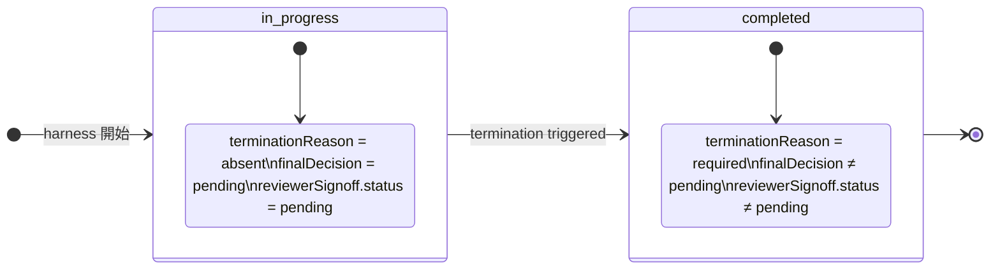

# 02_Inception-Deck — QFAI v1.7.15 完結設計

---

## 1. なぜここにいるのか？（Why Are We Here?）

`packages/qfai` v1.7.15 は rev9 までのイテレーションでビルドエラー・型エラーを解消したが、semantic closure（状態機械の整合・canonical ref の強制・型安全なバリデータの実装）が未完のまま残っている。v1.7.15-10 監査により4つのブロッカーが特定された。これらをすべて単一 PR で解消し、バリデータ通過・全テスト GREEN・ドキュメント同期を達成する。

---

## 2. エレベーターピッチ（Elevator Pitch）

**[QFAI 開発チーム] 向けに、[runtime.ts / validators / tests の semantic closure 完結]** を実現する **[packages/qfai 単一 PR]** は、**[ターミナル状態機械の強制・canonical ref の一元化・カテゴリ ref の厳格化・declaredRef の semantic 検証]** を可能にする。これは **[ad-hoc な後付けバリデーションとの乖離]** とは異なり、**[設計書 rev10 と実装が 1:1 で対応する完全な traceability chain]** を提供する。

---

## 3. 製品ボックス（Product Box）

**パッケージ名**: `@qfai/core` v1.7.15  
**見出し**: "full-harness execution with closed semantic contracts"

**裏面の機能一覧**:
- ✅ ターミナル状態機械（`in-progress` / `completed`）の厳格な遷移保証
- ✅ `terminationReason` → `finalDecision` / `reviewerSignoff.status` の一貫したマッピング
- ✅ `buildScreenContractInputs()` が `readCanonicalScreenContracts()` の `sourceRef` を直接利用
- ✅ イテレーション証拠 ref カテゴリ全8種の非空・具体性チェック
- ✅ `declaredRef` が `.qfai/specs/` パスかつ行アンカー付きであることを保証
- ✅ ネガティブフィクスチャ（各 WS ごとに最低1件）

---

## 4. やらないことリスト（NOT List）

| やらない | 理由 |
|---|---|
| `.qfai/**` の変更 | 運用ディレクトリは今回のスコープ外 |
| calibration pack 再設計 | 別タスク |
| スコアリング rubric 再設計 | 別タスク |
| Browser QA オーケストレーション再設計 | 別タスク |
| non-UI prototyping 再導入 | 廃止済み |
| standard/low-cost mode 再導入 | 廃止済み |
| マイグレーションサポート | 破壊的変更のため不要 |
| 後方互換レガシーフィクスチャ | 廃棄済み |
| warning-only パス | fail-closed ポリシーにより禁止 |

---

## 5. 隣人を知る（Meet Your Neighbors）

| ステークホルダー | 期待すること |
|---|---|
| completion-reviewer | 各 WS の完了基準（DoD）が満たされていること |
| requirements-reviewer | REQ-0001〜REQ-0009 がすべてコードとテストにトレースできること |
| architecture-reviewer | WS-1 の状態機械設計が既存アーキテクチャと整合すること |
| QFAI 利用者（将来） | v1.7.15 の public API が型安全かつドキュメント通りに動作すること |

---

## 6. 技術的解決策（Technical Solution）

**WS-1**: `runtime.ts` / `history.ts` でターミナル状態遷移を実装。バリデータ `prototypingEvidence.ts` で状態ごとのフィールド制約を検証。

**WS-2**: `screenContracts.ts` の `buildScreenContractInputs()` を修正し、ルートスラグアンカー生成を廃止。`readCanonicalScreenContracts()` 戻り値の `sourceRef` をそのまま使用。フォーマット: `.qfai/discussion/<pack>/uiux/40_screen_contracts.md#<screenId>`

**WS-3**: `l2Evidence.ts` / `prototypingEvidence.ts` に `assertConcreteArtifactRefs()` ヘルパーを追加。全8カテゴリ（render, browserQa, uiObservation, discussion, screenContract, trend, runtimeGate, specCoverage）に適用。

**WS-4**: `specCoverage.ts` / `execution.ts` の `declaredRef` 検証を強化。`/^\.qfai\/specs\/.+#(L\d+|\S+)$/` パターンに一致しない ref を即エラー。

---

## 7. 夜も眠れないこと（What Keeps Us Up at Night?）

| リスク | 深刻度 | 対策 |
|---|---|---|
| 状態機械の遷移制約が既存テストを大量に壊す | 高 | ネガティブフィクスチャを先に修正し、GREEN にしてから本実装 |
| `refSemantics.ts` の置き場判断が SDD フェーズにずれ込む | 中 | OQ-0002 として defer し、スコープ外に明示 |
| `declaredRef` の anchor パターンが edge case で false-positive | 中 | OQ-0004 で resolved：bare path は常に無効 |
| rev10 の変更が README と乖離したまま PR に入る | 低 | WS-1〜WS-4 完了後に README 同期をチェックリスト化 |

---

## 8. 期間（How Long?）

| マイルストーン | 見積もり |
|---|---|
| WS-1: terminal state machine 実装・テスト | 1–2 日 |
| WS-2: canonical screen contract refs 修正 | 0.5 日 |
| WS-3: iteration category refs 厳格化 | 0.5–1 日 |
| WS-4: semantic declaredRef 実装 | 0.5–1 日 |
| README 同期・PR 最終レビュー | 0.5 日 |
| **合計** | **3–5 日** |

---

## 9. コスト（What Will It Cost?）

- 開発工数: 3–5 人日（QFAI 開発チーム内）
- 追加インフラ: なし（既存 CI パイプラインをそのまま使用）
- 外部依存: なし（新規 npm パッケージ追加なし）

---

## 10. 優先度付け（Prioritization）

| 優先度 | 内容 | 根拠 |
|---|---|---|
| P0 (must) | WS-1 terminal state machine | v1.7.15 の核心。他の WS の前提 |
| P0 (must) | WS-4 semantic declaredRef | traceability chain の完結に不可欠 |
| P1 (must) | WS-3 iteration category refs | バリデータの fail-closed 保証 |
| P1 (must) | WS-2 canonical screen contract refs | sourceRef の一元化 |
| P2 (should) | README 同期 | ドキュメントと実装の乖離防止 |
| P3 (could) | `refSemantics.ts` 新規ファイル | OQ-0002 で SDD フェーズに defer |
