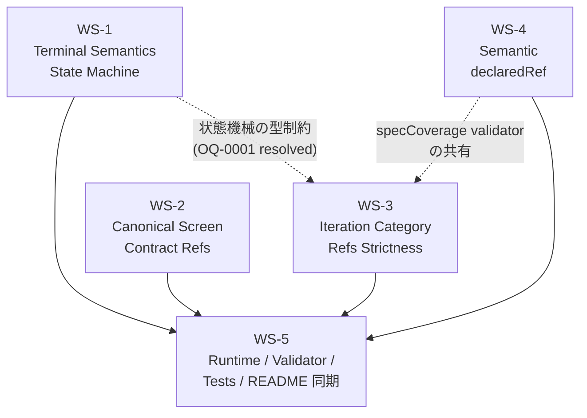

# 03_Story-Workshop — ユーザーストーリー & Example Seeds

---

## ワークストリーム全体像

---

## US-001: Terminal State Machine（WS-1）

**As a** developer running full-harness,  
**I want** the `fullHarness` outcome fields (`status`, `terminationReason`, `finalDecision`, `reviewerSignoff`) to follow a strict state machine,  
**So that** I can trust that `in-progress` and `completed` states are always internally consistent and validated by the runtime.

### 受け入れ基準

- `status=in-progress` のとき `terminationReason` フィールドは存在しない（`absent`）
- `status=in-progress` のとき `finalDecision=pending`、`reviewerSignoff.status=pending`
- `status=completed` のとき `terminationReason` は必須（`abandoned | max-iterations | plateau`）
- `status=completed` のとき `finalDecision ≠ pending`、`reviewerSignoff.status ≠ pending`
- バリデータは `completed` かつ `terminationReason=absent` の入力をエラーとして返す（warning なし）
- 各 `terminationReason` 値に対する `finalDecision` / `reviewerSignoff.status` のマッピング（OQ-0001）が実装されている

### OQ-0001 解決済みマッピング

| terminationReason | finalDecision | reviewerSignoff.status |
|---|---|---|
| `abandoned` | `abandoned` | `abandoned` |
| `max-iterations` | `abandoned` | `abandoned` |
| `plateau` | `abandoned` | `abandoned` |

### Example Seeds

| シナリオ | 入力 | 期待出力 |
|---|---|---|
| **Happy path** | `status=completed`, `terminationReason=abandoned`, `finalDecision=abandoned`, `reviewerSignoff.status=abandoned` | バリデーション通過 |
| **Happy path 2** | `status=in-progress`, `terminationReason=absent`, `finalDecision=pending`, `reviewerSignoff.status=pending` | バリデーション通過 |
| **Negative: reason in-progress** | `status=in-progress`, `terminationReason=abandoned` | エラー: `terminationReason must be absent when status=in-progress` |
| **Negative: missing reason** | `status=completed`, `terminationReason=absent` | エラー: `terminationReason is required when status=completed` |
| **Negative: pending on completed** | `status=completed`, `finalDecision=pending` | エラー: `finalDecision must not be pending when status=completed` |
| **Edge: max-iterations** | `status=completed`, `terminationReason=max-iterations`, `finalDecision=abandoned`, `reviewerSignoff.status=abandoned` | バリデーション通過 |
| **Edge: plateau** | `status=completed`, `terminationReason=plateau`, `finalDecision=abandoned`, `reviewerSignoff.status=abandoned` | バリデーション通過 |
| **State transition: in-progress→completed** | runtime が termination を検出し `completed` に遷移 | `terminationReason` が設定され、`finalDecision` / `reviewerSignoff` が consistent |
| **Idempotency** | 同じ `completed` バンドルを2回バリデーション | 毎回同一のエラーなし結果 |

---

## US-002: Canonical Screen Contract Refs（WS-2）

**As a** developer building screen contracts,  
**I want** `buildScreenContractInputs()` to use `readCanonicalScreenContracts()` の `sourceRef` を直接利用し,  
**So that** スクリーン contract の参照が常に canonical なパスを指し、ルートスラグアンカー生成によるズレが生じない.

### 受け入れ基準

- `buildScreenContractInputs()` はルートスラグからアンカーを生成しない
- 出力の `ref` フィールドは `.qfai/discussion/<pack>/uiux/40_screen_contracts.md#<screenId>` の形式（`readCanonicalScreenContracts()` の `sourceRef` そのまま）
- `screenId` が `sourceRef` に存在しない場合はエラー
- テスト: canonical sourceRef を持つフィクスチャで通過、slug 生成パスで失敗

### Example Seeds

| シナリオ | 入力 | 期待出力 |
|---|---|---|
| **Happy path** | `sourceRef=".qfai/discussion/pack-001/uiux/40_screen_contracts.md#SCR-001"` | `ref=".qfai/discussion/pack-001/uiux/40_screen_contracts.md#SCR-001"` |
| **Negative: slug-generated ref** | `ref=".qfai/discussion/pack-001/uiux/40_screen_contracts.md#/screens/top"` | エラー: slug-based anchor は無効 |
| **Negative: missing screenId** | `screenId="SCR-999"` が contracts に存在しない | エラー: `screenId not found in canonical screen contracts` |
| **Edge: 複数スクリーン** | 3つの screenId を含む contracts | 3件すべての sourceRef を返す |
| **Edge: 空の contracts** | contracts が空配列 | エラーなし（空配列を返す） |
| **Permission/role** | read-only caller が `buildScreenContractInputs()` を呼ぶ | 権限チェックなし（ファイル読み取り成功が前提） |
| **Idempotency** | 同じ contracts で2回呼ぶ | 毎回同一の結果 |

---

## US-003: Iteration Category Refs Strictness（WS-3）

**As a** developer reviewing evidence,  
**I want** all categories of `fullHarness.iterations[].evidenceRefs.*` to be validated as non-empty AND containing only concrete artifact refs,  
**So that** 証拠の参照が常に実際のアーティファクトを指しており、プレースホルダーや空配列が見落とされない.

### 受け入れ基準

- 全8カテゴリ（`render`, `browserQa`, `uiObservation`, `discussion`, `screenContract`, `trend`, `runtimeGate`, `specCoverage`）で非空チェックを実施
- 各エントリが `assertConcreteArtifactRefs()` ヘルパーを通過すること（OQ-0003 resolved）
- `runtimeGate` と `specCoverage` も同じヘルパーを使用（OQ-0003）
- 空配列はエラー
- プレースホルダー文字列（例: `"TODO"`, `"pending"`, `""`) はエラー
- ネガティブフィクスチャ: 各カテゴリで空配列を持つテストケース

### Example Seeds

| シナリオ | 入力 | 期待出力 |
|---|---|---|
| **Happy path** | 全8カテゴリに具体的 artifact ref が1件以上 | バリデーション通過 |
| **Negative: render 空** | `render: []` | エラー: `render evidenceRefs must be non-empty` |
| **Negative: browserQa プレースホルダー** | `browserQa: ["TODO"]` | エラー: `browserQa contains non-concrete ref: "TODO"` |
| **Negative: specCoverage 空** | `specCoverage: []` | エラー: `specCoverage evidenceRefs must be non-empty` |
| **Negative: runtimeGate 空** | `runtimeGate: []` | エラー: `runtimeGate evidenceRefs must be non-empty` |
| **Edge: 境界値1件** | 各カテゴリに正確に1件の具体 ref | バリデーション通過 |
| **Edge: 複数イテレーション** | 3イテレーション、うち1つで `discussion: []` | エラー: `iteration[2].discussion evidenceRefs must be non-empty` |
| **Idempotency** | 同じ `iterations` を2回バリデーション | 毎回同一の結果 |

---

## US-004: Semantic declaredRef（WS-4）

**As a** developer writing spec coverage,  
**I want** `specs[].coverageRefs[].declaredRef` to point to `.qfai/specs/` paths with line/anchor refs only,  
**So that** spec declaration の traceability chain が明確になり、discussion ref やスクリーン ref が誤って混入しない.

### 受け入れ基準

- `declaredRef` は `/^\.qfai\/specs\/.+#(L\d+|\S+)$/` に一致する必要がある（OQ-0004 resolved）
- ベアファイルパス（アンカーなし）は無効（OQ-0004）
- `.qfai/discussion/` パスは無効
- スクリーン contract ref は無効
- render evidence ref は無効
- Browser QA ref は無効
- バリデータは非準拠の `declaredRef` を即エラー（warning なし）

### Example Seeds

| シナリオ | 入力 | 期待出力 |
|---|---|---|
| **Happy path: 行アンカー** | `declaredRef=".qfai/specs/spec-0001.md#L42"` | バリデーション通過 |
| **Happy path: 宣言アンカー** | `declaredRef=".qfai/specs/spec-0001.md#REQ-0001"` | バリデーション通過 |
| **Negative: ベアパス** | `declaredRef=".qfai/specs/spec-0001.md"` | エラー: `declaredRef must include line or declaration anchor` |
| **Negative: discussion ref** | `declaredRef=".qfai/discussion/pack/01_Context.md#section"` | エラー: `declaredRef must point to .qfai/specs/ path` |
| **Negative: screen contract ref** | `declaredRef=".qfai/discussion/pack/uiux/40_screen_contracts.md#SCR-001"` | エラー: `declaredRef must point to .qfai/specs/ path` |
| **Negative: render evidence** | `declaredRef="screenshots/render-001.png"` | エラー: `declaredRef must point to .qfai/specs/ path` |
| **Edge: アンカーが空文字** | `declaredRef=".qfai/specs/spec-0001.md#"` | エラー: anchor が空 |
| **Permission/role** | specCoverage バリデーターの呼び出し | 権限チェックなし |
| **Idempotency** | 同じ `coverageRefs` を2回バリデーション | 毎回同一の結果 |

---

## US-005: Production Path Closure（WS-5）

**As a** developer executing full-harness,  
**I want** the complete runtime execution to produce output that passes all validators end-to-end,  
**So that** v1.7.15 が "completion" 状態として定義された DoD をすべて満たし、単一 PR でマージできる.

### 受け入れ基準

- `runtime.ts` / `history.ts` / `execution.ts` の変更後、`prototypingExecution.productionPath.test.ts` が GREEN
- `prototypingEvidence.test.ts` の全テストが GREEN（既存テスト + 新規ネガティブフィクスチャ）
- `fullHarnessRuntime.test.ts` の全テストが GREEN
- `pnpm format:check && pnpm lint && pnpm check-types` が通過
- `README.md` が WS-1〜WS-4 の変更を反映

### Example Seeds

| シナリオ | 入力 | 期待出力 |
|---|---|---|
| **Happy path** | 完全に正しい `fullHarness` オブジェクト | `qfai validate` 通過、エラーなし |
| **Negative: WS-1 違反** | `status=completed` かつ `terminationReason=absent` | バリデーターがエラーを返す |
| **Negative: WS-2 違反** | slug-based screen contract ref | バリデーターがエラーを返す |
| **Negative: WS-3 違反** | `evidenceRefs.render=[]` | バリデーターがエラーを返す |
| **Negative: WS-4 違反** | `declaredRef` にアンカーなし | バリデーターがエラーを返す |
| **Edge: 全 WS 同時違反** | WS-1〜WS-4 の違反を全て含む入力 | 全エラーが列挙される |
| **State transition** | `in-progress` → `completed` への runtime 遷移 | 状態遷移後のフィールドが consistent |
| **Idempotency** | 同じ入力で `qfai validate` を2回実行 | 毎回同一のエラーリスト |
