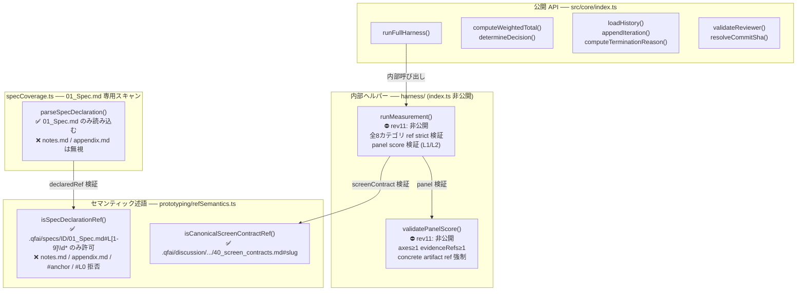

# 02_Inception-Deck — QFAI v1.7.15-rev11 セマンティッククロージャ完結

---

## 1. なぜここにいるのか？（Why Are We Here?）

`packages/qfai` v1.7.15 は rev10 までの実装でビルドエラー・型エラーを解消したが、v1.7.15-11 監査によって3つの semantic closure ギャップが残存していることが判明した。

1. `runMeasurement()` / `validatePanelScore()` が public API に露出しており、外部から strict validation なしに呼び出せてしまう
2. `declaredRef` が `.qfai/specs/<specId>/01_Spec.md#L<正整数>` 以外の ref を許可しており、traceability chain が破壊されうる
3. `specCoverage.ts` が全 `.md` ファイルをスキャンするため、非宣言ファイル（`notes.md`・`appendix.md`）からの `ui_route:` 宣言が混入しうる

これらを単一 PR で解消し、v1.7.15 の public API 表面とバリデーションコントラクトを完全に閉じる。

---

## 2. エレベーターピッチ（Elevator Pitch）

**[QFAI 開発チーム] 向けに、[public API 表面の削減と内部バリデーション厳格化]** を実現する **[packages/qfai v1.7.15-rev11 単一 PR]** は、**[`runFullHarness` のみを公開エントリポイントとし・`declaredRef` を `01_Spec.md#L<n>` に限定し・specCoverage を `01_Spec.md` 専用スキャンに変更すること]** を可能にする。これは **[rev10 までの広すぎる public export と loose な ref 許容]** とは異なり、**[設計書 rev11 と実装が 1:1 で対応する完全な semantic closure]** を提供する。

---

## 3. 製品ボックス（Product Box）

**パッケージ**: `packages/qfai` v1.7.15-rev11  
**見出し**: "Closed semantic contracts — no leaky helpers, no loose refs"

**機能一覧（裏面）**:

- ✅ `runFullHarness()` が唯一の public production-path エントリポイント
- ✅ `runMeasurement()` が内部ヘルパー化（全8カテゴリ ref strict 検証 + panel score 検証）
- ✅ `validatePanelScore()` が内部ヘルパー化（axes≥1 / evidenceRefs≥1 / concrete artifact ref）
- ✅ `isSpecDeclarationRef()` が `.qfai/specs/<specId>/01_Spec.md#L<正整数>` のみを許可
- ✅ `specCoverage.ts` が `01_Spec.md` のみをスキャン（`notes.md`・`appendix.md` を無視）
- ✅ `measurement.test.ts`・`panelScore.test.ts` が rev11 DTO 形状に完全準拠
- ✅ `specCoverage.test.ts`・`refSemantics.test.ts` が rev11 セマンティック境界をカバー

---

## 4. やらないことリスト（NOT List）

| やらない | 理由 |
|---|---|
| `.qfai/**` の変更 | 運用ディレクトリはスコープ外 |
| スコアリング rubric 再設計 | 別タスク |
| Browser QA オーケストレーション再設計 | 別タスク |
| calibration pack 再設計 | 別タスク |
| non-UI prototyping の追加 | 廃止済み・スコープ外 |
| マイグレーションサポート | 破壊的変更のため不要 |
| 後方互換レガシーフィクスチャ | fail-closed ポリシーにより禁止 |
| warning-only バリデーションパス | fail-closed ポリシーにより禁止 |
| README 以外のドキュメント更新 | スコープ外 |

---

## 5. 隣人を知る（Meet Your Neighbors）

| ステークホルダー | 期待 | 依存 |
|---|---|---|
| completion-reviewer | 全3課題の DoD が満たされていること | 実装完了後の全テスト GREEN |
| requirements-reviewer | REQ トレーサビリティが維持されていること | テスト TC-Ref の整合性 |
| ライブラリ利用者 | `runFullHarness` のみが public API であること | `index.ts` の export 一覧 |
| CI パイプライン | format/lint/型/テスト全通過 | pnpm workspace 設定 |

**内部モジュール依存**:

- `prototyping/refSemantics.ts` → `prototyping/specCoverage.ts`（`isSpecDeclarationRef` を使用）
- `harness/panelScore.ts` → `harness/measurement.ts`（`validatePanelScore` を内部呼び出し）
- `harness/measurement.ts` → `prototyping/refSemantics.ts`（`isCanonicalScreenContractRef` を使用）
- `harness/` 全体 → `core/index.ts`（public export の制御対象）

---

## 6. 技術的解決策（Show the Solution）

**実装順序（rev11 確定）**:

| # | ファイル | 内容 |
|---|---|---|
| 1 | `refSemantics.ts` | semantic predicate 先行確定（`#L[1-9]\d*` 制限） |
| 2 | `specCoverage.ts` | `01_Spec.md` 専用スキャンに変更 |
| 3 | `panelScore.ts` | `validatePanelScore` strict 確定 |
| 4 | `measurement.ts` | 全8カテゴリ ref + panel validator 呼び出し確定 |
| 5 | `index.ts` | `runMeasurement` / `validatePanelScore` 非公開化 |
| 6–9 | テストファイル群 | `measurement.test.ts`・`panelScore.test.ts` 更新 + `specCoverage.test.ts`・`refSemantics.test.ts` 新規/更新 |
| 10 | `README.md` | ドキュメント同期 |

---

## 7. 夜も眠れないこと（What Keeps Us Up at Night?）

| リスク | 深刻度 | 対策 |
|---|---|---|
| `validatePanelScore` / `runMeasurement` を参照していた外部コードが壊れる | 高 | breaking change として CHANGELOG に明記。public API は `runFullHarness` のみ |
| `isSpecDeclarationRef` の正規表現が edge case で false-negative（`#L999999` 等） | 中 | `#L0`・`#L-1`・ネストパス・絶対パス・`#anchor` の全ケースをユニットテストで網羅 |
| `specCoverage.ts` の `01_Spec.md` 限定変更が既存 integration test を壊す | 中 | テスト修正を実装と同一 PR に含め、GREEN 確認後マージ |
| `runMeasurement` 非公開化後に `runFullHarness` のエンドツーエンドパスが壊れる | 低 | `fullHarnessRuntime.test.ts` で production path を検証 |
| README が実装変更と乖離したまま PR に入る | 低 | 実装後に README を最終確認するチェックリスト化 |

---

## 8. 期間（Size It Up）

| 作業項目 | 見積もり |
|---|---|
| `refSemantics.ts` 修正 + `refSemantics.test.ts` 新規/更新 | 0.5 日 |
| `specCoverage.ts` 修正 + `specCoverage.test.ts` 新規/更新 | 0.5 日 |
| `panelScore.ts` strict 確定 + `panelScore.test.ts` 更新 | 0.5 日 |
| `measurement.ts` 確定 + `measurement.test.ts` 更新 | 0.5 日 |
| `index.ts` 非公開化 | 0.25 日 |
| `README.md` 同期・PR 最終レビュー | 0.25 日 |
| **合計** | **2.5 日** |

---

## 9. トレードオフ（What's Going to Give）

| 選択 | 採用 | 代替 | 理由 |
|---|---|---|---|
| `runMeasurement` / `validatePanelScore` を完全非公開化（破壊的変更） | ✅ 採用 | 後方互換 export を保持 | fail-closed ポリシー。互換レイヤーは semantic closure の意味を失わせる |
| `isSpecDeclarationRef` を `01_Spec.md#L<n>` のみに制限 | ✅ 採用 | 正規表現スコープを緩める | traceability chain の SSOT は `01_Spec.md` のみ。他のファイルへの宣言拡散を禁止 |
| `specCoverage.ts` を `01_Spec.md` 専用スキャンに変更 | ✅ 採用 | 全 `.md` スキャンを維持 | 宣言の単一ソース（SSOT）を保証。`notes.md`・`appendix.md` からの混入を根絶 |
| 新規テストファイル（`specCoverage.test.ts`・`refSemantics.test.ts`） | ✅ 採用 | 既存テストに追記のみ | rev11 セマンティック境界を独立したテストスイートで明確化するため |

---

## 10. チームとリソース（What's It Going to Take）

| リソース | 内容 |
|---|---|
| 実装担当 | QFAI 開発チーム（1名） |
| レビュー担当 | completion-reviewer / requirements-reviewer |
| CI 環境 | GitHub Actions（既存パイプライン） |
| 追加インフラ | なし |
| 追加 npm パッケージ | なし |
| 外部依存 | なし |
