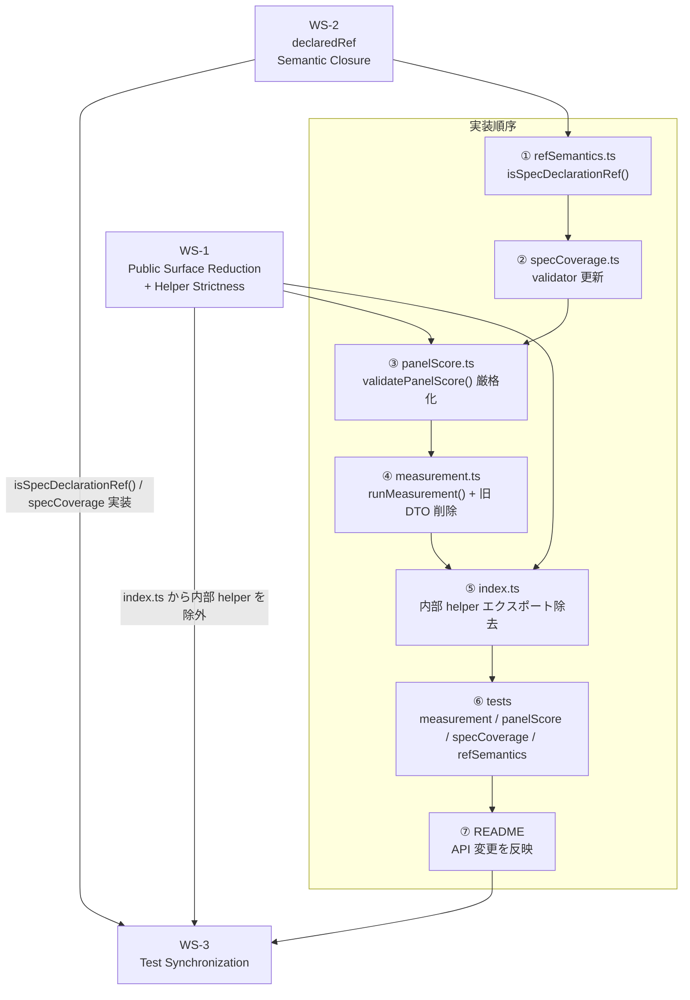
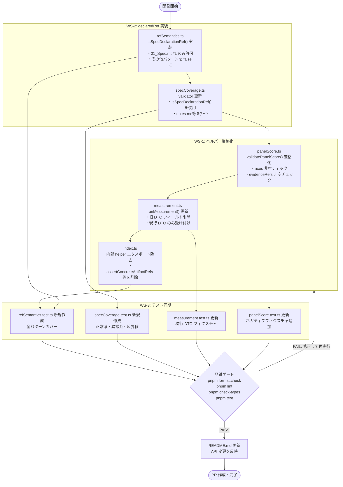
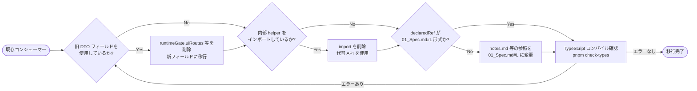

# 03_Story-Workshop — ユーザーストーリー & Example Seeds

---

## ワークストリーム全体像

---

## US-001: 公開 API の絞り込みとヘルパー厳格化（WS-1）

- **As a:** パッケージコンシューマー（packages/qfai をインポートする開発者）
- **I want:** `index.ts` が本番パス API のみをエクスポートし、内部ヘルパーが公開されない状態にしたい
- **So that:** パブリック API の安定性が保証され、内部実装の変更が外部に漏洩しない

- **As a:** パッケージコントリビューター（packages/qfai を実装する開発者）
- **I want:** `runMeasurement()` と `validatePanelScore()` が不正な入力（古い DTO フィールド、空の axes）を拒否するようにしたい
- **So that:** バリデーションが実装レベルで強制され、不整合なデータが下流に流れない

### 受け入れ基準

- AC-001-01: `index.ts` から内部ヘルパー（`assertConcreteArtifactRefs` 等）のエクスポートが削除されている
- AC-001-02: `runMeasurement()` は旧 DTO フィールド（`runtimeGate.uiRoutes`, `runtimeGate.apiEndpoints`, `uiObservation.domLabelsFound` 等）を含む入力をエラーとして返す
- AC-001-03: `validatePanelScore()` は `axes` が空配列の入力をエラーとして返す
- AC-001-04: `validatePanelScore()` は各 axis の `evidenceRefs` が空の入力をエラーとして返す
- AC-001-05: パッケージコンシューマーが内部ヘルパーをインポートしようとすると TypeScript コンパイルエラーになる

### Example Seeds

| 観点 | 例 | ステータス |
|---|---|---|
| Happy path | `runMeasurement()` に現行 DTO（`renderRefs`, `browserQaRefs` 等）を渡す → バリデーション通過 | seed |
| Negative path | `runtimeGate.uiRoutes: ["/home"]` を含む旧 DTO を `runMeasurement()` に渡す → エラー: `uiRoutes は廃止されたフィールドです` | seed |
| Edge / boundary | `axes: [{ key: "coverage", score: 0, rationale: "none", evidenceRefs: [] }]` を `validatePanelScore()` に渡す → エラー: `axis.evidenceRefs must be non-empty` | seed |
| Permission / role | パッケージコンシューマーが `import { assertConcreteArtifactRefs } from 'qfai'` を試みる → TypeScript コンパイルエラー（`Module '"qfai"' has no exported member 'assertConcreteArtifactRefs'`） | seed |
| State transition | 旧 DTO のみを知るコンシューマーが新バージョンに移行: 旧フィールドを削除し新フィールドに置き換える → 両ステップでの型チェック通過 | seed |
| Idempotency / retry | 同じ有効な `runMeasurement()` 入力で2回呼び出す → 毎回同一のバリデーション通過結果 | seed |

---

## US-002: declaredRef のセマンティッククロージャー（WS-2）

- **As a:** パッケージコントリビューター
- **I want:** `specCoverage` バリデーターが `01_Spec.md` ファイルのみを受け入れるよう制限したい
- **So that:** spec coverage の参照が spec 定義ファイルのみを指し、discussion や notes ファイルへの誤参照が検出される

- **As a:** パッケージコントリビューター
- **I want:** `isSpecDeclarationRef()` が `.qfai/specs/<specId>/01_Spec.md#L<n>` 形式のみを受け入れるよう制限したい
- **So that:** トレーサビリティチェーン（REQ → Spec → Code → Test）の integrity が保たれる

### 受け入れ基準

- AC-002-01: `isSpecDeclarationRef(".qfai/specs/spec-0001/01_Spec.md#L14")` → `true`
- AC-002-02: `isSpecDeclarationRef(".qfai/specs/spec-0001/01_Spec.md#route-home")` → `false`（行参照でないアンカー）
- AC-002-03: `isSpecDeclarationRef(".qfai/specs/spec-0001/notes.md#L10")` → `false`（01_Spec.md 以外のファイル）
- AC-002-04: `isSpecDeclarationRef(".qfai/discussion/pack-1/uiux/20_design_eval_invariant.md#L12")` → `false`（spec パスではない）
- AC-002-05: `specCoverage` バリデーターは `notes.md`, `appendix.md`, discussion refs, アンカー参照（行番号なし）をすべてエラーとして返す

### Example Seeds

| 観点 | 例 | ステータス |
|---|---|---|
| Happy path | `declaredRef: ".qfai/specs/spec-0042/01_Spec.md#L7"` を specCoverage に渡す → バリデーション通過 | seed |
| Negative path | `declaredRef: ".qfai/specs/spec-0042/notes.md#L10"` を渡す → エラー: `declaredRef must point to 01_Spec.md` | seed |
| Edge / boundary | `declaredRef: ".qfai/specs/spec-0042/01_Spec.md#L1"` （行番号 1、境界値）→ バリデーション通過 | seed |
| Permission / role | N/A — `isSpecDeclarationRef()` は純粋関数でありパーミッションチェックを持たない。呼び出し元の権限に関係なく同一の結果を返す | seed |
| State transition | 既存コードが `notes.md` 参照を使用していた場合に `01_Spec.md` 参照へ移行: `notes.md` 参照でエラー検出 → `01_Spec.md#L<n>` に修正 → エラー解消 | seed |
| Idempotency / retry | `isSpecDeclarationRef(".qfai/specs/spec-0042/01_Spec.md#L7")` を複数回呼び出す → 毎回 `true` を返す | seed |

---

## US-003: テスト同期とセマンティクス強制（WS-3）

- **As a:** パッケージコントリビューター
- **I want:** ハーネスユニットテストが現行の DTO 形状を使用するように更新したい
- **So that:** テストが実際の実装と乖離せず、回帰を即座に検出できる

- **As a:** パッケージコントリビューター
- **I want:** `specCoverage.test.ts` と `refSemantics.test.ts` が存在しすべてのテストが通過する状態にしたい
- **So that:** WS-1 / WS-2 の実装が完全にテストカバレッジで保護される

### 受け入れ基準

- AC-003-01: `measurement.test.ts` が現行 DTO（旧フィールドなし）で GREEN
- AC-003-02: `panelScore.test.ts` が現行 DTO（`axes` + `evidenceRefs` 必須）で GREEN
- AC-003-03: `specCoverage.test.ts` が新規作成され、`01_Spec.md` 参照の正常系・異常系テストが含まれ GREEN
- AC-003-04: `refSemantics.test.ts` が新規作成され、`isSpecDeclarationRef()` の全パターン（正常・異常・境界値）をカバーし GREEN
- AC-003-05: `pnpm format:check && pnpm lint && pnpm check-types` がすべて通過

### Example Seeds

| 観点 | 例 | ステータス |
|---|---|---|
| Happy path | `measurement.test.ts` に現行 DTO フィクスチャを渡す → 全テスト GREEN | seed |
| Negative path | `panelScore.test.ts` に `axes: []` のネガティブフィクスチャを追加 → エラーアサーションが GREEN | seed |
| Edge / boundary | `refSemantics.test.ts` で `#L0`（ゼロ行）を `isSpecDeclarationRef()` に渡す → 実装に応じ `false` または `true` の一貫した結果 | seed |
| Permission / role | テストファイル自体は `packages/qfai/tests/` 配下に配置され、外部からの直接実行が不要なことを確認（`pnpm test` 経由でのみ実行される） | seed |
| State transition | `measurement.test.ts` が旧 DTO フィクスチャを使用している状態 → 旧フィールドを削除し新フィールドへ更新 → テストが再び GREEN になること | seed |
| Idempotency / retry | `pnpm test` を同じコミットで2回連続実行 → 毎回同一のテスト結果（flaky なし） | seed |

---

## User Flows

### フロー 1: コントリビューターによる WS-1〜WS-3 実装フロー

### フロー 2: パッケージコンシューマーの移行フロー

---

## Flow Descriptions

### フロー 1: コントリビューターによる WS-1〜WS-3 実装フロー

実装順序は依存関係に基づき固定される:

1. **refSemantics.ts** — `isSpecDeclarationRef()` は他のバリデーターから参照されるため最初に実装する
2. **specCoverage.ts** — `isSpecDeclarationRef()` に依存するため2番目
3. **panelScore.ts** — 独立した厳格化。WS-1 の中核
4. **measurement.ts** — 旧 DTO フィールドの削除。panelScore の変更後に実施
5. **index.ts** — エクスポートの整理。上記すべての実装後に実施
6. **tests** — すべての実装が揃った後にテストを同期・新規作成
7. **README** — 最後に API 変更を文書化

品質ゲートは実装とテストがすべて完了した後に通過することを確認する。

### フロー 2: パッケージコンシューマーの移行フロー

既存コンシューマーは3つのチェックポイントを順に確認する。各チェックで問題が見つかれば修正し、最終的に TypeScript コンパイルエラーがゼロになることを確認する。

---

## Behavior Obligations

### State Coverage

| State / Risk | Discovery Notes | Handoff to Contract |
|---|---|---|
| `validatePanelScore()` に空 axes が渡される | axes が空の場合のエラーメッセージを定義する必要がある | panelScore contract: `axes must be non-empty` エラー形式 |
| `runMeasurement()` に旧 DTO フィールドが含まれる | 旧フィールドを TypeScript 型レベルで除外 (`never` 型または型ガード) するか、実行時チェックするかを決定する必要がある | measurement contract: 旧フィールド列挙と rejection ルール |
| `isSpecDeclarationRef()` が `#L0` を受け取る | 行番号 0 の有効性（1始まりか0始まりか）を仕様に明記する必要がある | refSemantics contract: 行番号の最小値 |
| 内部 helper が削除された後の後方互換性 | セマジョバーアップ（major version bump）なしで削除可能かを確認する必要がある | package versioning policy |
| `specCoverage.test.ts` / `refSemantics.test.ts` が存在しない状態 | 新規ファイル作成。既存テストファイルと命名規則を合わせる | test file convention: `packages/qfai/tests/` 配下 |

### Interaction Contracts

| Primary Task | Key Action | Priority Hint | Expected Result | Error Handling |
|---|---|---|---|---|
| `runMeasurement()` 呼び出し | 現行 DTO（新フィールド）を渡す | HIGH | バリデーション通過、エラーなし | 旧フィールドは型エラーまたは実行時エラー |
| `validatePanelScore()` 呼び出し | `axes` に1件以上のエントリを渡す | HIGH | バリデーション通過 | `axes` 空の場合は即エラー返却 |
| `isSpecDeclarationRef()` 呼び出し | `.qfai/specs/<id>/01_Spec.md#L<n>` 形式の ref を渡す | HIGH | `true` を返す | それ以外のパターンはすべて `false` |
| パッケージコンシューマーによるインポート | `import { runMeasurement } from 'qfai'` | HIGH | 型安全なインポート成功 | 削除された内部 helper インポートは TypeScript エラー |
| `pnpm test` 実行 | テストスイート全体を実行 | HIGH | 全テスト GREEN | 失敗テストの詳細が標準出力に表示される |

### Error Handling

- **バリデーションエラー**: `runMeasurement()` と `validatePanelScore()` は `ValidationError` 型（またはエラーオブジェクト配列）を返す。`throw` ではなく `Result` 型またはエラー配列で返すことを推奨する（既存パターンに従う）
- **旧 DTO フィールド検出**: TypeScript の型システムで旧フィールドを `never` 型として定義し、コンパイル時に検出する。実行時バリデーションも追加する
- **非準拠 declaredRef**: `isSpecDeclarationRef()` は純粋な述語関数として `false` を返すのみ。`specCoverage` バリデーターがこれを利用してエラーメッセージを生成する
- **テスト失敗**: `pnpm test` の失敗時は対象テストファイルと行番号を確認し、フィクスチャを現行 DTO に合わせて修正する
- **型チェック失敗**: `pnpm check-types` 失敗時は `as` キャスト禁止ルールに従い、型ガードまたは型アサーション関数で解決する
