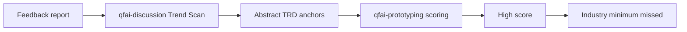
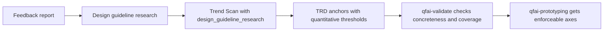

# 02_Inception-Deck

## 1. Why Are We Here?

UI-bearing discussion がデザイン指南書の定量基準を拾えないため、TRD 軸の品質が不十分になり、後続 prototyping が低品質 UI を通してしまう。QFAI package 自体に、その再発防止策を組み込む必要がある。

## 2. Elevator Pitch

QFAI discussion に design guideline research を追加し、Trend Scan から TRD 軸までを定量基準つきで接続する。さらに validator で coverage と concreteness を検証することで、抽象的な美的判断だけに依存しない品質ゲートを作る。

## 3. Design the Box

- In: `qfai-discussion` skill/template、`qfai-validate` rule、関連 README/refs
- Out: prototyping 実装個別修正、ローカル `.qfai/assistant/skills/...` への暫定パッチ常設化

## 4. Not a Solution?

- package に固定の静的ルール集を埋め込んで全プロジェクトへ同値適用する案は採らない
- prototyping skill にだけ後追いルールを足す案は採らない

## 5. Show the Money

- discussion 時点で設計品質の欠陥を検知できる
- downstream project ごとのローカル対処を減らせる
- validator により regression を自動検知できる

## 6. What Keeps Us Up at Night?

- guideline research を必須化すると、外部参照依存で作業量が増える
- validator を厳しくし過ぎると既存 pack に false positive が出る
- 定量 requirement が強すぎると、プロジェクト特性に応じた design variation を潰す

## 7. Can We Build It?

package 既存構造には discussion pack validator と UIX validator 群があり、skill/template/rule の追加先は明確である。よって実装可能性は高い。

## 8. What's the Plan?

1. discussion 側で design guideline research と score anchor concreteness requirement を定義する。
2. validator 側で coverage/concreteness rule を追加する。
3. README・references で expected behavior と backward compatibility guidance を補足する。

## 9. What Gives Us Confidence?

- 入力レポートが root cause と package-level fix を具体的に提示している
- 現在の validator 群に追加ルールを載せる拡張余地がある
- downstream では既にローカル mitigation が必要になっており、課題の実在性が高い

## 10. What Are We Not Doing?

- `.qfai/` 配下ローカル mitigation を package 標準として残すこと
- project 固有 UI spec をこの段階で固定すること
- 実装コードまで discussion で確定すること

## Mermaid 1: Current Failure Path

## Mermaid 2: Target Path After Fix

