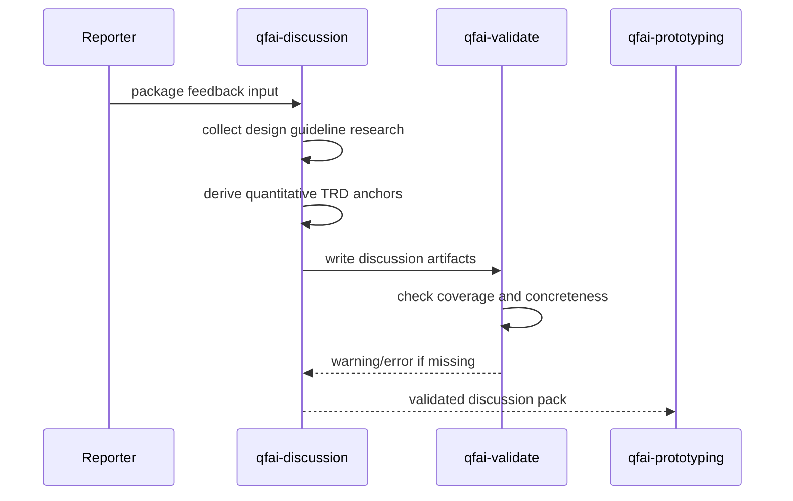

# 03_Story-Workshop

## Story Map

| Story ID | As a | I want | So that |
| --- | --- | --- | --- |
| US-0001 | QFAI discussion agent | design guideline research を mandatory step として実行したい | Trend Scan に定量根拠を残せる |
| US-0002 | QFAI validator | Trend Scan の guideline coverage を検出したい | 必須カテゴリ不足を見逃さない |
| US-0003 | QFAI validator | TRD `score_anchors` の定量性を検証したい | 抽象的アンカーだけで通過しない |
| US-0004 | package maintainer | 既存 project への影響を制御したい | 後方互換性を壊さず導入できる |
| US-0005 | downstream UI project | project 文脈に応じた design guideline を使いたい | 固定の静的ルール集に縛られない |

## User Flow

## Behavior Obligations

- UI-bearing discussion では `design_guideline_research` を省略してはならない。
- `score_anchors` は形容詞のみで構成してはならず、数値・比率・ルール ID・クラス名のいずれかを含む。
- non-ui discussion では今回の新 requirement は適用しない。
- validator は不足箇所を file/rule 単位で明示し、修正可能なメッセージを返す。

## Example Seeds

### US-0001 Example Seeds

| Perspective | Seed |
| --- | --- |
| Happy path | web UI project が Material Design / WCAG / shadcn/ui / platform library を調査して `04_Sources.md` に記録する |
| Negative path | Trend Scan に visual trend だけがあり guideline research が 0 件 |
| Edge or boundary | custom design system project が platform-specific docs を primary source にする |
| Permission or role | discussion agent のみが research を記述し reviewer は検証だけ行う |
| State transition | draft discussion pack から validate-ready pack へ遷移する |
| Idempotency or retry | research source を追加して再 validate しても既存 entries が壊れない |

### US-0002 Example Seeds

| Perspective | Seed |
| --- | --- |
| Happy path | validator が spacing/color/accessibility/component_sizes を検出して PASS 相当になる |
| Negative path | `design_guideline_research` category 自体が存在しない |
| Edge or boundary | 4カテゴリはあるが 1 entry が複数カテゴリを兼ねるケース |
| Permission or role | validator は pack を読むだけで source を補完しない |
| State transition | warning 未満の draft から rule 準拠済みへ遷移する |
| Idempotency or retry | 同一 pack に対して複数回 validate しても結果が安定する |

### US-0003 Example Seeds

| Perspective | Seed |
| --- | --- |
| Happy path | `high: contrast ratio >= 4.5:1` のように rule ID や数値を含む |
| Negative path | `high: spacing is polished` のような抽象表現のみ |
| Edge or boundary | Tailwind class のみで数値がなくても class 名が定量 proxy として許可される |
| Permission or role | requirements reviewer は曖昧アンカーを blocking issue にできる |
| State transition | abstract anchor から quantified anchor へ更新される |
| Idempotency or retry | 同一 TRD entry を修正後に再評価しても別 axis へ副作用しない |

### US-0004 Example Seeds

| Perspective | Seed |
| --- | --- |
| Happy path | rule severity を warning で導入し既存 pack の移行猶予を確保する |
| Negative path | 初回導入で全既存 pack を hard error にして CI を壊す |
| Edge or boundary | 新規 pack のみ stricter guidance を docs で推奨する |
| Permission or role | maintainer が migration note を管理し user は pack を修正する |
| State transition | existing validator baseline から staged rollout へ遷移する |
| Idempotency or retry | warning override を調整しても discussion schema は不整合にならない |

### US-0005 Example Seeds

| Perspective | Seed |
| --- | --- |
| Happy path | enterprise admin UI が Ant Design docs を platform-specific source として採用する |
| Negative path | Stripe-like fixed rule set を mobile native project に強制適用する |
| Edge or boundary | mixed surface project が web と mobile guideline を併記する |
| Permission or role | downstream project owner が採用ライブラリに応じた source を選ぶ |
| State transition | generic trend scan から project-context-aware scan へ遷移する |
| Idempotency or retry | library 変更時に source entries を更新しても TRD schema は変わらない |
