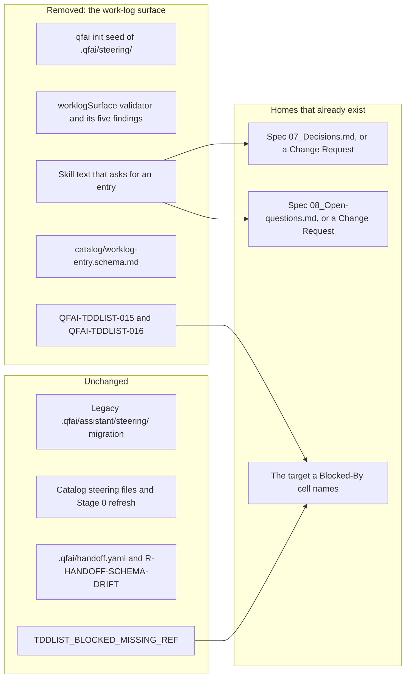

# 02 Inception Deck

## 1. Why Are We Here?

- Purpose: remove the AI work-log surface `.qfai/steering/` (C in `01_Context.md#Background`).
  Every kind of record it held already has a tracked home. The validator that
  polices it costs more to keep than it returns. Its name collides with two
  other QFAI features that stay.

## 2. Elevator Pitch

- For: adopters of QFAI and the agents that run its stage skills
- Who: are asked to keep a second record, in `.qfai/steering/`, of things a
  Change Request, a spec's `07_Decisions.md` or `08_Open-questions.md`, or a
  ledger's `Blocked-By` cell already records
- The: removal of the QFAI work-log surface
- Is a: subtractive change to `qfai init`, `qfai validate` and the shipped skills
- That: leaves one home per kind of record, and one meaning for "steering"
- Unlike: keeping the surface and repairing its schema and validator
- Our product: deletes the surface without touching an adopter's existing files

## 3. Product Box (Feature highlights)

- Headline feature 1: `qfai init` stops creating `.qfai/steering/`, and
  `qfai validate` stops reading it (REQ-0001, REQ-0002).
- Headline feature 2: the skills name where each record goes instead
  (REQ-0007, REQ-0008).
- Headline feature 3: an adopter's existing `.qfai/steering/` is left exactly as
  it was (REQ-0010, NFR-0003).

## 4. NOT List (Out of Scope)

| In Scope                                                                       | Out of Scope                                                        |
| ------------------------------------------------------------------------------ | ------------------------------------------------------------------- |
| C: `.qfai/steering/`, its seed, schema, validator, findings and skill text     | A: legacy `.qfai/assistant/steering/` and its migration code        |
| `QFAI-TDDLIST-015` and `QFAI-TDDLIST-016`                                      | B: catalog steering files and the Stage 0 steering refresh          |
| `R-HANDOFF-INCOMPLETE` and `R-WORKLOG-DRIFT` in the reviewer justification set | `.qfai/handoff.yaml`, `handoffUpgrade.ts`, `R-HANDOFF-SCHEMA-DRIFT` |
| This repository's seven entries, moved and deleted                             | `R-REJECTED-READOPT`, which reads no work-log entry (AP-0002)       |
| Rewriting the records that point into the directory                            | Any warning about a leftover `.qfai/steering/` (AP-0005)            |
| Recording the upstream conflicts as the Change Request `/qfai-sdd` raises      | Editing specs, `_policies` or contracts in this stage               |
| A CHANGELOG entry that tells adopters what changed                             | Choosing the release version (OQ-0011)                              |
| `TDDLIST_BLOCKED_MISSING_REF`, unchanged                                       | A replacement for the handoff brief or for the approval-stop entry  |

## 5. Meet Your Neighbors (Stakeholders & Dependencies)

- Upstream dependencies:
  - spec-0003 and spec-0004 rows, DR-0250..0260, `_policies/07_Constraints.md`
    TC-66, TC-70, OC-51, OC-52, and `.qfai/contracts/cli/*` (SRC-0009 to SRC-0011).
    `/qfai-sdd` supersedes them through a Change Request (REQ-0016).
- Downstream dependencies:
  - The dogfood ratchet `scripts/check-dogfood-backlog.mjs`, which fails on a
    lower error count until re-pinned (SRC-0016).
  - `qfai init --force`'s withdrawn-asset pass, which retires the shipped schema
    (SRC-0006).
- External integrations: none.

## 6. Show the Solution (Architecture Overview)

- High-level architecture: delete C's code, asset, tests and skill text by symbol.
  Point the skills at homes that already exist. Leave A, B and the handoff
  feature untouched.
- Key components:
  - `packages/qfai/src/core/validators/worklogSurface.ts` and
    `packages/qfai/src/core/worklogEntries.ts`, removed whole (SRC-0001).
  - Check 8b in `packages/qfai/src/core/validators/tddList.ts`, removed (SRC-0002).
  - `seedProjectSteering` and `buildProjectSteeringEntryTemplate` in
    `packages/qfai/src/cli/commands/init.ts`, removed (SRC-0004).
  - `packages/qfai/assets/init/.qfai/assistant/catalog/worklog-entry.schema.md`,
    withdrawn (SRC-0006, SRC-0007).

## 7. What Keeps Us Up at Night (Risks)

| Risk                                                                                              | Probability | Impact | Mitigation                                                                                                                                                                      |
| ------------------------------------------------------------------------------------------------- | ----------- | ------ | ------------------------------------------------------------------------------------------------------------------------------------------------------------------------------- |
| A token sweep for "steering" or "handoff" removes A, B or the live handoff feature                | medium      | high   | Remove by symbol (AP-0001, NFR-0001, NFR-0002, NFR-0006)                                                                                                                        |
| Entries deleted before the check, turning spec-0003's blocked rows red                            | medium      | high   | One change (REQ-0015, AP-0003)                                                                                                                                                  |
| The dogfood ratchet fails on the lower error counts                                               | high        | medium | Re-pin tdd, sdd and full in the same change (BP-0004)                                                                                                                           |
| An adopter's edited schema copy or entry is deleted                                               | low         | high   | Leave `.qfai/steering/` alone; the retire pass keeps an edited schema (REQ-0010, NFR-0003)                                                                                      |
| An adopter's remaining schema copy fails `qfai validate` with `QFAI-ASSETS-006` after the upgrade | high        | medium | Existing behaviour for every withdrawn asset. The CHANGELOG says to delete the file or run `qfai init --force`, and that an edited copy is removed by hand (REQ-0006, REQ-0011) |
| Content moved from an entry rewrites a dated observation in the target evidence file              | low         | medium | Append with the entry's own date (AP-0006)                                                                                                                                      |
| Specs keep rows for behaviour that no longer exists                                               | medium      | medium | The Change Request supersedes them (REQ-0016, AP-0004)                                                                                                                          |

## 8. Size It Up (Effort & Timeline)

- Estimated effort: one change. Mostly deletions across `packages/qfai/src`,
  `packages/qfai/assets`, `packages/qfai/tests`, two README copies and this
  repository's `.qfai/` records (SRC-0001 to SRC-0015).
- Target timeline: no date was set. The release version is the user's
  (OQ-0011).

## 9. What's Going to Give (Trade-offs)

| Dimension | Priority | Notes                                                                        |
| --------- | -------- | ---------------------------------------------------------------------------- |
| Scope     | 1        | Held to C. A, B and the handoff feature do not move                          |
| Quality   | 2        | No regression to A or B, no adopter file touched, CI green in the one change |
| Time      | 3        | No deadline                                                                  |
| Budget    | 4        | Not a factor: no spending                                                    |

## 10. What's It Going to Take (Team & Resources)

- Required skills: QFAI validator and `init` internals, the drift protocol's
  rules for deleted obligations (SRC-0017), and the dogfood ratchet (SRC-0016).
- Team composition: `/qfai-sdd` for the Change Request and spec rows; the
  implement stage for code, assets, tests and records.
- Infrastructure: the existing CI lanes. Nothing new.
