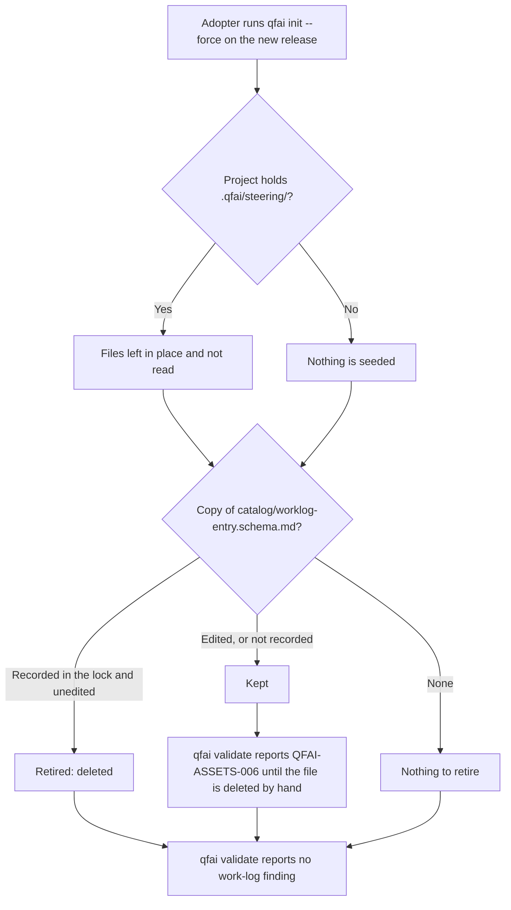
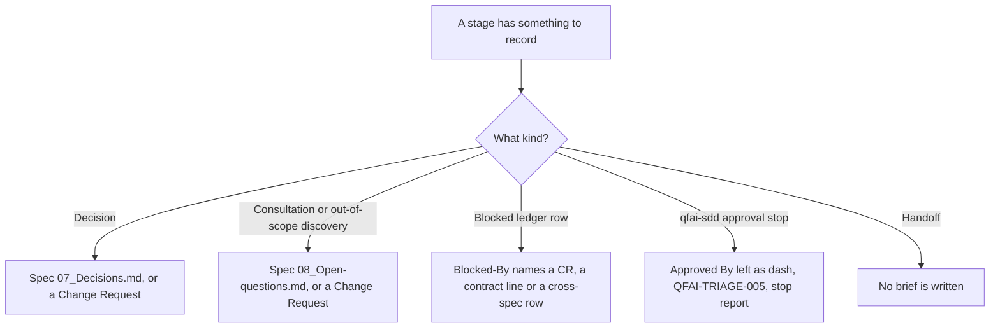

# 03 Story Workshop

## User Stories

> Discussion-layer IDs use the `D` prefix (`DUS-`, `DAC-`) so they can never be read as
> spec-layer IDs (`US-0001`, `AC-0001`) or as a traceability scenario tag (`SC-NNNN-NNNN`).
> Carry these IDs into the spec layer as `<pack-id>#<discussion-id>`: the `- Source:` line of
> the matching `## US-NNNN` block in `qfai-sdd/templates/specs/spec/02_User-stories.md`, and
> the `# Source:` comment inside the AC's Gherkin block in `03_Acceptance-Criteria.md`. The
> AC Catalog table has no `Source` column — provenance lives in the required Gherkin block so
> a spec that omits the optional catalog still carries it.

### DUS-001: A new project gets no work-log directory

- As a: developer running `qfai init` in a new project
- I want: init to create only what QFAI still reads
- So that: my tree holds no directory that nothing uses

#### Acceptance Criteria

- DAC-001-01: `qfai init` on an empty directory creates no `.qfai/steering/`,
  no `.qfai/steering/.gitkeep` and no `.qfai/steering/_templates/entry.md` (REQ-0001).
- DAC-001-02: init's report names no `.qfai/steering/` path, and the generated
  `.github/copilot-instructions.md` has no work-log line (REQ-0001).
- DAC-001-03: the init tree has no `.qfai/assistant/catalog/worklog-entry.schema.md` (REQ-0006).

#### Example Seeds

| Perspective         | Example                                                                                       | Status |
| ------------------- | --------------------------------------------------------------------------------------------- | ------ |
| Happy path          | `qfai init` in an empty directory: no path under `.qfai/steering/` exists afterwards          | seed   |
| Negative path       | `qfai init --dry-run`: the report names no `.qfai/steering/` path                             | seed   |
| Edge / boundary     | The catalog's four steering files (B) are still written, byte-identical to the release before | seed   |
| Permission / role   | N/A: init has no roles. Follow-up: none                                                       | seed   |
| State transition    | N/A: a fresh tree has no prior state. The upgrade case is DUS-002                             | seed   |
| Idempotency / retry | Running `qfai init` twice leaves no `.qfai/steering/` either time                             | seed   |

### DUS-002: An existing work-log directory is left alone

- As a: maintainer of a project that already holds `.qfai/steering/`
- I want: upgrading QFAI to leave those files exactly as they are
- So that: nothing I wrote is lost, and I decide what to do with it

#### Acceptance Criteria

- DAC-002-01: after `qfai init` and after `qfai init --force`, every file under
  `.qfai/steering/` has the same bytes as before (REQ-0010, NFR-0003).
- DAC-002-02: `qfai validate` under every profile emits no `W-WORKLOG-*`,
  `W-PENDING-PROMOTION`, `R-HANDOFF-INCOMPLETE` or new finding about the
  directory (REQ-0002, REQ-0010).
- DAC-002-03: a remaining `.qfai/assistant/catalog/worklog-entry.schema.md` is
  reported as `QFAI-ASSETS-006` until it is gone. `qfai init --force` deletes a
  copy the lock records and that still matches its record; an edited or
  unrecorded copy stays and is deleted by hand (REQ-0006, REQ-0011).

#### Example Seeds

| Perspective         | Example                                                                                                                                                                                | Status |
| ------------------- | -------------------------------------------------------------------------------------------------------------------------------------------------------------------------------------- | ------ |
| Happy path          | A tree with three entries and `_templates/entry.md`: `init --force` then `validate` leave all four files unchanged and report nothing                                                  | seed   |
| Negative path       | An entry with broken frontmatter, which used to raise `W-WORKLOG-SCHEMA`, now raises nothing                                                                                           | seed   |
| Edge / boundary     | An edited schema copy: `init --force` keeps it with the "content has been edited, so it was not removed" note, and `validate` reports `QFAI-ASSETS-006` until it is deleted by hand    | seed   |
| Edge / boundary     | A schema copy with no `.assets.lock.json` record: `init --force` never visits it, and `validate` reports `QFAI-ASSETS-006` until it is deleted by hand                                 | seed   |
| Permission / role   | N/A: no roles. Follow-up: none                                                                                                                                                         | seed   |
| State transition    | Unedited schema copy with a lock entry: after the upgrade `validate` reports `QFAI-ASSETS-006`; `init` without `--force` keeps it; `init --force` removes it; `validate` is then clean | seed   |
| Idempotency / retry | A second `init --force` after the schema was retired changes nothing and prints no second note                                                                                         | seed   |

### DUS-003: A blocked row needs only its Blocked-By target

- As a: agent running `/qfai-implement` that stops on a ledger row
- I want: the `Blocked-By` target to be the whole account of the stop
- So that: I do not keep a second record of the same stop

#### Acceptance Criteria

- DAC-003-01: a `blocked` row with a non-empty `Blocked-By` passes `qfai validate
--profile tdd`, whether or not a work-log entry exists (REQ-0004).
- DAC-003-02: a `blocked` row with an empty `Blocked-By` still fails with
  `TDDLIST_BLOCKED_MISSING_REF` (REQ-0004).
- DAC-003-03: the qfai-implement skill text names the `Blocked-By` target as the
  record of a stop and asks for no work-log entry (REQ-0007).

#### Example Seeds

| Perspective         | Example                                                                                                            | Status |
| ------------------- | ------------------------------------------------------------------------------------------------------------------ | ------ |
| Happy path          | spec-0003 `TDD-0058`, `blocked`, `Blocked-By: CR-20260923-0003 — blocked at todo`, no entry: no `QFAI-TDDLIST-015` | seed   |
| Negative path       | The same row with an empty `Blocked-By`: `TDDLIST_BLOCKED_MISSING_REF`, error                                      | seed   |
| Edge / boundary     | An unreadable `.qfai/steering/` file in the tree: no `QFAI-TDDLIST-016`                                            | seed   |
| Permission / role   | N/A: no roles. Follow-up: none                                                                                     | seed   |
| State transition    | A row moving `in-progress` to `blocked` with a CR in `Blocked-By` passes; `blocked` to `todo` needs nothing more   | seed   |
| Idempotency / retry | N/A: validation reads files and writes none of its inputs. Follow-up: none                                         | seed   |

### DUS-004: A qfai-sdd approval stop writes nothing new

- As a: agent running `/qfai-sdd --auto` whose triage holds an approval-required row
- I want: the stop to be recorded by what the run already leaves
- So that: no extra file is needed to hand the run back

#### Acceptance Criteria

- DAC-004-01: the qfai-sdd skill's approval stop leaves `Approved By` as `-`, does
  not enter Phase 0, reports the unapproved rows, and writes no work-log entry
  (REQ-0008).
- DAC-004-02: the record of the stop is the Triage `Approved By: -`, the
  `QFAI-TRIAGE-005` errors and the stop report (REQ-0008).
- DAC-004-03: `sdd-execution-playbook.md` and `sdd-triage.md` say the same
  (REQ-0008).

#### Example Seeds

| Perspective         | Example                                                                                                                                                       | Status |
| ------------------- | ------------------------------------------------------------------------------------------------------------------------------------------------------------- | ------ |
| Happy path          | `--auto` with one UPDATE:REMOVE row: stop, `Approved By: -`, `QFAI-TRIAGE-005`, report; no new file                                                           | seed   |
| Negative path       | `--auto` with only UPDATE:APPEND rows: no stop, as today                                                                                                      | seed   |
| Edge / boundary     | A CREATE row that has no spec pack yet: no work-log entry is written; the Triage table persisted by `sdd-triage.md` step 6 and the stop report are the record | seed   |
| Permission / role   | Without `--auto` the user approves each row through the question tool, as today                                                                               | seed   |
| State transition    | Stopped run, then a rerun without `--auto` that records the approvals and enters Phase 0                                                                      | seed   |
| Idempotency / retry | A second `--auto` run stops at the same rows and reports the same set                                                                                         | seed   |

### DUS-005: Other records go to homes that exist

- As a: agent running a stage skill that reaches a decision, a question for the
  user, or a discovery outside the current scope
- I want: the skill to name where the record goes
- So that: each kind of record has one home

#### Acceptance Criteria

- DAC-005-01: a decision goes to the spec's `07_Decisions.md` or to a Change
  Request (REQ-0007).
- DAC-005-02: a consultation or an out-of-scope discovery goes to the spec's
  `08_Open-questions.md` or to a Change Request (REQ-0007).
- DAC-005-03: no shipped skill, agent card, constitution article or manifest
  asks for a `.qfai/steering/` entry (REQ-0007, NFR-0006).
- DAC-005-04: the handoff brief has no replacement (REQ-0009).

#### Example Seeds

| Perspective         | Example                                                                              | Status |
| ------------------- | ------------------------------------------------------------------------------------ | ------ |
| Happy path          | qfai-implement reaches a scope decision: the skill text sends it to a Change Request | seed   |
| Negative path       | A search of `packages/qfai/assets/init/**` for `.qfai/steering/` returns nothing     | seed   |
| Edge / boundary     | Mentions of A's `.qfai/assistant/steering/` in migration text remain                 | seed   |
| Permission / role   | N/A: the homes are the same for every role. Follow-up: none                          | seed   |
| State transition    | N/A: text change. Follow-up: none                                                    | seed   |
| Idempotency / retry | N/A: text change. Follow-up: none                                                    | seed   |

### DUS-006: This repository removes its own directory in one green change

- As a: QFAI maintainer
- I want: the seven entries' unique content moved, the directory deleted, and
  every pointer rewritten, in the same change as the code
- So that: nothing is lost and CI stays green

#### Acceptance Criteria

- DAC-006-01: content found nowhere else is appended to the evidence file each
  entry points to, with the entry's own date (REQ-0013, AP-0006).
- DAC-006-02: `.qfai/steering/` and the tracked symlink
  `.qfai/assistant/catalog/worklog-entry.schema.md` are gone (REQ-0013).
- DAC-006-03: the three Change Requests and the evidence and spec-0006 lines that
  cite an entry path name where its content moved (REQ-0014).
- DAC-006-04: the check removal, the skill text, the deletion, the test
  removals, the ledger-row removals and tombstones, and the dogfood re-pin are one
  change, and `check-dogfood-backlog.mjs` passes for tdd, sdd and full (REQ-0015,
  NFR-0005).

#### Example Seeds

| Perspective         | Example                                                                                                                                | Status |
| ------------------- | -------------------------------------------------------------------------------------------------------------------------------------- | ------ |
| Happy path          | The spec-0003 blocker entry's per-row mutation table lands in `.qfai/evidence/implement-spec-0003.md`, dated 2026-09-23                | seed   |
| Negative path       | Deleting the directory without the check removal: spec-0003 raises one `QFAI-TDDLIST-015` naming six rows. REQ-0015 forbids this order | seed   |
| Edge / boundary     | The spec-0002 entry has nothing unique: only the pointers in `CR-20260912-0003` action 10 and `coverage-depth-spec-0002.md:495` change | seed   |
| Permission / role   | Rewriting the two approved Change Requests is the user's decision (OQ-0008), already taken                                             | seed   |
| State transition    | A ledger's error count falls, the ratchet reports "the pin is behind the tree", the change re-pins, the lane passes                    | seed   |
| Idempotency / retry | Re-running the re-pin on the finished change leaves `scripts/dogfood-backlog.json` unchanged                                           | seed   |

## User Flows

## Flow Descriptions

- Flow 1: adopter upgrade
  - Entry point: `qfai init --force` on a release without the surface.
  - Steps: the seed step no longer runs; any existing `.qfai/steering/` is left
    alone; the withdrawn-asset pass (`retireWithdrawnGovernedAssets`,
    `packages/qfai/src/cli/commands/init.ts:1514-1570`) deletes a schema copy the
    lock records and that still matches its record. An edited or unrecorded copy
    stays, and `qfai validate` reports it as `QFAI-ASSETS-006` until it is deleted
    by hand.
  - Exit point: once no schema copy remains, `qfai validate` reports nothing about
    the work-log surface.
- Flow 2: where a stage records something
  - Entry point: a stage skill reaches a decision, a question, a stop or a handoff.
  - Steps: the skill text names the home for each kind (REQ-0007, REQ-0008,
    REQ-0009).
  - Exit point: the record is in a file that is already tracked and already read.

## Behavior Obligations

Non-ui pack: no screen contract follows from this section. The obligations are
the Acceptance Criteria above.

### State Coverage

| State / Risk                             | Discovery Notes                                                                       | Handoff to Contract                                                                                 |
| ---------------------------------------- | ------------------------------------------------------------------------------------- | --------------------------------------------------------------------------------------------------- |
| Existing `.qfai/steering/` after upgrade | An adopter may read the silence as the files being ignored by mistake                 | CHANGELOG entry says the directory is left alone and unread (REQ-0011)                              |
| Edited schema copy after `init --force`  | The kept copy is named in init's note, and `validate` reports it as `QFAI-ASSETS-006` | Existing retire-pass note and finding; the CHANGELOG says to delete it by hand (REQ-0006, REQ-0011) |

### Interaction Contracts

| Primary Task                         | Key Action          | Priority Hint | Expected Result                                      | Error Handling                                                                 |
| ------------------------------------ | ------------------- | ------------- | ---------------------------------------------------- | ------------------------------------------------------------------------------ |
| Upgrade a project to the new release | `qfai init --force` | primary       | No seed; existing work-log files untouched           | Edited or unrecorded schema copy kept; `QFAI-ASSETS-006` until deleted by hand |
| Validate a project                   | `qfai validate`     | primary       | No work-log finding, no `QFAI-TDDLIST-015` or `-016` | `TDDLIST_BLOCKED_MISSING_REF` unchanged                                        |

### Error Handling

- Input validation: unchanged. `TDDLIST_BLOCKED_MISSING_REF` still requires a
  non-empty `Blocked-By` on a `blocked` row.
- Network failure: not applicable; no network access.
- Timeout: not applicable.
