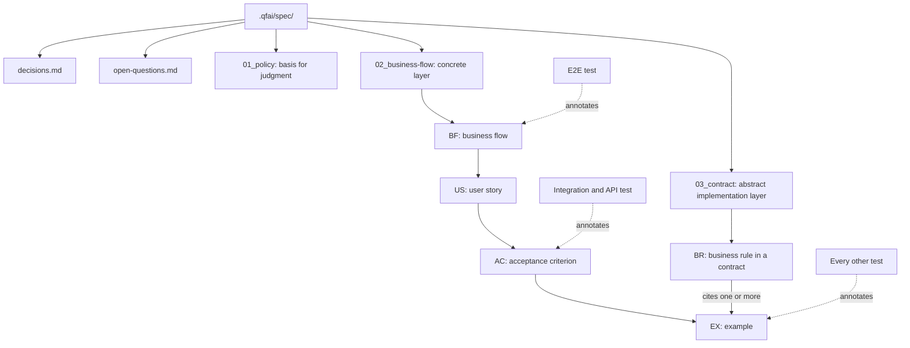

# 02 Inception Deck

## 1. Why Are We Here?

- Purpose: give adopters a spec tree that is written concrete-first — business flows, then stories with their acceptance criteria and examples, then the contracts that abstract them — with one place for decisions, one for open questions, and one traceability chain from a flow to a test: BF → US → AC → EX ← BR.

## 2. Elevator Pitch

- For: teams that use QFAI to drive AI agents through specification, acceptance tests and implementation.
- Who: need specs an agent can implement from without guessing, and a history of decisions they can read in one place.
- The: story-based `.qfai/spec/` layout, shipped as a breaking major release of the `qfai` package.
- Is a: document layout with validator rules, skill procedures and a migration skill.
- That: orders work concrete-first, makes examples the unit a test verifies, and keeps every decision and open question in two append-only tables.
- Unlike: today's capability packs, which interleave stories and rules per capability, ask for contracts first (SRC-0104), and keep test cases, a test list and a traceability ledger beside the examples (SRC-0101).
- Our product: derives the next test from examples that have no test, with no ledger file to keep in step (06_REQ.md, REQ-0015).

## 3. Product Box (Feature highlights)

- Headline feature 1: three layers — `01_policy` (the basis for judgment), `02_business-flow` (flows, stories, criteria, examples), `03_contract` (contracts with the business rules they enforce).
- Headline feature 2: one decision table and one open-question table for the whole project, four columns each, rows appended and only their status changed.
- Headline feature 3: `/qfai-migration-spec-to-story`, a skill whose bundled scripts perform every mechanical step of moving an existing project, and report every test case they turn into an example.

## 4. NOT List (Out of Scope)

| In Scope                                                         | Out of Scope                                                                 |
| ---------------------------------------------------------------- | ---------------------------------------------------------------------------- |
| The layout, templates, mdschema and validators the package ships | Reorganising this repository's own `.qfai/specs/` now (deferred, OQ-0021)    |
| The qfai skills that read and write the tree                     | A `qfai migrate` CLI command                                                 |
| A migration skill with bundled scripts                           | A period in which both layouts are accepted                                  |
| Moving project-owned settings into `qfai.config.yaml`            | Date or approver columns in the decision and open-question tables            |
| Singular names for QFAI-owned directories                        | Renaming host-defined directories (`.claude/skills`, `.github/workflows`, …) |

## 5. Meet Your Neighbors (Stakeholders & Dependencies)

- Upstream dependencies:
  - The mdschema manifest and its schemas, the layout SSOT (SRC-0115; `packages/qfai/assets/mdschema/manifest.yml`, SRC-0101).
  - The `qfai-sdd` templates, held to the schemas in both directions by `packages/qfai/tests/assets/mdschemaSchemas.test.ts` (SRC-0120).
- Downstream dependencies:
  - Every skill that names `.qfai/specs/`, and every validator that reads a spec pack (SRC-0101).
  - Existing adopters' repositories, which run on the old layout until migrated.
  - This repository's CI, whose self-validate steps read `.qfai/specs/` (SRC-0106).
- External integrations:
  - Host skill and agent directories written by `qfai init` (`SKILL_INTEGRATION_DIRS` in `packages/qfai/src/cli/commands/init.ts`, SRC-0103). Their names are host-defined and do not change.

## 6. Show the Solution (Architecture Overview)

- High-level architecture: `.qfai/spec/` holds two project-wide tables and three layers. The concrete layer is written first; the contract layer is derived from it; tests point into the chain at the layer they verify.
- Key components:
  - `decisions.md`, `open-questions.md` at the root of `.qfai/spec/`.
  - `01_policy/`: `objective.md`, `initiative.md`, `principle.md`, `glossary.md`, `constraint.md`.
  - `02_business-flow/`: `business-flows.md`, and per flow `business-flow.md`, `user-stories.md` and one directory per story holding `01_User-story.md`, `02_Acceptance-Criteria.md`, `03_Example.md`.
  - `03_contract/`: `contracts.md`, `tech.md`, `structure.md`, and `api/ db/ ui/ cli/ design/` with business rules inside the contract files.

## 7. What Keeps Us Up at Night (Risks)

| Risk                                                                                                                                          | Probability | Impact | Mitigation                                                                                     |
| --------------------------------------------------------------------------------------------------------------------------------------------- | ----------- | ------ | ---------------------------------------------------------------------------------------------- |
| R1: This repository's CI validates its own `.qfai/specs/` (SRC-0106); the cutover breaks it unless the repository migrates in the same change | high        | high   | Cutover and repository migration land together (phase P7; OQ-0021)                             |
| R2: `pnpm sync:ssot` regenerates `.qfai/assistant/` from the package, and `ci:gate:ssot` fails on drift (SRC-0107)                            | high        | medium | Rename and reorganise in `packages/qfai/assets/init/`, then run `sync:ssot` in the same commit |
| R3: The mdschema-to-template test fails on any unpaired schema or template (SRC-0120)                                                         | high        | medium | Change schemas and templates together in phase P2                                              |
| R4: An internal ID or private version marker reaches a shipped file through a new template or skill (SRC-0114)                                | medium      | high   | The three guards learn the new ID shapes (REQ-0024) and run on every change; NFR-0004          |
| R5: Migration drops test cases that exist only as tests (SRC-0105)                                                                            | medium      | high   | Every such case becomes an EX row and is listed in the migration report (REQ-0020, NFR-0003)   |
| R6: Flow-encoded IDs force renumbering when a story moves or a flow splits (SRC-0002)                                                         | medium      | medium | Accepted cost (Q2); tooling deferred (OQ-0023)                                                 |
| R7: Shared ID counters collide across parallel branches (AP-0001, AP-0002)                                                                    | medium      | medium | Deferred to design (OQ-0024)                                                                   |

## 8. Size It Up (Effort & Timeline)

- Estimated effort: nine phases, from the delivery-planner's preflight plan (`.qfai/evidence/discussion-20260923063306456.md#Work Orders Summary`, step 5):
  - P0 spec pack for this change, in the current layout;
  - P1 ID grammar and layout module, config schema;
  - P2 mdschema and templates;
  - P3 new validators, selected by the layout detected;
  - P4 skill rewrites;
  - P5 migration skill and scripts;
  - P6 assistant tree reorganisation, singular renames, config merge;
  - P7 cutover: migrate this repository's `.qfai/`, make the old layout an error, delete the old validators;
  - P8 release.
- Target timeline: not fixed. The release version and the pinned branch are a user decision (OQ-0022), needed before P1, the first phase that changes shipped files.
- Phase safety: P1 to P7 land on the pinned integration branch. No release carries P2 to P6 output before the P7 cutover, so no released version ever accepts both layouts (the rejected dual-layout option stays rejected).

## 9. What's Going to Give (Trade-offs)

| Dimension | Priority | Notes                                                                              |
| --------- | -------- | ---------------------------------------------------------------------------------- |
| Quality   | 1        | Every traceability rule is enforced by `validate`; nothing is dropped in migration |
| Scope     | 2        | Fixed by Q1–Q20; this repository's own migration is deferred to the cutover        |
| Time      | 3        | No date is set                                                                     |
| Budget    | 4        | No external spend                                                                  |

## 10. What's It Going to Take (Team & Resources)

- Required skills: TypeScript validators and CLI (`packages/qfai/src/`), Markdown templates and mdschema, skill authoring, migration scripting.
- Team composition: the routed roles in `.qfai/assistant/manifest/agent-routing.yml` for `qfai-sdd`, `qfai-atdd` and `qfai-implement`, with QFAI maintainers approving.
- Infrastructure: the existing CI (`.github/workflows/ci.yml`) and the pack verification it runs.
