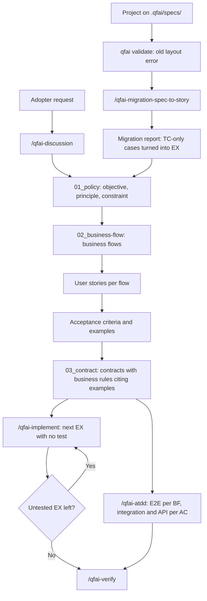

# 03 Story Workshop

## User Stories

> Discussion-layer IDs use the `D` prefix (`DUS-`, `DAC-`) so they can never be read as
> spec-layer IDs or as a traceability scenario tag. Carry them into the spec layer as
> `discussion-20260923063306456#DUS-001`.

### DUS-001: Write the concrete layer first

- As a: product owner or business analyst on an adopting project
- I want: to write business flows, then the stories under each flow, then their acceptance criteria and examples, before any contract exists
- So that: every rule and contract is derived from behaviour that is already agreed, not guessed ahead of it

#### Acceptance Criteria

- DAC-001-01: `/qfai-sdd` runs in the order 01 policy → 02 business flow → stories (US, AC, EX) → 03 contract with BRs (REQ-0014).
- DAC-001-02: A story directory holds exactly `01_User-story.md`, `02_Acceptance-Criteria.md` and `03_Example.md`, and no subdirectory (REQ-0003).
- DAC-001-03: Each EX cites exactly one AC, and every AC has at least one EX (REQ-0008).
- DAC-001-04: IDs follow `BF-0001`, `US-0001-0001`, `AC-0001-0001-01`, `EX-0001-0001-01` and are unique across the project (REQ-0004).

#### Example Seeds

| Perspective         | Example                                                                                                                       | Status |
| ------------------- | ----------------------------------------------------------------------------------------------------------------------------- | ------ |
| Happy path          | `BF-0001` holds `US-0001-0001`, whose `AC-0001-0001-01` has `EX-0001-0001-01` and `EX-0001-0001-02`; validate reports nothing | seed   |
| Negative path       | `EX-0001-0001-03` cites `AC-0001-0001-01` and `AC-0001-0001-02` → validate error: an EX cites exactly one AC                  | seed   |
| Negative path       | `AC-0001-0001-02` has no EX → validate error                                                                                  | seed   |
| Edge / boundary     | `US-0001-0001` moves to flow `BF-0002` → it becomes `US-0002-000N` and its AC and EX IDs change with it (accepted cost, Q2)   | seed   |
| Edge / boundary     | A story directory contains a subdirectory → validate error                                                                    | seed   |
| Permission / role   | N/A: the layout has no roles; authorship is governed by git and by the skills' ownership rules                                | seed   |
| State transition    | A story is retired → its directory is removed and a `decisions.md` row records why (REQ-0012)                                 | seed   |
| Idempotency / retry | N/A: authoring is a file edit with no external I/O                                                                            | seed   |

### DUS-002: Derive contracts and business rules from examples

- As a: solution architect writing contracts
- I want: to write each business rule inside the contract that enforces it, citing the examples it abstracts
- So that: a rule has one home, and every example is explained by at least one rule

#### Acceptance Criteria

- DAC-002-01: A BR lives in its contract file, in the form that file type allows; the proposed forms (an `x-qfai-rules` extension in YAML, a fixed-form comment block in SQL, a Rules table in a Markdown CLI contract) are confirmed under OQ-0027 (REQ-0006).
- DAC-002-02: Every BR cites at least one EX, and every EX is cited by at least one BR (REQ-0007).
- DAC-002-03: A rule spanning contracts lives in the authoritative one; the others reference its `BR-` ID (REQ-0006).

#### Example Seeds

| Perspective         | Example                                                                                                                                    | Status |
| ------------------- | ------------------------------------------------------------------------------------------------------------------------------------------ | ------ |
| Happy path          | `BR-0001` in `CON-API-0001` cites `EX-0001-0001-01` and `EX-0002-0001-01`; both EXs are cited; validate reports nothing                    | seed   |
| Negative path       | `EX-0001-0001-02` is cited by no BR → validate error                                                                                       | seed   |
| Negative path       | `BR-0002` cites no EX → validate error                                                                                                     | seed   |
| Edge / boundary     | `BR-0003` is enforced by `CON-API-0001` and `CON-DB-0001`; it is written in one and referenced by ID in the other; validate counts it once | seed   |
| Edge / boundary     | A BR cites an EX ID that does not exist → validate error                                                                                   | seed   |
| Permission / role   | N/A: no roles in the layout                                                                                                                | seed   |
| State transition    | N/A: a BR has no lifecycle of its own; a withdrawn rule is removed and recorded in `decisions.md`                                          | seed   |
| Idempotency / retry | N/A: no external I/O                                                                                                                       | seed   |

### DUS-003: Pick the next test from untested examples

- As a: AI agent running `/qfai-implement`
- I want: to select my next test from the EX IDs that no test annotates
- So that: I need no test list or ledger, and the next test is always derivable from the tree

#### Acceptance Criteria

- DAC-003-01: Every test that is neither E2E nor an integration or API test annotates an EX, as `QFAI:EX-0001-0001-01`; the `QFAI:SPEC-NNNN:` prefix is not used (REQ-0009).
- DAC-003-02: `/qfai-implement` derives its next test from the EX IDs with no annotated test; no ledger file exists (REQ-0015).
- DAC-003-03: An EX with no test and no exception fails validate (REQ-0010).

#### Example Seeds

| Perspective         | Example                                                                                                                                                                                | Status |
| ------------------- | -------------------------------------------------------------------------------------------------------------------------------------------------------------------------------------- | ------ |
| Happy path          | `EX-0001-0001-01` has a test, `EX-0001-0001-02` has none → `/qfai-implement` picks `EX-0001-0001-02`                                                                                   | seed   |
| Negative path       | A test annotated only `QFAI:SPEC-0001:TC-0001` covers no EX, so the EX it was written for stays untested and fails REQ-0010                                                            | seed   |
| Edge / boundary     | Every EX has a test → `/qfai-implement` reports nothing left to derive                                                                                                                 | seed   |
| Edge / boundary     | An EX has no test, and `decisions.md` row `DEC-0007` names it as exempt → validate accepts it; how the row links to the EX, and which statuses make it hold, are decided under OQ-0029 | seed   |
| Permission / role   | `/qfai-implement` does not write BF or AC tests; those belong to `/qfai-atdd` (REQ-0015)                                                                                               | seed   |
| State transition    | An EX's test is deleted → the EX is untested again and is the next candidate                                                                                                           | seed   |
| Idempotency / retry | Running the selection twice without new tests picks the same EX                                                                                                                        | seed   |

### DUS-004: Verify flows and criteria at the right layer

- As a: acceptance-test author running `/qfai-atdd`
- I want: to write an E2E test per business flow and an integration or API test per acceptance criterion
- So that: each layer of the chain is verified at the level that can observe it

#### Acceptance Criteria

- DAC-004-01: E2E tests annotate a BF (`QFAI:BF-0001`); integration and API tests annotate an AC (`QFAI:AC-0001-0001-01`) (REQ-0009).
- DAC-004-02: A BF with no E2E test, or an AC with no integration or API test, fails validate unless a `decisions.md` row names it as exempt (REQ-0010; the link and the statuses that hold are decided under OQ-0029).
- DAC-004-03: Contract-ID test annotations (`QFAI:CON-API-N`, `QFAI:CON-DB-N`) are no longer accepted (REQ-0009).

#### Example Seeds

| Perspective         | Example                                                                                                            | Status |
| ------------------- | ------------------------------------------------------------------------------------------------------------------ | ------ |
| Happy path          | `tests/e2e/checkout.spec.ts` annotates `QFAI:BF-0001`; validate reports nothing for `BF-0001`                      | seed   |
| Negative path       | `BF-0002` has no E2E test and no DEC exception → validate error                                                    | seed   |
| Negative path       | A test annotated only `QFAI:CON-API-0001` covers no AC, so the AC stays without an integration or API test         | seed   |
| Edge / boundary     | The exception row for `BF-0002` has Status `REJECTED` → whether the exemption still holds is decided under OQ-0029 | seed   |
| Permission / role   | `/qfai-atdd` writes no EX-level test; those belong to `/qfai-implement`                                            | seed   |
| State transition    | The exception row for `BF-0002` moves to `SUPERSEDED` → whether the exemption still holds is decided under OQ-0029 | seed   |
| Idempotency / retry | N/A: annotation scanning is a read                                                                                 | seed   |

### DUS-005: Record decisions and questions in two tables

- As a: anyone deciding something on the project, human or agent
- I want: one decision table and one open-question table for the whole project
- So that: I read the whole history in two files, and nobody rewrites a settled decision

#### Acceptance Criteria

- DAC-005-01: Both tables have exactly the columns ID, Content, Approach, Status, and no date or approver (REQ-0011).
- DAC-005-02: Status is TODO, WIP or DONE; decisions add SUPERSEDED and REJECTED; open questions add DEFERRED (REQ-0011).
- DAC-005-03: Rows are appended; only Status changes on an existing row (REQ-0011).
- DAC-005-04: Triage records and change requests are `decisions.md` rows; `.qfai/decisions/` is not written (REQ-0012).

#### Example Seeds

| Perspective         | Example                                                                                                         | Status |
| ------------------- | --------------------------------------------------------------------------------------------------------------- | ------ |
| Happy path          | `DEC-0012` is appended with Status `TODO`; later only its Status becomes `DONE`                                 | seed   |
| Negative path       | The Content of `DEC-0004` is edited in place → a violation; whether a CI guard catches it is deferred (OQ-0026) | seed   |
| Negative path       | A row with Status `APPROVED` → validate error: not in the vocabulary                                            | seed   |
| Edge / boundary     | `DEC-0004` is replaced: a new row `DEC-0013` is appended, and `DEC-0004` becomes `SUPERSEDED (by DEC-0013)`     | seed   |
| Edge / boundary     | An open question is put off: its Status becomes `DEFERRED`; `DEFERRED` on a decision is an error                | seed   |
| Permission / role   | N/A: no approver column; git records who changed a row                                                          | seed   |
| State transition    | TODO → WIP → DONE; a decision may end SUPERSEDED or REJECTED; a question may end DEFERRED                       | seed   |
| Idempotency / retry | N/A: no external I/O                                                                                            | seed   |

### DUS-006: Migrate an existing project

- As a: existing adopter on the capability layout
- I want: to run `/qfai-migration-spec-to-story` and have an AI move my project, with every mechanical step done by a bundled script
- So that: the move is repeatable, reviewable, and loses nothing

#### Acceptance Criteria

- DAC-006-01: Each mechanical step in REQ-0019 is a script bundled with the skill (REQ-0019).
- DAC-006-02: Every error or boundary TC with no EX becomes an EX row under the AC it cites, and the migration report lists it (REQ-0020).
- DAC-006-03: Every script has a dry run that writes nothing, and a second run on a migrated tree changes nothing (NFR-0001, NFR-0002).

#### Example Seeds

| Perspective         | Example                                                                                                                                                                     | Status |
| ------------------- | --------------------------------------------------------------------------------------------------------------------------------------------------------------------------- | ------ |
| Happy path          | A project with `spec-0001` and `spec-0002` migrates; validate on the result reports no layout error                                                                         | seed   |
| Negative path       | `.qfai/specs/` is absent → the skill reports that there is nothing to migrate and writes nothing                                                                            | seed   |
| Edge / boundary     | `TC-0003` is a boundary case citing `AC-0001` with EX-Ref `—` → it becomes an EX row under the migrated AC, and the report lists `TC-0003` and the new EX ID                | seed   |
| Edge / boundary     | A TC cites two ACs and no EX → it cannot become one EX with one AC-Ref; the report lists it for a person to split, and it is never dropped (REQ-0020)                       | seed   |
| Edge / boundary     | `EX-0003` is cited by TC rows whose AC-Refs name `AC-0001` and `AC-0002` → its AC-Ref cannot be derived; the report lists it and the EX is kept (REQ-0019 step 6, REQ-0020) | seed   |
| Permission / role   | Scripts write only to `.qfai/`, `qfai.config.yaml`, the managed `.gitignore` block, the host integration links and `QFAI:` annotation lines in test files (NFR-0008)        | seed   |
| State transition    | A retired spec (`01_Spec-retired`) becomes a `decisions.md` row, not a story directory                                                                                      | seed   |
| Idempotency / retry | The migration stops midway and is run again → it completes, and a third run changes nothing                                                                                 | seed   |

### DUS-007: Configure a project in one file

- As a: maintainer of an adopting project
- I want: my overrides of per-skill agent assignment and review profiles in `qfai.config.yaml`
- So that: my settings are not inside a tree `qfai init --force` regenerates

#### Acceptance Criteria

- DAC-007-01: Only the parts a project changes move into `qfai.config.yaml`; the agent card frontmatter is the single agent definition (REQ-0016).
- DAC-007-02: `developer_instructions`, a copy of card bodies, no longer exists (REQ-0016).
- DAC-007-03: The quality-gate commands live only in the Standard commands section of `03_contract/tech.md`; `qfai.config.yaml` holds none (REQ-0005).
- DAC-007-04: An override in `qfai.config.yaml` replaces the matching shipped default entry; the shipped defaults are not a file the project edits (REQ-0016).

#### Example Seeds

| Perspective         | Example                                                                                                                                                                                     | Status |
| ------------------- | ------------------------------------------------------------------------------------------------------------------------------------------------------------------------------------------- | ------ |
| Happy path          | A project assigns a different reviewer to `qfai-sdd` in `qfai.config.yaml`; the skill routes to it                                                                                          | seed   |
| Negative path       | `qfai.config.yaml` assigns a skill an agent that has no card → the override names nothing to replace; how validate reports it is part of the config schema `/qfai-sdd` designs for REQ-0016 | seed   |
| Edge / boundary     | `qfai.config.yaml` sets nothing → the shipped defaults apply                                                                                                                                | seed   |
| Permission / role   | N/A: no roles                                                                                                                                                                               | seed   |
| State transition    | `qfai init --force` regenerates cards and leaves `qfai.config.yaml` untouched                                                                                                               | seed   |
| Idempotency / retry | Running `qfai init --force` twice leaves the same tree                                                                                                                                      | seed   |

### DUS-008: Be told the layout is old

- As a: adopter who upgraded the package without migrating
- I want: `qfai validate` to say the layout is old and name the skill that moves it
- So that: I am not left reading dozens of findings about missing files

#### Acceptance Criteria

- DAC-008-01: `spec-*/` or `_policies/` under the specs directory is a validate error that names `/qfai-migration-spec-to-story` (REQ-0021).

#### Example Seeds

| Perspective         | Example                                                                                               | Status |
| ------------------- | ----------------------------------------------------------------------------------------------------- | ------ |
| Happy path          | A project on the new layout → no layout finding                                                       | seed   |
| Negative path       | `.qfai/specs/spec-0001/` exists → one error naming the path and the migration skill                   | seed   |
| Edge / boundary     | Both `.qfai/specs/` and `.qfai/spec/` exist → the old-layout error still fires; no dual-layout period | seed   |
| Permission / role   | N/A: validate only reads the tree, and the finding is the same whoever runs it                        | seed   |
| State transition    | After migration the finding disappears                                                                | seed   |
| Idempotency / retry | N/A: validate is a read                                                                               | seed   |

## User Flows

## Flow Descriptions

- Flow 1: authoring a new project
  - Entry point: `/qfai-discussion` produces a pack; `/qfai-sdd` starts.
  - Steps: 01 policy → business flows → stories → AC and EX → contracts with BRs → `/qfai-atdd` and `/qfai-implement`.
  - Exit point: `/qfai-verify` with no untested BF, AC or EX left.
- Flow 2: migrating an existing project
  - Entry point: `qfai validate` reports the old layout and names the skill.
  - Steps: dry run → review the planned operations → run the scripts → read the migration report → validate.
  - Exit point: validate reports no layout error; the project continues at Flow 1.

## Behavior Obligations

The pack is `non-ui`, so there is no screen contract. The obligations below are the command and skill behaviours the flows depend on.

### State Coverage

| State / Risk                 | Discovery Notes                                              | Handoff to Contract                                           |
| ---------------------------- | ------------------------------------------------------------ | ------------------------------------------------------------- |
| Old layout present           | An upgraded project that has not migrated                    | REQ-0021: one error naming the skill                          |
| New layout, chain incomplete | An AC without EX, an EX without BR, a BF without an E2E test | REQ-0007, REQ-0008, REQ-0010: validate errors                 |
| Migration interrupted        | A script stopped after some writes                           | NFR-0001: a rerun completes and a further run changes nothing |
| TC with no EX                | Error and boundary cases that exist only as tests (SRC-0105) | REQ-0020: turned into EX rows and reported                    |

### Interaction Contracts

| Primary Task                    | Key Action                                 | Priority Hint | Expected Result                     | Error Handling                                    |
| ------------------------------- | ------------------------------------------ | ------------- | ----------------------------------- | ------------------------------------------------- |
| Write a story with its examples | Create a `user-story-NNNN-NNNN/` directory | primary       | validate checks its AC and EX links | Missing links are errors naming the ID            |
| Implement the next behaviour    | `/qfai-implement`                          | primary       | The next untested EX is chosen      | None left: the skill says so                      |
| Migrate a project               | `/qfai-migration-spec-to-story`            | high          | The new tree and a migration report | A case it cannot convert is listed, never dropped |

### Error Handling

- Input validation: validate names the ID and the file of every broken link in the chain.
- Network failure: N/A. Neither validate nor the migration scripts use the network (NFR-0008).
- Timeout: N/A. No step waits on an external service.
