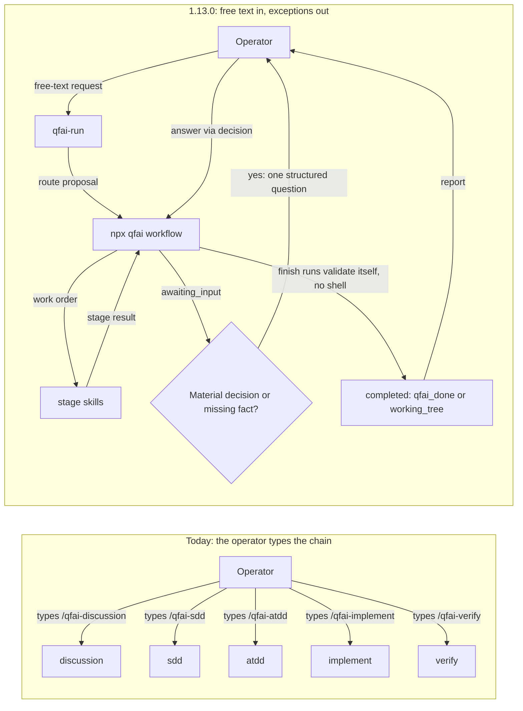

# 02 Inception Deck

"Design" means the design package SRC-0001 and its chapter numbers. "D1" to "D18" are the session's decisions, recorded in `99_delta.md`
`## Change History`. Where a decision and the design disagree, the decision holds.

## 1. Why Are We Here?

- Purpose: an operator should state a change once, in their own words, and have QFAI carry it to verified completion.
  Today the operator types `/qfai-discussion`, `/qfai-sdd`, `/qfai-atdd`, `/qfai-implement` and `/qfai-verify` in order (`01_Context.md` `## Background`).
  Each hand-off costs the operator's attention, and each stage re-reads context the previous stage already read.
- What does not change: QFAI's quality gates. The run chains the existing skills. It does not replace them, skip their reviews or invent approvals
  (REQ-0040, REQ-0041, REQ-0062).
- Why now: comparable tools already route a free-text request to a workflow (SRC-0029, SRC-0031, SRC-0032). The two hosts QFAI targets can run the
  shell commands and relay the questions such a run needs (Assumption 1 in `05_Scope.md`, confirmed per host by REQ-0058).

## 2. Elevator Pitch

- For: developers who use QFAI through Claude Code or Codex, and the maintainers who install it into their repositories
- Who: have to pick and type every stage skill themselves, and answer the same approval more than once
- The: intent-driven entry, the `qfai-run` skill with its `npx qfai workflow` control core
- Is a: request router and resumable workflow control core for QFAI's existing skills
- That: routes one free-text request to the smallest safe workflow, runs the stages to completion, and asks only on material decisions
- Unlike: a host-only workflow runtime (SRC-0024) or a router that keeps every stage competing for selection (SRC-0027)
- Our product: keeps run state, authorizations and receipts on disk under a deterministic CLI, so a run resumes after an interruption and a
  gate result cannot be asserted by the agent alone

## 3. Product Box (Feature highlights)

- Headline feature 1: "Say what you want changed." A free-text request is classified, routed to one of five routes and carried through the existing
  stages, with no stage name typed after the first prompt (REQ-0001, REQ-0005, REQ-0006; DSC-001).
- Headline feature 2: "Asked once, when it matters." A new capability is approved once, at routing, and `/qfai-sdd` does not ask again. Destructive,
  contract-breaking or boundary-loosening requests always stop for the operator (REQ-0008, REQ-0042; D5).
- Headline feature 3: "Pick up where it stopped." `npx qfai workflow resume` restores the run from its journal and continues at the smallest valid
  checkpoint, without re-running finished stages (REQ-0020, REQ-0030).

## 4. NOT List (Out of Scope)

Full list: `05_Scope.md` `## Out of Scope`.

| In Scope                                                                                                                                                                                                                                                      | Out of Scope                                                                             |
| ------------------------------------------------------------------------------------------------------------------------------------------------------------------------------------------------------------------------------------------------------------- | ---------------------------------------------------------------------------------------- |
| All five routes, including `direct` and the `qfai-maintain` skill, in 1.13.0 (D1)                                                                                                                                                                             | Releasing the routes one at a time; staged enablement is implementation order only (D1)  |
| Seven CLI operations: `start`, `next`, `accept`, `status`, `resume`, `decision`, `finish`                                                                                                                                                                     | An `exec` operation, a command-ID registry and Windows launcher adapters (D2)            |
| One routing-time CREATE question, recorded as a `human_decision` (D5)                                                                                                                                                                                         | The `intent_scoped_additive` policy that asked nothing (D5)                              |
| Bugfix by diagnose verdict: a missing-test row appended by `/qfai-sdd` (`sdd_append`); a regression caught by an existing test fixed in code with the `done` row kept `done` (`regression_fix`, D18); a test-defect fix that leaves status alone (`test_fix`) | A `defect-reopen` transition, `Repair-Ref` and the `repair_prepare` stage (D6, D13, D14) |
| Claude Code and Codex declared supported, each with an adapter test (D3)                                                                                                                                                                                      | A support claim for Copilot; it keeps the skills for manual use (D3)                     |
| Stage skill descriptions rewritten as trigger conditions (D15)                                                                                                                                                                                                | `disable-model-invocation` on stage skills; Codex `agents/openai.yaml` (D15)             |
| `active` mode by default, fail-closed on invariant violation or drift (D7)                                                                                                                                                                                    | Changing what `--auto` means (REQ-0044)                                                  |
| README rewrite in both copies (D16)                                                                                                                                                                                                                           | The 1.13.0 release edits, tag, publish and merge (F2)                                    |

## 5. Meet Your Neighbors (Stakeholders & Dependencies)

- Upstream dependencies:
  - the host harness, which runs the AI, the sub-agents and the shell commands; the CLI never launches an AI (REQ-0014, design 02 AD-01);
  - the existing stage skills and their phase order, which the run reuses unchanged (REQ-0034, REQ-0068);
  - the validator, which `finish` runs itself (REQ-0060), and the triage approval check it must now resolve (REQ-0043; SRC-0004, SRC-0005);
  - the seven specs that receive Change Requests: spec-0001, spec-0003, spec-0004, spec-0011, spec-0013, spec-0014, spec-0015 (D4). Whether
    spec-0008, spec-0010 and spec-0012 join them is OQ-0020, decided at `/qfai-sdd` triage.
- Downstream dependencies:
  - adopters, who receive the new skills, wrappers, plans and ignore entries through `qfai init` and upgrade (REQ-0064, REQ-0065);
  - the README in both copies, which becomes the operator's first description of the free-text entry (REQ-0067);
  - reviewers and qa-gatekeeper, whose independent PASS remains a completion condition (REQ-0040, REQ-0060).
- External integrations:
  - skill loading on Claude Code and Codex, which decides whether a free-text request reaches `qfai-run` at all (SRC-0023, SRC-0025);
  - the Agent Skills specification, which bounds the portable frontmatter (SRC-0022; BP-0008).

## 6. Show the Solution (Architecture Overview)

- High-level architecture: the AI judges intent and semantic impact; the CLI manages work orders, state transitions, artifact integrity and receipts
  (design 00, the basic structure). The harness runs everything that needs a model or a shell.
- Key components:

| Layer                 | Decides or does                                                              | Never does                                                 | Source                   |
| --------------------- | ---------------------------------------------------------------------------- | ---------------------------------------------------------- | ------------------------ |
| `qfai-run` (entry)    | Request kind, route proposal, scope, delegation, presenting results          | Draft or review a primary artifact; invent an approval     | REQ-0001, REQ-0054       |
| `npx qfai workflow`   | Scope checks, work orders, compare-and-set transitions, invalidation, finish | Understand a spec on its own; start an AI or a slash skill | REQ-0014, REQ-0026       |
| Existing stage skills | Their own phases, artifacts, delegation and independent review               | Widen the run's authority; edit another owner's artifact   | REQ-0034, REQ-0039       |
| Host harness          | Skill and sub-agent calls, relaying questions, running commands              | Rewrite policy; pretend to a capability it lacks           | REQ-0058                 |
| Validator and CI      | `npx qfai validate` observed by `finish`; repository gates via `verify.json` | Accept a gate the run narrowed or rewrote                  | REQ-0060, REQ-0062 (D10) |

Today the operator is the router. After the change the operator states the request, and is involved again only on an exception.

<!-- UX-INTENT: If UI-bearing, reference 04_Sources.md and uiux/40_screen_contracts.md for design direction alignment -->

The terminal surface this diagram implies — the questions, the `workflow` operations' JSON and exit contract, the mode setting — is specified in
`uiux/40_screen_contracts.md`. The comparable-tool signals behind it are in `04_Sources.md` `## Trend Scan`.

## 7. What Keeps Us Up at Night (Risks)

| Risk                                                                                                                              | Probability | Impact | Mitigation                                                                                                                                                                                                                                                                                   |
| --------------------------------------------------------------------------------------------------------------------------------- | ----------- | ------ | -------------------------------------------------------------------------------------------------------------------------------------------------------------------------------------------------------------------------------------------------------------------------------------------- |
| R1 Automatic skill selection is a host behaviour and does not reach `qfai-run` every time (design 02 AD-04)                       | medium      | medium | Trigger-condition descriptions and a short entry instruction (REQ-0050, REQ-0064); a stage skill reached without a work order hands over (REQ-0051); the routing eval measures it (DSC-004)                                                                                                  |
| R2 `active` by default (D7) changes behaviour for existing adopters on upgrade                                                    | medium      | high   | `off` and `shadow` stay available; fail-closed on invariant violation, unsupported capability or drift (REQ-0059); a user-modified manifest never activates silently (REQ-0065, DSC-008)                                                                                                     |
| R3 An agent-written approval is taken as a human one                                                                              | low         | high   | `decision` is the only path for a human answer and refuses agent approvals (REQ-0018); the validator resolves the authorization (REQ-0043); `--auto` stays a no-question mode (REQ-0044)                                                                                                     |
| R4 Repository gates stay on today's footing (D10): `verify.json` is written by an agent, not observed by the CLI                  | medium      | medium | `finish` runs the package's own validate itself, with no shell (DTC-7); an independent qa-gatekeeper PASS is required; each receipt records its trust level (REQ-0060); a narrowed gate never counts (REQ-0062)                                                                              |
| R5 `qfai-implement` and `qfai-atdd` bodies are one to three lines from the 800-line ceiling                                       | high        | medium | Orchestrated-mode rules go into one `references/orchestrated-mode.md` per skill, cited by one line (D12; REQ-0052, NFR-0003)                                                                                                                                                                 |
| R6 Token saving is unproven, and a router can raise the listed cost (SRC-0027, AP-0004)                                           | medium      | medium | DSC-009 is a candidate target, not a promise; measurement fields are recorded (NFR-0004); stage skills stay listed, so no listing saving is claimed                                                                                                                                          |
| R7 One release carries all twelve work packages (D1)                                                                              | high        | high   | Implementation order follows design 07 §5; the feature and bugfix vertical slices come first (design 10, the implementer's starting order); 24 fault-seed tests run on every pull request (REQ-0066)                                                                                         |
| R8 A crash or a second session corrupts run state, especially on Windows                                                          | medium      | high   | Journal with compare-and-set and atomic publish (REQ-0026); one writing run per worktree (REQ-0027); crash consistency and Windows parity (NFR-0010, NFR-0011; OQ-0012)                                                                                                                      |
| R9 D13 lets `/qfai-sdd` append a row with no Change Request document, which changes today's rule that new rows arrive through one | medium      | medium | The row cites the diagnosis evidence and AC and BR stay unchanged (REQ-0047); the implementer still cannot seed rows; the rule change is carried by the Change Request to spec-0013 (`qfai-sdd` Phase 2b) and by edits to the shipped `drift-protocol.md` and `change-request-reset.md` (D4) |
| R10 A host changes how skills are selected or invoked after release                                                               | medium      | medium | Re-verification on a host or model change (NFR-0018); the adapter probe fails closed for a missing capability (REQ-0058)                                                                                                                                                                     |

## 8. Size It Up (Effort & Timeline)

- Estimated effort: twelve work packages (design 07 §1, WP-01 to WP-12) in one minor release. WP-03, WP-04 and WP-05 shrink under D2, D5, D6 and
  D13 (`99_delta.md` `## Consequences for the Design Package`). Two new skills, one new CLI command family, changes to seven specs.
- Target timeline: no release date was set. The planning dates for the `/qfai-sdd` run are in `13_Deferred.md`. The release is gated by the manual
  real-model routing eval on both hosts (REQ-0066, DSC-004), not by a date.

## 9. What's Going to Give (Trade-offs)

| Dimension | Priority | Notes                                                                                                                        |
| --------- | -------- | ---------------------------------------------------------------------------------------------------------------------------- |
| Quality   | 1        | No gate, review or approval is loosened to save questions or tokens (REQ-0040, REQ-0062; NFR-0005)                           |
| Scope     | 2        | Fixed by D1: the whole design ships in 1.13.0. Scope reductions go through a Change Request, not a quiet cut                 |
| Time      | 3        | Gives first: the release waits for the safety cases and the routing eval rather than shipping on a date                      |
| Budget    | 4        | Paid real-model evaluation runs once as a release gate, not on every pull request (D8); the token target is a candidate only |

## 10. What's It Going to Take (Team & Resources)

- Required skills: TypeScript CLI work (state machine, journal, locking), skill authoring for two hosts, validator changes, test design for fault
  seeds, and technical writing for the README.
- Team composition, by role in `.qfai/assistant/manifest/agent-catalog.yml`:
  - `solution-architect` for the `workflow` CLI contract and run state;
  - `requirements-analyst` and `test-design-analyst` for the new spec and the Change Requests;
  - `backend-engineer` for the control core and validator changes, `acceptance-test-engineer` for the fault-seed tests;
  - `doc-steward` for the README and skill references, `devops-ci-engineer` for the per-pull-request fault-seed lane;
  - `requirements-reviewer`, `architecture-reviewer`, `implementation-reviewer`, `product-surface-reviewer`, `qa-gatekeeper` as independent reviewers.
- Infrastructure:
  - the existing CI, which runs every job on Linux only: each `runs-on` in `.github/workflows/*.yml` is `ubuntu-latest`, and the Windows lane
    is a deferred TODO at `.github/workflows/ci.yml:312-317`; how Windows results are obtained is OQ-0012;
  - a scratch adopter repository for fresh-install and upgrade checks (design 07 §7);
  - access to Claude Code and Codex for the release-gate routing eval.
