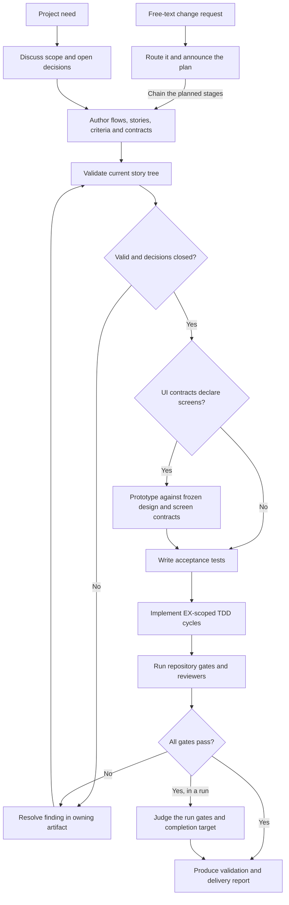

# BF-0001: Develop and verify a QFAI project

## Purpose

Take a project need through discussion, story and contract authoring, acceptance
tests, implementation, verification and a report. The current story tree and
contracts are the execution source; discussion records the decisions that led
to them.

## Flow

## Alternate and exception paths

- Missing usable discussion source stops SDD until the source is supplied.
- An open product decision returns to discussion and SDD before implementation.
- UI work requires its declared screen contracts and frozen design inputs;
  missing inputs stop prototyping and UI validation.
- A failed validation or reviewer gate returns to the artifact that owns the
  finding. Completion is recorded only after the relevant gate passes.
- A free-text change request in mode `active` is routed by `qfai-run` and
  driven through `npx qfai workflow`, which chains the planned stages with no
  stage typed by the operator and ends at `finish`. A new story, and each change
  a story-authoring stage makes to the tree, wait for the operator's approval.
  A request that is not a change, or a mode of `off` or `shadow`, starts no run.
- A scope change discovered after an accepted implementation item follows the
  drift protocol through SDD before another item is selected.
