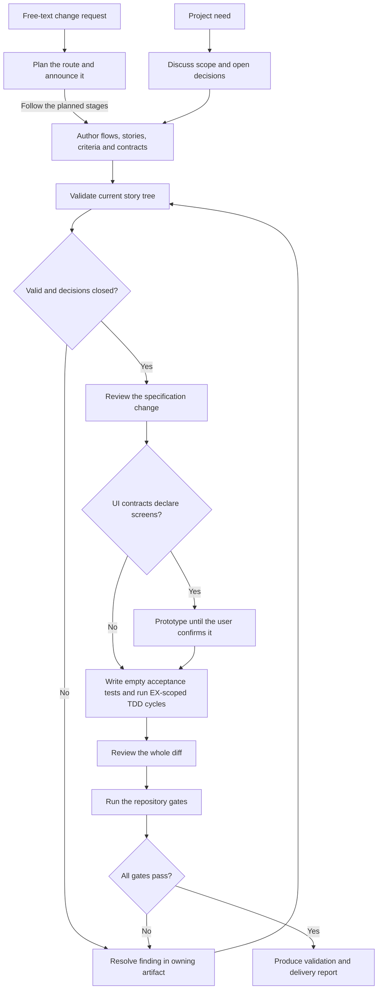

# BF-0001: Develop and verify a QFAI project

## Purpose

Take a project need through discussion, story and contract authoring,
implementation with its acceptance tests, verification and a report. The
current story tree and contracts are the execution source; discussion records
the decisions that led to them.

## Flow

```mermaid
flowchart TD
  Need[Project need] --> Discuss[Discuss scope and open decisions]
  Request[Free-text change request] --> Route[Plan the route and announce it]
  Route -->|Follow the planned stages| SDD
  Discuss --> SDD[Author flows, stories, criteria and contracts]
  SDD --> Validate[Validate current story tree]
  Validate --> Ready{Valid and decisions closed?}
  Ready -->|No| Repair[Resolve finding in owning artifact]
  Repair --> Validate
  Ready -->|Yes| SpecReview[Review the specification change]
  SpecReview --> UI{UI contracts declare screens?}
  UI -->|Yes| Prototype[Prototype until the user confirms it]
  UI -->|No| Implement[Write empty acceptance tests and run EX-scoped TDD cycles]
  Prototype --> Implement
  Implement --> CodeReview[Review the whole diff]
  CodeReview --> Verify[Run the repository gates]
  Verify --> Gate{All gates pass?}
  Gate -->|No| Repair
  Gate -->|Yes| Report[Produce validation and delivery report]
```

## Alternate and exception paths

- Missing usable discussion source stops SDD until the source is supplied.
- An open product decision returns to discussion and SDD before implementation.
- UI work requires its declared screen contracts and root `DESIGN.md`;
  prototyping completes when the user confirms the prototype.
- A failed validation, review or gate returns to the artifact that owns the
  finding. Completion is reported only after the relevant gate passes.
- A free-text change request in mode `active` is planned by `qfai-run` with
  `npx qfai workflow plan`, and the session follows the planned stages with no
  stage typed by the user. A critical decision, each change to the story tree
  and each release wait for the user's approval. Text that is not a request, or
  a mode of `off` or `shadow`, is not planned.
- Fixed decision rules choose the route from the facts read out of the request.
  A request that needs no change runs a route that answers, closes, splits or
  hands it back and writes nothing. A diagnosis showing the work is on the wrong
  route moves it, at a branch point the route declares, to the route that fits.
- A request to write the acceptance tests of a flow runs the quality-phase
  route, which writes the bodies of the empty acceptance tests.
- A scope change discovered after an accepted implementation item follows the
  drift protocol through SDD before another item is selected.
