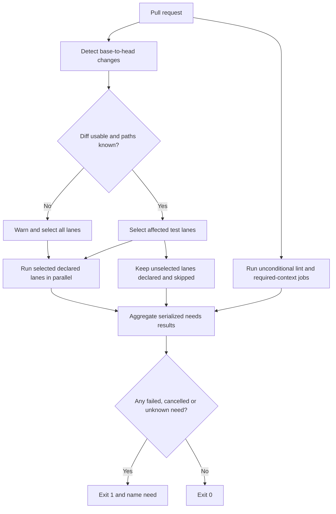

# BF-0002: Run and assess pull request CI

## Purpose

Select the required CI lanes for a pull request, keep every declared check
visible, and derive one verdict from the results of its dependencies.

## Flow

## Alternate and exception paths

- A documentation-only change selects no test lane; unconditional checks still
  run and the verdict remains reachable.
- A shallow clone, missing base reference or unknown path warns and selects
  every lane. It does not claim that an unavailable diff proves safety.
- A skipped job remains declared, preserving its check name without consuming
  a runner for that lane.
- Package-manager resolution or install failure stops its lane. A failing,
  cancelled or unrecognized dependency state makes the aggregate verdict fail.
- Repository-owned CI requirements live in `03_contract/tech.md`; rules for
  workflows shipped to adopters live in `cli/shipped-workflows.md`.
