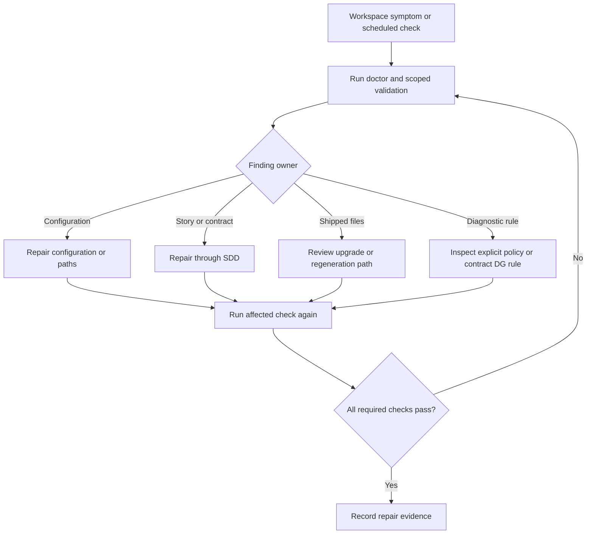

# BF-0003: Diagnose and repair a QFAI workspace

## Purpose

Give a project operator a repeatable way to identify configuration, layout,
contract and shipped-workflow drift, then verify a targeted repair.

## Flow

## Alternate and exception paths

- A malformed configuration or missing path produces an actionable finding;
  no diagnostic silently supplies an unverified value.
- `--fail-on error` passes when findings are warnings only;
  `--fail-on warning` fails when any warning is present.
- Guardrails output derives from explicit DG entries in policy or contract
  artifacts. An absent action or unreadable path returns its documented error
  rather than an empty successful result.
- Automatic remediation requires its documented safety boundary and a
  confirming second check. An unresolved source decision returns to SDD.
