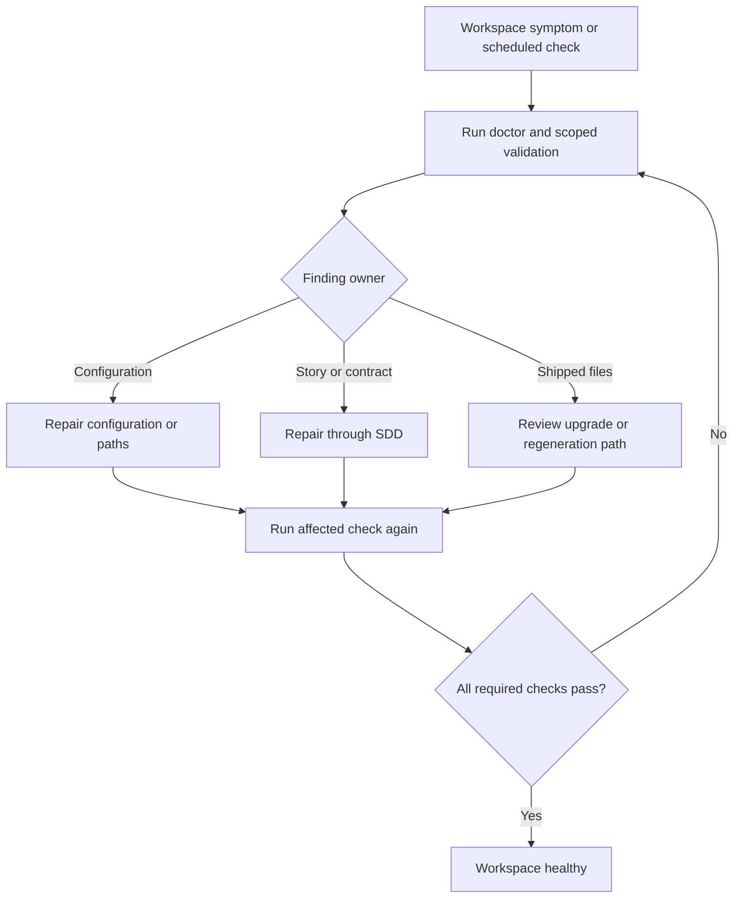

# BF-0003: Diagnose and repair a QFAI workspace

## Purpose

Give a project operator a repeatable way to identify configuration, layout,
contract and shipped-workflow problems, then verify a targeted repair.

## Flow

```mermaid
flowchart TD
  Symptom[Workspace symptom or scheduled check] --> Diagnose[Run doctor and scoped validation]
  Diagnose --> Classify{Finding owner}
  Classify -->|Configuration| Config[Repair configuration or paths]
  Classify -->|Story or contract| SDD[Repair through SDD]
  Classify -->|Shipped files| Upgrade[Review upgrade or regeneration path]
  Config --> Recheck[Run affected check again]
  SDD --> Recheck
  Upgrade --> Recheck
  Recheck --> Result{All required checks pass?}
  Result -->|No| Diagnose
  Result -->|Yes| Done[Workspace healthy]
```

## Alternate and exception paths

- A malformed configuration or missing path produces an actionable finding;
  no diagnostic silently supplies an unverified value.
- `--fail-on error` passes when findings are warnings only;
  `--fail-on warning` fails when any warning is present.
- Automatic remediation requires its documented safety boundary and a
  confirming second check. An unresolved source decision returns to SDD.
