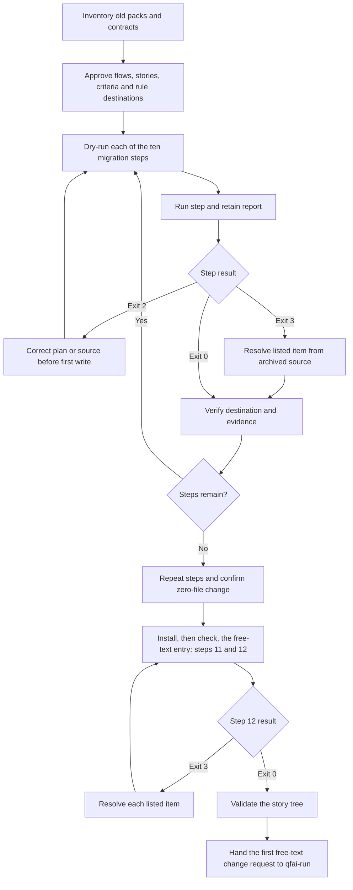

# BF-0004: Migrate a spec-pack project to the story tree

## Purpose

Move an old layered spec-pack project to business flows, stories, criteria,
examples and contracts while retaining every unresolved source and a stable
old-to-new ID record.

## Flow

## Alternate and exception paths

- A dry run writes no files. Exit 2 identifies a blocked operation and stops
  before the step's first write.
- Exit 3 lists source paths and unresolved items under `For a person`. The
  source stays in the old pack or retired archive until a person resolves it.
- Step 4 writes the ID map once. A later plan cannot move or add an item that
  disagrees with that map; resolution proceeds in the migrated tree through
  SDD, with the old source retained as evidence.
- Re-running any completed step changes zero files. A partial run resumes
  under the same plan and retained report.
- The migration ends when `qfai validate` on the story tree reports no
  layout or chain error, with every item listed for a person resolved.

The ordered steps are directory rename, decision-table merge, catalog move,
ID renumbering, TC-only case conversion, EX criterion derivation, rule move,
test-annotation rewrite, host-link repointing and gitignore update. The
step-4 ID map binds every later step to the approved plan.

Steps 11 and 12 then install and check the free-text entry. Step 11 brings the
shipped skills, their host links, the entry directive and the managed
`.gitignore` block up to the installed package, archiving a customised skill
rather than losing it. Step 12 writes nothing and lists for a person every
check `npx qfai workflow start` would fail, so the project's first free-text
change request can go to `qfai-run`.
