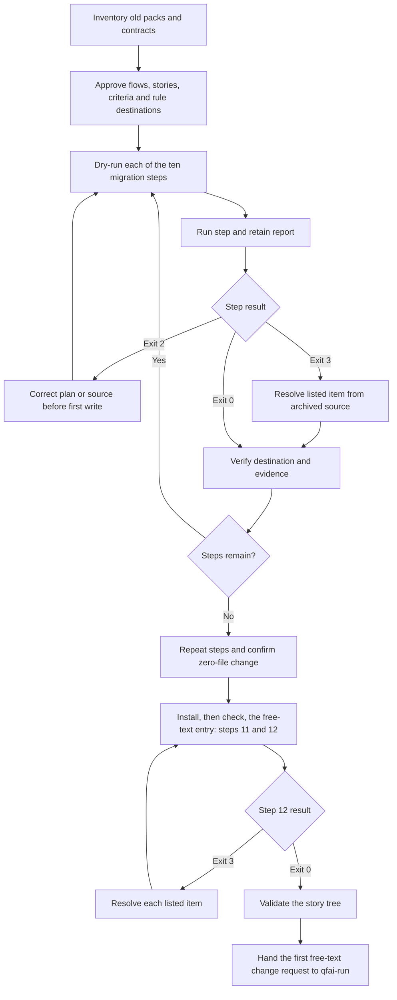

# BF-0004: Migrate a spec-pack project to the story tree

## Purpose

Move an old layered spec-pack project to business flows, stories, criteria,
examples and contracts while retaining every unresolved source and a stable
old-to-new ID record.

## Flow

```mermaid
flowchart TD
  Inventory[Inventory old packs and contracts] --> Plan[Approve flows, stories, criteria and rule destinations]
  Plan --> Dry[Dry-run each of the ten migration steps]
  Dry --> Apply[Run step and retain report]
  Apply --> Check{Step result}
  Check -->|Exit 2| Correct[Correct plan or source before first write]
  Correct --> Dry
  Check -->|Exit 3| Person[Resolve listed item from archived source]
  Person --> Verify[Verify destination and evidence]
  Check -->|Exit 0| Verify
  Verify --> More{Steps remain?}
  More -->|Yes| Dry
  More -->|No| Recheck[Repeat steps and confirm zero-file change]
  Recheck --> Entry[Install, then check, the free-text entry: steps 11 and 12]
  Entry --> EntryCheck{Step 12 result}
  EntryCheck -->|Exit 3| Resolve[Resolve each listed item]
  Resolve --> Entry
  EntryCheck -->|Exit 0| Validate[Validate the story tree]
  Validate --> Handover[Hand the first free-text change request to qfai-run]
```

## Alternate and exception paths

- A dry run writes no files but its report file. Exit 2 identifies a blocked
  operation and stops before the step's first write.
- Exit 3 lists source paths and unresolved items under `For a person`. The
  source stays in the old pack or retired archive until a person resolves it.
- Step 4 writes the ID map once. A later plan cannot move or add an item that
  disagrees with that map; resolution proceeds in the migrated tree through
  SDD, with the old source retained as evidence.
- Re-running any completed step changes zero files but its report file. A
  partial run resumes under the same plan and retained report.
- The migration ends when `qfai validate` on the story tree reports no
  layout or chain error, with every item listed for a person resolved.
- Step 11 moves a customised skill or step into the migration archive before
  replacing it. A host link path it does not own stays as it was and is listed
  for a person.
- Step 12 writes nothing but its report file and lists for a person every check
  `npx qfai workflow start` would fail. The first free-text change request goes
  to `qfai-run` once none is left.
