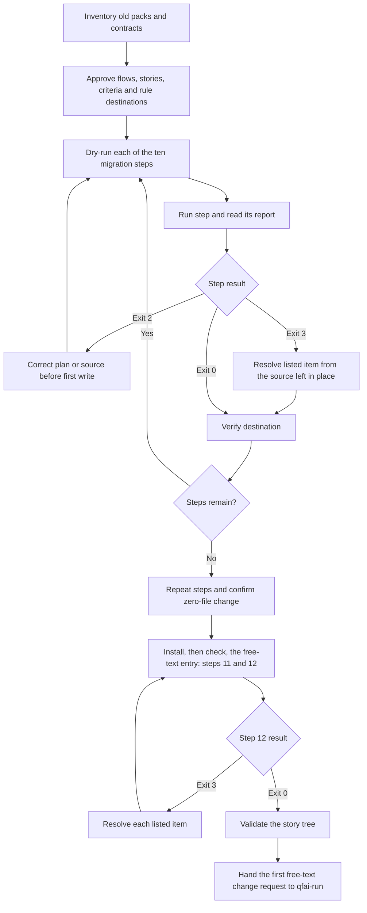

# BF-0004: Migrate a spec-pack project to the story tree

## Purpose

Move an old layered spec-pack project to business flows, stories, criteria,
examples and contracts, keeping every unresolved source in place and a stable
old-to-new ID record. A file the migration deletes survives only where git
history held it.

## Flow

```mermaid
flowchart TD
  Inventory[Inventory old packs and contracts] --> Plan[Approve flows, stories, criteria and rule destinations]
  Plan --> Dry[Dry-run each of the ten migration steps]
  Dry --> Apply[Run step and read its report]
  Apply --> Check{Step result}
  Check -->|Exit 2| Correct[Correct plan or source before first write]
  Correct --> Dry
  Check -->|Exit 3| Person[Resolve listed item from the source left in place]
  Person --> Verify[Verify destination]
  Check -->|Exit 0| Verify
  Verify --> More{Steps remain?}
  More -->|Yes| Dry
  More -->|No| Recheck[Repeat steps and confirm zero-file change]
  Recheck --> Entry[Install, then check, the free-text entry: steps 11 and 12]
  Entry --> EntryCheck{Step 12 result}
  EntryCheck -->|Exit 3| Resolve[Resolve each listed item]
  Resolve --> Entry
  EntryCheck -->|Exit 0| Validate[Validate the story tree]
  Validate --> Handover[Hand the first free-text change request to qfai-run]
```

## Alternate and exception paths

- A dry run writes no file. Exit 2 identifies a blocked operation and stops
  before the step's first write.
- Exit 3 lists source paths and unresolved items under `For a person`. The
  source stays in the old pack until a person resolves it.
- A source with no destination is deleted, an untracked file and an
  uncommitted edit included; the person is told so before the first real run.
- Step 4 writes the ID map once, under `tmp/qfai-migration/`. A later plan
  cannot move or add an item that disagrees with that map; resolution proceeds
  in the migrated tree through SDD.
- Re-running any completed step changes zero files.
- The migration ends when `qfai validate` on the story tree reports no layout or
  chain error, with every item listed for a person resolved.
- Step 11 replaces a customised skill or step with the package's copy. A host
  link path it does not own stays as it was and is listed for a person.
- Step 12 writes nothing and lists for a person every check a shipped plan
  would fail. The first free-text change request goes to `qfai-run` once none
  is left.
