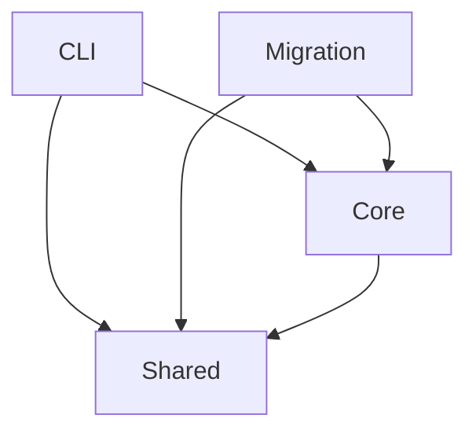

# Technology

## Stack

| Component | Choice |
| --- | --- |
| Runtime | Node.js `>=20.19.0` (`packages/qfai/package.json#engines`) |
| Platform | Linux and Windows; CI runs the suite on Linux and a Windows parity subset |
| CI | GitHub Actions (`.github/workflows/`) |
| Language | TypeScript 6 (`^6.0.3`), compiled to ESM and CommonJS |
| Package manager | pnpm 12.8.2 (root `package.json#packageManager`) |
| Build tool | tsup 8 (`^8.3.5`) |
| Test runner | Vitest 4 (`^4.1.11`), one project per test layer |
| Lint / format | ESLint 10 and Prettier 3 |
| CSS framework | None: the package is a command-line tool with no user interface |
| Component catalogue | None: the package is a command-line tool with no user interface |

## Architecture

| Layer | Responsibility | Depends on |
| --- | --- | --- |
| CLI | The commands: each parses its arguments and composes Core | Core, Shared |
| Migration | The 1.x to 2.x migration steps, which the migration skill calls as a library function | Core, Shared |
| Core | Reads, validates and reports on the story tree and its contracts; also the library surface | Shared |
| Shared | Small helpers: text, bundled assets and bounded reads | - |

## Dependencies

- `yaml`
  - Parses the configuration and every contract stub the validators read.
- `fast-glob`
  - Finds the files every scan walks.
- `@cucumber/gherkin`
  - Parses the Gherkin blocks in acceptance documents with Cucumber's own grammar.
- `@cucumber/messages`
  - Supplies the message types the Gherkin parser returns.
- `jsdom`
  - Gives the diagram lane a DOM to render Mermaid in, to check each diagram parses.

## Standard commands (copy-paste)

- Install: `pnpm install --frozen-lockfile`
- Format: `pnpm format:check`
- Test: `pnpm -C packages/qfai test`
- Lint: `pnpm lint`
- Typecheck: `pnpm check-types`
- Build: `pnpm build`
- Skeleton: `qfai` -> `node scripts/smoke-qfai-cli.mjs`
- Validate: `pnpm build && node scripts/check-dogfood-backlog.mjs --profile full`
- Pack / distribution: `pnpm verify:pack`
