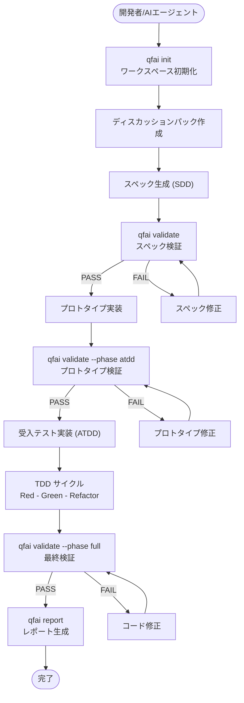
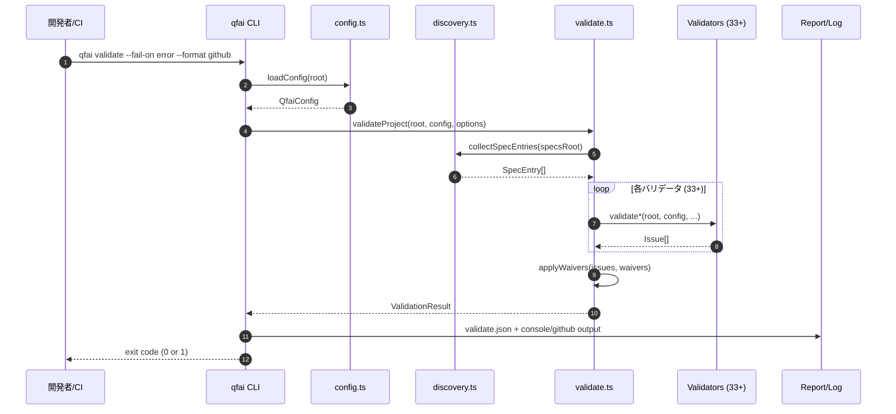
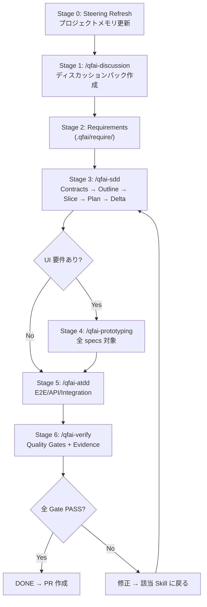
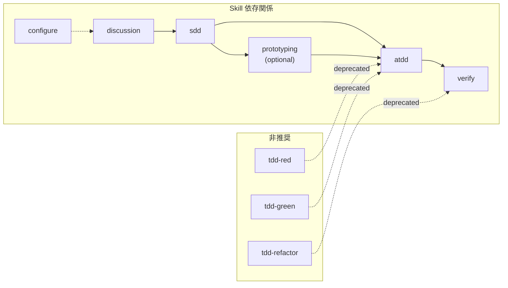
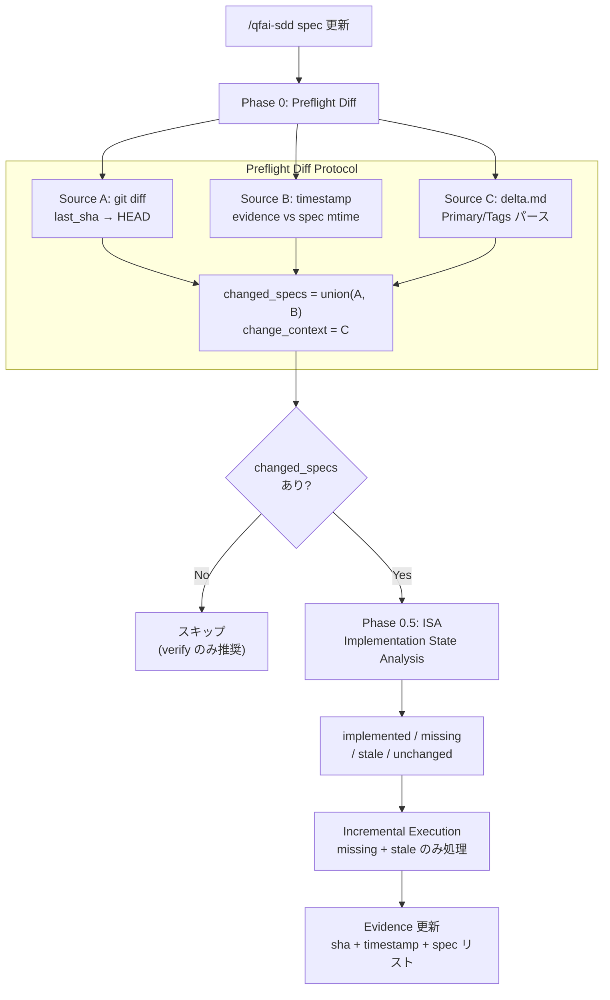
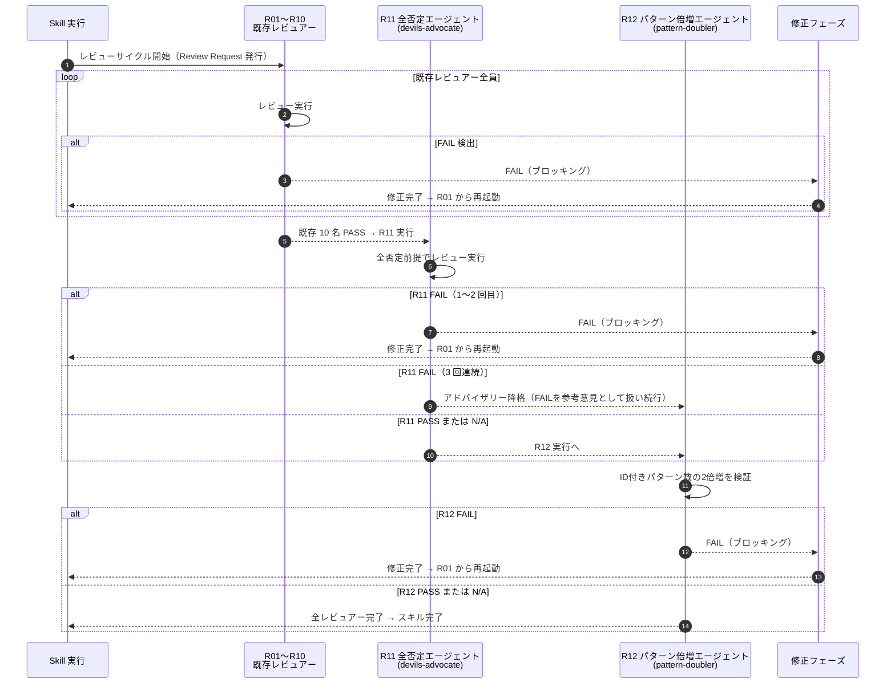

# 04 Business Flow

## Purpose

- QFAI CLI ツールの高レベルビジネスプロセスをポリシーレイヤーの SSOT として記述する。
- 受入シナリオの詳細は各 `spec-XXXX/03_Acceptance-Criteria.md` に記載する。

## Actors / Systems

- Actor: 開発者 / AI コーディングエージェント / CI/CD パイプライン
- System: QFAI CLI

## Preconditions

- Node.js >= 18.0.0 がインストールされていること
- プロジェクトルートに `qfai.config.yaml` が存在すること（`qfai init` 後）

## Flow Overview

1. 開発者または AI エージェントが `qfai init` でワークスペースを初期化する
2. ディスカッションパック（15ファイル）を作成し、要件を整理する
3. スペック（SDD）を生成する
4. `qfai validate` でスペックを検証し、問題があれば修正する
5. プロトタイプを実装し、`qfai validate --phase atdd` で検証する
6. 受入テスト（ATDD）を実装する
7. TDD サイクル（Red -> Green -> Refactor）でコードを実装する
8. `qfai validate --phase full` で最終検証する
9. `qfai report` でレポートを生成する

## Diagram (Mermaid required)

## Alternate / Exception Flows

- ALT-01: ウェイバーが設定されている場合、該当ルールの issue は suppress または downgrade される
- ALT-02: `--phase` オプションにより、バリデーション対象を限定できる（full/atdd/tdd/refinement）
- EX-01: 設定ファイル不在の場合、`qfai doctor` で診断を推奨するエラーメッセージを表示
- EX-02: テストディレクトリが存在しない場合、ATDD チェックはスキップされる

## Canonical Workflow Stages (Assistant Framework)

QFAI の Assistant Framework は以下の 7 ステージで構成される Canonical Workflow を定義する。

### Drift Recovery Flow

下流フェーズで upstream SSOT との不整合を検出した場合:

1. STOP — 下流の編集を即座に停止
2. Change Request 作成（context, 3+ 選択肢, 推奨, 影響範囲）
3. ユーザー承認を待機
4. Owner skill rerun で upstream を修正
5. 下流の作業を再開

### Review Cycle Flow

Skill 完了後:

1. Review Request 発行
2. Roster 順に全 reviewer を実行
3. FAIL 検出 → 修正 → 新 review-pack → roster 先頭から再実行
4. 全 reviewer PASS（または valid N/A）で完了

## SDP Incremental Flow (v1.5.5)

Spec 更新後の下流スキル実行時、SDP によりインクリメンタル処理が行われる。

- `/qfai-prototyping`: changed_specs のスケルトンのみ更新。unchanged は Runtime Gate 検証のみ。
- `/qfai-atdd`: missing obligations の新規テスト生成 + stale obligations のテスト更新。unchanged はスキップ。
- `/qfai-verify`: SDP 適用外。常にフルスキャン。

## Notes

- CLI ツールのため画面モックは対象外。
- `qfai report --format md` の出力がレポートの主要な可読形式となる。

## v1.5.6 レビューサイクルフロー（拡張レビュアー）

v1.5.6 では既存 10 名のレビュアー（R01〜R10）に加え、R11 全否定エージェントと R12 パターン倍増エージェントが追加された。

### レビューサイクルルール（v1.5.6 追加分）

- R11（全否定エージェント）はこじつけ・屁理屈・全否定でレビューし、FAIL を発行できる（ブロッキング）。
- R11 が 3 回連続で FAIL を発行した場合、アドバイザリー降格が適用され、以降 R11 の FAIL は参考意見として扱われる（スキル完了をブロックしない）。
- R12（パターン倍増エージェント）は全 skill 共通。ID 付き項目数が目標（現在数の 2 倍）に達しない場合に FAIL を発行できる（ブロッキング）。R12 は成果物に ID 付き項目が存在しない場合は N/A とする。
- 既存 R01〜R10 の設定変更は禁止。いずれかの FAIL → 修正 → R01 からの再起動は v1.5.5 以前と同一。

## v1.5.7 UI/UX 定義ライフサイクルフロー

v1.5.7 では CAP-0013 として UI/UX 定義・レビュー体系が導入される。UI 定義 3 点セット（Design Token + HTML+CSS Visual Mock + Mermaid 画面遷移図）の作成から下流 skill での消費・レビューまでの一連のフローを定義する。

