# 04 Business Flow

## Purpose

- QFAI CLI ツールの高レベルビジネスプロセスをポリシーレイヤーの SSOT として記述する。
- 受入シナリオの詳細は各 `spec-XXXX/03_Acceptance-Criteria.md` に記載する。

## Actors / Systems

- Actor: 開発者 / AI コーディングエージェント / CI/CD パイプライン
- System: QFAI CLI

## Preconditions

- Node.js >= 18.0.0 がインストールされていること
- プロジェクトルートに `qfai.config.yaml` が存在すること（`qfai init` 後）

## Flow Overview

1. 開発者または AI エージェントが `qfai init` でワークスペースを初期化する
2. ディスカッションパック（15ファイル）を作成し、要件を整理する
3. スペック（SDD）を生成する
4. `qfai validate` でスペックを検証し、問題があれば修正する
5. プロトタイプを実装し、`qfai validate --phase atdd` で検証する
6. 受入テスト（ATDD）を実装する
7. TDD サイクル（Red -> Green -> Refactor）でコードを実装する
8. `qfai validate --phase full` で最終検証する
9. `qfai report` でレポートを生成する

## Diagram (Mermaid required)


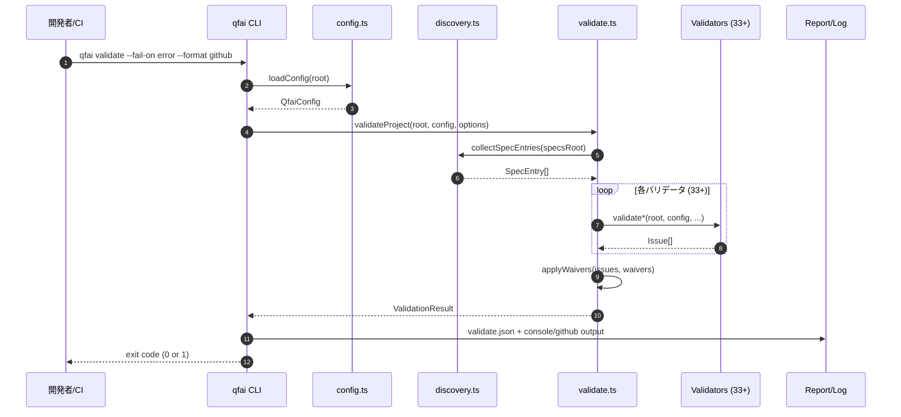

## Alternate / Exception Flows

- ALT-01: ウェイバーが設定されている場合、該当ルールの issue は suppress または downgrade される
- ALT-02: `--phase` オプションにより、バリデーション対象を限定できる（full/atdd/tdd/refinement）
- EX-01: 設定ファイル不在の場合、`qfai doctor` で診断を推奨するエラーメッセージを表示
- EX-02: テストディレクトリが存在しない場合、ATDD チェックはスキップされる

## Canonical Workflow Stages (Assistant Framework)

QFAI の Assistant Framework は以下の 7 ステージで構成される Canonical Workflow を定義する。

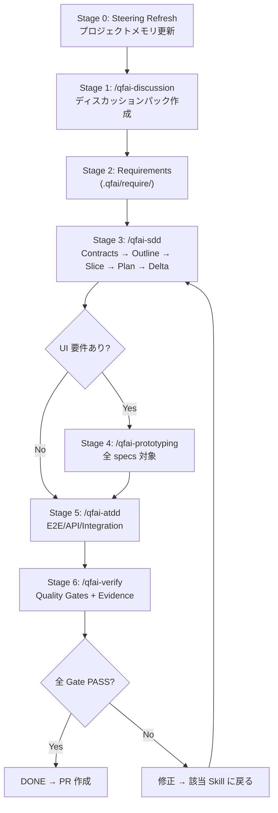

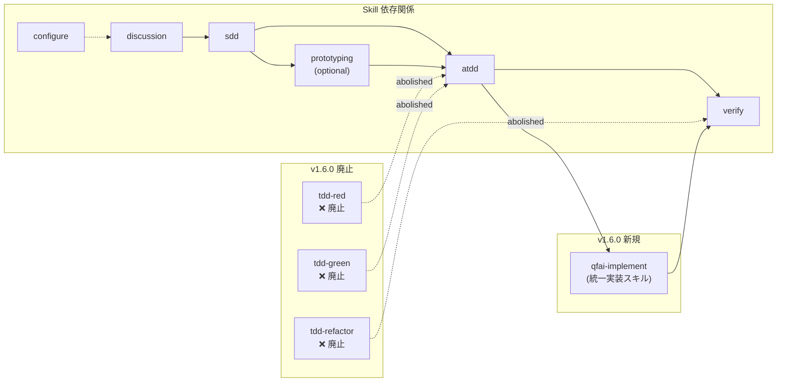

### Drift Recovery Flow

下流フェーズで upstream SSOT との不整合を検出した場合:

1. STOP — 下流の編集を即座に停止
2. Change Request 作成（context, 3+ 選択肢, 推奨, 影響範囲）
3. ユーザー承認を待機
4. Owner skill rerun で upstream を修正
5. 下流の作業を再開

### Review Cycle Flow

Skill 完了後:

1. Review Request 発行
2. Roster 順に全 reviewer を実行
3. FAIL 検出 → 修正 → 新 review-pack → roster 先頭から再実行
4. 全 reviewer PASS（または valid N/A）で完了

## SDP Incremental Flow (v1.5.5)

Spec 更新後の下流スキル実行時、SDP によりインクリメンタル処理が行われる。

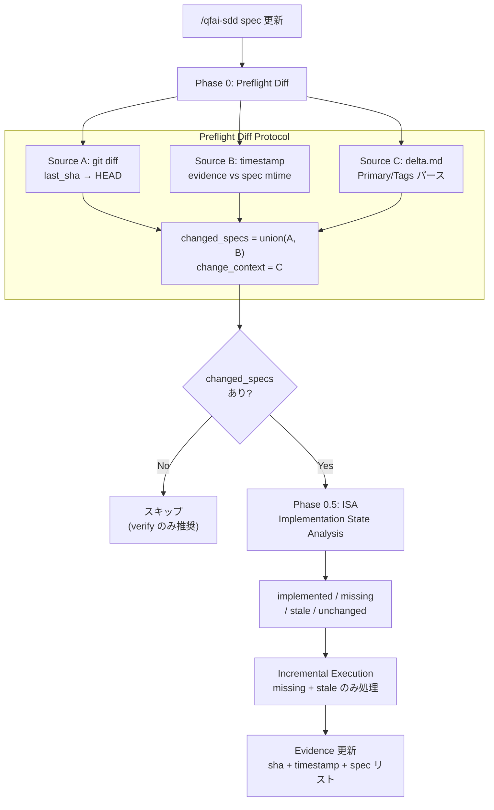

- `/qfai-prototyping`: changed_specs のスケルトンのみ更新。unchanged は Runtime Gate 検証のみ。
- `/qfai-atdd`: missing obligations の新規テスト生成 + stale obligations のテスト更新。unchanged はスキップ。
- `/qfai-verify`: SDP 適用外。常にフルスキャン。

## Notes

- CLI ツールのため画面モックは対象外。
- `qfai report --format md` の出力がレポートの主要な可読形式となる。

## v1.5.6 レビューサイクルフロー（拡張レビュアー）

v1.5.6 では既存 10 名のレビュアー（R01〜R10）に加え、R11 全否定エージェントと R12 パターン倍増エージェントが追加された。

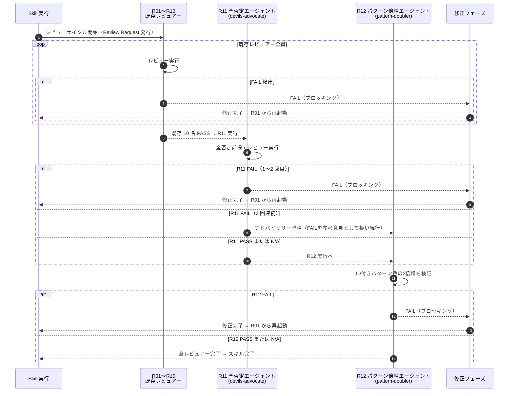

### レビューサイクルルール（v1.5.6 追加分）

- R11（全否定エージェント）はこじつけ・屁理屈・全否定でレビューし、FAIL を発行できる（ブロッキング）。
- R11 が 3 回連続で FAIL を発行した場合、アドバイザリー降格が適用され、以降 R11 の FAIL は参考意見として扱われる（スキル完了をブロックしない）。
- R12（パターン倍増エージェント）は全 skill 共通。ID 付き項目数が目標（現在数の 2 倍）に達しない場合に FAIL を発行できる（ブロッキング）。R12 は成果物に ID 付き項目が存在しない場合は N/A とする。
- 既存 R01〜R10 の設定変更は禁止。いずれかの FAIL → 修正 → R01 からの再起動は v1.5.5 以前と同一。

## v1.5.7 UI/UX 定義ライフサイクルフロー

v1.5.7 では CAP-0013 として UI/UX 定義・レビュー体系が導入される。UI 定義 3 点セット（Design Token + HTML+CSS Visual Mock + Mermaid 画面遷移図）の作成から下流 skill での消費・レビューまでの一連のフローを定義する。

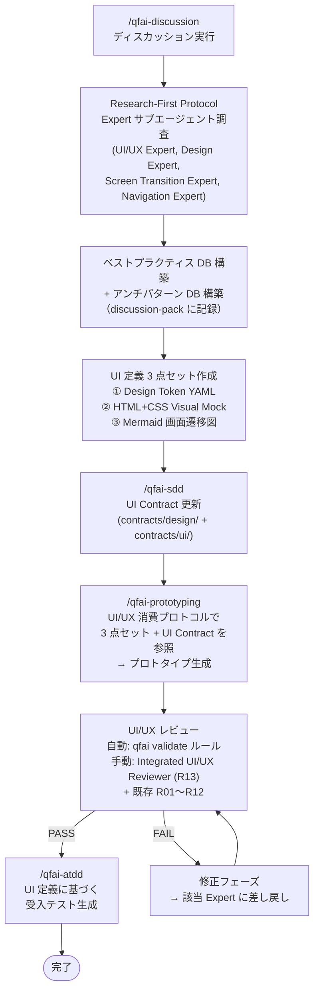

## v1.6.2 qfai-implement サブエージェントオーケストレーション

v1.6.2 では CAP-0016 として `qfai-implement` の内部オーケストレーション層が堅牢化される。サブエージェントロスターの形式化、完了/エビデンス/並列コントラクトの導入、および Docs/Wrappers/Assets テスト同期が実施される。

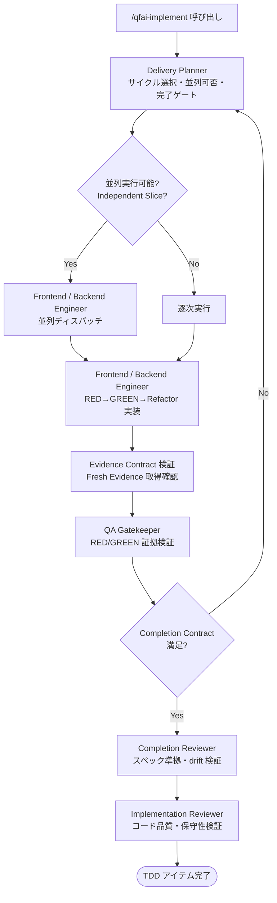

- `Delivery Planner`: qfai-implement におけるマスターオーケストレーター。サイクル選択・並列可否・完了ゲートを管理する。
- `Completion Contract`: アイテム/スペック単位で完了判定条件を定義し、未完了での前進を防止する。
- `Evidence Contract`: TDD アイテムごとの Fresh Evidence 最低要件を定義し、stale evidence を拒否する。
- `Independent Slice`: 共有状態のない独立スライスのみ並列実行可能（DR-0016 制約継続）。

## v1.6.5 Design Direction ライフサイクルフロー

v1.6.5 では CAP-0019〜CAP-0022 として Design Direction Pack（DDP）を起点とした UI 品質強化ライフサイクルが導入される。DDP 作成からフィデリティ評価までの一連のフローを定義する。

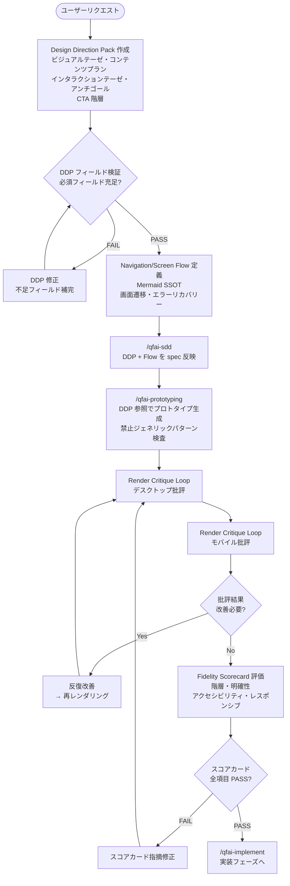

## v1.7.0 ディスカッション設計強化フロー

v1.7.0 では CAP-0023 として、UI-bearing ディスカッションパックに対する設計方向性の強制検証が導入される。

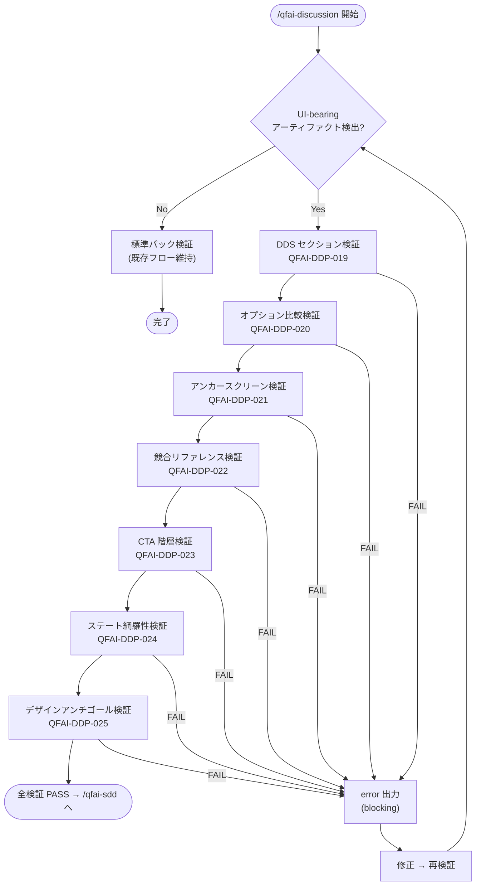

## v1.7.2 Design Audit & Slop Guardrails フロー

v1.7.2 では CAP-0025 として、`qfai validate` パイプラインに静的 design audit と AI slop guardrails を統合する。

### Actors / Systems

- Actor: 開発者 / AI コーディングエージェント / CI/CD パイプライン
- System: QFAI CLI (`qfai validate`)
- Validators: designAudit.ts, designSlop.ts

### Preconditions

- UI-bearing discussion pack が存在すること
- config.uiux.audit.enabled が true であること（デフォルト）

### v1.7.2 Validate Pipeline Flow

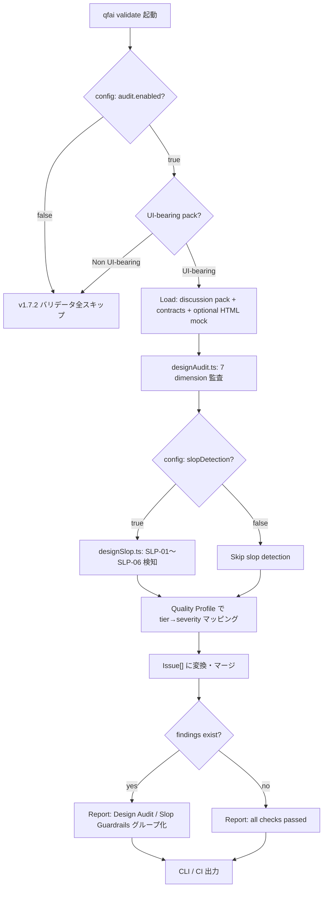

### Audit Dimensions

designAudit.ts は以下の 7 dimension で静的監査を実行する:

1. **tokenDiscipline** — design token 遵守度
2. **visualHierarchy** — CTA・見出しの階層妥当性
3. **stateCoverage** — empty/error/loading/skeleton 状態網羅性
4. **densityBalance** — 情報密度・余白バランス
5. **referenceTranslation** — リファレンス翻訳精度
6. **antiPatternRisk** — アンチパターン一致度
7. **flowClarity** — 画面遷移・操作フロー明確性

### Slop Categories

designSlop.ts は designSlopPatterns.json のルール定義に基づき以下を検知する:

- SLP-01: Generic AI SaaS shell
- SLP-02: Over-decoration without task support
- SLP-03: Missing state realism
- SLP-04: CTA inflation
- SLP-05: Token bypass
- SLP-06: Reference cargo-culting

### Severity Mapping

| Quality Profile | Tier 1 (structural-blocking) | Tier 2 (strong-advisory) | Tier 3 (style-heuristic) |
| --------------- | ---------------------------- | ------------------------ | ------------------------ |
| default         | error                        | warning                  | info/warning             |
| high            | error                        | warning                  | warning                  |
| strict          | error                        | error                    | warning                  |

## v1.7.3 Discussion/UIUX Authoring Flow

qfai-discussion が UI-bearing プロジェクトを検出した場合、標準15ファイルパックに加えて `uiux/` サイドカーディレクトリを生成する。

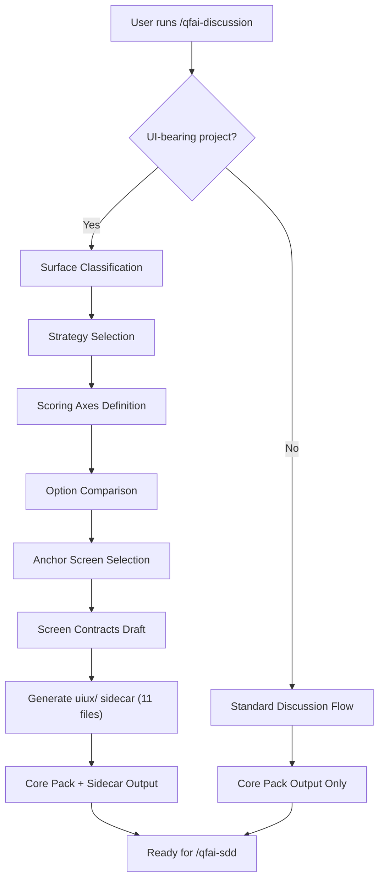

- UI-bearing 検出: SKILL.md のヒューリスティックで surface type (web, mobile, desktop, mixed, non-ui) を分類
- サイドカー: 00_index, 10_strategy, 11_design_taste_interview, 20_design_eval_invariant, 21_design_eval_trend_derived, 22_design_eval_product_specific, 23_design_eval_aggregate, 24_design_eval_dynamic_overrides (OPTIONAL), 30_option_comparison, 31_selected_anchor_screen, 40_screen_contracts, 50_review_input_bundle
- 非 UI プロジェクト: サイドカーは生成されず、既存15ファイルパックのみ出力

## v1.7.4 UIX-VAL/UIX-REV Validation Flow

v1.7.4 では CAP-0027 として、`qfai validate` パイプラインに UIX-VAL deterministic validators と UIX-REV semantic reviewers を統合し、レガシープロジェクトのマイグレーション検出を追加する。

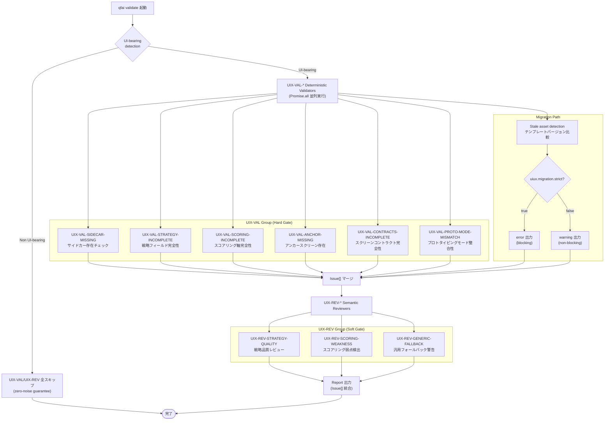

### UIX-VAL/UIX-REV 責務分離

- **UIX-VAL (Hard Gate)**: アーティファクトの存在/不在、必須フィールドの空/非空、構造の完全性、矛盾検出、テンプレートバージョン比較。決定論的（同一入力→同一出力）。
- **UIX-REV (Soft Gate)**: 戦略品質、スコアリング弱点、汎用フォールバックリスク。セマンティックレビュー（出力が変動しうる）。
- **Migration**: stale asset 検出は UIX-VAL グループに統合。severity は `uiux.migration.strict` config で制御（デフォルト warning）。

## v1.7.5 Runtime & Evidence Foundation フロー

v1.7.5 では CAP-0028 として、`/qfai-prototyping` の default を static-first に戻し、render evidence / backend abstraction / browser QA を optional capability として整備する。

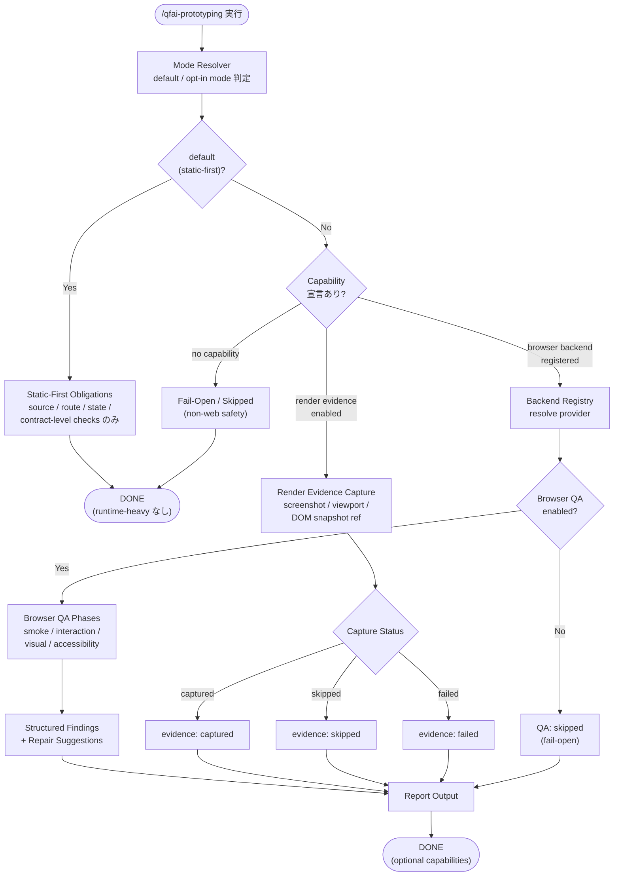

### v1.7.5 Mode Expectation 分離

| Mode               | Static Obligations             | Runtime Obligations                        | Evidence Capture | Browser QA          |
| ------------------ | ------------------------------ | ------------------------------------------ | ---------------- | ------------------- |
| standard (default) | source, route, state, contract | opt-in only                                | optional         | optional            |
| low-cost           | source, route, state, contract | opt-in only                                | optional         | smoke + interaction |
| full-harness       | source, route, state, contract | API non-404, DB existence, UI reachability | required         | required            |

### v1.7.5 非 Web プロジェクト安全保証

- browser/backend capability 未宣言時は fail-open semantics を適用
- evidence capture は skipped で表現（error にしない）
- browser QA は skip で表現（blocking error にしない）
- 新規 universal dependency の追加禁止

## v1.7.6 Critique, Calibration & Full-Harness Expansion フロー

v1.7.6 では CAP-0029〜CAP-0033 として、premium prototyping mode with iterative critique loops を導入する。

```mermaid
flowchart TD
    START([ユーザーリクエスト]) --> MODE{モード選択}
    MODE -->|Standard| STD[標準プロトタイピングパス]
    MODE -->|Premium| FH[/qfai-prototyping --mode full-harness<br/>明示的オプトイン]
    FH --> OBS_START[Observability: コスト/時間追跡開始]
    OBS_START --> PLAN[Planner: 生成戦略策定]
    PLAN --> GEN[Generator: 出力生成]
    GEN --> EVAL[Evaluator: 評価]
    EVAL --> CAL[Calibration Pack: スコアリング整合性確認]
    EVAL --> CRIT{Critique Adapter}
    CRIT -->|provider available| CRITIQUE[構造化批評取得]
    CRIT -->|provider unavailable| FAILOPEN[Fail-Open: 批評スキップ]
    CRITIQUE --> SCORE[スコアリング]
    FAILOPEN --> SCORE
    CAL --> SCORE
    SCORE --> DECISION{Accept / Refine / Pivot}
    DECISION -->|Accept| OUTPUT[最終出力]
    DECISION -->|Refine| GEN
    DECISION -->|Pivot| PLAN
    DECISION -->|Plateau/Cap| OUTPUT
    OUTPUT --> OBS_END[Observability: メトリクス出力]
    OBS_END --> HANDOFF[Handoff Artifact 生成]
    HANDOFF --> DETECT[Display/Stub Detection]
    DETECT --> EVIDENCE[Evidence + Review]
    STD --> STD_OUT[標準出力]
    STD_OUT --> EVIDENCE
```

### Premium Path Iteration Policy

| Policy            | Rule                                            |
| ----------------- | ----------------------------------------------- |
| Iteration range   | 5-15 (configurable max, default 15)             |
| Plateau detection | Score delta threshold with 3-iteration lookback |
| Loop exit         | Accept, plateau, or max cap reached             |
| Fail-open         | Adapter-level; provider failure never blocks    |
| Cost ceiling      | Deferred to post-implementation (OQ-0005)       |

## v1.7.13 Canonical Sidecar Convergence

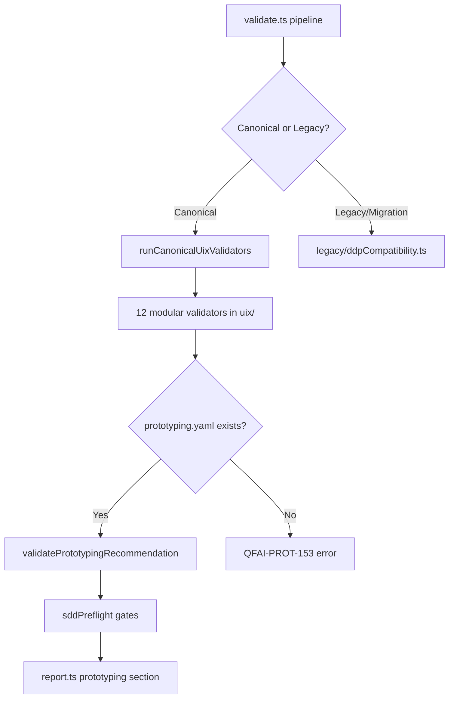

**Canonical/Legacy Separation:**

- Production path: `runCanonicalUixValidators()` in `uix/canonical.ts` runs 12 modular validators
- Legacy path: `legacy/ddpCompatibility.ts` and `legacy/uixCompatibility.ts` for migration tooling only
- `validateDdpFields` removed from `validate.ts` pipeline

**Prototyping Module:**

- `prototyping/mode.ts`: mode resolution with existence-based precedence (D-5)
- `prototyping/recommendationArtifact.ts`: single source of truth for recommendation artifact status
- `prototyping/recommendationSchema.ts`: key existence checks for precedence decisions
- SDD preflight gates on valid `prototyping.yaml`

**Report Observability:**

- `report.ts` now includes `## Prototyping` section with mode, obligations, evidence, harness, render, browserQa, calibration subsections
- Marked as "foundation-only (not integrated into blocking validation in v1.7.13)"
