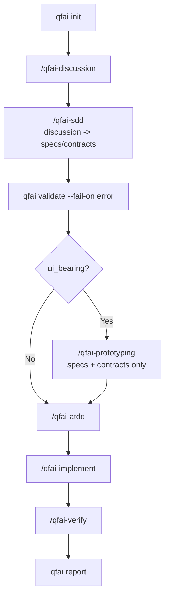
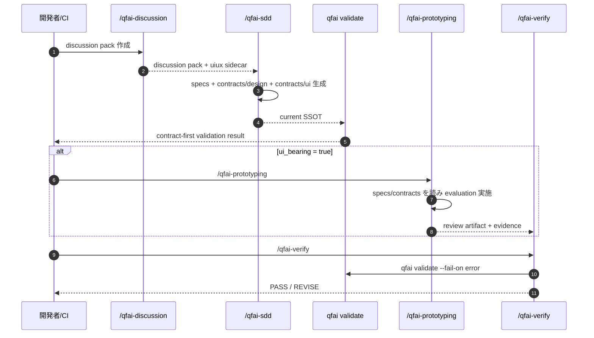
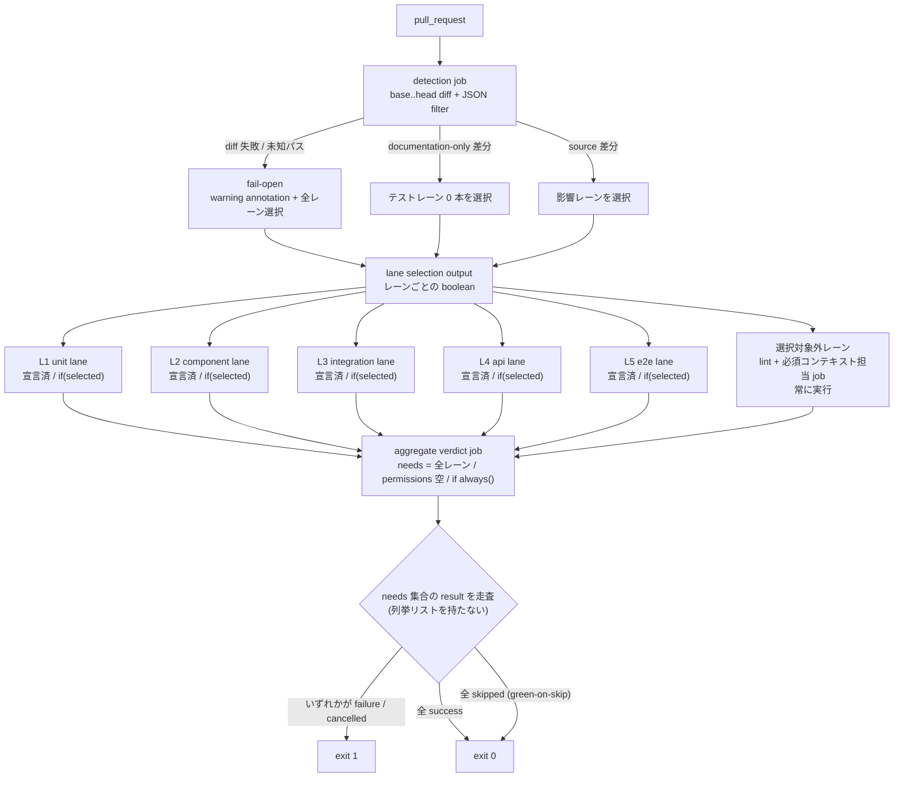
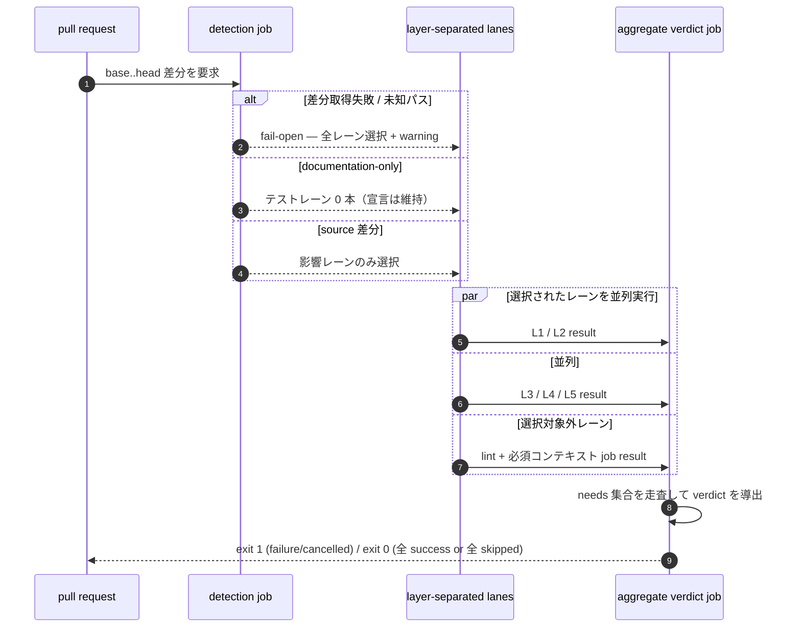
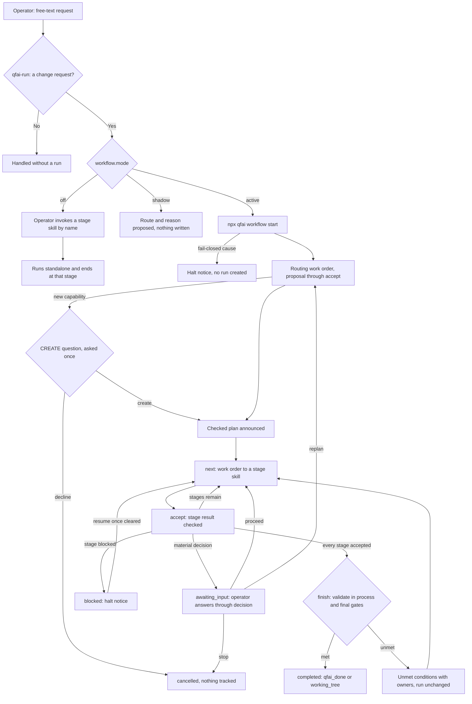
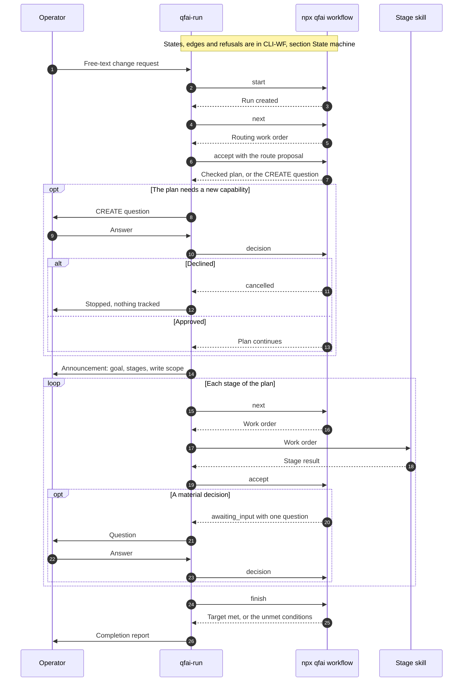

# 04 Business Flow

## Purpose

- QFAI の current business flow を policy-layer SSOT として定義する。
- downstream execution は `specs + .qfai/contracts/**` を読み、discussion pack を直接 truth source にしない。

## Actors / Systems

- Actor: 開発者 / AI コーディングエージェント / CI/CD パイプライン
- System: QFAI CLI + Assistant Skills

## Preconditions

- Node.js >= 18.0.0
- `qfai init` 済み
- UI-bearing プロジェクトでは `/qfai-discussion` → `/qfai-sdd` を経て `.qfai/contracts/design/**` と `.qfai/contracts/ui/**` が存在する

## Flow Overview

1. `qfai init` でワークスペースを初期化する
2. `/qfai-discussion` で discussion pack を作成する
3. `/qfai-sdd` で discussion UIUX sidecar を contracts/design・contracts/ui に正規化し、specs を生成・更新する
4. `qfai validate --fail-on error` で spec/contracts を検証する
5. UI-bearing の場合は `/qfai-prototyping` が spec/contracts を読み、prototype 実装・capture・agent-led evaluation を行う
6. `/qfai-atdd` が spec/contracts を読み、受入テストを整備する
7. `/qfai-implement` が spec/contracts を読み、TDD マイクロサイクルで実装する
8. `/qfai-verify` が repo gates と `qfai validate --fail-on error` を実行し、review artifact と evidence を確認する
9. `qfai report` が validate/review/evidence の結果をまとめる

## Diagram

## Alternate / Exception Flows

- discussion pack が不足している場合、`/qfai-sdd` は停止し `/qfai-discussion` への差し戻しを行う。
- design/ui contracts が不足している UI-bearing project では、`/qfai-prototyping` と downstream validate は fail-close する。
- `runCanonicalUixValidators` は discussion pack を直接検証する時だけ使用し、repo-root downstream validate の primary path には使わない。

## Notes

- `qfai prototyping` CLI や runtime/full-harness engine は current flow に存在しない。
- screenshot と HTML snapshot は declared screen ごとの mandatory evidence である。
- current downstream truth は `specs + contracts` であり、discussion pack は upstream authoring artifact である。

## CHG-007 — Layered CI Lane Topology (CAP-0017 / CAP-0003)

上流の SDD/ATDD/TDD フローとは別レイヤーの、CI 実行時トポロジを policy-layer SSOT として定義する。
本節は QFAI 自身の CI（`CAP-0017`）と配布ワークフローテンプレート（`CAP-0003`）の**共通形**を記述する。
どちらも QFAI が runner としてワークフローを実行するものではない（`01_Objective.md` Out of Scope）。

### Actors / Systems

- Actor: pull request 作成者（開発者 / AI エージェント）
- System: GitHub Actions（detection job / test lane / aggregate verdict job）

### Flow Overview

1. pull request が 1 本のワークフローをトリガーする。
2. detection job が base..head の差分からどのレーンを走らせるかを導出する（full history はこの job のみ要求する）。
3. 差分取得失敗・未知パスは **fail-open** — warning annotation を出して全レーンを選択する（過剰実行しかしない）。
4. documentation-only 差分では**テストレーンを 1 本も選択しない**。lint レーンと必須コンテキストを担う job は選択対象外で常に実行される。
5. 全レーンは常に**宣言**され、非選択レーンは false 条件で**スキップ**される。よって check name は消えず、runner minutes も消費しない（REQ-0007 / REQ-0017）。
6. 選択されたレイヤー分離テストレーン（L1 unit / L2 component / L3 integration / L4 api / L5 e2e）は**並列**に実行される。レーン分離は新規ワークフローファイルではなく同一ファイル**内の job**として表現する（REQ-0008 / REQ-0016）。
7. aggregate verdict job は `if: always()` かつ空の permission map で走り、**自身の `needs` 集合を走査して** verdict を導出する（REQ-0006）。手書きの比較リストは持たない。
8. verdict は failure / cancelled のいずれかがあれば exit 1、全 success または**全 skipped** なら exit 0（green-on-skip）。

### Diagram

### Alternate / Exception Flows

- ALT-CI-01: documentation-only 差分 — テストレーンは全て skipped だが check name は解決し続け、verdict は green-on-skip で exit 0（REQ-0007 / REQ-0017）。
- ALT-CI-02: shallow clone / base ref 不在 — fail-open。verdict は green を維持しつつ warning annotation を残す。
- EX-CI-01: パッケージマネージャ解決不能 — **fail-closed**。何もインストールされないため継続すると評価していない結果を報告することになる（`07_Constraints.md` OC-78）。
- EX-CI-02: 必須ステータスコンテキストを担う job を選択対象に含めてはならない。skip された job は success を報告するため、走っていない job に対して branch protection へ green を渡してしまう。

### Notes (CHG-007)

- レーン（CI の job / matrix leg）とレイヤー（テスト意味論）とスライス（QFAI 自身の matrix 次元）は同義ではない。用語定義は `06_Glossary.md` § CHG-007。
- レイヤー語彙は増やさない（NFR-0015）。本節は既存の L1..L5 語彙のみを使う。
- 配布側はさらに inert-by-default であり、アダプタが対応 script を宣言するまでテストレーンは 1 本も実行されない。

## Intent-driven entry (CAP-0018)

A run-driven path beside the flow above. The operator states a change once, in
free text, and `qfai-run` drives the stage skills through `npx qfai workflow`.
The flow above stays: a stage skill invoked by name runs standalone and ends at
that stage. This section states the order between the actors. The operations,
states and refusals are CLI-WF's (`.qfai/contracts/cli/qfai-workflow.md`), and
the files and plans are CLI-WFFILE's (`.qfai/contracts/cli/workflow-files.schema.md`).

### Actors / Systems

- Actor: the operator, on Claude Code or Codex.
- System: `qfai-run`, the entry skill, running inside the host session.
- System: `npx qfai workflow`, the control core.
- System: the stage skills a built-in plan dispatches, `qfai-maintain` included.

### Preconditions

- `qfai init` has installed `qfai-run`, `qfai-maintain`, the built-in plans and
  the entry directive (`.qfai/contracts/cli/qfai-init.md` `## Workflow entry`).
- `workflow.mode` is absent or `active`.
- The host's capability report passes (CLI-WF `## Host capability report`).

### Flow Overview

1. The operator types a change request in free text.
2. `qfai-run` classifies it. A request that is not a change is handled without a
   run: an explanation, a plan only, a verification only, or one stage by name.
3. `qfai-run` reads the mode. Under `off` the stage skills are invoked by name.
   Under `shadow` it proposes the route and its reason and writes nothing. Under
   `active` it calls `start`.
4. `start` either refuses fail-closed, naming the cause and creating no run, or
   creates the run.
5. Routing is a stage instance. `next` returns the routing work order, and
   `qfai-run` submits its route proposal through `accept`. When the plan needs a
   new capability, the operator is asked once, and the answer goes through
   `decision`.
6. `qfai-run` announces the goal, the stages and the write scope, and asks
   nothing.
7. For each stage, `next` issues a work order, the stage skill does the work, and
   `accept` checks the result. A material decision puts one question, answered
   through `decision`.
8. `finish` runs validate in process and reads this run's verify report and an
   independent qa-gatekeeper PASS. A met target completes the run. An unmet one
   lists each condition with its owner and leaves the run as it was.

### Diagram

### Alternate / Exception Flows

- The operator stops the run. `qfai-run` records the stop through `decision`, the
  run ends `cancelled`, and nothing further is written or asked (CLI-WF
  `## Questions and decisions`).
- A fail-closed cause found at `start` is refused, and no run is created. A cause
  found later stops automatic chaining until it is cleared through `resume` or
  the run is stopped (CLI-WF `## Fail-closed`, `## State machine`).
- An interrupted session is restored when a new session is told to continue:
  `resume` revalidates the run and returns the work order of the smallest valid
  checkpoint (CLI-WF `## Operations`).
- `/qfai-sdd` Stage 1 finds the CREATE authorization unapproved, mismatched or
  stale. SDD asks nothing and persists no triage row, the run waits in
  `awaiting_input`, and a new CREATE question is put (CLI-WF `## Authorizations`).
- Under a no-question mode such as `--auto`, the question is not put and the run
  stays `awaiting_input` (CLI-WF `### host:create-question`,
  `### host:decision-question`).
- A bugfix follows the diagnosis: a missing test gets an appended row from
  `/qfai-sdd` (`sdd_append`), a defective test is fixed by the owner of its layer
  (`test_fix`), and a regression is fixed in production code (`regression_fix`).
  A `done` row stays `done` in all three (CLI-WFFILE `## Plan files`, CLI-WF
  `## Ledger row-set check`).

### Notes (CAP-0018)

- The control core launches no AI and runs no repository command. It reads git
  read-only and runs validate in process. Every stage runs in the host (CLI-WF
  `## Boundaries`).
- It is not the removed prototyping runtime that `07_Constraints.md` TC-10 keeps
  out.
- It is not a CI runner, which `01_Objective.md` puts out of scope. QFAI still
  hosts no agent and executes no CI workflow.
