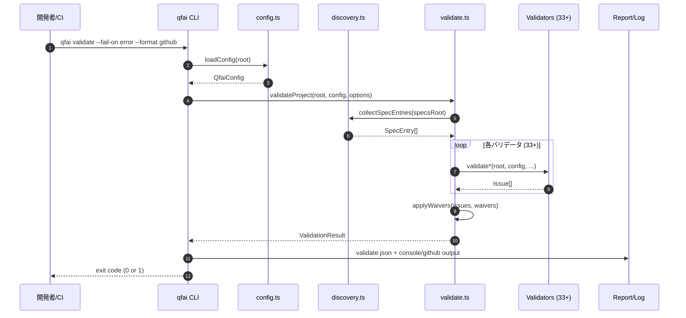

# 04 Business Flow

## Purpose

- QFAI CLI ツールの高レベルビジネスプロセスをポリシーレイヤーの SSOT として記述する。
- 受入シナリオの詳細は各 `spec-XXXX/03_Acceptance-Criteria.md` に記載する。

## Actors / Systems

- Actor: 開発者 / AI コーディングエージェント / CI/CD パイプライン
- System: QFAI CLI

## Preconditions

- Node.js >= 18.0.0 がインストールされていること
- プロジェクトルートに `qfai.config.yaml` が存在すること（`qfai init` 後）

## Flow Overview

1. 開発者または AI エージェントが `qfai init` でワークスペースを初期化する
2. ディスカッションパック（15ファイル）を作成し、要件を整理する
3. スペック（SDD）を生成する
4. `qfai validate` でスペックを検証し、問題があれば修正する
5. プロトタイプを実装し、`qfai validate --phase atdd` で検証する
6. 受入テスト（ATDD）を実装する
7. TDD サイクル（Red -> Green -> Refactor）でコードを実装する
8. `qfai validate --phase full` で最終検証する
9. `qfai report` でレポートを生成する

## Diagram (Mermaid required)

## Alternate / Exception Flows

- ALT-01: ウェイバーが設定されている場合、該当ルールの issue は suppress または downgrade される
- ALT-02: `--phase` オプションにより、バリデーション対象を限定できる（full/atdd/tdd/refinement）
- EX-01: 設定ファイル不在の場合、`qfai doctor` で診断を推奨するエラーメッセージを表示
- EX-02: テストディレクトリが存在しない場合、ATDD チェックはスキップされる

## Notes

- CLI ツールのため画面モックは対象外。
- `qfai report --format md` の出力がレポートの主要な可読形式となる。
