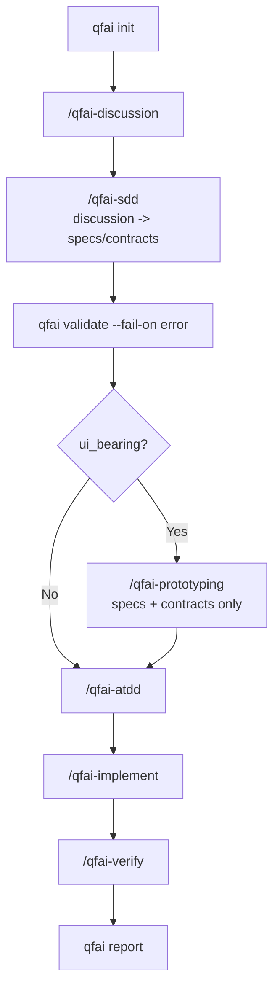
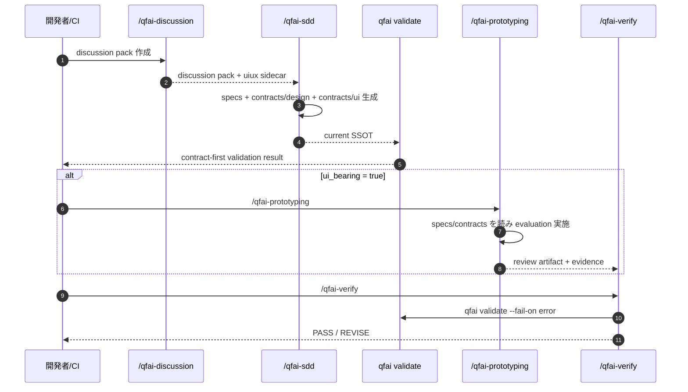

# 04 Business Flow

## Purpose

- QFAI の current business flow を policy-layer SSOT として定義する。
- downstream execution は `specs + .qfai/contracts/**` を読み、discussion pack を直接 truth source にしない。

## Actors / Systems

- Actor: 開発者 / AI コーディングエージェント / CI/CD パイプライン
- System: QFAI CLI + Assistant Skills

## Preconditions

- Node.js >= 18.0.0
- `qfai init` 済み
- UI-bearing プロジェクトでは `/qfai-discussion` → `/qfai-sdd` を経て `.qfai/contracts/design/**` と `.qfai/contracts/ui/**` が存在する

## Flow Overview

1. `qfai init` でワークスペースを初期化する
2. `/qfai-discussion` で discussion pack を作成する
3. `/qfai-sdd` で discussion UIUX sidecar を contracts/design・contracts/ui に正規化し、specs を生成・更新する
4. `qfai validate --fail-on error` で spec/contracts を検証する
5. UI-bearing の場合は `/qfai-prototyping` が spec/contracts を読み、prototype 実装・capture・agent-led evaluation を行う
6. `/qfai-atdd` が spec/contracts を読み、受入テストを整備する
7. `/qfai-implement` が spec/contracts を読み、TDD マイクロサイクルで実装する
8. `/qfai-verify` が repo gates と `qfai validate --fail-on error` を実行し、review artifact と evidence を確認する
9. `qfai report` が validate/review/evidence の結果をまとめる

## Diagram

## Alternate / Exception Flows

- discussion pack が不足している場合、`/qfai-sdd` は停止し `/qfai-discussion` への差し戻しを行う。
- design/ui contracts が不足している UI-bearing project では、`/qfai-prototyping` と downstream validate は fail-close する。
- `runCanonicalUixValidators` は discussion pack を直接検証する時だけ使用し、repo-root downstream validate の primary path には使わない。

## Notes

- `qfai prototyping` CLI や runtime/full-harness engine は current flow に存在しない。
- screenshot と HTML snapshot は declared screen ごとの mandatory evidence である。
- current downstream truth は `specs + contracts` であり、discussion pack は upstream authoring artifact である。
