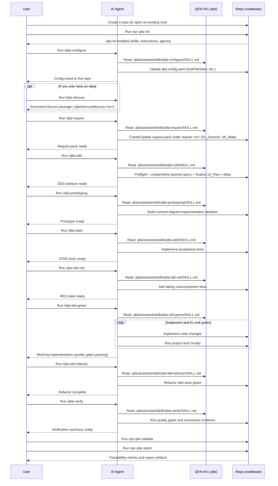
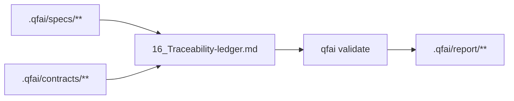

# QFAI (Quality-First AI)

QFAI is a quality-first development kit for AI coding agents.
Its purpose is to improve the quality of AI-generated software outputs by enforcing a structured workflow and validating traceability.

Modern AI coding agents can write code quickly, but they can also misunderstand requirements, drift from intended behavior, or “sound correct” while being wrong.
QFAI addresses these failure modes by standardizing an end-to-end delivery loop and forcing objective checks.

- SDD clarifies what to build, so the agent does not invent requirements while coding.
- ATDD defines acceptance goals as executable scenarios, so correctness is measured rather than assumed.
- TDD enables a self-correcting loop: implement → run tests → fix → repeat.
- Traceability validation enforces that SDD → ATDD → TDD → implementation stays aligned, reducing hallucination-driven drift.
- Result: higher output quality, fewer review cycles, and lower human supervision cost.

QFAI is designed for a skills-driven operating model: engineers select a prepared custom skill and provide only the task intent.
The agent reads the repository, produces the required artifacts, and iterates until the hard gates pass.

## Quick start

```bash
# 1) Initialize QFAI assets in your repository
npx qfai init

# 2) Validate traceability (use this in CI as a hard gate)
npx qfai validate

# 3) Generate a human-readable report (Markdown)
npx qfai report
```

## What you can do (CLI commands)

- `npx qfai init`
  - Creates the QFAI workspace under `.qfai/` (requirements/specs/status/contracts/report) and installs the AI assistant kit (`assistant/` with skills, instructions, agents, and steering templates), plus `qfai.config.yaml`.
- `npx qfai validate`
  - Validates specs/contracts/scenarios/traceability and review artifacts (`.qfai/review/review-*/summary.json` + minimum schema), then writes `.qfai/report/validate.json`; use `--fail-on error` (or `--fail-on warning`) to turn it into a CI gate, and `--format github` to emit GitHub-friendly annotations. Use `--phase refinement` only for local refinement checks; CI should use default/full validation.
- `npx qfai report`
  - Produces a human-readable report (`report.md` by default) or an internal JSON export (`report.json`) from `validate.json`; use `--base-url` to link file paths in Markdown to your repository viewer.
- `npx qfai doctor`
  - Diagnoses configuration discovery, path resolution, glob scanning, and `validate.json` inputs before running validate/report; use `--fail-on` to enforce failures in CI.

## Operating model (skills-driven workflow)

QFAI assumes you operate the project primarily via prepared custom skills.
A custom skill is a reusable task instruction set for your AI coding agent.
The agent reads QFAI assets under `.qfai/assistant/` and produces or updates SDD/ATDD/TDD artifacts and code.

### Where the skills live

- QFAI canonical skills (SSOT): `.qfai/assistant/skills/**` (may be overwritten when you re-run `qfai init --force`).
- Your local overrides: `.qfai/assistant/skills.local/**` (never overwritten by QFAI; prefer this for project-specific customizations).

### Minimal custom skill set

QFAI includes a small set of custom skills (stored under `.qfai/assistant/skills/`) designed to keep the workflow opinionated and repeatable.

- **qfai-configure**: Analyze the repository (language, frameworks, test layout, directory structure) and tailor `qfai.config.yaml` accordingly (especially `testFileGlobs`). Run this once right after `npx qfai init`, and re-run it when the repository structure changes.
- **qfai-discuss**: Turn an idea into clear requirements by discussing scope, constraints, risks, and open questions.
- **qfai-require**: Produce a fixed 9-file require-pack (`01_Sources.md`..`09_delta.md`) under `.qfai/require/require-<ts>/`.
- **qfai-sdd**: Unified SDD entrypoint with require-pack preflight guard (missing/incomplete/blocking OQ causes stop + next action guidance).
- **qfai-sdd-refinement / qfai-sdd-planning (deprecated wrappers)**: Legacy entrypoints that return a fixed deprecation notice and route to `/qfai-sdd` only (no direct artifact generation).
- **qfai-prototyping**: Build a contract-aligned skeleton implementation before deep coding.
- **qfai-atdd**: Implement acceptance tests driven by specs/scenarios.
- **qfai-tdd-red**: Add failing unit/component tests from the approved acceptance scenarios.
- **qfai-tdd-green**: Implement production code to satisfy failing tests.
- **qfai-tdd-refactor**: Refactor while keeping all tests green.
- **qfai-verify**: Run/interpret the local quality gates and produce a release-ready summary.

### Workflow sequence (example)

This sequence shows which skill to run, in what order, and what artifacts to expect.



Operational notes.

- Each custom skill must output in the user’s language (absolute requirement).
- Each custom skill must end with a completion message that enumerates all available next actions and clearly states what to do for each option.
- Except `qfai-discuss`, each skill must analyze the project context (architecture, tech stack, test framework, repo structure) before generating artifacts or code.
- Skills should delegate work to multiple role-based sub-agents (Planner, Architect, Contract Designer, QA, Code Reviewer, etc.) to emulate a real delivery flow.
- Change classification (Primary/Tags) is required in `18_delta.md` and recommended in PRs. See `.qfai/assistant/instructions/change-classification.md`.
- Verification planning is recorded in `18_delta.md` (`Verification -> Plan`) and validated in CI (`VFY-*` rules).
- Review gate policies (required/optional layers and reviewers) are defined in `.qfai/assistant/steering/review-gate.rules.yml`.
- Review roster SSOT is defined in `.qfai/assistant/steering/review-roster.yml`.

## Configuration

Configuration is stored at the repository root as `qfai.config.yaml`; you can change paths, traceability policies, and CI gate thresholds.

Example: override paths and traceability globs.

```yaml
paths:
  contractsDir: .qfai/contracts
  specsDir: .qfai/specs
  requireDir: .qfai/require
  outDir: .qfai/report
  skillsDir: .qfai/assistant/skills
  srcDir: src
  testsDir: tests
validation:
  failOn: error # error | warning | never
  traceability:
    testFileGlobs:
      - "src/**/*.test.ts"
      - "tests/**/*.spec.ts"
    testFileExcludeGlobs:
      - "**/fixtures/**"
    scMustHaveTest: true
    scNoTestSeverity: warning # error | warning
```

Notes.

- `validate.json`, `report.json`, and `doctor.json` are internal exports and are not a stable external contract; prefer `report.md` for integrations that must survive tool upgrades.
- Scenario files are expected to use the Gherkin extension `*.feature` (not `*.md`).

## Specifications and contracts (SDD)

QFAI uses a small, opinionated set of artifacts to reduce ambiguity and prevent agents from “inventing” behavior.

- Requirements: what you want to achieve, constraints, and explicit non-goals.
- Specs: structured expected behaviors, inputs/outputs, edge cases, and invariants.
- Contracts:
  - UI contracts: YAML (`.yaml` / `.yml`)
  - API contracts: YAML (`.yaml` / `.yml`)
  - DB contracts: SQL (`.sql`)
- Scenarios (ATDD): Gherkin `.feature` files

Traceability is validated across these artifacts, so code changes remain grounded in the specs and the tests prove compliance.

## SSOT boundaries



- Specs SSOT: `.qfai/specs/**` (`01..18`, especially `16_Traceability-ledger.md` and `18_delta.md`)
- Contracts SSOT: `.qfai/contracts/**`
- Report outputs (`.qfai/report/**`) are derived artifacts and not SSOT.

## Minimal tutorial (v1.4.23)

1. `npx qfai init`
2. Run `/qfai-discuss` to structure scope and open questions.
3. Run `/qfai-require` to produce a require pack (`01_Sources`..`09_delta`) under `.qfai/require/require-<ts>/`.
4. Run `/qfai-sdd` to build layered specs and finalized plans.
5. For each completed review cycle, append artifacts under `.qfai/review/review-<timestamp>/`.
6. Run `npx qfai validate` then `npx qfai report`.

Release gate behavior:

- Merge gate: `qfai validate` must pass (`error=0`), and open OQ is warning.
- Release gate: set `release_candidate: true` in `.qfai/status/*.json` (for example, `release.json`); open OQ then becomes error.

## FAQ

- Q: I referenced AC/TC directly from upper layers and got an error.
  - A: Keep upper-to-lower references out of upper docs; use `16_Traceability-ledger.md` for cross-layer linkage.
- Q: Ledger validation fails with missing columns.
  - A: Ensure required columns exist: `trace_id,obj_id,init_id,cap_id,flow_id,us_id,ac_id,ex_ids,tc_ids`.
- Q: `18_delta.md` fails validation.
  - A: Include all required sections (`Change Summary`, `Rationale`, `Candidates Considered`, `Adopted`, `Rejected`, `Impact`, `Follow-ups`) and include both `DO NOT` and `Temptation` in `Rejected`.
- Q: release_candidate validation fails due open questions.
  - A: Keep specs definition-only, then update status in `.qfai/status/*.json` and convert open OQ to `resolved` or `deferred` with evidence.

## Continuous integration

QFAI v1.4.23 generates `.github/**` only for Copilot integration wrappers
(`.github/prompts`, `.github/agents`).
It does not generate GitHub Actions workflows.
Configure CI in your own platform and run:

```bash
pnpm ci:local
# or, minimum gate only:
npx qfai validate --fail-on error
```

Recommended baseline.

- Keep CI on default/full validation (`qfai validate --fail-on error`); do not use `--phase refinement` in CI.
- Add a report step (`npx qfai report`) when you need a human-readable artifact.
- Tune traceability globs in `qfai.config.yaml` to match your test layout.

Waiver policy.

- Use waivers only for `warning` / `info` findings (false positives, phased migration noise).
- Waivers that target `error` findings are invalid and fail validation (`QFAI-WAIVER-002`).
- Expired waivers are reported as warnings (`QFAI-WAIVER-003`) and must be renewed or removed with evidence.
- Suppressed findings remain visible in reports as `suppressed=true`; waivers do not erase findings.

Typical customizations.

- Add a `doctor` step before validate if you want to fail fast on path/glob/config issues.
- Publish `.qfai/report/validate.json` and `report.md` as CI artifacts.

## Generated structure

`npx qfai init` generates the following structure in your repository.

```text
.
├── .qfai
│   ├── assistant
│   │   ├── agents
│   │   │   ├── README.md
│   │   │   ├── architect.md
│   │   │   ├── backend-engineer.md
│   │   │   ├── code-reviewer.md
│   │   │   ├── contract-designer.md
│   │   │   ├── devops-ci-engineer.md
│   │   │   ├── facilitator.md
│   │   │   ├── frontend-engineer.md
│   │   │   ├── interviewer.md
│   │   │   ├── planner.md
│   │   │   ├── qa-engineer.md
│   │   │   ├── requirements-analyst.md
│   │   │   └── test-engineer.md
│   │   ├── instructions
│   │   │   ├── README.md
│   │   │   ├── agent-selection.md
│   │   │   ├── communication.md
│   │   │   ├── constitution.md
│   │   │   ├── quality.md
│   │   │   ├── thinking.md
│   │   │   └── workflow.md
│   │   ├── skills
│   │   │   ├── qfai-configure
│   │   │   │   └── SKILL.md
│   │   │   ├── qfai-discuss
│   │   │   │   └── SKILL.md
│   │   │   ├── qfai-prototyping
│   │   │   │   └── SKILL.md
│   │   │   ├── qfai-require
│   │   │   │   └── SKILL.md
│   │   │   ├── qfai-sdd
│   │   │   │   └── SKILL.md
│   │   │   ├── qfai-sdd-refinement  (deprecated wrapper)
│   │   │   │   └── SKILL.md
│   │   │   ├── qfai-sdd-planning    (deprecated wrapper)
│   │   │   │   └── SKILL.md
│   │   │   ├── qfai-atdd
│   │   │   │   └── SKILL.md
│   │   │   ├── qfai-tdd-red
│   │   │   │   └── SKILL.md
│   │   │   ├── qfai-tdd-green
│   │   │   │   └── SKILL.md
│   │   │   ├── qfai-tdd-refactor
│   │   │   │   └── SKILL.md
│   │   │   └── qfai-verify
│   │   │       └── SKILL.md
│   │   ├── skills.local
│   │   │   └── README.md
│   │   ├── templates
│   │   │   └── rcp_footer.md
│   │   ├── steering
│   │   │   ├── README.md
│   │   │   ├── review-gate.rules.yml
│   │   │   ├── review-roster.yml
│   │   │   ├── product.md
│   │   │   ├── structure.md
│   │   │   └── tech.md
│   │   └── README.md
│   ├── discuss
│   │   ├── README.md
│   │   └── discuss-20260215205220203
│   │       ├── 01_Context.md
│   │       ├── ...
│   │       └── 09_delta.md
│   ├── contracts
│   │   ├── api
│   │   │   └── README.md
│   │   ├── db
│   │   │   └── README.md
│   │   ├── ui
│   │   │   └── README.md
│   │   └── README.md
│   ├── report
│   │   └── README.md
│   ├── require
│   │   ├── README.md
│   │   └── require-20260215205220203
│   │       ├── 01_Sources.md
│   │       ├── 02_Scope.md
│   │       ├── 03_REQ.md
│   │       ├── ...
│   │       └── 09_delta.md
│   ├── review
│   │   ├── .gitignore
│   │   └── README.md
│   ├── status
│   │   ├── .gitignore
│   │   └── README.md
│   ├── specs
│   │   └── README.md
│   └── README.md
└── qfai.config.yaml
```

Integration wrappers are also generated for immediate use:

- Claude Code: `.claude/commands/**`, `.claude/agents/**`
- GitHub Copilot: `.github/prompts/**`, `.github/agents/**`
- Codex: `.codex/skills/**`

## Agent integrations

`npx qfai init` installs canonical skills under `.qfai/assistant/skills/**` (SSOT)
and generates thin wrapper assets for Copilot / Claude Code / Codex.
If wrapper assets drift from canonical skills, rerun `npx qfai init --force` to resync.

## Contributing (for QFAI maintainers)

This repository is a monorepo, and the distributable package is under `packages/qfai`; if you change documentation, keep the repository root README and the package README aligned (the CI enforces this).

## License

MIT
