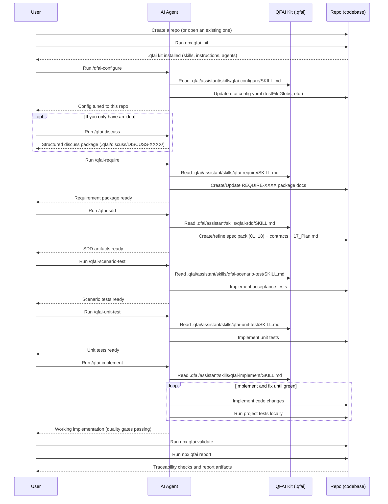

# QFAI (Quality-First AI)

QFAI is a quality-first development kit for AI coding agents.
Its purpose is to improve the quality of AI-generated software outputs by enforcing a structured workflow and validating traceability.

Modern AI coding agents can write code quickly, but they can also misunderstand requirements, drift from intended behavior, or “sound correct” while being wrong.
QFAI addresses these failure modes by standardizing an end-to-end delivery loop and forcing objective checks.

- SDD clarifies what to build, so the agent does not invent requirements while coding.
- ATDD defines acceptance goals as executable scenarios, so correctness is measured rather than assumed.
- TDD enables a self-correcting loop: implement → run tests → fix → repeat.
- Traceability validation enforces that SDD → ATDD → TDD → implementation stays aligned, reducing hallucination-driven drift.
- Result: higher output quality, fewer review cycles, and lower human supervision cost.

QFAI is designed for a skills-driven operating model: engineers select a prepared custom skill and provide only the task intent.
The agent reads the repository, produces the required artifacts, and iterates until the hard gates pass.

## Quick start

```bash
# 1) Initialize QFAI assets in your repository
npx qfai init

# 2) Validate traceability (use this in CI as a hard gate)
npx qfai validate

# 3) Generate a human-readable report (Markdown)
npx qfai report
```

## What you can do (CLI commands)

- `npx qfai init`
  - Creates the QFAI workspace under `.qfai/` (requirements/specs/contracts/report) and installs the AI assistant kit (`assistant/` with skills, instructions, agents, and steering templates), plus a default GitHub Actions workflow and `qfai.config.yaml`.
- `npx qfai validate`
  - Validates specs/contracts/scenarios/traceability and writes `.qfai/report/validate.json`; use `--fail-on error` (or `--fail-on warning`) to turn it into a CI gate, and `--format github` to emit GitHub-friendly annotations. Use `--phase refinement` only for local refinement checks; CI should use default/full validation.
- `npx qfai report`
  - Produces a human-readable report (`report.md` by default) or an internal JSON export (`report.json`) from `validate.json`; use `--base-url` to link file paths in Markdown to your repository viewer.
- `npx qfai doctor`
  - Diagnoses configuration discovery, path resolution, glob scanning, and `validate.json` inputs before running validate/report; use `--fail-on` to enforce failures in CI.

## Operating model (skills-driven workflow)

QFAI assumes you operate the project primarily via prepared custom skills.
A custom skill is a reusable task instruction set for your AI coding agent (for example, IDE/CLI skill wrappers that link to canonical QFAI skills).
The agent reads QFAI assets under `.qfai/assistant/` and produces or updates SDD/ATDD/TDD artifacts and code.

### Where the skills live

- QFAI canonical skills (SSOT): `.qfai/assistant/skills/**` (may be overwritten when you re-run `qfai init --force`).
- Your local overrides: `.qfai/assistant/skills.local/**` (never overwritten by QFAI; prefer this for project-specific customizations).

### Minimal custom skill set

QFAI includes a small set of custom skills (stored under `.qfai/assistant/skills/`) designed to keep the workflow opinionated and repeatable.

- **qfai-configure**: Analyze the repository (language, frameworks, test layout, directory structure) and tailor `qfai.config.yaml` accordingly (especially `testFileGlobs`). Run this once right after `npx qfai init`, and re-run it when the repository structure changes.
- **qfai-discuss**: Turn an idea into clear requirements by discussing scope, constraints, risks, and open questions.
- **qfai-require**: Produce `.qfai/require/REQUIRE-XXXX/*` from your idea or discussion output.
- **qfai-sdd**: Produce/update the full spec pack (`01_Spec.md` to `18_delta.md`) in one workflow (Outline -> Slice -> Plan finalize -> Delta).
- **qfai-spec**: Deprecated alias of `qfai-sdd` for backward compatibility.
- **qfai-scenario-test**: Implement acceptance tests (ATDD) driven by specs/scenarios.
- **qfai-unit-test**: Implement unit tests (TDD) driven by specs/scenarios.
- **qfai-implement**: Implement the feature; iterate test→fix until all quality gates are green.
- **qfai-verify**: Run/interpret the local quality gates and produce a PR-ready summary.
- **qfai-pr**: Draft a PR description aligned with the repository’s PR template.

### Workflow sequence (example)

This sequence shows which skill to run, in what order, and what artifacts to expect.



Operational notes.

- Each custom skill must output in the user’s language (absolute requirement).
- Except `qfai-discuss`, each skill must analyze the project context (architecture, tech stack, test framework, repo structure) before generating artifacts or code.
- Skills should delegate work to multiple role-based sub-agents (Planner, Architect, Contract Designer, QA, Code Reviewer, etc.) to emulate a real delivery flow.
- Change classification (Primary/Tags) is required in `18_delta.md` and recommended in PRs. See `.qfai/assistant/instructions/change-classification.md`.
- Verification planning is recorded in `18_delta.md` (`Verification -> Plan`) and validated in CI (`VFY-*` rules).

## Configuration

Configuration is stored at the repository root as `qfai.config.yaml`; you can change paths, traceability policies, and CI gate thresholds.

Example: override paths and traceability globs.

```yaml
paths:
  contractsDir: .qfai/contracts
  specsDir: .qfai/specs
  requireDir: .qfai/require
  outDir: .qfai/report
  skillsDir: .qfai/assistant/skills
  srcDir: src
  testsDir: tests
validation:
  failOn: error # error | warning | never
  traceability:
    testFileGlobs:
      - "src/**/*.test.ts"
      - "tests/**/*.spec.ts"
    testFileExcludeGlobs:
      - "**/fixtures/**"
    scMustHaveTest: true
    scNoTestSeverity: warning # error | warning
```

Notes.

- `validate.json`, `report.json`, and `doctor.json` are internal exports and are not a stable external contract; prefer `report.md` for integrations that must survive tool upgrades.
- Scenario files are expected to use the Gherkin extension `*.feature` (not `*.md`).

## Specifications and contracts (SDD)

QFAI uses a small, opinionated set of artifacts to reduce ambiguity and prevent agents from “inventing” behavior.

- Requirements: what you want to achieve, constraints, and explicit non-goals.
- Specs: structured expected behaviors, inputs/outputs, edge cases, and invariants.
- Contracts:
  - UI contracts: YAML (`.yaml` / `.yml`)
  - API contracts: YAML (`.yaml` / `.yml`)
  - DB contracts: SQL (`.sql`)
- Scenarios (ATDD): Gherkin `.feature` files

Traceability is validated across these artifacts, so code changes remain grounded in the specs and the tests prove compliance.

## Continuous integration (GitHub Actions)

(GitHub Actions)

`npx qfai init` generates `.github/workflows/qfai.yml` which runs `npx qfai validate --fail-on error` on pull requests and on pushes to `main`, and uploads `.qfai/report/validate.json` as an artifact.

What works out-of-the-box.

- The generated workflow is npm-oriented (`npm ci`); if your repository uses pnpm/yarn/bun, replace the install/cache steps accordingly.
- The default validate gate fails only on `error`; use `--fail-on warning` or `--strict` if you want a stricter gate.
- Keep CI on default/full validation (`qfai validate --fail-on error`); do not use `--phase refinement` in CI.

Waiver policy.

- Use waivers only for `warning` / `info` findings (false positives, phased migration noise).
- Waivers that target `error` findings are invalid and fail validation (`QFAI-WAIVER-002`).
- Expired waivers are reported as warnings (`QFAI-WAIVER-003`) and must be renewed or removed with evidence.
- Suppressed findings remain visible in reports as `suppressed=true`; waivers do not erase findings.

Typical customizations.

- Add a second job to generate `report.md` from the uploaded `validate.json`.
- Add a `doctor` step before validate if you want to fail fast on path/glob/config issues.
- Tune traceability globs in `qfai.config.yaml` to match your test layout.

## Generated structure

`npx qfai init` generates the following structure in your repository.

```text
.
├── .claude
│   └── skills
│       ├── qfai-configure
│       │   └── SKILL.md
│       ├── qfai-discuss
│       │   └── SKILL.md
│       ├── qfai-require
│       │   └── SKILL.md
│       └── ...
├── .codex
│   └── skills
│       ├── qfai-configure
│       │   └── SKILL.md
│       ├── qfai-discuss
│       │   └── SKILL.md
│       ├── qfai-implement
│       │   └── SKILL.md
│       ├── qfai-pr
│       │   └── SKILL.md
│       ├── qfai-require
│       │   └── SKILL.md
│       ├── qfai-scenario-test
│       │   └── SKILL.md
│       ├── qfai-sdd
│       │   └── SKILL.md
│       ├── qfai-spec
│       │   └── SKILL.md
│       ├── qfai-unit-test
│       │   └── SKILL.md
│       └── qfai-verify
│           └── SKILL.md
├── .github
│   ├── skills
│   │   ├── qfai-configure
│   │   │   └── SKILL.md
│   │   ├── qfai-discuss
│   │   │   └── SKILL.md
│   │   ├── qfai-require
│   │   │   └── SKILL.md
│   │   └── ...
│   ├── workflows
│   │   └── qfai.yml
│   ├── copilot-instructions.md
│   └── PULL_REQUEST_TEMPLATE.md
├── .qfai
│   ├── assistant
│   │   ├── agents
│   │   │   ├── README.md
│   │   │   ├── architect.md
│   │   │   ├── backend-engineer.md
│   │   │   ├── code-reviewer.md
│   │   │   ├── contract-designer.md
│   │   │   ├── devops-ci-engineer.md
│   │   │   ├── facilitator.md
│   │   │   ├── frontend-engineer.md
│   │   │   ├── interviewer.md
│   │   │   ├── planner.md
│   │   │   ├── qa-engineer.md
│   │   │   ├── requirements-analyst.md
│   │   │   └── test-engineer.md
│   │   ├── instructions
│   │   │   ├── README.md
│   │   │   ├── agent-selection.md
│   │   │   ├── communication.md
│   │   │   ├── constitution.md
│   │   │   ├── quality.md
│   │   │   ├── thinking.md
│   │   │   └── workflow.md
│   │   ├── skills
│   │   │   ├── qfai-configure
│   │   │   │   └── SKILL.md
│   │   │   ├── qfai-discuss
│   │   │   │   └── SKILL.md
│   │   │   ├── qfai-require
│   │   │   │   └── SKILL.md
│   │   │   └── ...
│   │   ├── skills.local
│   │   │   └── README.md
│   │   ├── steering
│   │   │   ├── README.md
│   │   │   ├── product.md
│   │   │   ├── structure.md
│   │   │   └── tech.md
│   │   └── README.md
│   ├── discuss
│   │   ├── README.md
│   │   └── DISCUSS-0001
│   │       ├── 00_Summary.md
│   │       ├── ...
│   │       └── 07_Open-questions.md
│   ├── contracts
│   │   ├── api
│   │   │   └── README.md
│   │   ├── db
│   │   │   └── README.md
│   │   ├── ui
│   │   │   └── README.md
│   │   └── README.md
│   ├── report
│   │   └── README.md
│   ├── require
│   │   ├── README.md
│   │   ├── REQUIRE-0001
│   │   │   ├── 00_Summary.md
│   │   │   ├── ...
│   │   │   └── 07_Open-questions.md
│   │   ├── glossary.md        # legacy compatibility
│   │   ├── actors.md          # legacy compatibility
│   │   ├── business-flows.md  # legacy compatibility
│   │   ├── require.md         # legacy compatibility
│   │   └── open-questions.md  # legacy compatibility
│   ├── specs
│   │   └── README.md
│   └── README.md
└── qfai.config.yaml
```

## Agent integrations (Copilot / Claude Code / Codex)

`npx qfai init` also installs lightweight integration stubs so your AI coding agent can invoke QFAI custom skills directly.

- **GitHub Copilot Agent skills**: `.github/skills/*/SKILL.md`.
- **GitHub Copilot repository instructions**: `.github/copilot-instructions.md` (baseline behavior guidance for Copilot in this repo).
- **Claude Code skills**: `.claude/skills/*/SKILL.md`.
- **OpenAI Codex skills**: `.codex/skills/*/SKILL.md` (invoke as Codex skills; each skill points to the canonical QFAI skill doc).

Each of these files is intentionally thin and forwards to the canonical source of truth under `.qfai/assistant/skills/**`.

## Contributing (for QFAI maintainers)

This repository is a monorepo, and the distributable package is under `packages/qfai`; if you change documentation, keep the repository root README and the package README aligned (the CI enforces this).

## License

MIT
