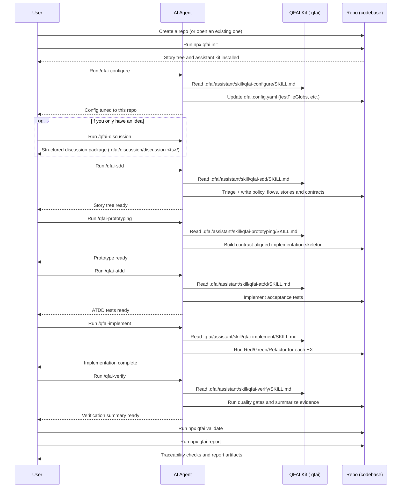
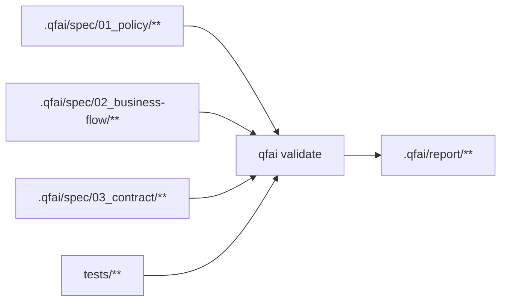

# QFAI (Quality-First AI)

QFAI is a quality-first development kit for AI coding agents.
Its purpose is to improve the quality of AI-generated software outputs by enforcing a structured workflow and validating traceability.

Modern AI coding agents can write code quickly, but they can also misunderstand requirements, drift from intended behavior, or “sound correct” while being wrong.
QFAI addresses these failure modes by standardizing an end-to-end delivery loop and forcing objective checks.

- SDD clarifies what to build, so the agent does not invent requirements while coding.
- ATDD defines acceptance goals as executable scenarios, so correctness is measured rather than assumed.
- TDD enables a self-correcting loop: implement → run tests → fix → repeat.
- Traceability validation enforces that SDD → ATDD → TDD → implementation stays aligned, reducing hallucination-driven drift.
- Result: higher output quality, fewer review cycles, and lower human supervision cost.

QFAI is designed for a skills-driven operating model: engineers select a prepared custom skill and provide only the task intent.
The agent reads the repository, produces the required artifacts, and iterates until the hard gates pass.

## Release status

- Release posture: runtime truthfulness is enforced.
- Prototyping is UI-only and runs through `qfai prototyping iterate --cycle <n>`.
  It evaluates every UI-bearing contract and each screen that contract declares.
  `prototyping.primaryUiContract` in `qfai.config.yaml` pins the primary
  contract; `--primary-ui-contract CON-UI-0001` overrides it. Cycle 0 records
  the full UI contract set as `uiContractsCovered` and `frozenSurfaceUnion` in
  `prototyping.json`. The loop runs through cycles 0..9 with deterministic stop
  codes: 0 (continue), 64 (converged), 65 (cycle limit), 66 (license check),
  and 2 (input or lock drift).
- Runtime observation is observed-only (no synthetic 200 / API / DB prototyping coverage).
- Per-iteration evidence is a single
  `iter-NN/CON-UI-NNNN/<screen>.review.json` per UI contract and screen pair
  (4-axis ordinal verdicts, 6 `*Feel` short-prose impressions
  bounded to 200 words each, `layoutAntiPatternsDetected[]`,
  `designMdViolations[]`, and `pivotDirective`). It is the only
  reviewer-authored file, not the only per-cycle artifact: the CLI itself
  always writes `iterate-plan.json` into the same `iter-NN/` directory, and
  from cycle 1 onward — once the previous cycle is recorded in
  `prototyping.json#iterations[]` — an advisory `iterate-context.json` holding
  the prior scores and open blockers. The opt-in `--capture` and
  `--cycle 0 --emit-skeletons` flags additionally write `<screen>.png` /
  `<screen>.html` there. Archive the whole `iter-NN/` directory; no
  `interaction.json` is written on any path. Certification records
  `uiContractsCovered`, `convergedUiContracts` and `laggingUiContracts`.
- Calibration SSOT is the calibration pack referenced by `calibrationRef.packPath`.

## Installation

qfai is published on npm as **`qfai`**. Install it as a dev dependency:

```bash
npm i -D qfai
# or: pnpm add -D qfai / yarn add -D qfai
```

Let the package manager write the `devDependencies` entry. Do not hand-pin a version
here: `package.json#version` in the published package is the only version source, and a
number copied from prose goes stale on the next release.

> **Do not install from the GitHub repository.** A git specifier such as
> `"qfai": "github:aganesy/QFAI"` maps the dependency key `qfai` to the private monorepo
> root — the manifest `name` is irrelevant, so it lands in `node_modules/qfai` regardless.
> That root ships no `bin` and no built `dist`, so nothing would be runnable or
> importable. Under npm or yarn a `preinstall` guard refuses the install with an
> explanatory error rather than completing silently; under pnpm — or any package manager
> that reports no user agent — it is not caught, so the mistake is yours to avoid. Use the
> npm package. Standalone CLI inspection can use `npx qfai@latest <command>`;
> agent skills require a local package installation for their routing defaults.

## Quick start

> **Windows users:** `qfai init` creates symlinks internally.
> You must enable **Developer Mode** (Settings → System → For developers → Developer Mode: ON)
> before running `npx qfai init`, otherwise symlink creation will fail due to insufficient privileges.

Creating missing governed assistant assets requires filesystem support and
permission for hard links. Init checks this before copying or migrating assets
and stops with recovery guidance when the check fails. `--dry-run` does not probe it.

```bash
npx qfai init
```

Run `/qfai-discussion` and `/qfai-sdd` to fill the seeded story tree. Follow
the project's Standard commands in `<paths.contractsDir>/tech.md` (the default
is [tech.md](.qfai/spec/03_contract/tech.md)) for its quality gates.

## What you can do (CLI commands)

- `npx qfai --version` (alias `-V`)
  - Prints the installed QFAI version to stdout and exits 0. It works anywhere, including outside a project
    with no `qfai.config.yaml`. The same value is also available as the `version` field of
    `npx qfai doctor --format json`.
- `npx qfai init`
  - Creates the QFAI workspace under `.qfai/` and installs the assistant tree
    (`assistant/rule/`, `skill/`, `agent/` and `prompt/`), plus `qfai.config.yaml`.
  - Options:

    | Flag                       | Effect                                                                                                                                                                                                                                                                                                                                   |
    | -------------------------- | ---------------------------------------------------------------------------------------------------------------------------------------------------------------------------------------------------------------------------------------------------------------------------------------------------------------------------------------- |
    | `--dir <path>`             | Output directory (default: the current directory). Wins over `--root` when both are given.                                                                                                                                                                                                                                               |
    | `--root <path>`            | Every other command reads this as the target directory; `init` reads it as the output directory too, but only when `--dir` is omitted.                                                                                                                                                                                                   |
    | `--force`                  | Refresh shipped skills and agents, their host wrappers, and generated Copilot instructions. Shipped rules are refreshed only when their provenance shows they are unedited. Project content, routing overrides and steering are preserved. The managed `.gitignore` block and `core.symlinks` setting are repaired on every non-dry-run. |
    | `--dry-run`                | Report what would change and write nothing. Use it to rehearse `--upgrade-assistant-tree`.                                                                                                                                                                                                                                               |
    | `--upgrade-assistant-tree` | Copy recognized legacy assistant files into the singular tree without deleting a source or overwriting a destination. Migrate old spec packs with `/qfai-migration-spec-to-story`. Unrecognized assistant files stay in place.                                                                                                           |
    | `--yes`                    | Reserved for a future interactive mode; no behavioural difference today.                                                                                                                                                                                                                                                                 |
    | `--verbose`                | Expand the run report's `skipped` list to the full path listing. Off by default, so a no-op re-run prints the skip count and a pointer to this flag instead of every shipped asset path. It does not gate the written or removed listings: those are printed whenever they have entries, with or without this flag.                      |
    | `--help`, `-h`             | Print the CLI usage banner and exit without writing anything. Accepted by every command, `init` included, and handled before the command runs.                                                                                                                                                                                           |
    | `--version`, `-V`          | Print the installed QFAI version to stdout and exit 0. Accepted by every command, `init` included, and handled before the command runs, so it works outside a project too.                                                                                                                                                               |

- `npx qfai validate`
  - Validates the story tree, contracts, test obligations and review artifacts
    (`.qfai/review/review-*/summary.json` + minimum schema), writes `.qfai/report/validate.json`,
    and appends run logs to `.qfai/report/run-*/`; use `--fail-on error` (or `--fail-on warning`) to turn it into a CI gate,
    and `--format github` to emit GitHub-friendly annotations.
    Use `--flow BF-0001` to scope a run to one business flow. `--spec` is retired.
    Use `--profile discussion|sdd|prototyping|atdd|tdd|verify` for local skill-owned checks; CI should use default/full validation (or `verify` / `tdd` for the dedicated CI gates).
- `npx qfai report`
  - Produces a human-readable report (`report.md` by default) or an internal JSON export (`report.json`) from `validate.json`; use `--base-url` to link file paths in Markdown to your repository viewer.
    Use `--flow BF-0001` for a report scoped to that flow.
    Exits non-zero when the reported findings cross the gate (`validation.failOn`, default `error`); use `--fail-on never|warning|error` or `--strict` to override it.
- `npx qfai doctor`
  - Diagnoses configuration discovery, path resolution, glob scanning, and `validate.json` inputs before running validate/report; use `--fail-on` to enforce failures in CI.
    Use `--profile prototyping` to add prototyping-specific preflight checks for the
    primary UI contract, design contract readiness, active agent-wrapper
    integrations, shipped role-input readiness, Playwright CLI launcher
    resolution/probing, and target URL reachability.
    Note: prototyping evidence (`.qfai/evidence/prototyping/prototyping.json`) is produced by the AI workflow
    (`/qfai-prototyping`), not by a general-purpose end-user CLI flow.
    Use `npx qfai prototyping preflight --target-url <url>` for a focused
    prototyping preflight before the skill starts; it surfaces blocking
    `QFAI-DCON-*` design-contract issues alongside runtime assumptions and resolves a runnable Playwright CLI launcher.
    Use `npx qfai prototyping iterate --cycle <n> --target-url <url>` to drive each cycle of the UI contract
    evolution loop. Exit codes: 0 (continue), 64 (convergence), 65 (max-iterations), 66 (license-verify failure), 2 (input or lock drift).
    Evidence refs must resolve to concrete repository-relative artifacts;
    absolute paths are invalid. UI coverage and per-screen reviews use full
    `CON-UI-NNNN` IDs.
    `fullHarness` follows a terminal-first state machine: `status="in-progress"` requires `finalDecision="pending"`,
    `reviewerSignoff.status="pending"`, and no `terminationReason`; `status="completed"` requires `terminationReason`,
    a non-pending `finalDecision`, and a terminal `reviewerSignoff`.
- `npx qfai sdd preflight`
  - Runs the Stage 0 gate of `/qfai-sdd`: selects the active discussion pack, counts the imported `REQ-*`,
    resolves the blockers, and writes the summary run-scoped at
    `<paths.outDir>/preflight/run-<timestamp>/preflight_summary.md`
    (`.qfai/report/preflight/run-<timestamp>/preflight_summary.md` by default; the run reports the path it wrote),
    then refreshes `<paths.outDir>/preflight_summary.md` as the latest-run pointer. Exits 1 when the result is
    `blocked` (use `--fail-on never` to report without failing); `--format json` emits the machine-readable
    result on stdout.
  - Only a missing or misnamed pack blocks. What a present pack lacks or contradicts is listed under the
    summary's `## Pack Gaps` (`packGaps` in the JSON result), and the result stays `ready`: the pack is
    reference material, so the gap is recorded in the SDD artifacts rather than stopping the stage.
  - The pack is the one `npx qfai discussion use <id>` pinned (`.qfai/state.json#discussion.currentId`); the
    newest pack is used only when no pointer is set. A pointer that matches no pack on disk stops the run with
    the candidate list instead of silently gating a different pack.
  - `--assume <text>` (repeatable) records carry-over open questions / assumptions in the summary. Without it
    the carry-over list already present in the `<paths.outDir>/preflight_summary.md` pointer is preserved, not
    overwritten.

## Test annotations

`qfai validate` checks three independent obligations from the story tree:

| Artifact             | Test annotation        | Required layer                   |
| -------------------- | ---------------------- | -------------------------------- |
| Business flow        | `QFAI:BF-0001`         | E2E                              |
| Acceptance criterion | `QFAI:AC-0001-0001-01` | Integration or API               |
| Example              | `QFAI:EX-0001-0001-01` | A selected test file outside E2E |

The layer directories follow `paths.testsDir` in `qfai.config.yaml`; `tests/`
is the default. `validation.traceability.testFileGlobs` selects test files.
An annotation for an unknown ID or in the wrong layer is an
error. A `Test exception:` decision row can exempt a specific BF, AC or EX;
validation reports that exemption. The former `QFAI:SPEC-...` and contract
annotations do not satisfy these obligations.

## Operating model (skills-driven workflow)

QFAI assumes you operate the project primarily via prepared custom skills.
A custom skill is a reusable task instruction set for your AI coding agent.
The agent reads QFAI assets under `.qfai/assistant/` and produces or updates SDD/ATDD/TDD artifacts and code.

### Where the skills live

- QFAI canonical skills (SSOT): `.qfai/assistant/skill/**` (may be overwritten when you re-run `qfai init --force`).
- QFAI does not create local override scaffolds. Project-specific guidance belongs in your repository's normal agent docs, or is created explicitly by your AI workflow.

### Minimal custom skill set

QFAI includes a small set of custom skills (stored under `.qfai/assistant/skill/`) designed to keep the workflow opinionated and repeatable.

- **qfai-configure**: Analyze the repository (language, frameworks, test layout, directory structure)
  and adjust `qfai.config.yaml` accordingly (especially `testFileGlobs`).
  Run this once right after `npx qfai init`, and re-run it when the repository structure changes.
- **qfai-discussion**: Run a unified structured discussion that produces and maintains the latest discussion pack
  as 15 required markdown files under `.qfai/discussion/discussion-<ts>/`.
  UI-bearing discussion packs may include `prototyping.yaml` as an optional recommendation artifact; non-ui discussion packs typically omit it.
- **qfai-sdd**: Triage requirements against the existing story tree. Write
  policy, business flows, stories with AC and EX, then enforcing contracts with
  BR. Record triage, change requests and unresolved questions in the two root
  tables. The discussion pack is input; the story tree is the execution SSOT.
- **qfai-prototyping**: Iterate every UI-bearing contract and its screens
  through up to ten generate, capture and review cycles. Convergence requires
  exceptional scores on all four UX axes with no layout or design-token
  violations. The primary UI contract is a selection pin, not a limit on
  coverage.
- **qfai-atdd**: Write E2E tests for each BF and integration or API tests for
  each AC of the selected flow.
- **qfai-implement**: Implement a BF through EX tests and a Red, Green,
  Refactor cycle for each example.
- **qfai-migration-spec-to-story**: Move an existing spec-pack project to the
  story tree with ten bundled scripts. Preview and apply each step, then resolve
  items retained in the migration reports. The bundled
  [migration guide](packages/qfai/assets/init/.qfai/assistant/skill/qfai-migration-spec-to-story/references/migration-guide.md)
  defines the plan and report. This skill is not
  a CLI command. See the [2.0.0 migration guide](https://github.com/aganesy/QFAI/blob/main/packages/qfai/docs/MIGRATION-2.0.0.md).
- **qfai-verify**: Run documented quality gates and produce reviewer-approved evidence under `.qfai/evidence/`.

On a project with the old spec layout, `qfai init` installs the migration skill
without seeding a competing `.qfai/spec/` tree. Run the skill before adopting
the new layout.

### Workflow sequence (example)

This sequence shows which skill to run, in what order, and what artifacts to expect.



Operational notes.

- Each custom skill must output in the user’s language (absolute requirement).
- Each custom skill must end with a completion message that enumerates all available next actions and clearly states what to do for each option.
- Except `qfai-discussion`, each skill must analyze the project context (architecture, tech stack, test framework, repo structure) before generating artifacts or code.
- Skills should delegate work to multiple role-based sub-agents (Planner, Architect, Contract Designer, QA, Code Reviewer, etc.) to emulate a real delivery flow.
- Triage decisions and change requests live in `.qfai/spec/decisions.md`;
  unresolved questions live in `.qfai/spec/open-questions.md`.
- Review pack structure — `.qfai/review/review-<YYYYMMDDhhmmssSSS>/{review_request.md,R01_*.md,summary.json}` — is the one layout enforced by validation (`QFAI-REVIEW-*`).
- Agent cards under `.qfai/assistant/agent/` define each role. The installed package supplies routing and review-profile defaults in `assets/defaults/`.
- Project `routing` and `reviewProfiles` entries in `qfai.config.yaml` replace matching defaults as complete entries.

## Configuration

Configuration is stored at the repository root as `qfai.config.yaml`; you can change paths, traceability policies, and validation policy.

Example: override paths and traceability globs.

```yaml
paths:
  contractsDir: .qfai/spec/03_contract
  specsDir: .qfai/spec
  discussionDir: .qfai/discussion
  outDir: .qfai/report
  skillsDir: .qfai/assistant/skill
  srcDir: src
  testsDir: tests
validation:
  failOn: error # error | warning | never
  traceability:
    testFileGlobs:
      - "src/**/*.test.ts"
      - "tests/**/*.spec.ts"
    testFileExcludeGlobs:
      - "**/fixtures/**"
```

Notes.

- `validate.json` is a **public** surface: its keys are documented in
  `.qfai/assistant/skill/qfai-verify/references/validate-json-schema.md`.
  Changes to its keys follow the `@api` classification in
  `.qfai/assistant/rule/change-classification.md`. The `message` text and
  issue order are not stable; match on `issues[].code`.
- `report.json`, `doctor.json`, and `run-*` JSON logs are internal exports and are not a stable external contract; prefer `report.md` for integrations that must survive tool upgrades.
- `prototyping.calibration.packPath` points to the calibration pack SSOT; runtime and validator both resolve thresholds and iteration parameters from that pack.
- `prototyping.calibration.thresholds`, `maxIterations`, `plateauDelta`, and `plateauLookback` are unsupported public config fields.
  Put calibration values in the referenced pack instead of `qfai.config.yaml`.
- Observability modules (`src/core/observability/`) exist as foundation code but are **not yet integrated into blocking validation**. They are reserved for future operational instrumentation.

## Specifications and contracts (SDD)

QFAI keeps policy, behavior and enforcing contracts in one story tree:

- `01_policy/` holds objectives, initiatives, principles, constraints and terms.
- `02_business-flow/` holds the flow index, each BF and its user stories. Each
  story has `01_User-story.md`, `02_Acceptance-Criteria.md` and `03_Example.md`.
- `03_contract/` holds the contract index and API, DB, UI, CLI and design
  contracts. A BR is defined in the contract that enforces it.
- `decisions.md` and `open-questions.md` record project decisions and open
  questions in append-only four-column tables.

The traceability chain is BF → US → AC → EX, with BR → EX from the contracts.
Each EX names one AC in its story; every AC has an EX, and every EX is cited by
a BR. Validation checks this chain and the independent BF, AC and EX test
obligations.

## SSOT boundaries



- Story and policy SSOT: `paths.specsDir` (`.qfai/spec/` by default).
- Contract SSOT: `paths.contractsDir` (`.qfai/spec/03_contract/` by default).
- Project quality-gate commands: [Standard commands](.qfai/spec/03_contract/tech.md#standard-commands-copy-paste)
  in the default contract tree.
- Report outputs (`.qfai/report/**`) are derived artifacts and not SSOT.

## Minimal tutorial

1. `npx qfai init`
2. Run `/qfai-discussion` to structure scope, open questions, and produce a discussion pack under `.qfai/discussion/discussion-<ts>/`.
3. Run `/qfai-sdd` to write policy, flows, stories and contracts.
4. Run `/qfai-prototyping` for UI-bearing contracts, then `/qfai-atdd` and
   `/qfai-implement` for each flow.
5. Keep each completed review under `.qfai/review/review-<timestamp>/`.
6. Run `/qfai-verify` using the commands in `<paths.contractsDir>/tech.md`.

## FAQ

- Q: A story directory fails validation.
  - A: Keep exactly `01_User-story.md`, `02_Acceptance-Criteria.md` and
    `03_Example.md` in it. Match its `US` ID to the parent BF number, and
    match each AC and EX ID to that story.
- Q: Validation reports a broken AC, EX or BR link.
  - A: Give each EX one `AC-Ref` in the same story, give each AC an EX, and
    cite every EX from a BR in its enforcing contract. List every contract
    file in the [contract index](.qfai/spec/03_contract/contracts.md) under
    `<paths.contractsDir>`.
- Q: An old spec-pack project reports `QFAI-LAYOUT-001`.
  - A: Run `/qfai-migration-spec-to-story`. The detector reads the configured
    `paths.specsDir`. Set that path to the old tree when the project has no
    existing setting; the new default is `.qfai/spec/`.
- Q: `/qfai-sdd` requires approval for a proposed change.
  - A: Record its scope and source in a `decisions.md` row. CREATE, DELETE,
    SPLIT, MERGE, SUPERSEDE and UPDATE:REMOVE require explicit approval before
    the dependent write. A rejected option stays recorded.

## Continuous integration

QFAI generates integration wrappers under `.agents/**`, `.claude/**`,
`.github/**`, and `.codex/**`.
`npx qfai init` also installs three GitHub Actions workflows,
`.github/workflows/qfai-validate.yml`, `.github/workflows/qfai-tests.yml` and
`.github/workflows/qfai-docs.yml`.
It writes exactly those three files into that directory and touches nothing else
there, and all three open with a ``# Generated by `qfai init` `` line. All three trigger on
every push to `main` or `master` and on every pull request, and all three run on the
runner `vars.QFAI_CI_RUNNER` names (`ubuntu-latest` when you set nothing).

- `qfai-validate.yml` runs `npx qfai validate --profile full --fail-on error`,
  and on a pull request also `npx qfai validate --profile drift --fail-on error`.
  The `full` profile evaluates every gate group except drift, so without the
  second run nothing there could fail on a downstream edit to upstream SSOT.
  It installs dependencies from whichever lockfile the repository has (pnpm /
  yarn / npm) and falls back to `npm install` when there is none, and it takes
  the Node version from your `.nvmrc` or `.node-version`, warning and
  continuing on Node 20 when you have neither. The pnpm route is the one
  precondition it stops closed on: the pnpm setup action resolves the pnpm
  version from `package.json#packageManager` and from nowhere else, so a tree
  holding a `pnpm-lock.yaml` with no such field fails the job with an
  annotation naming the field rather than reporting a validation it never ran.
  Declare `"packageManager": "pnpm@X.Y.Z"` so CI matches the version you
  develop against. The `full` profile includes the `QFAI-TEST-001` test-todo
  stub gate, so the job can fail your default branch on findings your existing
  CI never checked.
- `qfai-tests.yml` declares one lane per test layer (unit, component,
  integration, api, e2e) and runs none of them until you opt in: a lane runs
  only when your `package.json` declares the matching `test:<layer>` script
  **and** a name-only diff against the base commit selected that lane. On a
  repository that declares no such script it executes nothing.
- `qfai-docs.yml` checks the SHAPE of your SDD documents and the syntax of every
  Mermaid diagram in them — the two questions markdownlint cannot answer, because
  it validates the Markdown around a fenced block and treats the block's body as
  opaque text. See "Document quality" below for what each half checks. It shares
  the validate lane's install and Node-version behaviour, including the same
  pnpm precondition. It runs only when the change could reach what it checks: a
  change whose every path is code no document check reads — a `.ts` file, a
  stylesheet, an image — skips both checks and the installs they would pay for,
  and any other change, or any doubt about the diff, runs them. It runs files out
  of the QFAI package rather than the `qfai` bin, so it needs the package on
  disk: when your install has not already put one there it fetches QFAI itself,
  saving nothing to your manifest. If you do depend on QFAI, the lane reports the
  rules of the version you pinned and never replaces it.

A push to `main` or `master` runs the test lanes and the document checks again by
default, because nothing in the files can tell whether that commit passed a pull
request first. If your branch protection requires these checks before every merge,
set the repository variable `QFAI_CI_PUSH_POLICY` to `protected`: the push then runs
neither, and `qfai validate` still runs as the post-merge check.

All three files are copied create-only — `qfai init` never overwrites an existing
copy, not even with `--force` — so edit them freely. Deleting one is a choice
`qfai init` remembers rather than undoes: it records what it installed in
`.qfai/install-provenance.json` (keep that file committed), and never recreates
a workflow you removed.

Those two rules together mean a corrected template does not arrive on its own.
`qfai doctor` reports an installed workflow whose content no longer matches the
packaged one; taking the new copy is yours to do, either way round:

```bash
# Take the packaged file directly, leaving the record alone.
cp node_modules/qfai/assets/init/root/.github/workflows/qfai-docs.yml .github/workflows/

# Or let init write it: remove the file and its entry from the record first,
# otherwise the deletion reads as a decision and init writes nothing.
```

Read your own edits out of the old copy before you replace it. Neither route
merges them.

On any other CI platform, configure the job yourself and run:

```bash
pnpm ci:gate
pnpm check-types:future
# or, minimum gate only:
npx qfai validate --fail-on error
```

Document quality.

`qfai-docs.yml` checks the structure of story-tree Markdown and the syntax of
Mermaid diagrams. An acceptance-criteria file without a Gherkin scenario, an
example table without `AC-Ref`, or a malformed flow diagram needs more than
Markdown formatting checks.

- **Document shape** comes from the schemas the package ships in
  `assets/mdschema/`: one per SDD document type, declaring which chapters it
  needs and whether each is a list, a table with named columns, a Gherkin block
  or a Mermaid diagram. They are the schemas the `qfai-sdd` templates were
  written against, so a document authored from the template passes by
  construction. The driver reads `paths.specsDir` from your `qfai.config.yaml`,
  so a relocated story tree is covered without editing the driver.
- **Mermaid syntax** is checked with Mermaid's own grammar under a headless DOM
  — the parse the renderer performs before it draws, with no browser and no
  rendering. A template block carrying `<placeholder>` tokens opts out with
  `<!-- mermaid-lint:ignore -->` on the line directly above its opening fence.

Both lanes report the count they checked. With no matching documents, they
report zero rather than presenting an empty scan as coverage.

Record project-specific gate commands in the Standard commands section of
`<paths.contractsDir>/tech.md`. Set traceability globs in `qfai.config.yaml` to match
the test files that implement BF, AC and EX obligations.

Waiver policy.

- A waiver's `rule:` is the exact finding `code` in
  `.qfai/report/validate.json`.
- Use waivers only for `warning` / `info` findings (false positives).
- Waivers that target `error` findings are invalid and fail validation (`QFAI-WAIVER-002`).
- Expired waivers are reported as warnings (`QFAI-WAIVER-003`) and must be renewed or removed with evidence.
- Suppressed findings remain visible in reports as `suppressed=true`; waivers do not erase findings.

Typical customizations.

- Add a `doctor` step before validate if you want to fail fast on path/glob/config issues.
- Publish `.qfai/report/validate.json`, `report.md`, and relevant `.qfai/report/run-*/` logs as CI artifacts.

### Keeping QFAI itself up to date

A `qfai` bump is the one dependency update that is not finished when the version
number changes. The package writes an assistant tree into your repository —
skills and agents under `.qfai/assistant/**`, and the integration wrappers under
`.agents/`, `.claude/`, `.codex/` and `.github/` — and a new version of the
package does not refresh what a previous one already wrote. Only
`npx qfai init --force` does that.

Moving a project from the spec-pack layout to the story tree also requires
`/qfai-migration-spec-to-story`. `init --force` refreshes shipped assets; the
migration skill moves project content and reports items that need a person.

Merging the bump on its own leaves the repository claiming a version whose
skills it does not have. If you use Renovate, QFAI publishes a preset that keeps
the two together:

```json
{
  "extends": ["config:recommended", "github>aganesy/QFAI//.github/renovate-presets/qfai"]
}
```

The preset automerges every dependency update once your CI is green, and asks
Renovate to run `qfai init --force` inside the update branch so the regenerated
tree is committed into the same pull request.

Whether that command may run is a Renovate **administrator** setting
(`allowedCommands`) that no config file can read: self-hosted Renovate can allow
it, and the hosted app does not by default. So the preset above fails closed — a
`qfai` bump is the one update it does **not** automerge, and the pull request
tells you whether the regenerated tree is already in the diff. Once the command
is allow-listed, extend
`github>aganesy/QFAI//.github/renovate-presets/qfai-self-hosted` instead, which
is the same preset with that hold removed.

Two things to know before turning it on:

- `--force` rewrites the generated integration READMEs and
  `.github/copilot-instructions.md` without asking. Keep local edits out of those
  files; the flag's table under [What you can do](#what-you-can-do-cli-commands)
  lists exactly which ones it owns.
- Automerge means your CI is the only gate. On GitHub, that requires branch
  protection to actually require a status check — with none required, a pull
  request merges before any lane starts.

Not using Renovate? The equivalent is to run `npx qfai init --force` in the same
commit that bumps the package, and to keep the two from being merged separately.

## Generated structure

`npx qfai init` generates these paths, among others, in your repository.

```text
.
├── .agents
│   └── skills
│       └── qfai-configure
│           └── SKILL.md
├── .github
│   └── workflows
│       ├── qfai-tests.yml
│       └── qfai-validate.yml
├── .qfai
│   ├── assistant
│   │   ├── agent
│   │   │   └── <role>.md
│   │   ├── prompt
│   │   ├── rule
│   │   │   ├── constitution.md
│   │   │   ├── test-layers.md
│   │   │   └── worklog-entry.schema.md
│   │   └── skill
│   │       ├── qfai-migration-spec-to-story
│   │       │   └── SKILL.md
│   │       └── <other QFAI skills>
│   ├── spec
│   │   ├── decisions.md
│   │   ├── open-questions.md
│   │   ├── 01_policy
│   │   │   ├── objective.md
│   │   │   └── <other policy files>
│   │   ├── 02_business-flow
│   │   │   └── business-flows.md
│   │   └── 03_contract
│   │       ├── contracts.md
│   │       ├── structure.md
│   │       └── tech.md
│   └── waivers.yml
└── qfai.config.yaml
```

`qfai init` writes policy templates and the flow and contract indexes with
no item rows. It creates no `business-flow-NNNN/` or
`user-story-NNNN-NNNN/` instance, so a fresh tree has no BF, AC or EX test
obligation. Skills create instances and evidence when real work exists.

It writes no `README.md` either, anywhere. Guidance about an artifact lives with
the skill that writes that artifact, under `references/` and `templates/` in
`.qfai/assistant/skill/**`, which is where a reader looking for it goes and
where it stays current across upgrades. A README beside the artifacts is a
second copy that nothing refreshes. A release that finds the one earlier
versions wrote at the root of the assistant tree removes it, and leaves a README
a project wrote for itself alone.

### AI work-log surface (`.qfai/steering/`)

`qfai init` also creates `.qfai/steering/`, the per-project work-log surface for
AI coding agents, with an `entry.md` template under `_template/`. Each entry is a
markdown file with YAML frontmatter, and `npx qfai validate` polices the surface in
the `sdd` and full profiles via `W-WORKLOG-SCHEMA`, `W-WORKLOG-BROKEN-LINK`,
`W-WORKLOG-STALE`, `W-PENDING-PROMOTION` and `R-HANDOFF-INCOMPLETE`.

The frontmatter contract and the **per-kind write trigger** — which `kind` an
agent writes when — are in the shipped
`.qfai/assistant/rule/worklog-entry.schema.md`.

Note that `.qfai/steering/` (the work-log surface) is a different directory from
the legacy `.qfai/assistant/steering/` (the pre-recut assistant path).

Integration wrappers are also generated for immediate use:

- Agents/Codex VS Code: `.agents/skills/**`
- Claude Code: `.claude/skills/**`, `.claude/agents/**`
- GitHub Copilot: `.github/skills/**`, `.github/agents/**`
- Codex: `.codex/skills/**`, `.codex/agents/**`

## Agent integrations

`npx qfai init` installs canonical skills under `.qfai/assistant/skill/**` (SSOT)
and generates thin wrapper assets for Agents/Codex VS Code / Copilot / Claude Code / Codex.
Each card under `.qfai/assistant/agent/**` defines its role in YAML frontmatter.
Claude Code and GitHub Copilot use compatible fields, while Codex consumes
`.codex/agents/*.toml` profiles generated from that same card.
Install `qfai` in the project so the agent can load the package routing and
review-profile defaults. Running through `npx qfai@latest` alone does not
provide those defaults to the agent.
The `.claude` / `.github` agent wrappers are symlinks and follow the canonical document
automatically; the Codex profiles are generated files, so rerun `npx qfai init --force`
to refresh them (and any other wrapper asset that has drifted).
`--force` deletes as well as overwrites: it removes the command and prompt wrappers
under `.claude/commands/` and `.github/prompts/`, and the skill wrappers under
`.claude/skills/`, `.agents/skills/`, `.codex/skills/` and `.github/skills/` for skills that are
not in the current release, whether those wrappers are directories or symlinks.
Files it did not write — a project's own slash command, prompt file or skill,
including one published from a project-authored `.qfai/assistant/skill/` entry — are left in place,
whatever they are named. Ownership is read from the file, not the name: a wrapper is removed only when
it carries the delegation line to the canonical document of the same name, or is a symlink into
`.qfai/assistant/skill/`. One consequence of that: a symlink has no content to prove who wrote it, so
if you publish a canonical skill of your own under a name QFAI itself once shipped, `--force` removes
that link. Your `.qfai/assistant/skill/` entry is untouched; re-create the link to publish it again.

### Cross-AI rules and the writing reminder

`npx qfai init` seeds `.agents/rules/**`, the rule set every AI coding agent in
the project shares, and points `AGENTS.md` and `CLAUDE.md` at it. One of those
rules, `documentation-clarity.md`, sets the writing standard for pull requests,
issues, code comments and Markdown: no project-local identifiers, no account of
how the work went, cut to what a reader outside the team can follow.

Claude Code is reminded of it at the two moments it matters, through hooks in
`.claude/settings.json`:

| Moment                                                           | Hook        |
| ---------------------------------------------------------------- | ----------- |
| Posting a pull request, issue or review through the GitHub tools | PreToolUse  |
| Writing or editing a Markdown file                               | PostToolUse |

A project without a settings file receives the whole shipped one. A project that
already has settings keeps them: missing hook groups are added after whatever is
already there, and a second run adds nothing. A settings file that is not
readable JSON is left untouched and reported.

Each hook runs `node` directly, with no shell and no network, and prints one
message from `.agents/rules/reminders.json`. A missing or unreadable message
file prints nothing. `qfai init` refreshes that file wherever the project has
not edited it, so a new release's wording reaches an existing project without
changing `.claude/settings.json`. Remove the entries to turn the reminder off;
the rule still applies.

A hook group an earlier release wrote, still exactly as written, is replaced by
this release's group on the next `qfai init`. A group the project edited is
kept, and the run names it. To update one by hand, run
`npx qfai init --dir <scratch-dir>` in an unused scratch directory and compare
its `.claude/settings.json` with your project's file, group by group.

## Contributing (for QFAI maintainers)

This repository is a monorepo, and the distributable package is under `packages/qfai`.
The repository root `README.md` and `packages/qfai/README.md` are kept aligned by
`scripts/check-readme-alignment.mjs`, which CI runs as part of `pnpm ci:lint`: every line
outside a `readme-align:ignore-start` / `readme-align:ignore-end` HTML-comment block must be
identical in both files. When you change documentation, apply the edit to both READMEs, or
wrap the intentionally file-specific part in those markers.

## License

MIT
