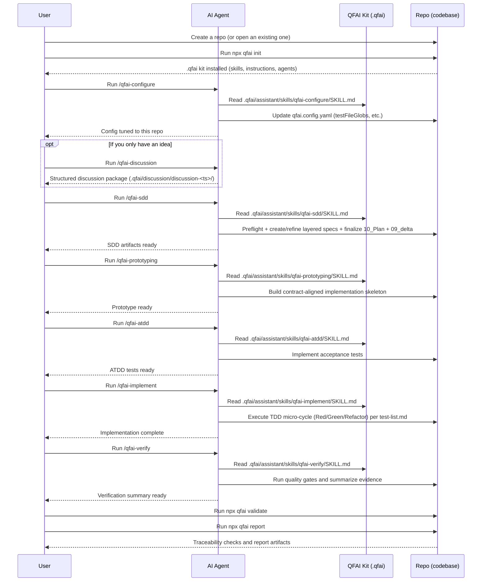
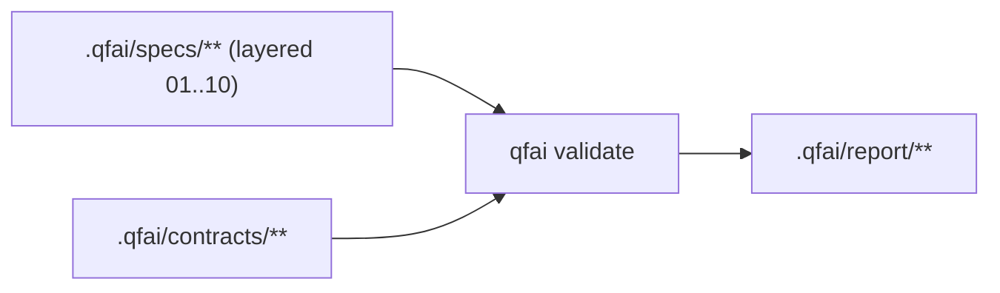

# QFAI (Quality-First AI)

QFAI is a quality-first development kit for AI coding agents.
Its purpose is to improve the quality of AI-generated software outputs by enforcing a structured workflow and validating traceability.

Modern AI coding agents can write code quickly, but they can also misunderstand requirements, drift from intended behavior, or “sound correct” while being wrong.
QFAI addresses these failure modes by standardizing an end-to-end delivery loop and forcing objective checks.

- SDD clarifies what to build, so the agent does not invent requirements while coding.
- ATDD defines acceptance goals as executable scenarios, so correctness is measured rather than assumed.
- TDD enables a self-correcting loop: implement → run tests → fix → repeat.
- Traceability validation enforces that SDD → ATDD → TDD → implementation stays aligned, reducing hallucination-driven drift.
- Result: higher output quality, fewer review cycles, and lower human supervision cost.

QFAI is designed for a skills-driven operating model: engineers select a prepared custom skill and provide only the task intent.
The agent reads the repository, produces the required artifacts, and iterates until the hard gates pass.

## Release status

- Current package version: `1.7.7`
- Release posture: v1.7.7 is the correction release that aligns the v1.7.6 remediation line before deeper prototyping work.
- Current repo note: some repo-wide `qfai validate --fail-on error` blockers still come from historical review/evidence/ATDD/TDD artifacts and are being cleaned incrementally.

## Quick start

> **Windows users:** `qfai init` creates symlinks internally.
> You must enable **Developer Mode** (Settings → System → For developers → Developer Mode: ON)
> before running `npx qfai init`, otherwise symlink creation will fail due to insufficient privileges.

```bash
# 1) Initialize QFAI assets in your repository
npx qfai init

# 2) Validate traceability (use this in CI as a hard gate)
npx qfai validate

# 3) Generate a human-readable report (Markdown)
npx qfai report
```

## What you can do (CLI commands)

- `npx qfai init`
  - Creates the QFAI workspace under `.qfai/` (requirements/specs/contracts/report) and installs the AI assistant kit
    (`assistant/` with skills, instructions, agents, and steering templates), plus `qfai.config.yaml`.
- `npx qfai validate`
  - Validates specs/contracts/scenarios/traceability and review artifacts
    (`.qfai/review/review-*/summary.json` + minimum schema), writes `.qfai/report/validate.json`,
    and appends run logs to `.qfai/report/run-*/`; use `--fail-on error` (or `--fail-on warning`) to turn it into a CI gate,
    and `--format github` to emit GitHub-friendly annotations.
    Use `--phase refinement` only for local refinement checks; CI should use default/full validation.
- `npx qfai report`
  - Produces a human-readable report (`report.md` by default) or an internal JSON export (`report.json`) from `validate.json`; use `--base-url` to link file paths in Markdown to your repository viewer.
- `npx qfai doctor`
  - Diagnoses configuration discovery, path resolution, glob scanning, and `validate.json` inputs before running validate/report; use `--fail-on` to enforce failures in CI.
- `npx qfai prototyping --autogen-ui-fidelity --base-url <url>`
  - Auto-generates `uiFidelity` evidence by crawling UI routes and collecting DOM labels;
    writes to `.qfai/evidence/prototyping.json` (or `--evidence-out <path>`).
    Requires `--base-url` or `QFAI_PROTOTYPE_BASE_URL` to specify the running application URL.
    Use `--autogen-only` to fail when generation fails (for CI gates).
    Enable with `QFAI_PROTOTYPE_FIDELITY_AUTOGEN=1` as an alternative to `--autogen-ui-fidelity`.

## ATDD annotation hard gate

`qfai validate` enforces spec-to-test traceability with directory-based rules.

- `tests/e2e/**`: annotate all covered user stories with `QFAI:SPEC-XXXX:US-YYYY`.
- `tests/integration/**`: annotate all covered test cases with `QFAI:SPEC-XXXX:TC-YYYY`.
- `tests/api/**`: annotate all covered API contracts with `QFAI:CON-API-XXXX`.
- `tests/api/**` and `tests/e2e/**` must not use `TC` annotations.
- `AC` annotations are not required in code; AC coverage is treated as indirect through full `TC` coverage.

## Prototyping uiFidelity autogen

`qfai prototyping --autogen-ui-fidelity` auto-generates `uiFidelity` evidence by:

1. Extracting expected labels/actions from `contracts/ui/**` (YAML).
2. Crawling the running application routes via headless fetch + jsdom.
3. Computing label coverage (found vs. missing).
4. Heuristically evaluating `mockPaths` (route reachability + navigate targets).
5. Writing the result to `.qfai/evidence/prototyping.json`.

### Prerequisites

- Labels must be rendered in the DOM (text, aria-label, placeholder, etc.).
- Routes must be reachable (authentication bypass or test fixtures as needed).
- `--base-url` must point to a running instance of the application.

### CI integration example

```yaml
- name: Start app (background)
  run: npm start &
  env:
    DISABLE_AUTH: "true"

- name: Wait for app
  run: npx wait-on http://localhost:3000

- name: Run qfai prototyping autogen
  run: |
    npx qfai prototyping --autogen-ui-fidelity --base-url http://localhost:3000 --autogen-only
```

### Failure handling

- If autogen fails, `uiFidelityAutogen.status=failed` is recorded in the evidence, but existing `uiFidelity` data is not removed.
- `--autogen-only` causes exit code 1 on failure; without it, exit code is always 0 (safe fallback).

## Operating model (skills-driven workflow)

QFAI assumes you operate the project primarily via prepared custom skills.
A custom skill is a reusable task instruction set for your AI coding agent.
The agent reads QFAI assets under `.qfai/assistant/` and produces or updates SDD/ATDD/TDD artifacts and code.

### Where the skills live

- QFAI canonical skills (SSOT): `.qfai/assistant/skills/**` (may be overwritten when you re-run `qfai init --force`).
- Your local overrides: `.qfai/assistant/skills.local/**` (never overwritten by QFAI; prefer this for project-specific customizations).

### Minimal custom skill set

QFAI includes a small set of custom skills (stored under `.qfai/assistant/skills/`) designed to keep the workflow opinionated and repeatable.

- **qfai-configure**: Analyze the repository (language, frameworks, test layout, directory structure)
  and tailor `qfai.config.yaml` accordingly (especially `testFileGlobs`).
  Run this once right after `npx qfai init`, and re-run it when the repository structure changes.
- **qfai-discussion**: Run a unified structured discussion that merges discuss and require into a single 15-file discussion pack under `.qfai/discussion/discussion-<ts>/`.
- **qfai-sdd**: Unified SDD entrypoint with discussion-pack preflight guard (missing/incomplete/blocking OQ causes stop + next action guidance).
- **qfai-prototyping**: Build an all-spec contract-aligned skeleton and prove runtime coverage before deep coding.
- **qfai-atdd**: Implement acceptance tests driven by specs/scenarios.
- **qfai-implement**: Unified TDD micro-cycle (Red/Green/Refactor) one test at a time using `test-list.md` as the execution ledger, including ledger status updates and exception closure.
- **qfai-verify**: Run full-scan local quality gates (`validate --fail-on error`, `report`, repo gates) and produce reviewer-approved evidence under `.qfai/evidence/`.

### Workflow sequence (example)

This sequence shows which skill to run, in what order, and what artifacts to expect.



Operational notes.

- Each custom skill must output in the user’s language (absolute requirement).
- Each custom skill must end with a completion message that enumerates all available next actions and clearly states what to do for each option.
- Except `qfai-discussion`, each skill must analyze the project context (architecture, tech stack, test framework, repo structure) before generating artifacts or code.
- Skills should delegate work to multiple role-based sub-agents (Planner, Architect, Contract Designer, QA, Code Reviewer, etc.) to emulate a real delivery flow.
- Change classification (Primary/Tags) is required in `09_delta.md` and recommended in PRs. See `.qfai/assistant/instructions/change-classification.md`.
- Verification planning is recorded in `09_delta.md` (`Verification -> Plan`) and validated in CI (`VFY-*` rules).
- Review gate policies (required/optional layers and reviewers) are defined in `.qfai/assistant/steering/review-gate.rules.yml`.
- Agent taxonomy and invocation SSOT are defined in `.qfai/assistant/steering/agent-catalog.yml`, `.qfai/assistant/steering/agent-routing.yml`, and `.qfai/assistant/steering/review-profiles.yml`.

## Configuration

Configuration is stored at the repository root as `qfai.config.yaml`; you can change paths, traceability policies, and CI gate thresholds.

Example: override paths and traceability globs.

```yaml
paths:
  contractsDir: .qfai/contracts
  specsDir: .qfai/specs
  discussionDir: .qfai/discussion
  outDir: .qfai/report
  skillsDir: .qfai/assistant/skills
  srcDir: src
  testsDir: tests
validation:
  failOn: error # error | warning | never
  traceability:
    testFileGlobs:
      - "src/**/*.test.ts"
      - "tests/**/*.spec.ts"
    testFileExcludeGlobs:
      - "**/fixtures/**"
    scMustHaveTest: true
    scNoTestSeverity: warning # error | warning
```

Notes.

- `validate.json`, `report.json`, `doctor.json`, and `run-*` JSON logs are internal exports and are not a stable external contract; prefer `report.md` for integrations that must survive tool upgrades.
- Scenario files are expected to use the Gherkin extension `*.feature` (not `*.md`).

## Specifications and contracts (SDD)

QFAI uses a small, opinionated set of artifacts to reduce ambiguity and prevent agents from “inventing” behavior.

- Requirements: what you want to achieve, constraints, and explicit non-goals.
- Specs: structured expected behaviors, inputs/outputs, edge cases, and invariants.
- Contracts:
  - UI contracts: YAML (`.yaml` / `.yml`)
  - API contracts: YAML (`.yaml` / `.yml`)
  - DB contracts: SQL (`.sql`)
- Scenarios (ATDD): Gherkin `.feature` files

Traceability is validated across these artifacts, so code changes remain grounded in the specs and the tests prove compliance.

## SSOT boundaries



- Specs SSOT: `.qfai/specs/**` (layered files `01_Spec.md`..`09_delta.md` + shared delta layer)
- Contracts SSOT: `.qfai/contracts/**`
- Report outputs (`.qfai/report/**`) are derived artifacts and not SSOT.

## Minimal tutorial (v1.7.7)

1. `npx qfai init`
2. Run `/qfai-discussion` to structure scope, open questions, and produce a discussion pack under `.qfai/discussion/discussion-<ts>/`.
3. Run `/qfai-sdd` to build layered specs and finalized plans.
4. For each completed review cycle, append artifacts under `.qfai/review/review-<timestamp>/`.
5. Run `npx qfai validate` then `npx qfai report`.

Release gate behavior:

- Merge gate: `qfai validate` must pass (`error=0`), and open OQ is warning.
- Release gate: set `release_candidate: true` in the Initiative layer (`03_Initiative.md`); open OQ then becomes error.

## FAQ

- Q: I referenced AC/TC directly from upper layers and got an error.
  - A: Keep upper-to-lower references out of upper docs; use `16_Traceability-ledger.md` for cross-layer linkage.
- Q: Ledger validation fails with missing columns.
  - A: Ensure required columns exist: `trace_id,obj_id,init_id,cap_id,flow_id,us_id,ac_id,ex_ids,tc_ids`.
- Q: `09_delta.md` fails validation.
  - A: Include all required sections (`Change Summary`, `Rationale`, `Candidates Considered`, `Adopted`, `Rejected`, `Impact`, `Follow-ups`) and include both `DO NOT` and `Temptation` in `Rejected`.
- Q: release_candidate validation fails due open questions.
  - A: Keep specs definition-only, use `.qfai/report/run-*` as execution logs, and convert open OQ to `resolved` or `deferred` with evidence.

## Continuous integration

QFAI generates integration wrappers under `.agents/**`, `.claude/**`,
`.github/**`, and `.codex/**`.
It does not generate GitHub Actions workflows.
Configure CI in your own platform and run:

```bash
pnpm ci:gate
pnpm check-types:future
# or, minimum gate only:
npx qfai validate --fail-on error
```

Recommended baseline.

- Keep CI on default/full validation (`qfai validate --fail-on error`); do not use `--phase refinement` in CI.
- Keep `pnpm check-types:future` as a separate mandatory gate so future TS compatibility runs once without duplicating `pnpm ci:gate`.
- Add a report step (`npx qfai report`) when you need a human-readable artifact.
- Tune traceability globs in `qfai.config.yaml` to match your test layout.

Waiver policy.

- Use waivers only for `warning` / `info` findings (false positives, phased migration noise).
- Waivers that target `error` findings are invalid and fail validation (`QFAI-WAIVER-002`).
- Expired waivers are reported as warnings (`QFAI-WAIVER-003`) and must be renewed or removed with evidence.
- Suppressed findings remain visible in reports as `suppressed=true`; waivers do not erase findings.

Typical customizations.

- Add a `doctor` step before validate if you want to fail fast on path/glob/config issues.
- Publish `.qfai/report/validate.json`, `report.md`, and relevant `.qfai/report/run-*/` logs as CI artifacts.

## Generated structure

`npx qfai init` generates the following structure in your repository.

```text
.
├── .agents
│   ├── README.md
│   └── skills
│       └── qfai-configure
│           └── SKILL.md
├── .qfai
│   ├── assistant
│   │   ├── agents
│   │   │   ├── README.md
│   │   │   ├── acceptance-test-engineer.md
│   │   │   ├── architecture-reviewer.md
│   │   │   ├── backend-engineer.md
│   │   │   ├── completion-reviewer.md
│   │   │   ├── delivery-planner.md
│   │   │   ├── devops-ci-engineer.md
│   │   │   ├── discovery-analyst.md
│   │   │   ├── frontend-engineer.md
│   │   │   ├── implementation-reviewer.md
│   │   │   ├── orchestrator.md
│   │   │   ├── product-experience-architect.md
│   │   │   ├── product-surface-reviewer.md
│   │   │   ├── qa-gatekeeper.md
│   │   │   ├── qa-strategist.md
│   │   │   ├── requirements-analyst.md
│   │   │   ├── requirements-reviewer.md
│   │   │   ├── solution-architect.md
│   │   │   └── test-design-analyst.md
│   │   ├── instructions
│   │   │   ├── README.md
│   │   │   ├── agent-selection.md
│   │   │   ├── communication.md
│   │   │   ├── constitution.md
│   │   │   ├── quality.md
│   │   │   ├── thinking.md
│   │   │   └── workflow.md
│   │   ├── skills
│   │   │   ├── qfai-configure
│   │   │   │   └── SKILL.md
│   │   │   ├── qfai-discussion
│   │   │   │   ├── references
│   │   │   │   │   └── rcp_footer.md
│   │   │   │   └── SKILL.md
│   │   │   ├── qfai-prototyping
│   │   │   │   └── SKILL.md
│   │   │   ├── qfai-sdd
│   │   │   │   ├── references
│   │   │   │   │   └── rcp_footer.md
│   │   │   │   └── SKILL.md
│   │   │   ├── qfai-atdd
│   │   │   │   └── SKILL.md
│   │   │   ├── qfai-implement
│   │   │   │   └── SKILL.md
│   │   │   └── qfai-verify
│   │   │       └── SKILL.md
│   │   ├── skills.local
│   │   │   └── README.md
│   │   ├── steering
│   │   │   ├── README.md
│   │   │   ├── agent-catalog.yml
│   │   │   ├── agent-routing.yml
│   │   │   ├── review-gate.rules.yml
│   │   │   ├── review-profiles.yml
│   │   │   ├── product.md
│   │   │   ├── structure.md
│   │   │   └── tech.md
│   │   └── README.md
│   ├── discuss
│   │   ├── README.md
│   │   └── discuss-20260215205220203
│   │       ├── 01_Context.md
│   │       ├── ...
│   │       └── 09_delta.md
│   ├── contracts
│   │   ├── api
│   │   │   └── README.md
│   │   ├── db
│   │   │   └── README.md
│   │   ├── ui
│   │   │   └── README.md
│   │   └── README.md
│   ├── report
│   │   ├── .gitignore
│   │   ├── README.md
│   │   └── run-20260218123456789
│   │       ├── run.json
│   │       ├── validator.json
│   │       ├── traceability.json
│   │       └── summary.md
│   ├── require
│   │   ├── README.md
│   │   └── require-20260215205220203
│   │       ├── 01_Sources.md
│   │       ├── 02_Scope.md
│   │       ├── 03_REQ.md
│   │       ├── ...
│   │       └── 09_delta.md
│   ├── review
│   │   ├── .gitignore
│   │   └── README.md
│   ├── specs
│   │   └── README.md
│   └── README.md
└── qfai.config.yaml
```

Integration wrappers are also generated for immediate use:

- Agents/Codex VS Code: `.agents/skills/**`
- Claude Code: `.claude/skills/**`, `.claude/agents/**`
- GitHub Copilot: `.github/skills/**`, `.github/agents/**`
- Codex: `.codex/skills/**`

## Agent integrations

`npx qfai init` installs canonical skills under `.qfai/assistant/skills/**` (SSOT)
and generates thin wrapper assets for Agents/Codex VS Code / Copilot / Claude Code / Codex.
If wrapper assets drift from canonical skills, rerun `npx qfai init --force` to resync.

## Contributing (for QFAI maintainers)

This repository is a monorepo, and the distributable package is under `packages/qfai`; if you change documentation, keep the repository root README and the package README aligned (the CI enforces this).

## License

MIT
